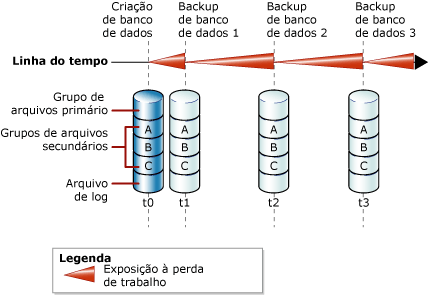
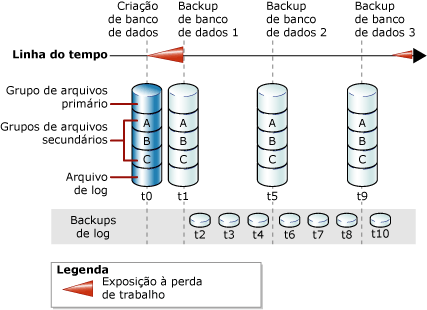

# Backups de bancos de dados completos (SQL Server)
  Um backup completo de banco de dados faz o backup de todo o banco de dados. Isso inclui parte do log de transações de modo que o banco de dados completo possa ser recuperado depois que um backup completo de banco de dados for restaurado. Backups completos de banco de dados representam o banco de dados no momento em que o backup foi concluído.  
  
> [!TIP]  
>  À medida que um banco de dados aumenta, os backups completos de banco de dados levam mais tempo para serem concluídos e exigem mais espaço de armazenamento. Portanto, para um banco de dados grande, convém complementar um backup de banco de dados completo com uma série de *backups de bancos de dados diferenciais*. Para obter mais informações, veja [Backups diferenciais &#40;SQL Server&#41;](../../relational-databases/backup-restore/differential-backups-sql-server.md).  
  
> [!IMPORTANT]  
>  TRUSTWORTHY é definido como OFF em um backup de banco de dados. Para obter informações sobre como definir TRUSTWORTHY como ON, veja [Opções do ALTER DATABASE SET &#40;Transact-SQL&#41;](../Topic/ALTER%20DATABASE%20SET%20Options%20\(Transact-SQL\).md).  
  
 **Neste tópico:**  
  
-   [Backups de banco de dados no modelo de recuperação simples](#DbBuRMs)  
  
-   [Backups de banco de dados no modelo de recuperação completa](#DbBuRMf)  
  
-   [Usar um backup de banco de dados completo para restaurar o banco de dados](#RestoreDbBu)  
  
-   [Tarefas relacionadas](#RelatedTasks)  
  
##  <a name="DbBuRMs"></a> Backups de banco de dados no modelo de recuperação simples  
 No modelo de recuperação simples, depois de cada backup, o banco de dados fica sujeito à possível perda de trabalho na eventualidade de um desastre. A possibilidade de perda de trabalho aumenta a cada atualização até que o próximo backup seja feito, quando a possibilidade de perda de trabalho retorna a zero, tendo início um novo ciclo de exposição à perda de trabalho. A possibilidade de perda de trabalho aumenta com o passar do tempo entre os backups. A ilustração a seguir mostra a exposição à perda de trabalho de uma estratégia de backup que usa apenas backups de banco de dados completos.  
  
   
  
### Exemplo ([!INCLUDE[tsql](../../includes/tsql-md.md)])  
 O exemplo a seguir mostra como criar um backup de banco de dados completo usando WITH FORMAT para substituir qualquer backup existente e criar um novo conjunto de mídias.  
  
```  
-- Back up the AdventureWorks2012 database to new media set.  
BACKUP DATABASE AdventureWorks2012  
    TO DISK = 'Z:\SQLServerBackups\AdventureWorksSimpleRM.bak'   
    WITH FORMAT;  
GO  
```  
  
##  <a name="DbBuRMf"></a> Backups de banco de dados no modelo de recuperação completa  
 Para bancos de dados que usam recuperação completa e recuperação bulk-logged, os backups de banco de dados são necessários, mas não são suficientes. Os backups de log de transações também são necessários. A ilustração a seguir mostra a estratégia de backup menos complexa possível no modelo de recuperação completa.  
  
   
  
 Para obter informações sobre como criar backups de logs, veja [Backups do log de transações &#40;SQL Server&#41;](../../relational-databases/backup-restore/transaction-log-backups-sql-server.md).  
  
### Exemplo ([!INCLUDE[tsql](../../includes/tsql-md.md)])  
 O exemplo a seguir mostra como criar um backup de banco de dados completo usando WITH FORMAT para substituir qualquer backup existente e criar um novo conjunto de mídias. Assim, o exemplo faz o backup do log de transações. Em uma situação da vida real, você teria de executar uma série de backups regulares de log. Para esse exemplo, o banco de dados de exemplo [!INCLUDE[ssSampleDBobject](../../includes/sssampledbobject-md.md)] deve ser definido para usar o modelo de recuperação completa.  
  
```  
USE master;  
ALTER DATABASE AdventureWorks2012 SET RECOVERY FULL;  
GO  
-- Back up the AdventureWorks2012 database to new media set (backup set 1).  
BACKUP DATABASE AdventureWorks2012  
  TO DISK = 'Z:\SQLServerBackups\AdventureWorks2012FullRM.bak'   
  WITH FORMAT;  
GO  
--Create a routine log backup (backup set 2).  
BACKUP LOG AdventureWorks2012 TO DISK = 'Z:\SQLServerBackups\AdventureWorks2012FullRM.bak';  
GO  
```  
  
##  <a name="RestoreDbBu"></a> Usar um backup de banco de dados completo para restaurar o banco de dados  
 É possível recriar todo o banco de dados de uma só vez, restaurando o banco de dados a partir de um backup completo de banco de dados para qualquer local. Uma parte suficiente do log de transações é incluída no backup para permitir que você recupere o banco de dados até o momento em que o backup foi concluído. O banco de dados restaurado equivale ao estado do banco de dados original quando o backup de banco de dados é concluído, desconsiderando transações não confirmadas. No modelo de recuperação completa, você deve restaurar todos os backups de log de transações subsequentes. Quando o banco de dados é recuperado, as transações não confirmadas são revertidas.  
  
 Para obter mais informações, veja [Restaurações completas de banco de dados &#40;Modelo de recuperação simples#41;](../../relational-databases/backup-restore/complete-database-restores-simple-recovery-model.md) ou [Restaurações completas de banco de dados &#40;Modelo de recuperação completa#41;](../../relational-databases/backup-restore/complete-database-restores-full-recovery-model.md).  
  
##  <a name="RelatedTasks"></a> Tarefas relacionadas  
 **Para criar um backup de banco de dados completo**  
  
-   [Criar um backup completo de banco de dados &#40;SQL Server&#41;](../../relational-databases/backup-restore/create-a-full-database-backup-sql-server.md)  
  
-   <xref:Microsoft.SqlServer.Management.Smo.Backup.SqlBackup%2A> (SMO)  
  
 **Para agendar trabalhos de backup**  
  
 [Usar o Assistente de Plano de Manutenção](../../relational-databases/maintenance-plans/use-the-maintenance-plan-wizard.md)  
  
## Consulte também  
 [Fazer backup e restaurar bancos de dados do SQL Server](../../relational-databases/backup-restore/back-up-and-restore-of-sql-server-databases.md)   
 [Visão geral do backup &#40;SQL Server&#41;](../../relational-databases/backup-restore/backup-overview-sql-server.md)   
 [Backup e restauração de bancos de dados do Analysis Services](../../analysis-services/multidimensional-models/backup-and-restore-of-analysis-services-databases.md)  
  
  