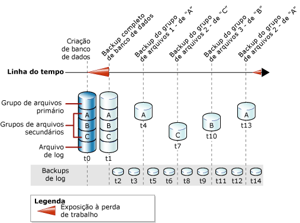

# Backups completos de arquivos (SQL Server)
[!INCLUDE[appliesto-ss-xxxx-xxxx-xxx-md](../../includes/appliesto-ss-xxxx-xxxx-xxx-md.md)]
  Este tópico é relevante para bancos de dados [!INCLUDE[ssNoVersion](../../includes/ssnoversion-md.md)] que contêm vários arquivos ou grupos de arquivos.  
  
 Pode ser feito backup dos arquivos em um banco de dados [!INCLUDE[ssNoVersion](../../includes/ssnoversion-md.md)] e restaurá-los individualmente. Além disso, você pode especificar um grupo de arquivos inteiro em vez de especificar cada arquivo constituinte separadamente. Note que, se qualquer arquivo de um grupo de arquivos estiver offline (por exemplo, porque o arquivo está sendo restaurado), o grupo de arquivos inteiro ficará offline e não poderá ter backup.  
  
 Backups de arquivos de grupos de arquivos do tipo somente leitura podem ser combinados com backups parciais. Os backups parciais incluem todos os grupos de arquivos do tipo leitura/gravação e, opcionalmente, um ou mais grupos de arquivos do tipo somente leitura. Para obter mais informações, veja [Backups parciais &#40;SQL Server&#41;](../../relational-databases/backup-restore/partial-backups-sql-server.md).  
  
 Um backup de arquivo pode servir como a *base diferencial* para backups de arquivos diferenciais. Para obter mais informações, veja [Backups diferenciais &#40;SQL Server&#41;](../../relational-databases/backup-restore/differential-backups-sql-server.md).  
  
> [!NOTE]  
>  Os backups completos de arquivos normalmente são chamados de *backups de arquivo*, exceto quando estão sendo comparados explicitamente com *backups de arquivo diferenciais*.  
  
 **Neste tópico:**  
  
-   [Benefícios de backups de arquivos](#Benefits)  
  
-   [Desvantagens de backups de arquivos](#Disadvantages)  
  
-   [Visão geral de backups de arquivos](#Overview)  
  
-   [Tarefas relacionadas](#RelatedTasks)  
  
##   Benefícios de backups de arquivos  
 Backups de arquivo oferecem as seguintes vantagens sobre backups de banco de dados:  
  
-   O uso de backups de arquivos pode aumentar a velocidade de recuperação permitindo restaurar somente arquivos danificados, sem restaurar o restante do banco de dados.  
  
     Por exemplo, se um banco de dados consistir em diversos arquivos situados em discos diferentes e um disco falhar, somente o arquivo no disco com falha precisará ser restaurado. O arquivo danificado pode ser restaurado rapidamente e a recuperação é mais rápida do que em um banco de dados inteiro.  
  
-   Backups de arquivo aumentam a flexibilidade no cronograma e tratamento de mídia em relação aos backups de banco de dados completos, os quais para os casos de bancos de dados muito grandes podem tornar-se difíceis de gerenciar. A maior flexibilidade de arquivo ou backups de grupo de arquivos também é útil para bancos de dados grandes que contêm dados com características variadas de atualização.  
  
##   Desvantagens de backups de arquivos  
  
-   A desvantagem básica de backups de arquivo comparada a backups de banco de dados completos está na complexidade administrativa adicional. Manter e rastrear um conjunto completo destes backups pode ser uma tarefa demorada que pode sobrecarregar as exigências de espaço de backups de banco de dados completos.  
  
-   Uma falha de mídia poderá tornar um banco de dados completo irrecuperável se um arquivo danificado não tiver um backup. Você deve manter um conjunto completo de backups de arquivo, e, para o modelo de recuperação completa/bulk-logged, um ou mais backups de log que abrangem o intervalo entre o primeiro backup de arquivo completo e último backup de arquivo completo.  
  
##   Visão geral de backups de arquivos  
 Um backup completo de arquivo faz o backup de todos os dados em um ou mais arquivos ou grupos de arquivos. Por padrão, backups de arquivos contêm registros de log suficientes para efetuar roll-forward do arquivo até o final da operação de backup.  
  
 Fazer backup de um arquivo ou grupo de arquivos do tipo somente leitura é o mesmo para todo modelo de recuperação. No o modelo de recuperação completa, um conjunto inteiro de backups de arquivo completos junto com backups de log suficientes para abranger todos os backups de arquivos, é equivalente ao backup de banco de dados completo.  
  
 Somente uma operação de backup de arquivo pode ocorrer de cada vez. Você pode fazer backup de vários arquivos em uma operação, mas isto pode aumentar o tempo de recuperação se você precisar restaurar somente um único arquivo. Isto ocorre porque para localizar esse arquivo, o backup inteiro é lido.  
  
> [!NOTE]  
>  Arquivos individuais de um backup de banco de dados podem ser restaurados; porém, localizar e restaurar um arquivo leva mais tempo a partir de um backup de banco de dados do que a partir de um backup de arquivo.  
  
### Backups de arquivos e o modelo de recuperação simples  
 No modelo de recuperação simples, o backup deve ser feito em todos os arquivos de leitura/gravação juntos. Isso assegura que o banco de dados possa ser restaurado até um point-in-time consistente. Em vez de especificar cada arquivo ou grupo de arquivos de leitura/gravação individualmente, use a opção de READ_WRITE_FILEGROUPS. Esta opção efetua backup de todos os grupos de arquivos de leitura/gravação no banco de dados. Um backup que é criado especificando READ_WRITE_FILEGROUPS é conhecido como um backup parcial. Para obter mais informações, veja [Backups parciais &#40;SQL Server&#41;](../../relational-databases/backup-restore/partial-backups-sql-server.md).  
  
### Backups de arquivos e o modelo de recuperação completa  
 No modelo de recuperação completa, você deve fazer backup de log de transações, independente do restante de sua estratégia de backup. Um conjunto inteiro de backups completos de arquivos junto com backups de log suficientes para abranger todos os backups de arquivos desde o início do primeiro backup de arquivos, é equivalente a um backup de banco de dados completo.  
  
 A restauração de um banco de dados com o uso de apenas um arquivo e backups de log pode ser complexa. Por isso, se for possível, é uma prática recomendada executar um backup de banco de dados completo e iniciar os backups de log antes do primeiro backup de arquivo. A ilustração a seguir mostra uma estratégia na qual um backup de banco de dados completo é feito (em t1) logo após o banco de dados ser criado (em t0). Este primeiro backup de banco de dados permite backups de log de transações no início. Os backups de log de transações são programados para ocorrer em intervalos definidos. Os backups de arquivos ocorrem no intervalo que melhor corresponder às necessidades empresariais do banco de dados. Esta ilustração exibe cada um dos quatro grupos de arquivos com backup feito um de cada vez. A ordem na qual é feito backup (A, C, B, A) reflete as necessidades empresariais do banco de dados.  
  
   
  
> [!NOTE]  
>  No modelo de recuperação completa, você deve efetuar roll-forward do log de transações ao restaurar um backup de arquivo de leitura/gravação para verificar se o arquivo está consistente com o restante do banco de dados. Para evitar que o roll forward seja efetuado em muitos backups de log de transações, considere o uso de backups de arquivo diferenciais. Para obter mais informações, veja [Backups diferenciais &#40;SQL Server&#41;](../../relational-databases/backup-restore/differential-backups-sql-server.md).  
  
##   Tarefas relacionadas  
 **Para criar backup de um arquivo ou de um grupo de arquivos**  
  
-   [Fazer backup de arquivos e de grupos de arquivos &#40;SQL Server&#41;](../../relational-databases/backup-restore/back-up-files-and-filegroups-sql-server.md)  
  
-   <xref:Microsoft.SqlServer.Management.Smo.Backup.SqlBackup%2A> (SMO)  
  
> [!NOTE]  
>  Backups de arquivo não são suportados pelo Assistente de plano de manutenção.  
  
## Consulte Também  
 [BACKUP &#40;Transact-SQL&#41;](../../t-sql/statements/backup-transact-sql.md)   
 [Visão geral do backup &#40;SQL Server&#41;](../../relational-databases/backup-restore/backup-overview-sql-server.md)   
 [Backup e Restauração: Interoperabilidade e Coexistência &#40;SQL Server&#41;](../../relational-databases/backup-restore/backup-and-restore-interoperability-and-coexistence-sql-server.md)   
 [Backups diferenciais &#40;SQL Server&#41;](../../relational-databases/backup-restore/differential-backups-sql-server.md)   
 [Restaurações de arquivos &#40;Modelo de recuperação simples&#41;](../../relational-databases/backup-restore/file-restores-simple-recovery-model.md)   
 [Restaurações de arquivo &#40;Modelo de recuperação completa&#41;](../../relational-databases/backup-restore/file-restores-full-recovery-model.md)   
 [Restauração online &#40;SQL Server&#41;](../../relational-databases/backup-restore/online-restore-sql-server.md)   
 [Restaurações por etapas &#40;SQL Server&#41;](../../relational-databases/backup-restore/piecemeal-restores-sql-server.md)  
  
  
