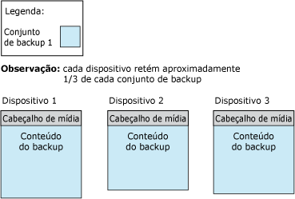
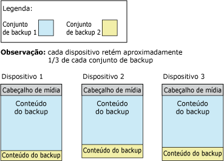

# <a name="media-sets-media-families-and-backup-sets-sql-server"></a>Conjuntos de mídias, famílias de mídia e conjuntos de backup (SQL Server)
[!INCLUDE[appliesto-ss-xxxx-xxxx-xxx-md](../../includes/appliesto-ss-xxxx-xxxx-xxx-md.md)]
  **Este tópico apresenta a terminologia básica de mídia de backup da restauração e do backup do [!INCLUDE[ssNoVersion](../../includes/ssnoversion-md.md)] , e destina-se a leitores que não têm experiência com o [!INCLUDE[ssNoVersion](../../includes/ssnoversion-md.md)].** 
  
  Este tópico descreve o formato que o [!INCLUDE[ssNoVersion](../../includes/ssnoversion-md.md)] usa na mídia de backup, a correspondência entre mídia de backup e dispositivos de backup, a organização dos backups na mídia de backup, e as várias considerações sobre conjuntos de mídias e famílias de mídia. O tópico também descreve as etapas de inicialização ou formatação de mídia de backup antes que você use isso pela primeira vez ou substitua um conjunto de mídias antigo por um novo conjunto de mídias, como substituir conjuntos de backup antigos em um conjunto de mídias, e como acrescentar novos conjuntos de backup a um conjunto de mídias.  
  
>**OBSERVAÇÃO:** Para obter mais informações sobre o backup do SQL Server no serviço de armazenamento de Blobs do Microsoft Azure, veja [Backup e restauração do SQL Server com o Serviço de Armazenamento de Blobs do Microsoft Azure](../../relational-databases/backup-restore/sql-server-backup-and-restore-with-microsoft-azure-blob-storage-service.md).  
   
##  <a name="TermsAndDefinitions"></a> Termos  
 **conjunto de mídias**  
 Uma coleção ordenada de mídias de backup, fitas ou arquivos de disco, em que uma ou mais operações de backup foram gravadas, usando um número e um tipo fixo de dispositivos de backup.  
  
 **família de mídia**  
 Os backups criados em um único dispositivo não espelhado ou um conjunto de dispositivos espelhados em um conjunto de mídias  
  
**conjunto de backup**  
 O conteúdo de backup adicionado a um conjunto de mídias por uma operação de backup bem-sucedida.  
  

##  <a name="OvMediaSetsFamiliesBackupSets"></a> Visão geral dos conjuntos de mídias, famílias de mídia e conjuntos de backup  
 Os backups em um conjunto de uma ou mais mídias de backup compõem um único conjunto de mídias. Um *conjunto de mídias* é uma coleção ordenada de *mídia de backup*, fitas ou arquivos de disco, ou Blobs do Azure, em que uma ou mais operações de backup foram gravadas usando um tipo fixo e número de dispositivos de backup. Um conjunto de mídias específica usa unidades de fita, ou unidades de disco ou blobs do Azure, mas não uma combinação dos dois ou mais. 
 
**Exemplo:** os dispositivos de backup associados ao conjunto de mídias podem ser três unidades de fita chamadas `\\.\TAPE0`, `\\.\TAPE1`e `\\.\TAPE2`. Aquele conjunto de mídias contém apenas fitas, começando com um mínimo de três fitas (uma por unidade). O tipo e o número de dispositivos de backup são estabelecidos quando um conjunto de mídias é criado, e não podem ser alterados. No entanto, entre as operações de backup e de restauração, um determinado dispositivo pode ser substituído por outro dispositivo do mesmo tipo, se necessário.  
  
 Um conjunto de mídias é criado na mídia de backup durante uma operação de backup ao formatar a mídia de backup. Para obter mais informações, consulte [Criando um novo conjunto de mídias](#CreatingMediaSet), posteriormente neste tópico. Após a formatação, cada arquivo ou fita conterá um cabeçalho de mídia para o conjunto de mídias e estará pronto para receber conteúdo de backup. Com o cabeçalho no lugar, a operação de backup continua a fazer backup dos dados especificados na mídia de backup em todos os dispositivos de backup especificados para a operação.  
  
> **OBSERVAÇÃO:** Os conjuntos de mídias podem ser espelhados para proteger contra um volume de mídia danificado (uma fita ou arquivo de disco). Para obter mais informações, veja [Conjuntos de mídias de backup espelhadas &#40;SQL Server&#41;](../../relational-databases/backup-restore/mirrored-backup-media-sets-sql-server.md).  
  
 Os backups compactados e não compactados não podem ser feitos juntos em um conjunto de mídias. Qualquer edição do [!INCLUDE[ssKatmai](../../includes/sskatmai-md.md)] ou posterior pode ler backups compactados. Para obter mais informações, veja [Compactação de backup &#40;SQL Server&#41;](../../relational-databases/backup-restore/backup-compression-sql-server.md).  

  
## <a name="media-families"></a>Famílias de mídia  
 Os backups criados em um único dispositivo não espelhado ou um conjunto de dispositivos espelhados em um conjunto de mídias constituem uma *família de mídia*. O número de dispositivos de backup usados no conjunto de mídias determina o número de famílias de mídia em um conjunto de mídias. Por exemplo, se um conjunto de mídias usa dois dispositivos de backup não espelhados, o conjunto de mídias conterá duas famílias de mídia.  
  
Em um conjunto de mídias espelhado, cada família de mídia é espelhada. Por exemplo, se seis dispositivos de backup são usados para formatar um conjunto de mídias, no qual dois espelhos são usados, existirão três famílias de mídia, cada uma contendo duas cópias equivalentes de dados de backup. Para obter mais informações sobre conjuntos de mídia espelhadas, consulte [Conjuntos de mídias de backup espelhadas &#40;SQL Server&#41;](../../relational-databases/backup-restore/mirrored-backup-media-sets-sql-server.md).  
  
 A cada fita ou disco em uma família de mídia é atribuído um *número de sequência de mídia*. O número de sequência de mídia de um disco é sempre 1. Em uma família de mídia de fita, o número de sequência da fita inicial é 1, da segunda fita é 2 e assim por diante. Para obter mais informações, consulte [Conjuntos de mídias, famílias de mídia e conjuntos de backup (SQL Server)](../../relational-databases/backup-restore/media-sets-media-families-and-backup-sets-sql-server.md).
  
## <a name="the-media-header"></a>O cabeçalho de mídia  
 Todo volume de mídia de backup (arquivo de disco ou fita) contém um cabeçalho de mídia criado pela primeira operação de backup que utiliza a fita (ou disco). Esse cabeçalho permanece intacto até que a mídia seja reformatada.  
  
 O cabeçalho de mídia contém todas as informações exigidas para identificar a mídia (arquivo de disco ou fita) e está localizado dentro da família de mídia a qual pertence. Essas informações incluem:  
  
-   O nome da mídia.  
  
     O nome de mídia é opcional, mas recomendamos consistentemente o uso de nomes de mídia que claramente identificam sua mídia. Um nome de mídia é atribuído por quem formata a mídia.  
  
-   O número de identificação exclusivo do conjunto de mídias.  
  
-   O número de famílias de mídia no conjunto de mídias.  
  
-   O número de sequência da família de mídia que contém essa mídia.  
  
-   O número de identificação exclusivo da família de mídia.  
  
-   O número de sequência dessa mídia na família de mídia. Para um arquivo de disco, este valor é sempre 1.  
  
-   A descrição de mídia contém um rótulo de mídia MTF ou uma descrição de mídia.  
  
    >**OBSERVAÇÃO:** Toda mídia usada em uma operação de backup ou restauração utiliza um formato de backup padrão chamado [!INCLUDE[msCoName](../../includes/msconame-md.md)] Formato de fita (MTF). O MTF permite que os usuários especifiquem um rótulo de fita que contém uma descrição específica de MTF. [!INCLUDE[ssNoVersion](../../includes/ssnoversion-md.md)] preserva qualquer rótulo de mídia MTF gravado por outro aplicativo, mas não grava rótulos de mídia MTF.  
  
-   O rótulo de mídia de formato de fita [!INCLUDE[msCoName](../../includes/msconame-md.md)] ou a descrição de mídia (em texto de formato livre).  
  
-   O nome do software de backup que gravou o rótulo.  
  
-   O número de identificação do fornecedor exclusivo do fornecedor de software que formatou a mídia.  
  
-   A data e a hora que o rótulo foi gravado.  
  
-   O número de espelhos do conjunto (1-4); 1 indica um dispositivo não espelhado.  
  
 [!INCLUDE[ssCurrent](../../includes/sscurrent-md.md)] pode processar mídia formatadas por versões anteriores do [!INCLUDE[ssNoVersion](../../includes/ssnoversion-md.md)].  
  
## <a name="backup-sets"></a>Conjuntos de backup  
 Uma operação de backup bem-sucedida adiciona um único *conjunto de backup* ao conjunto de mídias. O conjunto de backup é descrito nos termos do conjunto de mídias ao qual o backup pertence. Se a mídia de backup consistir de apenas uma família de mídia, a família conterá o conjunto de backup completo. Se a mídia de backup consistir de várias famílias de mídia, o conjunto de backup será distribuído entre elas. Em cada mídia, o conjunto de backup contém um cabeçalho que descreve o conjunto de backup.  
  
 Esse exemplo mostra uma instrução [!INCLUDE[tsql](../../includes/tsql-md.md)] que cria um conjunto de mídias chamado de `MyAdvWorks_MediaSet_1` para o banco de dados [!INCLUDE[ssSampleDBobject](../../includes/sssampledbobject-md.md)] usando três unidades de fita como dispositivos de backup:  
  
```  
BACKUP DATABASE AdventureWorks2012  
TO TAPE = '\\.\tape0', TAPE = '\\.\tape1', TAPE = '\\.\tape2'  
WITH   
   FORMAT,  
   MEDIANAME = 'MyAdvWorks_MediaSet_1'  
```  
  
 Se tiver êxito, essa operação de backup resultará em um novo conjunto de mídias contendo um novo cabeçalho de mídia e um conjunto de backup disseminado por três fitas. A figura a seguir ilustra esses resultados:  
  
   
  
 Normalmente, depois que um conjunto de mídias é criado, as operações de backup subsequentes, uma após a outra, anexam seus conjuntos de backup ao conjunto de mídias. Todas as mídias usadas pelo conjunto de backup compõem o conjunto de mídias, independentemente do número de mídias ou de dispositivos de backup envolvidos. Os conjuntos de backup são numerados sequencialmente de acordo com sua posição no conjunto de mídias, permitindo que você especifique qual conjunto de backup será restaurado.  
  
 Toda operação de backup para um conjunto de mídias deve gravar no mesmo número e tipo de dispositivos de backup. Com vários dispositivos, assim como com o primeiro dispositivo de backup, o conteúdo de todo backup subsequente é distribuído entre a mídia de backup em todos os dispositivos. Para continuar o exemplo acima, uma segunda operação de backup (um backup diferencial) acrescenta informações ao mesmo conjunto de mídias:  
  
```  
BACKUP DATABASE AdventureWorks2012  
TO TAPE = '\\.\tape0', TAPE = '\\.\tape1', TAPE = '\\.\tape2'  
WITH   
   NOINIT,  
   MEDIANAME = 'AdventureWorksMediaSet1',  
   DIFFERENTIAL  
```  
  
> **OBSERVAÇÃO:** A opção NOINIT é o padrão, mas é incluída a título de esclarecimento.  
  
 Se a segunda operação de backup for bem-sucedida, ela gravará um segundo conjunto de backup no conjunto de mídias, com a distribuição de conteúdo de backup a seguir:  
  
   
  
 Ao restaurar backups, você pode usar a opção FILE para especificar quais backups deseja usar. O exemplo a seguir mostra o uso de cláusulas FILE **=***backup_set_file_number* ao restaurar um backup de banco de dados completo do banco de dados [!INCLUDE[ssSampleDBobject](../../includes/sssampledbobject-md.md)] seguido de um backup de banco de dados diferencial no mesmo conjunto de mídias. O conjunto de mídias usa três fitas de backup, que estão nas unidades de fita `\\.\tape0`, `tape1`e `tape2`.  
  
```  
RESTORE DATABASE AdventureWorks2012 FROM TAPE = '\\.\tape0', TAPE = '\\.\tape1', TAPE = '\\.\tape2'  
   WITH   
   MEDIANAME = 'AdventureWorksMediaSet1',  
   FILE=1,   
   NORECOVERY;  
RESTORE DATABASE AdventureWorks2012 FROM TAPE = '\\.\tape0', TAPE = '\\.\tape1', TAPE = '\\.\tape2'   
   WITH   
   MEDIANAME = 'AdventureWorksMediaSet1',  
   FILE=2,   
   RECOVERY;  
GO  
```  
  
 Para obter informações sobre tabelas de histórico que armazenam informações sobre conjuntos de mídias e suas famílias de mídia e conjuntos de backup, consulte [Informações de histórico e cabeçalho de backup &#40;SQL Server&#41;](../../relational-databases/backup-restore/backup-history-and-header-information-sql-server.md).  
  
 O número de mídia de backup em um conjunto de mídias depende de vários fatores:  
  
-   Número de dispositivos de backup  
  
-   Tipo de dispositivos de backup  
  
-   Número de conjuntos de backup  

  
##  <a name="CreatingMediaSet"></a> Creating a new media set  
 Para criar um novo conjunto de mídias, é necessário formatar a mídia de backup (uma ou mais fitas ou arquivos de disco). O processo de formatação altera as mídias de backup da seguinte forma:  
  
1.  Exclui o cabeçalho antigo (se houver), excluindo efetivamente o conteúdo anterior da mídia de backup.  
  
     A formatação de um dispositivo de fita exclui todo o conteúdo anterior da fita atualmente montada. A formatação de um disco afeta somente o arquivo especificado para a operação de backup  
  
2.  Grava um novo cabeçalho de mídia na mídia de backup (fita ou arquivo de disco) em cada um dos dispositivos de backup.  

  
##  <a name="UseExistingMediaSet"></a> Fazendo backup em um conjunto de mídias existente  
 Quando você estiver fazendo backup em um conjunto de mídias existente, estas serão as duas opções disponíveis:  
  
-   Anexar ao conjunto de backups existente.  
  
     Para usar da melhor forma o espaço disponível, novos conjuntos de backups são geralmente anexados a conjuntos de mídias existentes. Fazer um acréscimo ao backup preserva qualquer backup anterior. Para obter mais informações, consulte [Acrescentando a conjuntos de backup existentes](#Appending), posteriormente nesta seção.  

O acréscimo, que é o comportamento padrão do BACKUP, pode ser especificado explicitamente com a opção NOINIT.  
  
-   Substituir todos os conjuntos de backups existentes pelo backup atual, deixando o cabeçalho da mídia atual em funcionamento.  
  
     [!INCLUDE[ssNoVersion](../../includes/ssnoversion-md.md)] tem proteções para impedir que você substitua a mídia acidentalmente. No entanto, o backup pode substituir automaticamente conjuntos de backups que alcançaram uma data de validade predefinida.  
  
     No caso de cabeçalhos de fita, deixar o cabeçalho no lugar pode fazer sentido. Para obter mais informações, consulte [Substituindo conjuntos de backup](#Overwriting), posteriormente nesta seção.  

    >  A substituição de conjuntos de backup existentes é especificada com a opção INIT da instrução BACKUP.  
  
##  <a name="Appending"></a> Appending to existing backup sets  
 Backups executados em momentos diferentes no mesmo banco de dados ou em bancos de dados diferentes podem ser armazenados na mesma mídia. Ao anexar outro conjunto de backups a uma mídia existente, o conteúdo anterior da mídia permanece intacto e o novo backup é gravado após o final do último backup da mídia.  
  
 Por padrão, o [!INCLUDE[ssNoVersion](../../includes/ssnoversion-md.md)] sempre acrescenta backups novos à mídia. O acréscimo só pode ocorrer no final da mídia. Por exemplo, se um volume de mídia contiver cinco conjuntos de backup, não é possível ignorar os três primeiros conjuntos de backup para substituir o quarto conjunto de backup por um conjunto novo.  
  
 Se você usar BACKUP WITH NOREWIND para um backup em fita, a fita ficará aberta no final da operação. Isso permite anexar outros backups à fita sem rebobiná-la e depois verificar para a frente novamente para encontrar o último conjunto de backup. Você pode obter uma lista das unidades de fita abertas na exibição de gerenciamento dinâmico **sys.dm_io_backup_tapes**; para obter mais informações, consulte [sys.dm_io_backup_tapes &#40;Transact-SQL&#41;](../../relational-databases/system-dynamic-management-views/sys-dm-io-backup-tapes-transact-sql.md).  
  
 Os backups do Microsoft Windows e do [!INCLUDE[ssNoVersion](../../includes/ssnoversion-md.md)] podem compartilhar a mesma mídia, mas não são interoperáveis. [!INCLUDE[ssNoVersion](../../includes/ssnoversion-md.md)] não pode fazer backup dos dados do Windows.  
  
> **IMPORTANTE:** Os backups compactados e não compactados não podem ser feitos juntos em um conjunto de mídias. Qualquer edição do [!INCLUDE[ssKatmai](../../includes/sskatmai-md.md)] ou versões posteriores podem ler backups compactados. Para obter mais informações, veja [Compactação de backup &#40;SQL Server&#41;](../../relational-databases/backup-restore/backup-compression-sql-server.md).  
  
 
##  <a name="Overwriting"></a> Overwriting backup sets  
 A substituição de conjuntos de backup existentes é especificada com a opção INIT da instrução BACKUP. Essa opção substitui todos os conjuntos de backups na mídia e preserva o cabeçalho da mídia, se houver. Se não houver nenhum cabeçalho da mídia, será criado um.  
  
 No caso de cabeçalhos de fita, deixar o cabeçalho no lugar pode fazer sentido. Em mídias de backup em disco, serão substituídos somente os arquivos usados pelos dispositivos de backup especificados na operação de backup; os outros arquivos no disco não são afetados. Quando backups são substituídos, qualquer cabeçalho da mídia existente é preservado e o backup novo é criado como o primeiro backup no dispositivo de backup. Se não houver nenhum cabeçalho da mídia, será gravado automaticamente um cabeçalho da mídia válido com um nome e descrição de mídia associados. Se o cabeçalho da mídia existente for inválido, a operação de backup será encerrada. Se a mídia estiver vazia, o novo cabeçalho de mídia será gerado com o MEDIANAME, MEDIAPASSWORD e MEDIADESCRIPTION fornecidos, se houver.  
  
 
 A mídia de backup não será substituída se qualquer uma das condições for aplicável:  
  
-   Os backups existentes na mídia não expiraram. (Se foi especificado SKIP, a expiração não será verificada.)  
  
     A data de validade especifica a data em que o backup expira e pode ser substituído por outro backup. Você pode especificar a data de validade quando um backup é criado. Por padrão, a data de validade é determinada pela opção **media retention** definida com o **sp_configure**. Para obter mais informações, consulte [sp_configure &#40;Transact-SQL&#41;](../../relational-databases/system-stored-procedures/sp-configure-transact-sql.md).  
  
-   O nome da mídia, caso fornecido, não corresponde ao nome na mídia de backup.  
  
     O nome da mídia é um nome descritivo usado para facilitar sua identificação.  
  
 Se tiver certeza de que deseja substituir a mídia existente (por exemplo, se souber que os backups na fita já não são necessários), você pode ignorar explicitamente essas verificações.  
  
 Se a mídia de backup for protegida por senha pelo Microsoft Windows, o Microsoft SQL Server não gravará na mídia. Para substituir a mídia protegida por senha, você deve reinicializar a mídia.  
  

  
##  <a name="SequenceNumbers"></a> Números de sequência  
 A ordem correta é importante para várias famílias de mídia dentro de um conjunto de mídia ou de vários backups de mídia dentro de uma família de mídia. Portanto, o backup atribui números de sequência dos modos seguintes:  
  
-   Famílias de mídia sequenciais dentro de um conjunto de mídia  
  
     Dentro de um conjunto de mídia, as famílias de mídia são numeradas sequencialmente de acordo com sua posição no conjunto de mídia. O número da família de mídia é registrado na coluna **family_sequence_number** da tabela **backupmediafamily** .  
  
-   Mídias físicas dentro de uma família de mídia  
  
     Um número de sequência de mídia indica a ordem das mídias físicas dentro de uma família de mídia. O número de sequência é 1 para a mídia inicial do backup. Esse é marcado com 1; o segundo (a primeira fita de continuação) é marcado com 2; e assim por diante. Quando o conjunto de backup é restaurado, os números de sequência de mídia garantem que o operador que restaura o backup montará as mídias corretas na ordem correta.  
  
###  <a name="MultipleDevices"></a> Vários dispositivos  
 Quando você usa várias unidades de fita ou arquivos de disco, as considerações seguintes se aplicam:  
  
-   Para backup:  
  
     O conjunto de mídia completo criado por uma operação de backup deve ser usado por todas as operações de backup subsequentes. Por exemplo, se um conjunto de mídia foi criado usando dois dispositivos de backup em fita, todas as operações de backup subsequentes que envolvem o mesmo conjunto de mídia devem usar dois dispositivos de backup.  
  
-   Para restauração:  
  
     Para qualquer restauração de backups de disco e qualquer restauração online, todas as famílias de mídia devem ser montadas simultaneamente. Para uma restauração offline de backups em fita, você pode processar as famílias de mídia a partir de menos dispositivos de backup. Cada família de mídia deve ser totalmente processada antes de começar a processar outra família de mídia. As famílias de mídia sempre serão processadas em paralelo, a menos que estejam sendo restauradas com um dispositivo único.  
  
##  <a name="RelatedTasks"></a> Tarefas relacionadas  
 **Criar um novo conjunto de mídias**  
  
-   [Criar um backup completo de banco de dados &#40;SQL Server&#41;](../../relational-databases/backup-restore/create-a-full-database-backup-sql-server.md) (opção **Fazer backup em um novo conjunto de mídias e apagar todos os conjuntos de backup existentes**)  
  
-   [BACKUP &#40;Transact-SQL&#41;](../../t-sql/statements/backup-transact-sql.md) (opção FORMAT)  
  
-   <xref:Microsoft.SqlServer.Management.Smo.Backup.FormatMedia%2A>  
  
 **Acrescentar um novo backup à mídia existente**  
  
-   [Criar um backup completo de banco de dados &#40;SQL Server&#41;](../../relational-databases/backup-restore/create-a-full-database-backup-sql-server.md) (opção **Acrescentar ao conjunto de backup existente**)  
  
-   [BACKUP &#40;Transact-SQL&#41;](../../t-sql/statements/backup-transact-sql.md) (opção NOINIT)  
  
 **Substituir os conjuntos de backup existentes**  
  
-   [Criar um backup completo de banco de dados &#40;SQL Server&#41;](../../relational-databases/backup-restore/create-a-full-database-backup-sql-server.md) (opção **Substituir todos os conjuntos de backup existentes**)  
  
-   [BACKUP &#40;Transact-SQL&#41;](../../t-sql/statements/backup-transact-sql.md) (opção INIT)  
  
 **Definir a data de expiração**  
  
-   [Definir a data de validade em um backup &#40;SQL Server&#41;](../../relational-databases/backup-restore/set-the-expiration-date-on-a-backup-sql-server.md)  
  
 **Exibir a sequência de mídia e números de sequência de família**  
  
-   [Exibir as propriedades e o conteúdo de um dispositivo de backup lógico &#40;SQL Server&#41;](../../relational-databases/backup-restore/view-the-properties-and-contents-of-a-logical-backup-device-sql-server.md)  
  
-   [backupmediafamily &#40;Transact-SQL&#41;](../../relational-databases/system-tables/backupmediafamily-transact-sql.md) (coluna **family_sequence_number**)  
  
 **Exibir os conjuntos de backup em um dispositivo de backup específico**  
  
-   [Exibir os dados e arquivos de log em um conjunto de backup &#40;SQL Server&#41;](../../relational-databases/backup-restore/view-the-data-and-log-files-in-a-backup-set-sql-server.md)  
  
-   [Exibir as propriedades e o conteúdo de um dispositivo de backup lógico &#40;SQL Server&#41;](../../relational-databases/backup-restore/view-the-properties-and-contents-of-a-logical-backup-device-sql-server.md)  
  
-   [RESTORE HEADERONLY &#40;Transact-SQL&#41;](../../t-sql/statements/restore-statements-headeronly-transact-sql.md)  
  
 **Ler o cabeçalho da mídia em um dispositivo de backup**  
  
-   [RESTORE LABELONLY &#40;Transact-SQL&#41;](../../t-sql/statements/restore-statements-labelonly-transact-sql.md)  
 
  
## <a name="see-also"></a>Confira também  
 [Fazer backup e restaurar bancos de dados do SQL Server](../../relational-databases/backup-restore/back-up-and-restore-of-sql-server-databases.md)   
 [Erros de mídia possíveis durante backup e restauração &#40;SQL Server&#41;](../../relational-databases/backup-restore/possible-media-errors-during-backup-and-restore-sql-server.md)   
 [Informações de histórico e cabeçalho de backup &#40;SQL Server&#41;](../../relational-databases/backup-restore/backup-history-and-header-information-sql-server.md)   
 [Conjuntos de mídias de backup espelhadas &#40;SQL Server&#41;](../../relational-databases/backup-restore/mirrored-backup-media-sets-sql-server.md)   
 [BACKUP &#40;Transact-SQL&#41;](../../t-sql/statements/backup-transact-sql.md)   
 [RESTORE &#40;Transact-SQL&#41;](../../t-sql/statements/restore-statements-transact-sql.md)   
 [RESTORE REWINDONLY &#40;Transact-SQL&#41;](../../t-sql/statements/restore-statements-rewindonly-transact-sql.md)   
 [sp_configure &#40;Transact-SQL&#41;](../../relational-databases/system-stored-procedures/sp-configure-transact-sql.md)  
  
  
