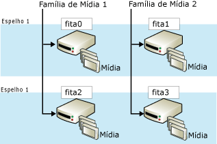

# Conjuntos de mídias de backup espelhadas (SQL Server)
[!INCLUDE[appliesto-ss-xxxx-xxxx-xxx-md](../../includes/appliesto-ss-xxxx-xxxx-xxx-md.md)]
    
> [!NOTE]  
>  Os conjuntos de mídias de backup espelhados têm suporte somente na edição Enterprise do [!INCLUDE[ssNoVersion](../../includes/ssnoversion-md.md)].  
  
 O espelhamento de um conjunto de mídias aumenta a confiabilidade do backup reduzindo o impacto do mau funcionamento do dispositivo de backup. Esse mau funcionamento é muito sério, uma vez que os backups são a última linha de defesa contra a perda de dados. À medida que os bancos de dados crescem, aumenta a probabilidade de que uma falha de um dispositivo de backup ou mídia torne impossível a restauração de um backup. O espelhamento de mídias de backup aumenta a confiabilidade dos backups fornecendo redundância.  
  
> [!NOTE]  
>  Para obter informações sobre conjuntos de mídias em geral, consulte [Conjuntos de mídias, famílias de mídia e conjuntos de backup &#40;SQL Server&#41;](../../relational-databases/backup-restore/media-sets-media-families-and-backup-sets-sql-server.md).  
  
 **Neste tópico:**  
  
-   [Visão geral dos conjuntos de mídias espelhados](#OverviewofMirroredMediaSets)  
  
-   [Requisitos de hardware para espelhos de backup](#HardwareReqs)  
  
-   [Tarefas relacionadas](#RelatedTasks)  
  
##   Visão geral dos conjuntos de mídias espelhados  
 Espelhamento de mídia é uma propriedade do conjunto de mídias. Um *conjunto de mídias espelhado* consiste em várias cópias (*espelhos*) do conjunto de mídias. Um conjunto de mídias contém uma ou mais famílias de mídia, cada uma correspondendo a um dispositivo de backup. Por exemplo, se a cláusula TO de uma instrução BACKUP DATABASE listar três dispositivos, BACKUP difundirá os dados entre três famílias de mídia, um por dispositivo. O número de famílias de mídia e espelhos é definido quando o conjunto de mídias é criado (por uma instrução BACKUP DATABASE que especifica WITH FORMAT).  
  
 Um conjunto de mídias espelhado tem de dois a quatro espelhos. Cada espelho contém todas as famílias de mídia no conjunto de mídias. Os espelhos requerem o mesmo número de dispositivos, um por família de mídia. Cada espelho requer um dispositivo de backup separado para cada família de mídia. Por exemplo, um conjunto de mídias espelhado que consiste em quatro famílias de mídia com três espelhos requer doze dispositivos de backup. Todos esses dispositivos devem ser equivalentes. Por exemplo, unidades de fita que tenham o mesmo número de modelo do mesmo fabricante.  
  
 A ilustração a seguir mostra um exemplo de um conjunto de mídias espelhado que consiste em duas famílias de mídia com dois espelhos. Cada família de mídia contém três volumes de mídia, cujo backup é feito uma vez por espelho.  
  
   
  
 Volumes correspondentes nos espelhos têm conteúdos idênticos. Isso os torna intercambiáveis quando da restauração. Por exemplo, na ilustração anterior, o terceiro volume de tape2 é intercambiável com o terceiro volume de tape0.  
  
 O [!INCLUDE[ssDEnoversion](../../includes/ssdenoversion-md.md)] garante que as mídias espelhadas tenham conteúdo idêntico sincronizando gravações nos dispositivos. Quando qualquer um dos espelhos encher, todos os espelhos serão transpostos ao mesmo tempo.  
  
> [!IMPORTANT]  
>  Um conjunto de mídias espelhado não pode ser implicitamente desfeito (dividido) removendo-se um espelho. Se qualquer fita ou disco em um espelho for danificado ou reformatado, o espelho não será mais utilizável em outros backups. Se pelo menos um espelho cheio permanecer intacto, o conjunto de mídias poderá ser lido. Se todos os espelhos perderem uma determinada família de mídia, o conjunto de mídias será inútil.  
  
 As operações de backup e de restauração impõem requisitos diferentes quanto à presença ou não de todos os espelhos. Para que uma operação de backup grave (ou seja, crie ou estenda) um conjunto de mídias espelhado, todos os espelhos devem estar presentes. Em contrapartida, ao restaurar um backup de um conjunto de mídias espelhado, você poderá especificar apenas um único espelho para cada família de mídia. Você pode executar a restauração de menos dispositivos do que famílias, mas cada família de mídia é processada somente uma vez. Porém, na presença de erros, a existência de outros espelhos permite que alguns problemas de restauração sejam resolvidos rapidamente. Você pode substituir um volume de mídia danificado pelo volume correspondente de outro espelho. Isso ocorre porque RESTORE e RESTORE VERIFYONLY oferecem suporte à substituição de mídias danificadas pelo volume das mídias de backup correspondentes de outro espelho.  
  
##   Requisitos de hardware para espelhos de backup  
 O espelhamento se aplica a disco e fita (discos não dão suporte a fitas de continuação). Todos os dispositivos de backup de um único backup ou operação de restauração devem ser do mesmo tipo, disco ou fita.  
  
 Dentro dessas classes mais amplas, deve-se usar dispositivos semelhantes que tenham as mesmas propriedades. Dispositivos insuficientemente semelhantes geram uma mensagem de erro (3212). Para evitar o risco de uma incompatibilidade de dispositivo, use dispositivos que sejam equivalentes, como somente unidades com o mesmo número de modelo do mesmo fabricante.  
  
##   Tarefas relacionadas  
 **Para fazer backup em dispositivos de backup espelhados**  
  
-   [Fazer backup em um conjunto de mídias espelhado &#40;Transact-SQL&#41;](../../relational-databases/backup-restore/back-up-to-a-mirrored-media-set-transact-sql.md)  
  
## Consulte Também  
 [Erros de mídia possíveis durante backup e restauração &#40;SQL Server&#41;](../../relational-databases/backup-restore/possible-media-errors-during-backup-and-restore-sql-server.md)   
 [RESTORE VERIFYONLY &#40;Transact-SQL&#41;](../../t-sql/statements/restore-statements-verifyonly-transact-sql.md)   
 [Dispositivos de backup &#40;SQL Server&#41;](../../relational-databases/backup-restore/backup-devices-sql-server.md)   
 [Conjuntos de mídias, famílias de mídia e conjuntos de backup &#40;SQL Server&#41;](../../relational-databases/backup-restore/media-sets-media-families-and-backup-sets-sql-server.md)  
  
  
