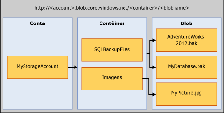

# <a name="sql-server-backup-to-url"></a>Backup do SQL Server para URL
[!INCLUDE[tsql-appliesto-ss2016-xxxx-xxxx-xxx_md](../../includes/tsql-appliesto-ss2016-xxxx-xxxx-xxx-md.md)]

  Este tópico apresenta os conceitos, os requisitos e os componentes necessários para usar o serviço de Armazenamento de Blobs do Microsoft Azure como um destino de backup. A funcionalidade de backup e restauração tem o mesmo efeito de DISK ou TAPE, com algumas diferenças. Essas diferenças e alguns exemplos de código estão incluídos neste tópico.  
  
## <a name="requirements-components-and-concepts"></a>Requisitos, componentes e conceitos  
 **Nesta seção:**  
  
-   [Segurança](#security)  
  
-   [Introdução aos principais componentes e conceitos](#intorkeyconcepts)  
  
-   [Serviço de Armazenamento de Blobs do Microsoft Azure](#Blob)  
  
-   [Componentes do SQL Server](#sqlserver)  
  
-   [Limitações](#limitations)  
  
-   [Suporte a instruções de backup/restauração](#Support)  
  
-   [Usando a tarefa de backup no SQL Server Management Studio](../../relational-databases/backup-restore/sql-server-backup-to-url.md#BackupTaskSSMS)  
  
-   [Backup do SQL Server para a URL usando o Assistente de Plano de Manutenção](../../relational-databases/backup-restore/sql-server-backup-to-url.md#MaintenanceWiz)  
  
-   [Restaurando a partir do armazenamento do Windows Azure por meio do SQL Server Management Studio](../../relational-databases/backup-restore/sql-server-backup-to-url.md#RestoreSSMS)  
  
###  <a name="security"></a> Segurança  
 Estes são os requisitos e as considerações de segurança para backup e restauração dos serviços Armazenamento de Blobs do Microsoft Azure.  
  
-   Ao criar um contêiner para o serviço de Armazenamento de Blobs do Microsoft Azure, recomendamos que você defina o acesso como **privado**. A definição do acesso como privado restringe o acesso a usuários ou contas capazes de fornecer as informações necessárias para realizar a autenticação na conta do Windows Azure.  
  
    > [!IMPORTANT]  
    >  [!INCLUDE[ssNoVersion](../../includes/ssnoversion-md.md)] exige o armazenamento de um nome de conta e autenticação de chave de acesso do Windows Azure ou de uma Assinatura de Acesso Compartilhado e token de acesso em uma Credencial do [!INCLUDE[ssNoVersion](../../includes/ssnoversion-md.md)] . Essas informações são usadas para realizar a autenticação na conta do Windows Azure durante a execução de operações de backup ou restauração.  
  
-   A conta de usuário usada para emitir os comandos BACKUP ou RESTORE deve estar na função de banco de dados **operador db_backup** com as permissões **Alterar qualquer credencial** .  
  
###  <a name="intorkeyconcepts"></a> Introdução aos principais componentes e conceitos  
 As duas seções a seguir apresentam o serviço de Armazenamento de Blobs do Microsoft Azure e os componentes do [!INCLUDE[ssNoVersion](../../includes/ssnoversion-md.md)] usados durante o backup ou a restauração do serviço de Armazenamento de Blobs do Microsoft Azure. É importante entender os componentes e a interação entre eles para fazer um backup ou uma restauração no serviço de Armazenamento de Blobs do Microsoft Azure.  
  
 Criar uma conta de Armazenamento do Windows Azure dentro de sua assinatura do Azure é a primeira etapa nesse processo. Essa conta de armazenamento é uma conta administrativa que tem permissões administrativas completas em todos os contêineres e objetos criados com a conta. [!INCLUDE[ssNoVersion](../../includes/ssnoversion-md.md)] pode usar o nome da conta de armazenamento do Windows Azure e seu valor de chave de acesso para autenticar, gravar e ler blobs do serviço de Armazenamento de Blobs do Microsoft Azure, ou usar um token de Assinatura de Acesso Compartilhado gerado em contêineres específicos, concedendo direitos de leitura e gravação. Para saber mais sobre a Conta de Armazenamento do Azure, confira [Sobre as contas de armazenamento do Azure](http://azure.microsoft.com/documentation/articles/storage-create-storage-account/) e para saber mais sobre as Assinaturas de Acesso Compartilhado, confira [Assinaturas de Acesso Compartilhado, parte 1: noções básicas sobre o modelo SAS](http://azure.microsoft.com/documentation/articles/storage-dotnet-shared-access-signature-part-1/). A credencial do [!INCLUDE[ssNoVersion](../../includes/ssnoversion-md.md)] armazena essas informações de autenticação e é usada durante as operações de backup ou restauração.  
  
###  <a name="blockbloborpageblob"></a> Backup no blob de blocos versus no blob de páginas 
 Há dois tipos de blobs que podem ser armazenados no serviço de Armazenamento de Blobs do Microsoft Azure: blobs de blocos e de páginas. O backup do SQL Server pode usar qualquer tipo de blob dependendo da sintaxe Transact-SQL usada: se a chave de armazenamento for usada na credencial, o blob de páginas será usado; se a Assinatura de Acesso Compartilhado for usada, o blob de blocos será usado.
 
 O backup no blob de blocos só está disponível no SQL Server 2016 ou versão posterior. Recomendamos que você faça backup no blob de blocos em vez do bloco de páginas se você estiver executando o SQL Server 2016 ou versão posterior. Os motivos principais são:
- A Assinatura de Acesso Compartilhado é uma maneira mais segura de autorizar o acesso ao blob em comparação à chave de armazenamento.
- Você pode fazer backup em vários blobs de blocos para ter um melhor desempenho de backup e restauração, bem como para dar suporte ao backup de bancos de dados maiores.
- O [blob de blocos](https://azure.microsoft.com/pricing/details/storage/blobs/) é mais barato que o [blob de páginas](https://azure.microsoft.com/pricing/details/storage/page-blobs/). 

Quando você faz backup no blob de blocos, o tamanho máximo de bloco que você pode especificar é de 4 MB. O tamanho máximo de um único arquivo de blob de blocos é 4 MB * 50000 = 195 GB. Se seu banco de dados tiver mais de 195 GB, recomendamos que você:
- use a compactação de backup
- faça backup em vários blobs de blocos

###  <a name="Blob"></a> Serviço de Armazenamento de Blobs do Microsoft Azure  
 **Conta de armazenamento:** a conta de armazenamento é o ponto de partida de todos os serviços de armazenamento. Para acessar o serviço de Armazenamento de Blobs do Microsoft Azure, primeiro crie uma conta de armazenamento do Windows Azure. Para saber mais, confira [Criar uma conta de armazenamento](http://azure.microsoft.com/documentation/articles/storage-create-storage-account/).  
  
 **Contêiner:** um contêiner fornece o agrupamento de um conjunto de blobs e pode armazenar um número ilimitado de blobs. Para gravar um backup do [!INCLUDE[ssNoVersion](../../includes/ssnoversion-md.md)] no serviço de Armazenamento de Blobs do Microsoft Azure, pelo menos o contêiner raiz deve ter sido criado. Você pode gerar um token de Assinatura de Acesso Compartilhado em um contêiner e conceder acesso a objetos apenas em um contêiner específico.  
  
 **Blob:** um arquivo de qualquer tipo e tamanho. Há dois tipos de blobs que podem ser armazenados no serviço de Armazenamento de Blobs do Microsoft Azure: blobs de blocos e de páginas. [!INCLUDE[ssNoVersion](../../includes/ssnoversion-md.md)] o backup pode usar qualquer tipo de blob, dependendo da sintaxe Transact-SQL usada. Blobs são endereçáveis por meio do seguinte formato de URL: https://\<conta de armazenamento>.blob.core.windows.net/\<contêiner>/\<blob>. Para saber mais sobre o serviço de Armazenamento de Blobs do Microsoft Azure, confira [Como usar o Armazenamento de Blobs no .NET](http://www.windowsazure.com/develop/net/how-to-guides/blob-storage/) Para saber mais sobre blobs de páginas e de blocos, confira [Noções básicas sobre blobs de blocos e blobs de páginas](http://msdn.microsoft.com/library/windowsazure/ee691964.aspx)  
  
   
  
 **Instantâneo do Azure:** um instantâneo de um blob do Azure capturado em algum momento. Para saber mais, consulte [Criando um instantâneo de um blob](https://msdn.microsoft.com/library/azure/hh488361.aspx). [!INCLUDE[ssNoVersion](../../includes/ssnoversion-md.md)] oferece suporte a backups de instantâneos do Azure dos arquivos de banco de dados armazenados no serviço de Armazenamento de Blobs do Microsoft Azure. Para obter mais informações, consulte [Backups de instantâneo de arquivo para arquivos de banco de dados no Azure](../../relational-databases/backup-restore/file-snapshot-backups-for-database-files-in-azure.md).  
  
###  <a name="sqlserver"></a> [!INCLUDE[ssNoVersion](../../includes/ssnoversion-md.md)] Componentes  
 **URL:** uma URL especifica um URI (Uniform Resource Identifier) para um arquivo de backup único. A URL é usada para fornecer o local e o nome do arquivo de backup do [!INCLUDE[ssNoVersion](../../includes/ssnoversion-md.md)] . A URL deve apontar para um blob real, e não apenas para um contêiner. Se o blob não existir, ele será criado. Se um blob existente for especificado, o BACKUP falhará, a não ser que a opção "WITH FORMAT" seja especificada a fim de substituir o arquivo de backup existente no blob.  
  
 Este é um valor de URL de exemplo: http[s]://ACCOUNTNAME.blob.core.windows.net/\<CONTAINER>/\<FILENAME.bak>. O HTTPS não é obrigatório, mas é recomendado.  
  
 **Credencial:** uma credencial do [!INCLUDE[ssNoVersion](../../includes/ssnoversion-md.md)] é um objeto usado para armazenar as informações de autenticação necessárias para se conectar a um recurso fora do SQL Server. Aqui, os processos de backup e restauração do [!INCLUDE[ssNoVersion](../../includes/ssnoversion-md.md)] usam a credencial para autenticação no serviço de Armazenamento de Blobs do Microsoft Azure e em seus objetos de contêiner e de blob. A Credencial armazena o nome da conta de armazenamento e os valores de **chave de acesso** da conta de armazenamento, ou a URL do contêiner e seu token de Assinatura de Acesso Compartilhado. Após a criação da credencial, a sintaxe das instruções BACKUP/RESTORE determinará o tipo de blob e as credenciais necessárias.  
  
 Para obter um exemplo de como criar uma Assinatura de Acesso Compartilhado, confira exemplos de [Criar uma Assinatura de Acesso Compartilhado](../../relational-databases/backup-restore/sql-server-backup-to-url.md#SAS) posteriormente neste tópico, e para criar uma Credencial do [!INCLUDE[ssNoVersion](../../includes/ssnoversion-md.md)] , confira exemplos de [Criar uma credencial](../../relational-databases/backup-restore/sql-server-backup-to-url.md#credential) posteriormente neste tópico.  
  
 Para obter informações gerais sobre credenciais, consulte [Credenciais](../security/authentication-access/credentials-database-engine.md)  
  
 Para saber mais sobre outros exemplos em que as credenciais são usadas, confira [Criar um proxy do SQL Server Agent](../../ssms/agent/create-a-sql-server-agent-proxy.md).  
  
###  <a name="limitations"></a> Limitações  
  
-   Não há suporte para backup em armazenamento premium.  
  
-   O SQL Server limita para 1 TB o tamanho máximo de backup com suporte usando um blob de páginas. O tamanho máximo de backup com suporte usando blobs de blocos é limitado a aproximadamente 200 MB (50.000 blocos * MAXTRANSFERSIZE de 4 MB). Suporte à distribuição de blobs de blocos para dar suporte a tamanhos de backup consideravelmente maiores.  
  
-   Você pode emitir as instruções de backup ou restauração usando o TSQL, SMO, cmdlets do PowerShell, assistente de backup ou restauração do SQL Server Management Studio.   
  
-   Não há suporte para a criação de um nome de dispositivo lógico. Portanto, não há suporte para a adição de uma URL como dispositivo de backup por meio de sp_dumpdevice ou do SQL Server Management Studio.  
  
-   Não há suporte para a anexação de blobs de backup. Os backups em um blob existente só podem ser substituídos usando a opção **WITH FORMAT** . No entanto, ao usar backups de instantâneo de arquivo (usando o argumento **WITH FILE_SNAPSHOT** ), o argumento **WITH FORMAT** não recebe permissão, a fim de evitar deixar órfãos os instantâneos de arquivos que foram criados com o backup de instantâneo de arquivo original.  
  
-   Só há suporte para o backup em vários blobs em uma única operação de backup usando os blobs de bloco e um token de SAS (Assinatura de Acesso Compartilhado) em vez da chave de conta de armazenamento para a Credencial do SQL.  
  
-   Não há suporte para especificar **BLOCKSIZE** para blobs de página. 
  
-   Não há suporte para especificar **MAXTRANSFERSIZE** para blobs de página. 
  
-   Não há suporte para a especificação de opções de backupset - **RETAINDAYS** e **EXPIREDATE** .  
  
-   [!INCLUDE[ssNoVersion](../../includes/ssnoversion-md.md)] tem um limite máximo de 259 caracteres em um nome de dispositivo de backup. O BACKUP TO URL consome 36 caracteres para os elementos necessários usados para especificar a URL – 'https://.blob.core.windows.net//.bak', deixando 223 caracteres para os nomes da conta, do contêiner e do blob juntos.  
  
###  <a name="Support"></a> Suporte a instruções de backup/restauração  
  
|Instrução de backup/restauração|Tem suporte|Exceções|Comentários|
|-|-|-|-|
|BACKUP|S|Há suporte para BLOCKSIZE e MAXTRANSFERSIZE para blobs de bloco. Eles não têm suporte em blobs de página. | BACKUP para um blob de blocos requer uma assinatura de acesso compartilhado salva em uma credencial do SQL Server. BACKUP para um blob de páginas requer que a chave de conta de armazenamento seja salva em uma credencial [!INCLUDE[ssNoVersion](../../includes/ssnoversion-md.md)] e requer que o argumento WITH CREDENTIAL seja especificado.|  
|RESTORE|S||Exige a definição de uma credencial do [!INCLUDE[ssNoVersion](../../includes/ssnoversion-md.md)] e exige a especificação do argumento WITH CREDENTIAL se a credencial [!INCLUDE[ssNoVersion](../../includes/ssnoversion-md.md)] for definida usando a chave da conta de armazenamento como o segredo|  
|RESTORE FILELISTONLY|S||Exige a definição de uma credencial do [!INCLUDE[ssNoVersion](../../includes/ssnoversion-md.md)] e exige a especificação do argumento WITH CREDENTIAL se a credencial [!INCLUDE[ssNoVersion](../../includes/ssnoversion-md.md)] for definida usando a chave da conta de armazenamento como o segredo|  
|RESTORE HEADERONLY|S||Exige a definição de uma credencial do [!INCLUDE[ssNoVersion](../../includes/ssnoversion-md.md)] e exige a especificação do argumento WITH CREDENTIAL se a credencial [!INCLUDE[ssNoVersion](../../includes/ssnoversion-md.md)] for definida usando a chave da conta de armazenamento como o segredo|  
|RESTORE LABELONLY|S||Exige a definição de uma credencial do [!INCLUDE[ssNoVersion](../../includes/ssnoversion-md.md)] e exige a especificação do argumento WITH CREDENTIAL se a credencial [!INCLUDE[ssNoVersion](../../includes/ssnoversion-md.md)] for definida usando a chave da conta de armazenamento como o segredo|  
|RESTORE VERIFYONLY|S||Exige a definição de uma credencial do [!INCLUDE[ssNoVersion](../../includes/ssnoversion-md.md)] e exige a especificação do argumento WITH CREDENTIAL se a credencial [!INCLUDE[ssNoVersion](../../includes/ssnoversion-md.md)] for definida usando a chave da conta de armazenamento como o segredo|  
|RESTORE REWINDONLY|−|||  
  
 Para obter a sintaxe e informações gerais sobre as instruções de backup, consulte [BACKUP &#40;Transact-SQL&#41;](../../t-sql/statements/backup-transact-sql.md).  
  
 Para obter a sintaxe e informações gerais sobre as instruções de restauração, consulte [RESTORE &#40;Transact-SQL&#41;](../../t-sql/statements/restore-statements-transact-sql.md).  
  
### <a name="support-for-backup-arguments"></a>Suporte para argumentos de backup  

|Argumento|Tem suporte|Exceção|Comentários|  
|-|-|-|-|  
|DATABASE|S|||  
|LOG|S|||  
||  
|TO (URL)|S|Diferente de DISK e TAPE, a URL não oferece suporte para a especificação ou criação de um nome lógico.|Esse argumento é usado para especificar o caminho da URL para o arquivo de backup.|  
|MIRROR TO|S|||  
|**Opções WITH:**||||  
|CREDENTIAL|S||Só há suporte para WITH CREDENTIAL ao usar a opção BACKUP TO URL para o serviço de Armazenamento de Blobs do Microsoft Azure, e apenas se a credencial [!INCLUDE[ssNoVersion](../../includes/ssnoversion-md.md)] for definida usando a chave da conta de armazenamento como o segredo|  
|FILE_SNAPSHOT|S|||  
|ENCRYPTION|S||Quando o argumento **WITH ENCRYPTION** é especificado, o backup do instantâneo de arquivo do [!INCLUDE[ssNoVersion](../../includes/ssnoversion-md.md)] assegura que todo o banco de dados tenha sido criptografado com TDE antes de executar o backup e, em caso afirmativo, criptografa o próprio arquivo de backup do instantâneo do arquivo usando o algoritmo especificado para TDE no banco de dados. Se todos os dados no banco de dados, no banco de dados inteiro, não estiverem criptografados, o backup falhará (por exemplo, o processo de criptografia ainda não estará completo).|  
|DIFFERENTIAL|S|||  
|COPY_ONLY|S|||  
|COMPRESSION&#124;NO_COMPRESSION|S|Não há suporte para backup de instantâneo de arquivo||  
|DESCRIPTION|S|||  
|NAME|S|||  
|EXPIREDATE &#124; RETAINDAYS|−|||  
|NOINIT &#124; INIT|−||Não é possível anexar aos blobs. Para substituir um backup, use o argumento **WITH FORMAT** . No entanto, ao usar backups de instantâneo de arquivo (usando o argumento **WITH FILE_SNAPSHOT** ), o argumento **WITH FORMAT** não recebe permissão, a fim de evitar deixar órfãos os instantâneos de arquivos que foram criados com o backup original.|  
|NOSKIP &#124; SKIP|−|||  
|NOFORMAT &#124; FORMAT|S||Um backup executado em um blob existente falhará, a menos que **WITH FORMAT** seja especificado. O blob existente será substituído quando **WITH FORMAT** for especificado. No entanto, ao usar backups de instantâneo de arquivo (usando o argumento **WITH FILE_SNAPSHOT** ), o argumento FORMAT não recebe permissão, a fim de evitar deixar órfãos os instantâneos de arquivos que foram criados com o backup de instantâneo de arquivo original. No entanto, ao usar backups de instantâneo de arquivo (usando o argumento **WITH FILE_SNAPSHOT** ), o argumento **WITH FORMAT** não recebe permissão, a fim de evitar deixar órfãos os instantâneos de arquivos que foram criados com o backup original.|  
|MEDIADESCRIPTION|S|||  
|MEDIANAME|S|||  
|BLOCKSIZE|S|Sem suporte para blobs de páginas. Com suporte para blobs de blocos.| Recomendamos BLOCKSIZE=65536 para otimizar o uso dos 50.000 blocos permitidos em um blob de blocos. |  
|BUFFERCOUNT|S|||  
|MAXTRANSFERSIZE|S|Sem suporte para blobs de páginas. Com suporte para blobs de blocos.| O padrão é 1048576. O valor pode variar a até 4 MB em incrementos de 65536 bytes.</br> Recomendamos MAXTRANSFERSIZE=4194304 para otimizar o uso dos 50.000 blocos permitidos em um blob de blocos. |  
|NO_CHECKSUM &#124; CHECKSUM|S|||  
|STOP_ON_ERROR &#124; CONTINUE_AFTER_ERROR|S|||  
|STATS|S|||  
|REWIND &#124; NOREWIND|−|||  
|UNLOAD &#124; NOUNLOAD|−|||  
|NORECOVERY &#124; STANDBY|S|||  
|NO_TRUNCATE|S|||  
  
 Para obter mais informações sobre os argumentos de backup, consulte [BACKUP &#40;Transact-SQL&#41;](../../t-sql/statements/backup-transact-sql.md).  
  
### <a name="support-for-restore-arguments"></a>Suporte para argumentos de restauração  
  
|Argumento|Tem suporte|Exceções|Comentários|  
|-|-|-|-|  
|DATABASE|S|||  
|LOG|S|||  
|FROM (URL)|S||O argumento FROM URL é usado para especificar o caminho da URL do arquivo de backup.|  
|**WITH Options:**||||  
|CREDENTIAL|S||Há suporte para WITH CREDENTIAL somente quando a opção RESTORE FROM URL for usada para realizar a restauração no serviço de Armazenamento de Blobs do Microsoft Azure.|  
|PARTIAL|S|||  
|RECOVERY &#124; NORECOVERY &#124; STANDBY|S|||  
|LOADHISTORY|S|||  
|MOVE|S|||  
|REPLACE|S|||  
|RESTART|S|||  
|RESTRICTED_USER|S|||  
|FILE|−|||  
|PASSWORD|S|||  
|MEDIANAME|S|||  
|MEDIAPASSWORD|S|||  
|BLOCKSIZE|S|||  
|BUFFERCOUNT|−|||  
|MAXTRANSFERSIZE|−|||  
|CHECKSUM &#124; NO_CHECKSUM|S|||  
|STOP_ON_ERROR &#124; CONTINUE_AFTER_ERROR|S|||  
|FILESTREAM|S|Não há suporte para backup de instantâneos||  
|STATS|S|||  
|REWIND &#124; NOREWIND|−|||  
|UNLOAD &#124; NOUNLOAD|−|||  
|KEEP_REPLICATION|S|||  
|KEEP_CDC|S|||  
|ENABLE_BROKER &#124; ERROR_BROKER_CONVERSATIONS &#124; NEW_BROKER|S|||  
|STOPAT &#124; STOPATMARK &#124; STOPBEFOREMARK|S|||  
  
 Para obter mais informações sobre os argumentos de restauração, consulte [Argumentos de RESTORE &#40;Transact-SQL&#41;](../../t-sql/statements/restore-statements-arguments-transact-sql.md).  
  
##  <a name="BackupTaskSSMS"></a> Usando a tarefa de backup no SQL Server Management Studio  
Você pode fazer o backup de um banco de dados para a URL por meio da tarefa de Backup no SQL Server Management Studio usando uma credencial do SQL Server.  
  
> [!NOTE]  
>  Para criar um backup de instantâneo de arquivo do [!INCLUDE[ssNoVersion](../../includes/ssnoversion-md.md)] substituir um conjunto de mídias existente, é necessário usar o Transact-SQL, Powershell ou C# em vez da tarefa de Backup no SQL Server Management Studio.  
  
 As etapas a seguir descrevem as alterações feitas na tarefa de Backup de Banco de Dados no SQL Server Management Studio para permitir o backup para o armazenamento do Microsoft Azure:  
  
1.  No **Pesquisador de Objetos**, conecte-se a uma instância do Mecanismo de Banco de Dados do SQL Server e expanda-a.

2.  Expanda **Bancos de Dados**, clique com o botão direito do mouse no banco de dados desejado, aponte para **Tarefas**e clique em **Fazer backup...**.
  
3.  Na página **Geral** , na seção **Destino** , a opção **URL** está disponível na lista suspensa **Fazer backup em:** .  A opção **URL** é usada para criar um backup no armazenamento do Microsoft Azure. Clique em **Adicionar** e a caixa de diálogo **Selecionar Destino do Backup** será aberta:
   
    1.  **Contêiner de armazenamento do Azure:** o nome do contêiner de armazenamento do Microsoft Azure em que os arquivos de backup serão armazenados.  Selecione um contêiner existente na lista suspensa ou digite manualmente o contêiner. 
  
    2.  **Política de Acesso Compartilhado:** insira a assinatura de acesso compartilhado de um contêiner inserido manualmente.  Este campo não estará disponível se um contêiner existente tiver sido escolhido. 
  
    3.  **Arquivo de Backup:** nome do arquivo de backup.
    
    4.  **Novo Contêiner:** usado para registrar um contêiner existente para o qual você não tem uma assinatura de acesso compartilhado.  Consulte [Connect to a Microsoft Azure Subscription](../../relational-databases/backup-restore/connect-to-a-microsoft-azure-subscription.md)(Conectar-se a uma assinatura do Microsoft Azure).
  
> [!NOTE] 
>  **Adicionar** dá suporte a vários arquivos de backup e os contêineres de armazenamento para um único conjunto de mídias.
  
 Quando você selecionar **URL** como destino, determinadas opções na página **Opções de Mídia** serão desabilitadas.  Os tópicos a seguir têm mais informações na caixa de diálogo Backup de Banco de Dados:  
  
 [Fazer backup do banco de dados &#40;página Geral&#41;](../../relational-databases/backup-restore/back-up-database-general-page.md)  
  
 [Fazer backup do banco de dados &#40;página Opções de Mídia&#41;](../../relational-databases/backup-restore/back-up-database-media-options-page.md)  
  
 [Fazer backup do banco de dados &#40;página Opções de Backup&#41;](../../relational-databases/backup-restore/back-up-database-backup-options-page.md)  
  
 [Criar credencial - autenticar no Armazenamento do Azure](../../relational-databases/backup-restore/create-credential-authenticate-to-azure-storage.md)  
  
##  <a name="MaintenanceWiz"></a> Backup do SQL Server para a URL usando o Assistente de Plano de Manutenção  
 Assim como a tarefa de backup descrita anteriormente, o Assistente de Plano de Manutenção no SQL Server Management Studio inclui a **URL** como uma das opções de destino, e outros objetos de suporte necessários ao backup no armazenamento do Windows Azure, como a Credencial SQL. Para saber mais, confira a seção **Definir tarefas de Backup** em [Using Maintenance Plan Wizard](../../relational-databases/maintenance-plans/use-the-maintenance-plan-wizard.md#SSMSProcedure).  
  
> [!NOTE]  
>  Para criar um conjunto de backups distribuído, um backup de instantâneo de arquivo do [!INCLUDE[ssNoVersion](../../includes/ssnoversion-md.md)] ou uma credencial do SQL usando o token de Acesso Compartilhado, é necessário usar Transact-SQL, Powershell ou C# em vez da tarefa de Backup no Assistente de Plano de Manutenção.  
  
##  <a name="RestoreSSMS"></a> Restaurando por meio do armazenamento do Microsoft Azure usando o SQL Server Management Studio  
A tarefa Restaurar Banco de Dados inclui **URL** como um dispositivo do qual restaurar.  As etapas a seguir descrevem como usar a tarefa Restaurar para restaurar do serviço de Armazenamento de Blobs do Microsoft Azure: 
  
1.  Clique com o botão direito do mouse em **Bancos de Dados** e selecione **Restaurar Banco de Dados...**. 
  
2.  Na página **Geral** , selecione **Dispositivo** na seção **Fonte** .
  
3.  Clique no botão Procurar (...) para abrir a caixa de diálogo **Selecione dispositivos de backup** . 

4.  Selecione **URL** na lista suspensa **Tipo de mídia de backup:** .  Clique em **Adicionar** para abrir a caixa de diálogo **Selecione um Local do Arquivo de Backup** .

    1.  **Contêiner de armazenamento do Azure:** o nome totalmente qualificado do contêiner de armazenamento do Microsoft Azure que contém os arquivos de backup.  Selecione um contêiner existente na lista suspensa ou digite manualmente o nome totalmente qualificado do contêiner.
      
    2.  **Assinatura de Acesso Compartilhado:**  usada para inserir a assinatura de acesso compartilhado para o contêiner designado.
      
    3.  **Adicionar:**  usado para registrar um contêiner existente para o qual não existe uma assinatura de acesso compartilhado.  Consulte [Connect to a Microsoft Azure Subscription](../../relational-databases/backup-restore/connect-to-a-microsoft-azure-subscription.md) (Conectar-se a uma assinatura do Microsoft Azure).
      
    4.  **OK:** o SQL Server se conecta ao armazenamento do Microsoft Azure usando as informações da Credencial do SQL fornecidas e abre a caixa de diálogo **Localizar Arquivo de Backup no Microsoft Azure**. Os arquivos de backup que residem no contêiner de armazenamento são exibidos nessa página. Selecione o arquivo que deseja usar para restaurar e clique em **OK**. Isso o levará de volta à caixa de diálogo **Selecione Dispositivos de Backup** . Se você clicar em **OK** nessa caixa de diálogo, será levado de volta à caixa de diálogo **Restaurar** , na qual poderá concluir a restauração. 
  
     [Restaurar banco de dados &#40;página Geral&#41;](../../relational-databases/backup-restore/restore-database-general-page.md)  
  
     [Restaurar banco de dados &#40;página Arquivos&#41;](../../relational-databases/backup-restore/restore-database-files-page.md)  
  
     [Restaurar banco de dados &#40;página Opções&#41;](../../relational-databases/backup-restore/restore-database-options-page.md)  
  
##  <a name="Examples"></a> Exemplos de código  
 Esta seção contém os seguintes exemplos:  
  
-   [Criar uma credencial](#credential)  
  
-   [Fazendo backup de um banco de dados completo](#complete)  
    
-   [Restauração pontual usando STOPAT](#PITR)  
  
> [!NOTE]  
>  Para obter um tutorial sobre como usar o SQL Server 2016 com o serviço de Armazenamento de Blobs do Microsoft Azure, confira [Tutorial: usando o serviço de Armazenamento de Blobs do Microsoft Azure com bancos de dados do SQL Server 2016](../tutorial-use-azure-blob-storage-service-with-sql-server-2016.md)  
  
###  <a name="SAS"></a> Criar uma Assinatura de Acesso Compartilhado  
 O exemplo a seguir cria Assinaturas de Acesso Compartilhado que podem ser usadas para criar uma [!INCLUDE[ssNoVersion](../../includes/ssnoversion-md.md)] Credencial em um contêiner recém-criado. O script cria uma Assinatura de Acesso Compartilhado que está associada a uma Política de Acesso Armazenado. Para saber mais, confira [Assinaturas de Acesso Compartilhado, Parte 1: noções básicas sobre o modelo SAS](http://azure.microsoft.com/documentation/articles/storage-dotnet-shared-access-signature-part-1/). O script também grava o comando T-SQL necessário para criar a credencial no SQL Server. 

> [!NOTE] 
> O exemplo exige o Microsoft Azure PowerShell. Para obter informações sobre como instalar e usar o Azure PowerShell, consulte [Como instalar e configurar o Azure PowerShell](https://azure.microsoft.com/documentation/articles/powershell-install-configure/).  
> Esses scripts foram verificados com o Azure PowerShell 5.1.15063. 


**Assinatura de Acesso Compartilhado que está associada uma Política de Acesso Armazenada**  
  
```Powershell  
# Define global variables for the script  
$prefixName = '<a prefix name>'  # used as the prefix for the name for various objects  
$subscriptionName='<your subscription name>'   # the name of subscription name you will use  
$locationName = '<a data center location>'  # the data center region you will use  
$storageAccountName= $prefixName + 'storage' # the storage account name you will create or use  
$containerName= $prefixName + 'container'  # the storage container name to which you will attach the SAS policy with its SAS token  
$policyName = $prefixName + 'policy' # the name of the SAS policy  


# Set a variable for the name of the resource group you will create or use  
$resourceGroupName=$prefixName + 'rg'   

# adds an authenticated Azure account for use in the session   
Login-AzureRmAccount

# set the tenant, subscription and environment for use in the rest of   
Set-AzureRmContext -SubscriptionName $subscriptionName   

# create a new resource group - comment out this line to use an existing resource group  
New-AzureRmResourceGroup -Name $resourceGroupName -Location $locationName   

# Create a new ARM storage account - comment out this line to use an existing ARM storage account  
New-AzureRmStorageAccount -Name $storageAccountName -ResourceGroupName $resourceGroupName -Type Standard_RAGRS -Location $locationName   

# Get the access keys for the ARM storage account  
$accountKeys = Get-AzureRmStorageAccountKey -ResourceGroupName $resourceGroupName -Name $storageAccountName  

# Create a new storage account context using an ARM storage account  
$storageContext = New-AzureStorageContext -StorageAccountName $storageAccountName -StorageAccountKey $accountKeys[0].value 

# Creates a new container in blob storage  
$container = New-AzureStorageContainer -Context $storageContext -Name $containerName  
$cbc = $container.CloudBlobContainer  

# Sets up a Stored Access Policy and a Shared Access Signature for the new container  
$policy = New-AzureStorageContainerStoredAccessPolicy -Container $containerName -Policy $policyName -Context $storageContext -ExpiryTime $(Get-Date).ToUniversalTime().AddYears(10) -Permission "rwld"
$sas = New-AzureStorageContainerSASToken -Policy $policyName -Context $storageContext -Container $containerName


# Gets the Shared Access Signature for the policy  
$policy = new-object 'Microsoft.WindowsAzure.Storage.Blob.SharedAccessBlobPolicy'  
$sas = $cbc.GetSharedAccessSignature($policy, $policyName)  
Write-Host 'Shared Access Signature= '$($sas.Substring(1))''  

# Outputs the Transact SQL to the clipboard and to the screen to create the credential using the Shared Access Signature  
Write-Host 'Credential T-SQL'  
$tSql = "CREATE CREDENTIAL [{0}] WITH IDENTITY='Shared Access Signature', SECRET='{1}'" -f $cbc.Uri,$sas.Substring(1)   
$tSql | clip  
Write-Host $tSql  
```  

Depois de executar o script com êxito, copie o comando `CREATE CREDENTIAL` para uma ferramenta de consulta, conecte-se a uma instância do SQL Server e execute o comando para criar a credencial com a Assinatura de Acesso Compartilhado. 

###  <a name="credential"></a> Criar uma credencial  
 Os exemplos a seguir criam credenciais do [!INCLUDE[ssNoVersion](../../includes/ssnoversion-md.md)] para autenticação no serviço de Armazenamento de Blobs do Microsoft Azure. Execute uma delas. 
  
1.  **Usando a Assinatura de Acesso Compartilhado**  

   Se você executou o script para criar a Assinatura de Acesso Compartilhado acima, copie o `CREATE CREDENTIAL` para um editor de consultas conectado à instância do SQL Server e execute o comando. 

   O T-SQL a seguir é um exemplo que cria a credencial para usar uma Assinatura de Acesso Compartilhado. 

   ```sql  
   IF NOT EXISTS  
   (SELECT * FROM sys.credentials   
   WHERE name = 'https://<mystorageaccountname>.blob.core.windows.net/<mystorageaccountcontainername>')  
   CREATE CREDENTIAL [https://<mystorageaccountname>.blob.core.windows.net/<mystorageaccountcontainername>] 
      WITH IDENTITY = 'SHARED ACCESS SIGNATURE',  
      SECRET = '<SAS_TOKEN>';  
   ```  
  
2.  **Usando a chave de acesso e a identidade da conta de armazenamento**  
  
   ```sql 
   IF NOT EXISTS  
   (SELECT * FROM sys.credentials   
   WHERE name = '<mycredentialname>')  
   CREATE CREDENTIAL [<mycredentialname>] WITH IDENTITY = '<mystorageaccountname>'  
   ,SECRET = '<mystorageaccountaccesskey>';  
   ```  
  
###  <a name="complete"></a> Executar um backup completo do banco de dados.  
 Os exemplos a seguir executam um backup completo do banco de dados AdventureWorks2016 no serviço de Armazenamento de Blobs do Microsoft Azure. Siga um destes procedimentos:   
  
  
2.  **Para URL usando uma Assinatura de Acesso Compartilhado**  
  
   ```sql  
   BACKUP DATABASE AdventureWorks2016   
   TO URL = 'https://<mystorageaccountname>.blob.core.windows.net/<mycontainername>/AdventureWorks2016.bak';  
   GO   
   ```  

1.  **Para URL usando a chave de acesso e a identidade da conta de armazenamento**  
  
   ```sql
   BACKUP DATABASE AdventureWorks2016  
   TO URL = 'https://<mystorageaccountname>.blob.core.windows.net/<mycontainername>/AdventureWorks2016.bak'   
         WITH CREDENTIAL = '<mycredentialname>'   
        ,COMPRESSION  
        ,STATS = 5;  
   GO   
   ```  
  

  
  
###  <a name="PITR"></a> Restauração pontual usando STOPAT  
 O exemplo a seguir restaura um exemplo de banco de dados AdventureWorks2016 para seu estado em um determinado momento, e mostra uma operação de restauração.  
  
1.  **De URL usando uma Assinatura de Acesso Compartilhado**  
  
   ```sql
   RESTORE DATABASE AdventureWorks2016 FROM URL = 'https://<mystorageaccountname>.blob.core.windows.net/<mycontainername>/AdventureWorks2016_2015_05_18_16_00_00.bak'   
   WITH MOVE 'AdventureWorks2016_data' to 'C:\Program Files\Microsoft SQL Server\<myinstancename>\MSSQL\DATA\AdventureWorks2016.mdf'  
   ,MOVE 'AdventureWorks2016_log' to 'C:\Program Files\Microsoft SQL Server\<myinstancename>\MSSQL\DATA\AdventureWorks2016.ldf'  
   ,NORECOVERY  
   ,REPLACE  
   ,STATS = 5;  
   GO   
  
   RESTORE LOG AdventureWorks2016 FROM URL = 'https://<mystorageaccountname>.blob.core.windows.net/<mycontainername>/AdventureWorks2016_2015_05_18_18_00_00.trn'   
   WITH   
   RECOVERY   
   ,STOPAT = 'May 18, 2015 5:35 PM'   
   GO  
   ```  
  
## <a name="see-also"></a>Consulte Também  
 [Práticas recomendadas e solução de problemas de backup do SQL Server para URL](../../relational-databases/backup-restore/sql-server-backup-to-url-best-practices-and-troubleshooting.md)   
 [Fazer backup e restaurar bancos de dados do sistema &#40;SQL Server&#41;](../../relational-databases/backup-restore/back-up-and-restore-of-system-databases-sql-server.md)   
 [Tutorial: usando o serviço de Armazenamento de Blobs do Microsoft Azure com bancos de dados do SQL Server 2016](../tutorial-use-azure-blob-storage-service-with-sql-server-2016.md)  
  
  
