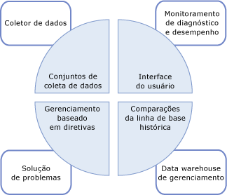
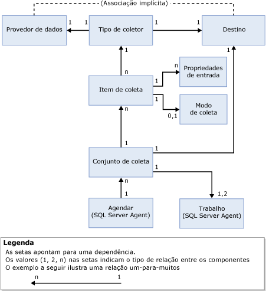

# Coleta de Dados
[!INCLUDE[appliesto-ss-xxxx-xxxx-xxx-md](../../includes/appliesto-ss-xxxx-xxxx-xxx-md.md)]
  O Coletor de Dados é um componente do [!INCLUDE[ssCurrent](../../includes/sscurrent-md.md)] que coleta diferentes conjuntos de dados. A coleta de dados é executada constantemente ou em uma agenda definida pelo usuário. O coletor de dados armazena os dados coletados em um banco de dados relacional conhecido como data warehouse de gerenciamento.  
  
## O que é o Coletor de Dados? 
 O coletor de dados é um componente importante da plataforma de coleta de dados para o [!INCLUDE[ssCurrent](../../includes/sscurrent-md.md)] e para as ferramentas fornecidas pelo [!INCLUDE[ssNoVersion](../../includes/ssnoversion-md.md)]. O coletor de dados fornece um ponto central para coleta de dados em seus servidores de banco de dados e aplicativos. Esse ponto de coleta pode obter dados de várias fontes e não se limita apenas aos dados de desempenho, ao contrário do Rastreamento do SQL.  
  
 O coletor de dados permite ajustar o escopo da coleta de dados para se adéquem a seus ambientes de teste e de produção. O coletor de dados também usa o data warehouse, um banco de dados relacional que permite gerenciar os dados coletados configurando diferentes períodos de retenção dos dados.  
  
 O coletor de dados oferece suporte ao ajuste dinâmico para coleta de dados e é extensível via API. Para obter mais informações, consulte [Data Collector Programming](http://msdn.microsoft.com/library/53b4752b-055d-4716-b2bc-75b4cce84101).  
  
 A ilustração a seguir mostra como o coletor de dados se adapta à estratégia geral de coleta e gerenciamento de dados no [!INCLUDE[ssCurrent](../../includes/sscurrent-md.md)].  
  
   
  
## Conceitos  
 O coletor de dados é integrado ao [!INCLUDE[ssNoVersion](../../includes/ssnoversion-md.md)] Agent e ao [!INCLUDE[ssISnoversion](../../includes/ssisnoversion-md.md)], e os utiliza extensivamente. Antes de trabalhar com o coletor de dados, você precisa entender determinados conceitos relacionados a cada um desses componentes do [!INCLUDE[ssNoVersion](../../includes/ssnoversion-md.md)] .  
  
 [!INCLUDE[ssNoVersion](../../includes/ssnoversion-md.md)] O Agente é usado para programar e executar trabalhos de coleta. Você precisa entender os seguintes conceitos:  
  
-   Trabalho  
  
-   Etapa do trabalho  
  
-   Agenda do trabalho  
  
-   Subsistema  
  
-   Contas Proxy  
  
 Para obter mais informações, consulte [Tarefas de administração automatizadas &#40;SQL Server Agent&#41;](http://msdn.microsoft.com/library/541ee5ac-2c9f-4b74-b4f0-13b7bd5920b0).  
  
 O [!INCLUDE[ssISnoversion](../../includes/ssisnoversion-md.md)] ([!INCLUDE[ssIS](../../includes/ssis-md.md)]) é usado para executar pacotes que coletam dados de provedores de dados individuais. Você precisa estar familiarizado com as seguintes ferramentas e conceitos do [!INCLUDE[ssIS](../../includes/ssis-md.md)] :  
  
-   Pacote [!INCLUDE[ssIS](../../includes/ssis-md.md)]  
  
-   Configuração do pacote [!INCLUDE[ssIS](../../includes/ssis-md.md)]  
  
 Para obter mais informações, consulte [Integration Services &#40;SSIS&#41; Pacotes](../../integration-services/integration-services-ssis-packages.md).  
  
## Terminologia  
 **Destino**  
 Uma instância do [!INCLUDE[ssDE](../../includes/ssde-md.md)] em uma edição do [!INCLUDE[ssNoVersion](../../includes/ssnoversion-md.md)] que oferece suporte à Coleta de dados. Para obter mais informações sobre edições com suporte, consulte a seção de "Gerenciamento" de [Recursos com suporte nas edições do SQL Server 2016](~/sql-server/editions-and-supported-features-for-sql-server-2016.md).  
  
 Uma *raiz de destino* define uma subárvore na hierarquia de destino. Um *conjunto de destinos* é o grupo de destinos resultante da aplicação de um filtro a uma subárvore definida por uma raiz de destino. Uma raiz de destino pode ser um banco de dados, uma instância do [!INCLUDE[ssNoVersion](../../includes/ssnoversion-md.md)]ou uma instância do computador.  
  
**tipo de destino**  
 Tipo de destino que tem um determinado comportamento e características. Por exemplo, um destino de instância do [!INCLUDE[ssNoVersion](../../includes/ssnoversion-md.md)] tem características diferentes das de um destino de banco de dados do [!INCLUDE[ssNoVersion](../../includes/ssnoversion-md.md)] .  
  
 **provedor de dados**  
 Uma fonte de dados conhecida, específica para um tipo de destino que fornece dados para um tipo de coletor.  
  
**tipo de coletor**  
 Um delimitador lógico que envolve os pacotes do [!INCLUDE[ssIS](../../includes/ssis-md.md)] e fornece o mecanismo real para coletar dados e carregá-los no data warehouse de gerenciamento.  
  
 **item da coleção**  
 Uma instância de um tipo de coletor. Um item de coleta é criado com um conjunto específico de propriedades de entrada e uma frequência de coleta.  
  
 **conjunto de coleta**  
 Um grupo de itens de coleta. Um conjunto de coleta é uma unidade de coleta de dados com o qual um usuário pode interagir através da interface do usuário.  
  
 **modo de coleta**  
 A maneira pela qual os dados são coletados e armazenados. O modo de coleta pode ser em cache ou não cache. O modo cache dá suporte à coleta contínua, enquanto que o modo não cache destina-se à coleta sob demanda ou a um instantâneo de coleta.  
  
 **data warehouse de gerenciamento**  
 Um banco de dados relacional usado para armazenar os dados coletados.  
  
 A ilustração a seguir mostra as dependências e as relações entre os componentes do coletor de dados.  
  
   
  
 Como mostrado na ilustração, o provedor de dados é externo ao coletor de dados e, por definição, tem uma relação implícita com o destino. O provedor de dados é específico para um destino específico (por exemplo, um serviço do [!INCLUDE[ssNoVersion](../../includes/ssnoversion-md.md)] como o mecanismo relacional) e fornece dados como exibições do sistema no [!INCLUDE[ssNoVersion](../../includes/ssnoversion-md.md)], contadores de Desempenho do Sistema e provedores WMI, que podem ser consumidos pelo coletor de dados.  
  
 O tipo de coletor é específico a um tipo de destino, baseado na associação lógica de um provedor de dados a um tipo de destino. O tipo de coletor define como os dados são coletados de um provedor de dados específico (usando parâmetros esquematizados) e especifica o esquema de armazenamento de dados. São necessários o esquema de provedor de dados e o esquema de armazenamento de dados para armazenar os dados coletados. O tipo de coletor também fornece o local do data warehouse de gerenciamento, que pode ser no computador que está executando a coleta de dados ou em um computador diferente.  
  
 Um item de coleta, mostrado na ilustração, é uma instância de um tipo de coletor específico, com parâmetros de entrada, como o esquema XML do tipo de coletor. Todos os itens de coleta devem funcionar na mesma raiz de destino ou em uma raiz de destino vazia. Isso habilita o coletor de dados a combinar tipos de coletor do sistema operacional ou de uma raiz de destino específica, mas não de raízes de destino diferentes.  
  
 Um item de coleta tem uma frequência de coleta definida que determina a frequência com que os instantâneos de valores são feitos. Embora seja um bloco de construção para um conjunto de coleta, um item de coleta não existe isoladamente.  
  
 Os conjuntos de coleta são definidos e implantados em uma instância de servidor e podem ser executados independentemente um do outro. Cada conjunto de coleta pode ser se aplicado a um destino que corresponda aos tipos de destino de todos os tipos de coletor que fazem de um conjunto de coleta. O conjunto de coleta é executado por um trabalho ou trabalhos do [!INCLUDE[ssNoVersion](../../includes/ssnoversion-md.md)] Agent, e os dados são carregados no data warehouse de gerenciamento em uma agenda predefinida.  
  
 Todos os dados coletados por instâncias diferentes dentro do conjunto de coleta são carregados no data warehouse de gerenciamento na mesma agenda. Essa agenda é definida como uma agenda compartilhada do [!INCLUDE[ssNoVersion](../../includes/ssnoversion-md.md)] Agent e pode ser usada por mais de um conjunto de coleta. Um conjunto de coleta é ativado ou desativado como uma entidade única; os itens de coleta não podem ser ativados ou desativados individualmente.  
  
 Ao criar ou atualizar um conjunto de coleta, você pode configurar o modo de coleta para coletar dados e carregá-los no data warehouse de gerenciamento. O tipo de agendamento é determinado pelo tipo de coleta: em cache ou não cache. Se a coleta for em cache, a coleta e o carregamento de dados serão executados como trabalhos separados. A coleta é executada segundo uma agenda que inicia quando o [!INCLUDE[ssNoVersion](../../includes/ssnoversion-md.md)] Agent é iniciado e executado na frequência especificada no item de coleta. O carregamento é executado de acordo com a agenda especificada pelo usuário.  
  
 Na coleta não cache, a coleta e o carregamento de dados são executados em um único trabalho, mas em duas etapas. A primeira etapa é a coleta, a segunda etapa é o carregamento. Nenhuma agenda é necessária para a coleta sob demanda.  
  
 Depois que um conjunto de coleta é habilitado, a coleta de dados pode ser iniciada, de acordo com uma agenda ou sob demanda. Quando a coleta de dados iniciar, o [!INCLUDE[ssNoVersion](../../includes/ssnoversion-md.md)] Agent gera um processo para o coletor de dados, que em troca carrega os pacotes do [!INCLUDE[ssISnoversion](../../includes/ssisnoversion-md.md)] no conjunto de coleta. Os itens de coleta que representam tipos de coleta reúnem dados dos provedores de dados apropriados nos destinos especificados. Quando o ciclo de coleta termina, os dados são carregados no data warehouse de gerenciamento.  
  
## O que você pode fazer  
  
|Descrição|Tópico|  
|----------------------|-----------|  
|Gerencie diferentes aspectos da coleta de dados; por exemplo, habilitar ou desabilitar a coleta de dados, alterar a configuração de um conjunto de coleta ou exibir dados no data warehouse de gerenciamento.|[Gerenciar coleta de dados](../../relational-databases/data-collection/manage-data-collection.md)|  
|Use esses relatórios para obter informações para monitorar a capacidade de sistema e solucionar problemas de desempenho do sistema.|[Relatórios do conjunto de coleta de dados do sistema](../../relational-databases/data-collection/system-data-collection-set-reports.md)|  
|Use o Data Warehouse de Gerenciamento para coletar dados de um servidor que seja o destino da coleta de dados.|[Data warehouse de gerenciamento](../../relational-databases/data-collection/management-data-warehouse.md)| 
|Explore os recursos de rastreamento do lado do servidor do SQL Server Profiler para exportar uma definição de rastreamento que pode ser usada para criar um conjunto de coleta que usa o tipo de coletor de Rastreamento do SQL Genérico| [Usar o SQL Server Profiler para criar um Conjunto de Coleta do Rastreamento do SQL (SQL Server Management Studio)](use-sql-server-profiler-to-create-a-sql-trace-collection-set.md)
  
  

