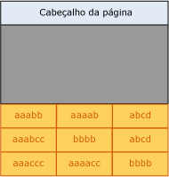
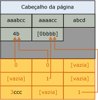

# Implementação da compactação de página
[!INCLUDE [SQL Server Azure SQL Database](../../includes/applies-to-version/sql-asdb.md)]

  Este tópico resume como o [!INCLUDE[ssDE](../../includes/ssde-md.md)] implementa a compactação de página. Este resumo fornece informações básicas para ajudar no planejamento do espaço de armazenamento exigido pelos dados.  
  
 A compactação de página é semelhante para tabelas, partições de tabela, índices e partições de índice. A descrição a seguir de compactação de página para uma tabela se aplica à compactação de página de todos os tipos de objeto. Os exemplos a seguir compactam cadeias de caracteres, mas a compactação de prefixo e dicionário segue os mesmos princípios para outros tipos de dados.  
  
 A compactação do nível folha de tabelas e índices usando a compactação de página consiste em três operações nesta ordem:  
  
1.  Compactação de linha  
  
2.  Compactação de prefixo  
  
3.  Compactação de dicionário  

 Quando você usa a compactação de página, as páginas do nível não folha dos índices são compactadas usando apenas a compactação de linha. Para obter mais informações sobre compactação de linha, veja [Implementação da compactação de linha](../../relational-databases/data-compression/row-compression-implementation.md).  
  
## Compactação de prefixo  
 Para cada página que está sendo compactada, a compactação de prefixo usa estas etapas:  
  
1.  Para cada coluna, é identificado um valor que pode ser usado para reduzir o espaço de armazenamento para os valores de cada coluna.  
  
2.  Uma linha que representa os valores de prefixo de cada coluna é criada e armazenada em uma estrutura CI (informações de compactação) que segue imediatamente o cabeçalho da página.  
  
3.  Os valores de prefixo repetidos da coluna são substituídos por uma referência ao prefixo correspondente. Se o valor de uma linha não corresponder exatamente ao valor do prefixo selecionado, deverá ser indicada uma correspondência parcial.  
  
 A ilustração a seguir mostra um exemplo de página de uma tabela antes da compactação de prefixo.  
  
   
  
 A ilustração a seguir mostra a mesma página após a compactação de prefixo. O prefixo é movido para o cabeçalho e os valores da coluna são alterados para referências ao prefixo.  
  
   
  
 Na primeira coluna da primeira linha, o valor 4b indica que os primeiros quatro caracteres do prefixo (aaab) estão presentes para essa linha, além do caractere b. Isso gera o valor resultante aaabb, que é o valor original.  
  
## Compactação de dicionário  
 Após a conclusão da compactação de prefixo, é aplicada a compactação de dicionário. A compactação de dicionário procura valores repetidos em qualquer lugar da página e os armazena na área de informações de compactação. Diferentemente da compactação de prefixo, a compactação de dicionário não é restrita a uma coluna. A compactação de dicionário pode substituir valores repetidos que ocorrem em qualquer lugar de uma página. A ilustração a seguir mostra a mesma página após a compactação de dicionário.  
  
   
  
 Observe que o valor 4b foi referenciado a partir de colunas diferentes da página.  
  
## Quando ocorre a compactação de página  
 Quando uma tabela é criada e possui compactação de página, não ocorre compactação. No entanto, os metadados da tabela indicam que a compactação de página deve ser usada. Como os dados são adicionados à primeira página de dados, os dados são compactados por linha. Como a página não está cheia, não há benefício decorrente da compactação de página. Quando a página está cheia, a próxima linha a ser adicionada inicia a operação de compactação de página. A página inteira é revisada; cada coluna é avaliada para compactação de prefixo e, em seguida, todas as colunas são avaliadas para confirmar se a compactação de dicionário é necessária. Se a compactação de página tiver criado espaço suficiente na página para uma linha adicional, a linha será adicionada e os dados serão compactados por linha e página. Se o espaço obtido pela compactação de página menos o espaço exigido para a estrutura de informações de compactação não for significativo, a compactação de página não será usada nessa página. As linhas futuras serão ajustadas à nova página ou, se não couberem, uma nova página será adicionada à tabela. Semelhante à primeira página, a nova página não estará na primeira página compactada.  
  
 Quando uma tabela existente que contém dados for convertida para compactação de página, cada página será recriada e avaliada. A recriação de todas as páginas causará a recriação da tabela, do índice ou da partição.  
  
## Consulte Também  
 [Compactação de dados](../../relational-databases/data-compression/data-compression.md)   
 [Implementação da compactação de linha](../../relational-databases/data-compression/row-compression-implementation.md)  
  
  
