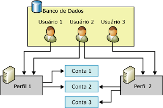

# Objetos de configuração do Database Mail
[!INCLUDE[appliesto-ss-xxxx-xxxx-xxx-md](../../includes/appliesto-ss-xxxx-xxxx-xxx-md.md)]
  O Database Mail tem dois objetos de configuração: os objetos de configuração de banco de dados permitem que você defina as configurações que Database Email deve usar ao enviar um email de seu aplicativo de banco de dados ou [!INCLUDE[ssNoVersion](../../includes/ssnoversion-md.md)] Agent.  
  
-   Contas do Database Mail  
  
-   Perfis do Database Mail  
  
  
##   Relação do objeto de configuração do Database Mail  
 A ilustração mostra dois perfis, três contas e três usuários. O Usuário 1 tem acesso ao Perfil 1, que usa a Conta 1 e a Conta 2. O Usuário 3 tem acesso ao Perfil 2, que usa a Conta 2 e a Conta 3. O Usuário 2 tem acesso ao Perfil 1 e ao Perfil 2.  
  
   
  
  
##   Conta do Database Mail  
 Uma conta do Database Mail contém as informações que o Microsoft [!INCLUDE[ssNoVersion](../../includes/ssnoversion-md.md)] usa para enviar mensagens de email a um servidor SMTP. Cada conta contém informações de um servidor de email.  
  
 O Database Mail oferece suporte a três métodos de autenticação para se comunicar com um servidor SMTP:  
  
-   Autenticação do Windows: O Database Mail usa as credenciais da conta de serviço do Windows do [!INCLUDE[ssDEnoversion](../../includes/ssdenoversion-md.md)] para autenticação no servidor SMTP.  
  
-   Autenticação Básica: O Database Mail usa o nome de usuário e a senha especificados para autenticação no servidor SMTP.  
  
-   Autenticação Anônima: O servidor SMTP não exige nenhuma autenticação.  O Database Mail não usará nenhuma credencial para a autenticação no servidor SMTP.  
  
 As informações da conta são armazenadas no banco de dados **msdb** . Cada conta consiste nas seguintes informações:  
  
-   O nome da conta.  
  
-   Uma descrição da conta.  
  
-   O endereço de email da conta.  
  
-   O nome para exibição da conta.  
  
-   O endereço de email a usar como informação de “responder” da conta.  
  
-   O nome do servidor de email.  
  
-   O tipo de servidor de email. Para o [!INCLUDE[msCoName](../../includes/msconame-md.md)] [!INCLUDE[ssNoVersion](../../includes/ssnoversion-md.md)], é sempre o protocolo SMTP.  
  
-   O número da porta do servidor de email.  
  
-   Uma coluna de bits indicando se a conexão com o servidor de email SMTP é feita usando protocolo SSL.  
  
-   Uma coluna de bits indicando se a conexão com o servidor SMTP é feita usando as credenciais configuradas para o [!INCLUDE[ssDEnoversion](../../includes/ssdenoversion-md.md)].  
  
-   O nome de usuário a usar para autenticação no servidor de email, se este exigir autenticação.  
  
-   A senha a usar para autenticação no servidor de email, se este exigir autenticação.  
  
 O Assistente para Configuração do Database Mail é um modo conveniente de criar e gerenciar contas. Você também pode usar os procedimentos armazenados de configuração no **msdb** para criar e gerenciar contas.  
  
  
##   Perfil do Database Mail  
 Um perfil do Database Mail é uma coleção ordenada de contas relacionadas do Database Mail. Os aplicativos que enviam email por meio do Database Mail especificam perfis, em vez de usar contas diretamente. Separar as informações sobre os servidores de email individuais e os objetos utilizados pelo aplicativo melhora a flexibilidade e a confiabilidade: os perfis proporcionam failover automático, de modo que, se um servidor de email não estiver respondendo, o Database Mail poderá enviar email para outro servidor automaticamente. Os administradores de banco de dados podem adicionar, remover ou reconfigurar contas sem a necessidade de alterações no código do aplicativo ou nas etapas de trabalho.  
  
 Os perfis também ajudam os administradores de banco de dados a controlar o acesso a email. É necessária associação à função **DatabaseMailUserRole** para poder enviar Database Mail. Os perfis propiciam flexibilidade extra aos administradores para controlar quem envia email e quais contas são utilizadas.  
  
 Um perfil pode ser público ou particular.  
  
 Os**perfis públicos** estão disponíveis a todos os membros da função de banco de dados **DatabaseMailUserRole** no banco de dados **msdb** . Eles permitem que todos os membros da função **DatabaseMailUserRole** enviem email utilizando o perfil.  
  
 Os**perfis particulares** são definidos para entidades de segurança no banco de dados **msdb** . Eles permitem que apenas usuários, funções e membros especificados da função de servidor fixa **sysadmin** do banco de dados enviem email usando o perfil. Por padrão, um perfil é particular e permite acesso apenas a membros da função de servidor fixa **sysadmin** . Para uso de um perfil particular, **sysadmin** deve conceder aos usuários permissão para usarem o perfil. Além disso, a permissão de EXECUTE no procedimento armazenado **sp_send_dbmail** é concedida apenas a membros da função **DatabaseMailUserRole**. Um administrador do sistema deve adicionar o usuário à função de banco de dados **DatabaseMailUserRole** para que ele possa enviar mensagens de email.  
  
 Os perfis melhoram a confiança nos casos em que um servidor de email se torna inacessível ou incapaz de processar mensagens. Cada conta no perfil possui um número de sequência. O número de sequência determina a ordem na qual o Database Mail usa as contas no perfil. Para uma nova mensagem de email, o Database Mail usa a última conta que enviou uma mensagem com êxito ou a conta com o número de sequência mais baixo, caso ainda não tenha sido enviada nenhuma mensagem. Se essa conta falhar, o Database Mail usará a conta com o próximo número de sequência mais alto, e assim por diante, até que o Database Mail envie a mensagem com êxito ou a conta com o número de sequência mais alto falhe. Se a conta com o número de sequência mais alto falhar, o Database Mail pausará as tentativas de enviar o email pelo período de tempo configurado no parâmetro **AccountRetryDelay** de **sysmail_configure_sp**e, em seguida, iniciará o processo de tentar enviar o email novamente, começando pelo número de sequência mais baixo. Use o parâmetro **AccountRetryAttempts** de **sysmail_configure_sp**para configurar o número de vezes que o processo de email externo tenta enviar a mensagem de email usando cada conta no perfil especificado.  
  
 Se existir mais de uma conta com o mesmo número de sequência, o Database Mail utilizará apenas uma delas para uma dada mensagem de email. Nesse caso, o Database Mail não pode garantir qual das contas será usada para o número de sequência em questão nem que a mesma conta seja usada em todas as mensagens.  
  
  
##   Tarefas de configuração do Database Mail  
 A tabela a seguir descreve as tarefas de configuração do Database Mail.  
  
|Tarefa de configuração|Link do tópico|  
|------------------------|----------------|  
|Descrever como criar contas do Database Mail|[Criar uma conta do Database Mail](../../relational-databases/database-mail/create-a-database-mail-account.md)|  
|Descrever como criar perfis do Database Mail|[Criar um perfil do Database Mail](../../relational-databases/database-mail/create-a-database-mail-profile.md)|  
|Descreve como configurar o Database Mail|[Configurar o Database Mail](../../relational-databases/database-mail/configure-database-mail.md)|  
|Descreve como criar um script de configuração do Database Mail usando modelos||  
  
  
##   Tarefas adicionais de configuração de banco de dados (procedimentos armazenados do sistema)  
 Os procedimentos armazenados de configuração do Database Mail estão localizados no banco de dados **msdb** .  
  
 As tabelas a seguir listam os procedimentos armazenados utilizados para configurar e gerenciar o Database Mail.  
  
### Configurações do Database Mail  
  
|Nome|Description|  
|----------|-----------------|  
|[sysmail_configure_sp (Transact-SQL)](../../relational-databases/system-stored-procedures/sysmail-configure-sp-transact-sql.md)|Altera definições de configuração do Database Mail.|  
|[sysmail_help_configure_sp (Transact-SQL)](../../relational-databases/system-stored-procedures/sysmail-help-configure-sp-transact-sql.md)|Exibe definições de configuração do Database Mail.|  
  
### Contas e perfis  
  
|Nome|Description|  
|----------|-----------------|  
|[sysmail_add_profileaccount_sp (Transact-SQL)](../../relational-databases/system-stored-procedures/sysmail-add-profileaccount-sp-transact-sql.md)|Adiciona uma conta de email a um perfil do Database Mail.|  
|[sysmail_delete_account_sp (Transact-SQL)](../../relational-databases/system-stored-procedures/sysmail-delete-account-sp-transact-sql.md)|Exclui uma conta do Database Mail.|  
|[sysmail_delete_profile_sp (Transact-SQL)](../../relational-databases/system-stored-procedures/sysmail-delete-profile-sp-transact-sql.md)|Exclui um perfil do Database Mail.|  
|[sysmail_delete_profileaccount_sp (Transact-SQL)](../../relational-databases/system-stored-procedures/sysmail-delete-profileaccount-sp-transact-sql.md)|Remove uma conta de um perfil do Database Mail.|  
|[sysmail_help_account_sp (Transact-SQL)](../../relational-databases/system-stored-procedures/sysmail-help-account-sp-transact-sql.md)|Lista informações sobre contas do Database Mail.|  
|[sysmail_help_profile_sp (Transact-SQL)](../../relational-databases/system-stored-procedures/sysmail-help-profile-sp-transact-sql.md)|Lista informações sobre um ou mais perfis do Database Mail.|  
|[sysmail_help_profileaccount_sp (Transact-SQL)](../../relational-databases/system-stored-procedures/sysmail-help-profileaccount-sp-transact-sql.md)|Lista as contas associadas a um ou mais perfis do Database Mail.|  
|[sysmail_update_account_sp (Transact-SQL)](../../relational-databases/system-stored-procedures/sysmail-update-account-sp-transact-sql.md)|Atualiza as informações em uma conta existente do Database Mail.|  
|[sysmail_update_profile_sp (Transact-SQL)](../../relational-databases/system-stored-procedures/sysmail-update-profile-sp-transact-sql.md)|Altera a descrição ou o nome de um perfil do Database Mail.|  
|[sysmail_update_profileaccount_sp (Transact-SQL)](../../relational-databases/system-stored-procedures/sysmail-update-profileaccount-sp-transact-sql.md)|Atualiza o número de sequência de uma conta dentro de um perfil do Database Mail.|  
  
### Segurança  
  
|Nome|Description|  
|----------|-----------------|  
|[sysmail_add_principalprofile_sp (Transact-SQL)](../../relational-databases/system-stored-procedures/sysmail-add-principalprofile-sp-transact-sql.md)|Concede permissão a uma entidade de banco de dados para usar um perfil do Database Mail.|  
|[sysmail_delete_principalprofile_sp (Transact-SQL)](../../relational-databases/system-stored-procedures/sysmail-delete-principalprofile-sp-transact-sql.md)|Remove a permissão de um usuário do banco de dados para usar um perfil público ou particular do Database Mail.|  
|[sysmail_help_principalprofile_sp (Transact-SQL)](../../relational-databases/system-stored-procedures/sysmail-help-principalprofile-sp-transact-sql.md)|Lista informações de perfil do Database Mail referentes a um determinado usuário de banco de dados.|  
|[sysmail_update_principalprofile_sp (Transact-SQL)](../../relational-databases/system-stored-procedures/sysmail-update-principalprofile-sp-transact-sql.md)|Atualiza as informações de permissões de um determinado usuário de banco de dados.|  
  
### Estado do sistema  
  
|Nome|Description|  
|----------|-----------------|  
|[sysmail_start_sp &#40;Transact-SQL&#41;](../../relational-databases/system-stored-procedures/sysmail-start-sp-transact-sql.md)|Inicia o programa externo do Database Mail e a fila associada do SQL Service Broker.|  
|[sysmail_stop_sp &#40;Transact-SQL&#41;](../../relational-databases/system-stored-procedures/sysmail-stop-sp-transact-sql.md)|Interrompe o programa externo do Database Mail e a fila associada do SQL Service Broker.|  
|[sysmail_help_status_sp &#40;Transact-SQL&#41;](../../relational-databases/system-stored-procedures/sysmail-help-status-sp-transact-sql.md)|Indica se o Database Mail foi iniciado.|  
  
##   Referências adicionais  
  
-   [Registro em log e auditoria do Database Mail](../../relational-databases/database-mail/database-mail-log-and-audits.md)  
  
  
  
