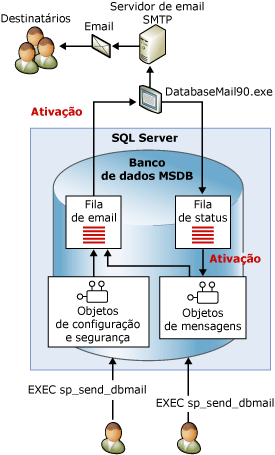

# Database Mail
  Database Mail é uma solução empresarial para envio de mensagens de email do [!INCLUDE[ssDEnoversion](../../includes/ssdenoversion-md.md)]. Com o Database Mail, seus aplicativos de banco de dados podem enviar mensagens de email a usuários. As mensagens podem conter resultados de consulta e incluir, também, arquivos de qualquer recurso de sua rede.  
  
  
##   Benefícios do uso do Database Mail  
 O Database Mail foi projetado de modo a garantir confiança, escalabilidade, segurança e suporte.  
  
### Confiabilidade  
  
-   O Database Mail usa o protocolo SMTP (Simple Mail Transfer Protocol) padrão para enviar emails. Você pode usar o Database Mail sem instalar um cliente de MAPI Estendida no computador que executa o [!INCLUDE[ssNoVersion](../../includes/ssnoversion-md.md)].  
  
-   Isolamento do processo. Para minimizar o impacto no [!INCLUDE[ssNoVersion](../../includes/ssnoversion-md.md)], o componente que entrega execuções de e-mail fora do [!INCLUDE[ssNoVersion](../../includes/ssnoversion-md.md)], em um processo separado. O [!INCLUDE[ssNoVersion](../../includes/ssnoversion-md.md)] continuará colocando na fila as mensagens de email mesmo se o processo externo for interrompido ou falhar. As mensagens enfileiradas serão enviadas assim que o processo externo ou o servidor SMTP ficar online.  
  
-   Contas de failover. Um perfil do Database Mail lhe permite especificar mais de um servidor SMTP. Caso um servidor SMTP fique indisponível, as mensagens poderão ser entregues por um outro servidor SMTP.  
  
-   Suporte a cluster. O Database Mail reconhece cluster e conta com suporte total em um cluster.  
  
### Escalabilidade  
  
-   Entrega em segundo plano: o Database Mail fornece entrega em segundo plano ou assíncrona. Quando **sp_send_dbmail** é chamado para enviar uma mensagem, o Database Mail adiciona uma solicitação a uma fila do [!INCLUDE[ssSB](../../includes/sssb-md.md)] . O procedimento armazenado retorna imediatamente. O componente de email externo recebe a solicitação e entrega o email.  
  
-   Vários perfis: o Database Mail lhe permite criar vários perfis dentro de uma instância do [!INCLUDE[ssNoVersion](../../includes/ssnoversion-md.md)] . Opcionalmente, você pode escolher o perfil a ser utilizado pelo Database Mail para enviar uma mensagem.  
  
-   Várias contas: cada perfil pode conter várias contas de failover. Você pode configurar perfis diferentes com contas diferentes para distribuir email por vários servidores de email.  
  
-   Compatibilidade de 64 bits: o Database Mail tem suporte total em instalações de 64 bits do [!INCLUDE[ssNoVersion](../../includes/ssnoversion-md.md)].  
  
### Segurança  
  
-   Desativada, por padrão: para reduzir a área da superfície do [!INCLUDE[ssNoVersion](../../includes/ssnoversion-md.md)], os procedimentos armazenados do Database Mail ficam desabilitados por padrão.  
  
-   Segurança do email: para enviar o Database Mail, é necessário ser membro da função de banco de dados **DatabaseMailUserRole** no banco de dados **msdb** .  
  
-   Segurança do perfil: o Database Mail impõe a segurança dos perfis de email. Os usuários ou grupos do banco de dados **msdb** que têm acesso a um perfil do Database Mail são escolhidos por você. Você pode conceder acesso a usuários específicos ou a todos os usuários do **msdb**. Os perfis particulares restringem o acesso a uma lista especificada de usuários. Os perfis públicos estão disponível para todos os usuários de um banco de dados.  
  
-   Administrador de tamanho de anexo: o Database Mail impõe um limite configurável ao tamanho do arquivo de anexo. É possível alterar esse limite usando o procedimento armazenado [sysmail_configure_sp](../../relational-databases/system-stored-procedures/sysmail-configure-sp-transact-sql.md) .  
  
-   Extensões de arquivo proibidas: o Database Mail mantém uma lista de extensões de arquivo proibidas. Arquivos com extensões que figuram na lista não podem ser anexados pelos usuários. É possível alterar essa lista usando sysmail_configure_sp.  
  
-   O Database Mail é executado na conta de serviço do mecanismo do [!INCLUDE[ssNoVersion](../../includes/ssnoversion-md.md)] . Para anexar um arquivo de uma pasta a um email, a conta de mecanismo do [!INCLUDE[ssNoVersion](../../includes/ssnoversion-md.md)] deve ter permissões para acessar a pasta com o arquivo.  
  
### Suporte  
  
-   Configuração integrada. O Database Mail mantém as informações das contas de email no [!INCLUDE[ssDEnoversion](../../includes/ssdenoversion-md.md)]. Não há nenhuma necessidade de gerenciar um perfil de email em um aplicativo cliente externo. O Assistente para Configuração do Database Mail é uma interface conveniente para a configuração do Database Mail. Você também pode criar e manter configurações do Database Mail por meio de [!INCLUDE[tsql](../../includes/tsql-md.md)].  
  
-   Registro em log. O Database Mail registra a atividade de email no [!INCLUDE[ssNoVersion](../../includes/ssnoversion-md.md)], no log de eventos de aplicativos do Microsoft Windows e em tabelas do banco de dados **msdb** .  
  
-   Auditoria: o Database Mail mantém cópias das mensagens e anexos enviados no banco de dados **msdb** . É fácil auditar o uso do Database Mail e examinar as mensagens retidas.  
  
-   Suporte a HTML. O Database Mail lhe permite enviar email formatado como HTML.  
  
  
##   Arquitetura do Database Mail  
 O Database Mail foi projetado em uma arquitetura de filas que usa tecnologias do Service Broker. Quando os usuários executam **sp_send_dbmail**, o procedimento armazenado insere um item na fila de emails e cria um registro que contém a mensagem do email. A inserção da nova entrada na fila de emails inicia o processo externo do Database Mail ((DatabaseMail.exe). O processo externo lê as informações de email e envia a mensagem ao servidor ou servidores de email adequados. O processo externo insere um item na fila Status quanto ao resultado da operação de envio. A inserção da nova entrada na fila de status faz com que seja iniciado um procedimento armazenado que atualiza o status da mensagem de email. Além de armazenar a mensagem de email enviada ou não, o Database Mail também registra eventuais anexos dos emails nas tabelas do sistema. As exibições do Database Mail fornecem o status das mensagens para a solução de problemas, e os procedimentos armazenados permitem a administração da fila do Database Mail.  
  
 O   
  
  
##   Introdução aos componentes do Database Mail  
 O Database Mail consiste nos seguintes componentes principais:  
  
-   Componentes de configuração e segurança  
  
     O Database Mail armazena informações de configuração e segurança no banco de dados **msdb** . Objetos de configuração e segurança criam perfis e contas usadas pelo Database Mail.  
  
-   Componentes de sistema de mensagens  
  
     O banco de dados **msdb** atua como o banco de dados de email-host que mantém os objetos do sistema de mensagens utilizado pelo Database Mail para enviar emails. Esses objetos compreendem o procedimento armazenado **sp_send_dbmail** e as estruturas de dados que mantém informações sobre mensagens.  
  
-   Executável do Database Mail  
  
     O executável do Database Mail é um programa externo que lê uma fila no banco de dados **msdb** e envia mensagens a servidores de email.  
  
-   Componentes de registro em log e auditoria  
  
     O Database Mail registra informações de log no banco de dados **msdb** e no log de eventos de aplicativos do [!INCLUDE[msCoName](../../includes/msconame-md.md)] Windows.  
  
 **Configurando o Agente para usar o Database Mail:**  
  
 O SQL Server Agent pode ser configurado para usar o Database Mail. Isso é necessário para notificações de alerta e notificação automática quando um trabalho é concluído.  
  
> [!WARNING]  
>  Etapas de trabalho individuais dentro de um trabalho também podem enviar email sem configurar o [!INCLUDE[ssNoVersion](../../includes/ssnoversion-md.md)] Agent para usar o Database Mail. Por exemplo, uma etapa de trabalho [!INCLUDE[tsql](../../includes/tsql-md.md)] pode usar Database Mail para enviar os resultados de uma consulta para uma lista de destinatários.  
  
 Você pode configurar o [!INCLUDE[ssNoVersion](../../includes/ssnoversion-md.md)] Agent para enviar mensagens de email a operadores predefinidos, quando:  
  
-   Um alerta é disparado. Alertas podem ser configurados para que enviem notificação por email sobre eventos específicos ocorridos. Por exemplo, podem ser configurados alertas que notifiquem um operador sobre um evento de banco de dados em particular ou uma condição do sistema operacional que talvez necessite de ação imediata. Para obter mais informações sobre como configurar alertas, veja [Alertas](http://msdn.microsoft.com/library/3f57d0f0-4781-46ec-82cd-b751dc5affef).  
  
-   Uma tarefa agendada, como um backup de banco de dados ou evento de replicação, obtém êxito ou falha. Por exemplo, você pode usar o [!INCLUDE[ssNoVersion](../../includes/ssnoversion-md.md)] Agent Mail para notificar operadores se ocorrer um erro durante o processamento do final de um mês.  
  
  
##   Tópicos de componentes do Database Mail  
  
-   [Objetos de configuração do Database Mail](../../relational-databases/database-mail/database-mail-configuration-objects.md)  
  
-   [Objetos do sistema de mensagens do Database Mail](../../relational-databases/database-mail/database-mail-messaging-objects.md)  
  
-   [Programa externo do Database Mail](../../relational-databases/database-mail/database-mail-external-program.md)  
  
-   [Registro em log e auditoria do Database Mail](../../relational-databases/database-mail/database-mail-log-and-audits.md)  
  
-   [Configurar o SQL Server Agent Mail para usar o Database Mail](../../relational-databases/database-mail/configure-sql-server-agent-mail-to-use-database-mail.md)  
  
  
  
