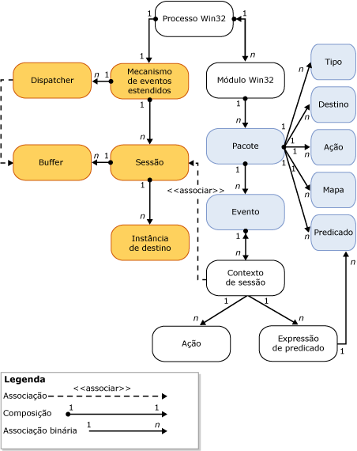

# Mecanismo de eventos estendidos do SQL Server
[!INCLUDE[appliesto-ss-asdb-xxxx-xxx-md](../../includes/appliesto-ss-asdb-xxxx-xxx-md.md)]

  O mecanismo de Eventos Estendidos do [!INCLUDE[ssNoVersion](../../includes/ssnoversion-md.md)] é uma coleção de serviços e objetos que:  
  
-   Habilita a definição de eventos.  
  
-   Habilita dados de evento de processamento.  
  
-   Gerencia serviços de eventos estendidos e objetos no sistema.  
  
-   Mantenha uma lista de sessões de eventos estendidos e gerencie o acesso àquela lista.  
  
 O mecanismo de eventos estendidos não fornece qualquer evento ou ações que ocorram quando um evento é disparado. Os processos que usam o mecanismo de evento estendido definem interação com o mecanismo. Estes processos adicionam pontos de evento e fornecem ações para que ocorram em resposta ao disparo do evento.  
  
 A ilustração seguinte mostra uma exibição simplificada de uma sessão de eventos estendidos. Para obter mais informações, consulte [Sessões de eventos estendidos do SQL Server](../../relational-databases/extended-events/sql-server-extended-events-sessions.md).  
  
   
  
 Observe o seguinte:  
  
-   Cada processo do Windows pode ter um ou mais módulos (**processo Win32**, **módulo Win32**). Estes também são conhecidos como *binários* ou *módulos de executáveis*.  
  
-   Cada um dos módulos de processo do Windows pode conter um ou mais pacotes de eventos estendidos (**Pacote**) que contêm um ou mais objetos de eventos estendidos (**Tipo**, **Destino**, **Ação**, **Mapa**, **Predicado**e **Evento**).  
  
-   Dentro de um processo de host pode haver só uma instância do mecanismo de eventos estendidos (**Mecanismo de evento estendido**) que:  
  
    -   Gerencia alguns aspectos da sessão (por exemplo, enumerar sessões).  
  
    -   Gerencia envio (**Dispatcher**). Isso é semelhante a um pool de thread.  
  
    -   Gerencia buffers de memória (**Buffer**) para eventos. Quando os buffers estiverem cheios, eles são despachados para os destinos.  
  
-   Depois que uma sessão for criada e os eventos associados à sessão opcionalmente (**Contexto de sessão**):  
  
    -   Instâncias de destinos (**Instância de destino**) podem também ser criadas e adicionadas à sessão.  
  
    -   Quando os buffers estão cheios, aqueles buffers são despachados para os destinos.  
  
## Consulte Também  
 [Eventos estendidos](../../relational-databases/extended-events/extended-events.md)  
  
  
