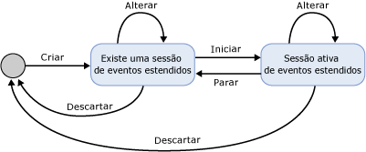
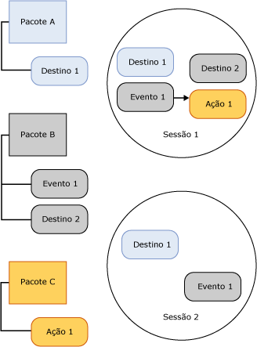

# Sessões de eventos estendidos do SQL Server

[!INCLUDE[appliesto-ss-asdb-xxxx-xxx-md](../../includes/appliesto-ss-asdb-xxxx-xxx-md.md)]

  Uma sessão de eventos estendidos do [!INCLUDE[ssNoVersion](../../includes/ssnoversion-md.md)] é criada no processo do [!INCLUDE[ssNoVersion](../../includes/ssnoversion-md.md)] que está hospedando o mecanismo de eventos estendidos. Os seguintes aspectos de uma sessão de eventos estendidos fornecem um contexto para entender a infraestrutura de eventos estendidos e o processamento geral que ocorre:  
  
-   Estados de sessão. Os diferentes estados em que uma sessão de eventos estendidos se encontra quando as instruções CREATE EVENT SESSION e ALTER EVENT SESSION são executadas.  
  
-   Conteúdo de sessão e características. O conteúdo de uma sessão do Extended Events, como destinos e eventos, e o modo como esses objetos estão relacionados em uma sessão ou entre sessões.  
  
## Estados da sessão  
 A ilustração a seguir mostra os vários estados de uma sessão de eventos estendidos.  
  
   
  
 Mencionando a figura precedente, observe que o estado da sessão é alterado quando os comandos DDL diferentes são emitidos para uma sessão de evento. Essas alterações de estado são descritas na tabela a seguir.  
  
|Rótulo de ilustração|instrução DDL|DESCRIÇÃO|  
|------------------------|-------------------|-----------------|  
|Criar|CREATE EVENT SESSION|O processo do host cria um objeto de sessão que contém os metadados fornecidos pela CREATE EVENT SESSION. O processo do host valida a definição de sessão, valida o nível de permissão do usuário, e armazena os metadados no banco de dados mestre. Neste momento a sessão não está ativa.|  
|Alterar|ALTER EVENT SESSION, STATE=START|O processo do host inicia a sessão. O processo do host lê os metadados armazenados, valida a definição da sessão, verifica o nível de permissão do usuário e cria a sessão. Objetos de sessão, como eventos e destinos, são carregados e a manipulação de eventos está ativa.|  
|Alterar|ALTER EVENT SESSION, STATE=STOP|O processo do host para a sessão ativa, mas retém os metadados.|  
|Remover|DROP EVENT SESSION|Dependendo se a sessão está ativa ou não, Descartar (DROP SESSION) excluirá os metadados e fechará a sessão ativa, ou excluirá os metadados da sessão.|  
  
> [!NOTE]  
>  ALTER EVENT SESSION e DROP EVENT SESSION podem ser aplicados aos metadados, ou a uma sessão ativa e aos metadados.  
  
## Conteúdo da sessão e características  
 Sessões de evento estendidos têm limites implícitos sendo que a configuração de uma sessão não altera a configuração de outra sessão. Contudo, esses limites não impedem que um evento ou destino seja usado em mais de uma sessão.  
  
 A ilustração a seguir mostra o conteúdo da sessão e a relação entre pacotes e sessões.  
  
   
  
 Em relação à ilustração anterior, observe que:  
  
-   O mapeamento entre objetos de pacote e sessões são muitos para muitos, o que significa que um objeto pode aparecer em várias sessões, e uma sessão pode conter vários objetos.  
  
-   O mesmo evento (Evento 1) ou destino (Destino 1) pode ser habilitado em mais de uma sessão.  
  
 As sessões têm as seguintes características:  
  
-   Ações e predicados estão associados a eventos em uma base por sessão. Se você tem o Evento 1 na Sessão A com a Ação 1 e o Predicado Z, isso de forma alguma impedirá que você tenha o Evento 1 na Sessão B com a Ação 2 e a Ação 3 sem nenhum predicado.  
  
-   As políticas são anexadas a sessões para controlar a utilização de buffer e expedição, e rastreamento de causalidade.  
  
 **Utilização de buffer e expedição**  
  
 A utilização de buffer se refere a como os dados de evento serão armazenados enquanto uma sessão de evento estiver em execução.  As políticas de utilização de buffer especificam o volume de memória a ser usado para dados de evento e a política de perda para os eventos. A expedição refere-se ao tempo que os eventos permanecerão nos buffers antes de serem entregues aos destinos para processamento.  
  
 **Rastreamento de causalidade**  
  
 O rastreamento de causalidade proporciona capacidade para rastrear trabalho por tarefas múltiplas. Quando o rastreamento de causalidade é habilitado, cada evento disparado tem uma ID exclusiva de atividade no sistema. A ID de atividade é uma combinação de um valor GUID que permanece constante em todos os eventos de uma tarefa e um número de sequência que é incrementado toda vez que um evento é disparado. Quando uma tarefa gera trabalho em outra, a ID de atividade da tarefa pai é enviada à tarefa filho. A tarefa filho produz a ID de atividade do pai na primeira vez dispara um evento.  
  
 A arquitetura de eventos estendidos oferece um sistema flexível que permite a utilização de diversos objetos para serem usados em conjunto na solução de problemas específicos.  
  
## Consulte Também  
 [Eventos estendidos](../../relational-databases/extended-events/extended-events.md)  
  
  
