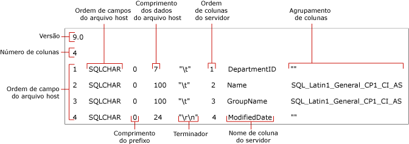

# <a name="non-xml-format-files-sql-server"></a>Arquivos de formato não XML (SQL Server)
[!INCLUDE[appliesto-ss-asdb-asdw-pdw-md](../../includes/appliesto-ss-asdb-asdw-pdw-md.md)]
  No [!INCLUDE[ssCurrent](../../includes/sscurrent-md.md)], há suporte para dois tipos de arquivos de formato de exportação e importação em massa: *arquivos de formato não XML* e *arquivos de formato XML*.  
  
 **Neste tópico:**  
  
-   [Benefícios](#Benefits)  
  
-   [Estrutura de arquivos de formato não XML](#Structure)  
  
-   [Exemplo de um arquivo de formato não XML](#Examples)  
  
-   [Tarefas relacionadas](#RelatedTasks)  
  
##  <a name="Benefits"></a> Benefícios de arquivos de formato não XML  
  
-   Você pode criar um arquivo de formato não XML automaticamente especificando a opção **format** em um comando **bcp** .  
  
-   Quando você especifica um arquivo de formato existente em um comando **bcp** , o comando usa os valores registrados no arquivo de formato e não solicita a você o tipo de armazenamento do arquivo, comprimento do prefixo, tamanho do campo ou o terminador de campo.  
  
-   Você pode criar um arquivo de formato para um tipo de dados específico, como dados de caractere ou dados nativos.  
  
-   Você pode criar um arquivo de formato não XML que contém atributos especificados interativamente para cada campo de dados. Para obter mais informações, veja [Especificar formatos de dados para compatibilidade usando bcp &#40;SQL Server&#41;](../../relational-databases/import-export/specify-data-formats-for-compatibility-when-using-bcp-sql-server.md).  
  
> [!NOTE]  
>  Arquivos de formato XML oferecem várias vantagens em relação aos arquivos de formato não XML. Para obter mais informações, veja [Arquivos de formato XML &#40;SQL Server&#41;](../../relational-databases/import-export/xml-format-files-sql-server.md).  
  
##  <a name="Structure"></a> Estrutura de arquivos de formato não XML  
 Um arquivo de formato não XML é um arquivo de texto que tem uma estrutura específica. O arquivo de formato não XML contém informações sobre o tipo de armazenamento do arquivo, o comprimento do prefixo, tamanho do campo e terminador de campo de cada coluna da tabela.  
  
 A ilustração a seguir exemplifica os campos do arquivo de formato para um exemplo de arquivo de formato não XML.  
  
 
  
 Os campos **Versão** e **Número de Colunas** só ocorrem uma vez. Seus significados são descritos na tabela a seguir.  
  
|Campo de arquivo de formato|Descrição|  
|------------------------|-----------------|  
|Versão|Número de versão do utilitário **bcp** :<br /><br /> 9.0 = [!INCLUDE[ssVersion2005](../../includes/ssversion2005-md.md)]<br /><br /> 10.0 = [!INCLUDE[ssKatmai](../../includes/sskatmai-md.md)]<br /><br /> 11.0 = [!INCLUDE[ssSQL11](../../includes/sssql11-md.md)]<br /><br /> 12.0 = [!INCLUDE[ssSQL14](../../includes/sssql14-md.md)]<br /><br /> O número de versão é reconhecido somente pelo **bcp**, não pelo [!INCLUDE[tsql](../../includes/tsql-md.md)].<br /><br /> <br /><br /> Observação: a versão do utilitário **bcp** (Bcp.exe) usada para ler um arquivo de formato deve ser igual ou posterior à versão usada para criar o arquivo de formato. Por exemplo, o [!INCLUDE[ssSQL11](../../includes/sssql11-md.md)]**bcp** pode ler um arquivo de formato da versão 10.0, que é gerado pelo [!INCLUDE[ssKatmai](../../includes/sskatmai-md.md)]**bcp**, mas o [!INCLUDE[ssKatmai](../../includes/sskatmai-md.md)]**bcp** não pode ler um arquivo de formato da versão 12.0, que é gerado pelo [!INCLUDE[ssSQL14](../../includes/sssql14-md.md)]**bcp**.|  
|Número de Colunas|Número de campos no arquivo de dados. Esse número deve ser o mesmo em todas as linhas.|  
  
 Os outros campos de arquivo de formato descrevem os campos de dados que devem ser importados ou exportados em massa. Cada campo de dados requer uma linha separada no arquivo de formato. Cada linha do arquivo de formato contém valores para os campos de arquivo de formato descritos na tabela a seguir.  
  
|Campo de arquivo de formato|Descrição|  
|------------------------|-----------------|  
|**Ordem de campo do arquivo host**|Um número que indica a posição de cada campo no arquivo de dados. O primeiro campo na linha é 1, e assim por diante.|  
|**Tipo de dados do arquivo host**|Indica o tipo de dados que é armazenado em um determinado campo do arquivo de dados. Com arquivos de dados ASCII, use SQLCHAR; para arquivos de dados de formato nativo, use tipos de dados padrão. Para obter mais informações, veja [Especificar tipo de armazenamento de arquivo usando bcp &#40;SQL Server&#41;](../../relational-databases/import-export/specify-file-storage-type-by-using-bcp-sql-server.md).|  
|**Comprimento do prefixo**|Número de caracteres de comprimento do prefixo para o campo. Os comprimentos do prefixo válidos são 0, 1, 2, 4 e 8. Para evitar especificar o comprimento do prefixo, defina-o como 0. Um comprimento do prefixo precisará ser especificado se o campo contiver valores de dados NULL. Para obter mais informações, veja [Especificar o tamanho de prefixo em arquivos de dados usando bcp &#40;SQL Server&#41;](../../relational-databases/import-export/specify-prefix-length-in-data-files-by-using-bcp-sql-server.md).|  
|**Comprimento de dados do arquivo host**|Comprimento máximo, em bytes, do tipo de dados armazenado no campo específico do arquivo de dados.<br /><br /> Se você estiver criando um arquivo de formato não XML para um arquivo de texto delimitado, poderá especificar 0 para o comprimento de dados do arquivo host de cada campo de dados. Quando um arquivo de texto é delimitado com um comprimento do prefixo 0 e um terminador é importado, o valor de tamanho do campo é ignorado, porque o espaço de armazenamento usado pelo campo é igual ao comprimento dos dados mais o terminador.<br /><br /> Para obter mais informações, veja [Especificar tamanho do campo usando bcp &#40;SQL Server&#41;](../../relational-databases/import-export/specify-field-length-by-using-bcp-sql-server.md).|  
|**Terminador**|Delimitador para separar os campos em um arquivo de dados. Terminadores comuns são vírgula (,), tabulação (\t) e término de linha (\r\n). Para obter mais informações, veja [Especificar terminadores de campo e linha &#40;SQL Server&#41;](../../relational-databases/import-export/specify-field-and-row-terminators-sql-server.md).|  
|**Ordem de coluna de servidor**|A ordem de exibição das colunas na tabela [!INCLUDE[ssNoVersion](../../includes/ssnoversion-md.md)] . Por exemplo, se o quarto campo no arquivo de dados mapear para a sexta coluna em uma tabela do [!INCLUDE[ssNoVersion](../../includes/ssnoversion-md.md)] , a ordem da coluna no servidor para o quarto campo será 6.<br /><br /> Para evitar que uma coluna na tabela receba dados do arquivo de dados, defina o valor da ordem da coluna no servidor como 0.|  
|**Nome de coluna de servidor**|Nome da coluna copiado da tabela do [!INCLUDE[ssNoVersion](../../includes/ssnoversion-md.md)] . O nome atual do campo não é necessário, mas o campo no arquivo de formato não deve ficar em branco.|  
|**Ordenação de coluna**|A ordenação usada para armazenar dados de caracteres e Unicode no arquivo de dados.|  
  
> [!NOTE]  
>  Você pode modificar um arquivo de formato para importar em massa de um arquivo de dados no qual o número ou a ordem dos campos difere do número ou da ordem das colunas na tabela. Para obter mais informações, consulte a lista de [Tarefas relacionadas](#RelatedTasks) , mais adiante neste tópico.  
  
##  <a name="Examples"></a> Exemplo de um arquivo de formato não XML  
 O exemplo a seguir mostra um arquivo de formato não XML previamente criado (`myDepartmentIdentical-f-c.fmt`). Esse arquivo descreve um campo dos dados de caracteres para cada coluna da tabela `HumanResources.Department` no banco de dados de exemplo `AdventureWorks2012` .  
  
 O arquivo de formato gerado, `myDepartmentIdentical-f-c.fmt`, contém as seguintes informações:  
  
```  
12.0  
4  
1       SQLCHAR       0       7       "\t"     1     DepartmentID     ""  
2       SQLCHAR       0       100     "\t"     2     Name             SQL_Latin1_General_CP1_CI_AS  
3       SQLCHAR       0       100     "\t"     3     GroupName        SQL_Latin1_General_CP1_CI_AS  
4       SQLCHAR       0       24      "\r\n"   4     ModifiedDate     ""  
```  
  
> [!NOTE]  
>  Para obter uma ilustração que mostra os campos de arquivo de formato em relação a esse arquivo de formato não XML, veja [Estrutura de arquivos de formato não XML](#Structure), acima neste tópico.  
  
##  <a name="RelatedTasks"></a> Tarefas relacionadas  
  
-   [Criar um arquivo de formato &#40;SQL Server&#41;](../../relational-databases/import-export/create-a-format-file-sql-server.md)  
  
-   [Usar um arquivo de formato para importação em massa de dados &#40;SQL Server&#41;](../../relational-databases/import-export/use-a-format-file-to-bulk-import-data-sql-server.md)  
  
-   [Usar um arquivo de formato para ignorar uma coluna de tabela &#40;SQL Server&#41;](../../relational-databases/import-export/use-a-format-file-to-skip-a-table-column-sql-server.md)  
  
-   [Usar um arquivo de formato para ignorar um campo de dados &#40;SQL Server&#41;](../../relational-databases/import-export/use-a-format-file-to-skip-a-data-field-sql-server.md)  
  
-   [Usar um arquivo de formato para mapear colunas de uma tabela para campos de arquivo de dados &#40;SQL Server&#41;](../../relational-databases/import-export/use-a-format-file-to-map-table-columns-to-data-file-fields-sql-server.md)  
  
## <a name="see-also"></a>Consulte Também  
 [Utilitário bcp](../../tools/bcp-utility.md)   
 [Criar um arquivo de formato &#40;SQL Server&#41;](../../relational-databases/import-export/create-a-format-file-sql-server.md)   
 [Arquivos de formato XML &#40;SQL Server&#41;](../../relational-databases/import-export/xml-format-files-sql-server.md)   
 [Arquivos de formato para importação ou exportação de dados &#40;SQL Server&#41;](../../relational-databases/import-export/format-files-for-importing-or-exporting-data-sql-server.md)  
  
  
