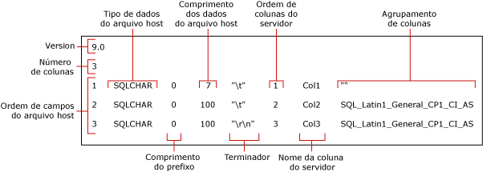

# Usar um arquivo de formato para ignorar uma coluna de tabela (SQL Server)
  Este tópico descreve arquivos de formato. Você pode usar um arquivo de formato para ignorar a importação de uma coluna de tabela, quando o campo não existir no arquivo de dados. Um arquivo de dados só poderá conter um número menor de campos que o número de colunas na tabela, se as colunas ignoradas forem anuláveis e/ou possuírem valor padrão.  
  
## Tabela e arquivo de dados de exemplo  
 Os exemplos a seguir requerem uma tabela chamada `myTestSkipCol`, no banco de dados de exemplo [!INCLUDE[ssSampleDBnormal](../../includes/sssampledbnormal-md.md)], no esquema **dbo**. Crie essa tabela como se segue:  
  
```  
USE AdventureWorks2012;  
GO  
CREATE TABLE myTestSkipCol   
   (  
   Col1 smallint,  
   Col2 nvarchar(50) NULL,  
   Col3 nvarchar(50) not NULL  
   );  
GO  
```  
  
 Os exemplos seguintes usam um arquivo de dados de exemplo `myTestSkipCol2.dat` com somente dois campos, ainda que a tabela correspondente tenha três colunas:  
  
```  
1,DataForColumn3  
1,DataForColumn3  
1,DataForColumn3  
  
```  
  
 Para importar dados em massa do `myTestSkipCol2.dat` para a tabela `myTestSkipCol`, o arquivo de formato deve mapear o primeiro campo de dados para `Col1`, o segundo campo para `Col3` e ignorar a `Col2`.  
  
## Usando um arquivo de formato não XML  
 É possível modificar um arquivo de formato não XML para ignorar uma coluna de tabela. Em geral, isso envolve o uso do utilitário **bcp** para criar um arquivo de formato não XML padrão e a modificação do arquivo padrão em um editor de texto. O arquivo de formato modificado deve mapear cada campo existente para sua coluna de tabela correspondente e indicar qual, ou quais, coluna de tabela deve ser ignorada. Há duas alternativas para se modificar um arquivo de dados não XML padrão. Ambas indicam que o campo de dados não existe no arquivo de dados e que nenhum dado será inserido na coluna de tabela correspondente.  
  
### Criando um arquivo de formato não XML padrão  
 Este tópico usa o arquivo de formato não XML padrão criado para a tabela de exemplo `myTestSkipCol`, usando o seguinte comando **bcp**:  
  
```  
bcp AdventureWorks2012..myTestSkipCol format nul -f myTestSkipCol_Default.fmt -c -T  
```  
  
 O comando anterior cria um arquivo de formato não XML, `myTestSkipCol_Default.fmt`. Esse arquivo de formato é denominado *arquivo de formato padrão*, pois esse é o formato gerado pelo **bcp**. Geralmente, um arquivo de formato padrão descreve uma correspondência um-para-um entre campos de arquivo de dados e colunas de tabela.  
  
> [!IMPORTANT]  
>  Talvez seja preciso especificar o nome da instância do servidor ao qual você está conectando. Talvez também seja preciso especificar o nome de usuário e a senha. Para obter mais informações, consulte [bcp Utility](../../tools/bcp-utility.md).  
  
 A ilustração a seguir exibe os valores nesses exemplos de arquivos de formato padrão. A ilustração também mostra o nome de cada campo do arquivo de formato.  
  
   
  
> [!NOTE]  
>  Para obter mais informações sobre campos de arquivo de formato, consulte [Arquivos de formato não XML &#40;SQL Server&#41;](../../relational-databases/import-export/non-xml-format-files-sql-server.md).  
  
### Métodos para modificar um arquivo de formato não XML  
 Para ignorar uma coluna de tabela, edite o arquivo de formato não XML padrão e modifique o arquivo, recorrendo a um dos seguintes métodos alternativos:  
  
-   O método preferencial compreende três etapas básicas. Primeiro, exclua qualquer linha do arquivo de formato que descreva um campo ausente do arquivo de dados. Então, reduza o valor da "Ordem do campo de arquivo host" de cada linha do arquivo de formato que segue uma linha excluída. A meta são valores sequenciais "Ordem do campo de arquivo host", de 1 a *n* que reflitam a posição atual de cada campo de dados no arquivo de dados. Finalmente, reduza o valor no campo "Número de colunas" para refletir o número real de campos no arquivo de dados.  
  
     O exemplo a seguir foi baseado no arquivo de formato padrão para a tabela `myTestSkipCol`, criada anteriormente neste tópico, em "Criando um arquivo de formato não XML padrão". Este arquivo de formato modificado mapeia o primeiro campo de dados para a `Col1`, ignora a `Col2` e mapeia o segundo campo de dados para a `Col3`. A linha da `Col2` foi excluída.  
  
    ```  
    9.0  
    2  
    1       SQLCHAR       0       7       "\t"     1     Col1         ""  
    2       SQLCHAR       0       100     "\r\n"   3     Col3         SQL_Latin1_General_CP1_CI_AS  
    ```  
  
-   Como alternativa para ignorar uma coluna de tabela, é possível modificar a definição da linha do arquivo de formato que corresponde à coluna de tabela. Nessa linha do arquivo de formato, os valores "comprimento do prefixo", "comprimento dos dados do arquivo host" e "ordem da coluna do servidor" devem ser definidos como 0. Além disso, o campos "terminador" e "agrupamento de colunas" devem ser definidos como "" (NULO).  
  
     O valor "nome da coluna de servidor" requer uma cadeia de caracteres não vazios, ainda que o nome de coluna em si não seja necessário. Os campos de formato restantes requerem seus valores padrão.  
  
     O exemplo a seguir também é derivado do arquivo de formato padrão da tabela `myTestSkipCol`.  
  
    ```  
    9.0  
    3  
    1       SQLCHAR       0       7       "\t"     1     Col1         ""  
    2       SQLCHAR       0       0       ""       0     Col2         ""  
    3       SQLCHAR       0       100     "\r\n"   3     Col3         SQL_Latin1_General_CP1_CI_AS  
    ```  
  
### Exemplos  
 Os exemplos a seguir também são baseados na tabela de exemplo `myTestSkipCol` e no arquivo de dados de exemplo `myTestSkipCol2.dat` criados anteriormente neste tópico, em "Tabela de exemplo e arquivo de dados".  
  
#### Usando BULK INSERT  
 Esse exemplo funciona usando qualquer um dos arquivos de formato não XML modificados criados anteriormente neste tópico, em "Métodos para modificar um arquivo de formato não XML". Nesse exemplo, o nome do arquivo de formato modificado é `C:\myTestSkipCol2.fmt`. Para usar o `BULK INSERT` para importar em massa o arquivo de dados `myTestSkipCol2.dat`, no Editor de Consultas [!INCLUDE[ssManStudioFull](../../includes/ssmanstudiofull-md.md)], execute o código a seguir:  
  
```tsql  
USE AdventureWorks2012;  
GO  
BULK INSERT myTestSkipCol   
   FROM 'C:\myTestSkipCol2.dat'   
   WITH (FORMATFILE = 'C:\myTestSkipCol2.fmt');  
GO  
SELECT * FROM myTestSkipCol;  
GO  
```  
  
## Usando um arquivo de formato XML   
 Com um arquivo de formato XML, não é possível ignorar uma coluna durante a importação direta para uma tabela usando um comando **bcp** ou uma instrução BULK INSERT. No entanto, é possível realizar a importação para todas as colunas de uma tabela, exceto para a última. Se for preciso ignorar alguma que não a última coluna, crie uma exibição da tabela de destino que contenha apenas as colunas contidas no arquivo de dados. Depois, importe em massa os dados desse arquivo para a exibição.  
  
 Para usar um arquivo de formato XML para ignorar uma coluna de tabela usando OPENROWSET(BULK...), é necessário fornecer uma lista explícita de colunas na lista de seleção e também na tabela de destino, como se segue:  
  
 INSERT ...<column_list> SELECT <column_list> FROM OPENROWSET(BULK...)  
  
### Criando um arquivo de formato XML padrão  
 Os exemplos dos arquivos de formato modificados se baseiam na tabela de exemplo `myTestSkipCol` e no arquivo de dados criado anteriormente neste tópico, em "Tabela de exemplo e arquivo de dados". O comando **bcp** a seguir cria um arquivo de formato XML padrão para a tabela `myTestSkipCol`:  
  
```  
bcp AdventureWorks2012..myTestSkipCol format nul -f myTestSkipCol_Default.xml -c -x -T  
```  
  
 O arquivo de formato não XML padrão resultante descreve uma correspondência um-para-um entre campos de arquivo de dados e colunas de tabela, da seguinte maneira:  
  
```  
<?xml version="1.0"?>  
<BCPFORMAT xmlns="http://schemas.microsoft.com/sqlserver/2004/bulkload/format" xmlns:xsi="http://www.w3.org/2001/XMLSchema-instance">  
 <RECORD>  
  <FIELD ID="1" xsi:type="CharTerm" TERMINATOR="\t" MAX_LENGTH="7"/>  
  <FIELD ID="2" xsi:type="CharTerm" TERMINATOR="\t" MAX_LENGTH="100" COLLATION="SQL_Latin1_General_CP1_CI_AS"/>  
  <FIELD ID="3" xsi:type="CharTerm" TERMINATOR="\r\n" MAX_LENGTH="100" COLLATION="SQL_Latin1_General_CP1_CI_AS"/>  
 </RECORD>  
 <ROW>  
  <COLUMN SOURCE="1" NAME="Col1" xsi:type="SQLSMALLINT"/>  
  <COLUMN SOURCE="2" NAME="Col2" xsi:type="SQLNVARCHAR"/>  
  <COLUMN SOURCE="3" NAME="Col3" xsi:type="SQLNVARCHAR"/>  
 </ROW>  
</BCPFORMAT>  
```  
  
> [!NOTE]  
>  Para obter informações sobre a estrutura de arquivos de formato XML, consulte [Arquivos de formato XML &#40;SQL Server&#41;](../../relational-databases/import-export/xml-format-files-sql-server.md).  
  
### Exemplos  
 Os exemplos desta seção usam a tabela de exemplo `myTestSkipCol` e o arquivo de dados de exemplo `myTestSkipCol2.dat` criados anteriormente neste tópico, em "Tabela de exemplo e arquivo de dados". Para importar os dados de `myTestSkipCol2.dat` para a tabela `myTestSkipCol`, os exemplos usam o seguinte arquivo de formato XML modificado, `myTestSkipCol2-x.xml`. A base para isso é o arquivo de formato criado anteriormente neste tópico, em "Criando um arquivo de formato XML padrão".  
  
```  
<?xml version="1.0"?>  
<BCPFORMAT xmlns="http://schemas.microsoft.com/sqlserver/2004/bulkload/format" xmlns:xsi="http://www.w3.org/2001/XMLSchema-instance">  
 <RECORD>  
  <FIELD ID="1" xsi:type="CharTerm" TERMINATOR="," MAX_LENGTH="7"/>  
  <FIELD ID="2" xsi:type="CharTerm" TERMINATOR="\r\n" MAX_LENGTH="100" COLLATION="SQL_Latin1_General_CP1_CI_AS"/>  
 </RECORD>  
 <ROW>  
  <COLUMN SOURCE="1" NAME="Col1" xsi:type="SQLSMALLINT"/>  
  <COLUMN SOURCE="2" NAME="Col3" xsi:type="SQLNVARCHAR"/>  
 </ROW>  
</BCPFORMAT>  
```  
  
#### Usando OPENROWSET(BULK...)  
 O exemplo a seguir usa o provedor de conjunto de linhas em massa `OPENROWSET` e o arquivo de formato `myTestSkipCol2.xml`. O exemplo importa em massa o arquivo de dados `myTestSkipCol2.dat` para a tabela `myTestSkipCol`. A instrução contém uma lista explícita de colunas na lista de seleção e também na tabela de destino, como exigido.  
  
 No Editor de Consultas do [!INCLUDE[ssManStudioFull](../../includes/ssmanstudiofull-md.md)], execute o seguinte código:  
  
```tsql  
USE AdventureWorks2012;  
GO  
INSERT INTO myTestSkipCol  
  (Col1,Col3)  
    SELECT Col1,Col3  
      FROM  OPENROWSET(BULK  'C:\myTestSkipCol2.Dat',  
      FORMATFILE='C:\myTestSkipCol2.Xml'    
       ) as t1 ;  
GO  
```  
  
#### Usando o BULK IMPORT em uma exibição  
 O exemplo a seguir cria o `v_myTestSkipCol` na tabela `myTestSkipCol`. Essa exibição ignora a segunda coluna da tabela, `Col2`. O exemplo usa o `BULK INSERT` para importar o arquivo de dados `myTestSkipCol2.dat` para essa exibição.  
  
 No Editor de Consultas do [!INCLUDE[ssManStudioFull](../../includes/ssmanstudiofull-md.md)], execute o seguinte código:  
  
```tsql  
CREATE VIEW v_myTestSkipCol AS  
    SELECT Col1,Col3  
    FROM myTestSkipCol;  
GO  
  
USE AdventureWorks2012;  
GO  
BULK INSERT v_myTestSkipCol  
FROM 'C:\myTestSkipCol2.dat'  
WITH (FORMATFILE='C:\myTestSkipCol2.xml');  
GO  
```  
  
## Consulte também  
 [Utilitário bcp](../../tools/bcp-utility.md)   
 [BULK INSERT &#40;Transact-SQL&#41;](../../t-sql/statements/bulk-insert-transact-sql.md)   
 [OPENROWSET &#40;Transact-SQL&#41;](../../t-sql/functions/openrowset-transact-sql.md)   
 [Usar um arquivo de formato para ignorar um campo de dados &#40;SQL Server&#41;](../../relational-databases/import-export/use-a-format-file-to-skip-a-data-field-sql-server.md)   
 [Usar um arquivo de formato para mapear colunas de uma tabela para campos de arquivo de dados &#40;SQL Server&#41;](../../relational-databases/import-export/use-a-format-file-to-map-table-columns-to-data-file-fields-sql-server.md)   
 [Usar um arquivo de formato para importação em massa de dados &#40;SQL Server&#41;](../../relational-databases/import-export/use-a-format-file-to-bulk-import-data-sql-server.md)  
  
  