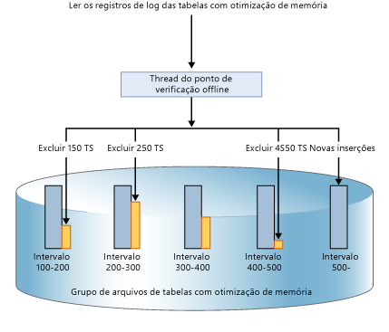
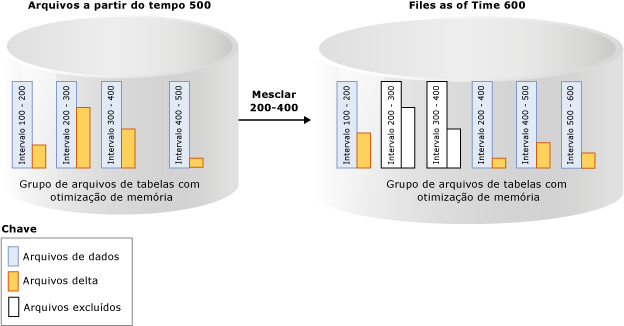

# Durabilidade de tabelas com otimização de memória
[!INCLUDE[tsql-appliesto-ss2014-xxxx-xxxx-xxx_md](../../includes/tsql-appliesto-ss2014-xxxx-xxxx-xxx-md.md)]

  [!INCLUDE[hek_2](../../includes/hek-2-md.md)] fornece a durabilidade completa para tabelas com otimização de memória. Quando uma transação que modificou uma tabela com otimização de memória é confirmada, o [!INCLUDE[ssNoVersion](../../includes/ssnoversion-md.md)] (como faz em tabelas baseadas em disco), garante que as alterações sejam permanentes (sobreviverão uma reinicialização do banco de dados), contanto que o armazenamento subjacente esteja disponível. Há dois principais componentes de durabilidade: log de transações e persistência das alterações de dados para armazenamento em disco.  
  
 Para obter detalhes sobre as limitações de tamanho para tabelas duráveis, veja [Estimar requisitos de memória para tabelas com otimização de memória](../../relational-databases/in-memory-oltp/estimate-memory-requirements-for-memory-optimized-tables.md). 
  
## Log de Transações  
 Todas as alterações feitas nas tabelas baseadas em disco ou tabelas duráveis com otimização de memória são capturadas em um ou mais registros de log de transações. Depois da confirmação de uma transação, o [!INCLUDE[ssNoVersion](../../includes/ssnoversion-md.md)] grava os registros de log associados com a transação no disco antes de comunicar ao aplicativo ou à sessão de usuário que a transação foi confirmada. Isso garante que as alterações feitas pela transação sejam duráveis. O log de transações para tabelas com otimização de memória está totalmente integrado ao mesmo fluxo de log usado por tabelas baseadas em disco. Essa integração permite que operações existentes de backup, recuperação e restauração do log de transações continuem funcionando, sem exigir etapas adicionais. No entanto, como [!INCLUDE[hek_2](../../includes/hek-2-md.md)] pode aumentar consideravelmente a taxa de transferência da transação de sua carga de trabalho, a E/S de log pode se tornar um afunilamento de desempenho. Para manter essa taxa de transferência maior, verifique se o subsistema de E/S de log pode lidar com o aumento de carga.  
  
## Arquivos delta e de dados  
 Os dados nas tabelas com otimização de memória são armazenados como as linhas de dados de forma livre em uma estrutura de dados de heap na memória, e são vinculadas por meio de um ou mais índices na memória. Não há nenhuma estrutura de página para linhas de dados, como as usadas para tabelas baseadas em disco. Para a persistência de longo prazo e para permitir o truncamento do log de transações, as operações em tabelas com otimização de memória são mantidas em um conjunto de arquivos delta e de dados. Esses arquivos são gerados com base no log de transações, usando um processo assíncrono em segundo plano. Os dados e os arquivos delta estão localizados em um ou mais contêineres (com o mesmo mecanismo usado para dados FILESTREAM). Esses contêineres fazem parte de um grupo de arquivos com otimização de memória.  
  
 Os dados são gravados nesses arquivos de maneira estritamente sequencial, o que minimiza a latência do disco na rotação da mídia. Você pode usar vários contêineres em discos diferentes para distribuir a atividade de E/S. Os arquivos delta e de dados em vários contêineres em discos diferentes aumentarão o desempenho de restauração/recuperação de banco de dados quando os dados forem lidos nos arquivos delta e de dados em disco, na memória.  
  
 As transações de usuário não acessam diretamente os arquivos delta e de dados. Todas as leituras e gravações de dados usam estruturas de dados na memória.  
  
### O arquivo de dados  
 Um arquivo de dados contém linhas de uma ou mais tabelas com otimização de memória que foram inseridas por várias transações como parte das operações INSERT ou UPDATE. Por exemplo, uma linha pode ser de uma tabela com otimização de memória T1 e a linha seguinte pode ser da tabela com otimização de memória T2. As linhas são acrescentadas ao arquivo de dados na ordem das transações no log de transações, tornando o acesso aos dados sequencial. Isso permite uma taxa de transferência de E/S significativamente melhor em comparação com a E/S aleatória.  
  
 Quando o arquivo de dados estiver cheio, as linhas inseridas por novas transações serão armazenadas em outro arquivo de dados. Com o tempo, as linhas de tabelas com otimização de memória duráveis são armazenadas em um de mais arquivos de dados e em cada arquivo de dados que contém linhas de um intervalo não contíguo, mas contíguo de transações. Por exemplo, um arquivo de dados com o carimbo de data/hora de confirmação de transação no intervalo de (100, 200) tem todas as linhas inseridas por transações com o carimbo de data/hora de confirmação maior que 100 e menor que ou igual a 200. O carimbo de data/hora de confirmação é um número que aumenta de forma monotônica atribuído a uma transação quando está pronto para confirmação. Cada transação tem um carimbo de data/hora de confirmação exclusivo.  
  
 Quando uma linha é excluída ou atualizada, ela não é removida, nem alterada no local no arquivo de dados, mas as linhas excluídas são rastreadas em outro tipo de arquivo: o arquivo delta. As operações de atualização são processadas como uma tupla de operações de exclusão e inserção para cada linha. Isso elimina a E/S aleatória no arquivo de dados.  
 
   Tamanho: cada arquivo de dados é dimensionado aproximadamente para 128 MB para computadores com mais memória que 16 GB e 16 MB para computadores com menos que ou igual a 16 GB. No [!INCLUDE[ssSQL15](../../includes/sssql15-md.md)] , o SQL Server pode usar o modo de ponto de verificação grande se considerar que o subsistema de armazenamento é rápido o suficiente. No modo de ponto de verificação grande, os arquivos de dados são dimensionados em 1 GB. Isso permite uma maior eficiência no subsistema de armazenamento para cargas de trabalho com alta taxa de transferência.  
   
### O arquivo delta  
 Cada arquivo de dados é emparelhado com um arquivo delta que tem o mesmo intervalo de transações e rastreia as linhas excluídas inseridas por transações nesse intervalo. Estes arquivos de dados e delta são chamados de Par de Arquivos de Ponto de Verificação (CFP) e são a unidade da alocação e deslocamento, bem como a unidade de operações de Mesclagem. Por exemplo, um arquivo delta correspondente ao intervalo de transações (100, 200) armazenará as linhas excluídas que foram inseridas por transações no intervalo (100, 200). Assim como os arquivos de dados, o arquivo delta é acessado sequencialmente.  
  
 Quando uma linha é excluída, ela não é removida do arquivo de dados, mas uma referência a ela é anexada ao arquivo delta associado ao intervalo de transações em que essa linha de dados foi inserida. Como a linha de dados a ser excluída já existe no arquivo de dados, o arquivo delta armazena apenas as informações de referência `{inserting_tx_id, row_id, deleting_tx_id }` e segue a ordem do log transacional das operações de exclusão ou atualização originais.  
  

 Tamanho: cada arquivo de dados é dimensionado aproximadamente para 16 MB para computadores com mais memória que 16 GB e 1 MB para computadores com menos que ou igual a 16 GB. A partir do [!INCLUDE[ssSQL15](../../includes/sssql15-md.md)] , o SQL Server pode usar o modo de ponto de verificação grande se considerar que o subsistema de armazenamento é rápido o suficiente. No modo de ponto de verificação grande, os arquivos delta são dimensionados em 128 MB.  
 
## Populando arquivos de dados e delta  
 Os arquivos delta e de dados são populados com base nos registros do log de transações gerados por transações confirmadas em tabelas com otimização de memória e anexa informações sobre as linhas inseridas e excluídas em arquivos delta e de dados apropriados. Diferentemente das tabelas baseadas em disco, nas quais páginas de dados/índice são liberadas com E/S aleatória quando o ponto de verificação é realizado, a persistência da tabela com otimização de memória é uma operação em segundo plano contínua. Vários arquivos delta são acessados, pois uma transação pode excluir ou atualizar qualquer linha que foi inserida por qualquer transação anterior. As informações de exclusão sempre são anexadas no final do arquivo delta. Por exemplo, uma transação com um carimbo de data/hora de confirmação de 600 insere uma linha nova e exclui linhas inseridas por transações com um carimbo de data/hora de confirmação de 150, 250 e 450, conforme mostrado na imagem a seguir. As quatro operações de E/S de arquivo (três para linhas excluídas e uma para as linhas recentemente inseridas) são operações somente de acréscimo nos arquivos delta e de dados correspondentes.  
  
   
  
## Acessando arquivos delta e de dados  
 Os pares de arquivos de dados e delta são acessados quando as situações a seguir ocorrem.  
  
 Trabalhador(es) do ponto de verificação offline  
 Esse thread acrescenta inserções e exclusões às linhas de dados com otimização de memória, aos pares de arquivos de dados e delta correspondentes. No [!INCLUDE[ssSQL14](../../includes/sssql14-md.md)] , há um único trabalhador de ponto de verificação offline; a partir do [!INCLUDE[ssSQL15](../../includes/sssql15-md.md)] , há vários trabalhadores de ponto de verificação.  
  
 Operação de mesclagem  
 A operação mescla um ou mais pares de arquivos delta e de dados, além de criar um novo par de arquivos de dados e delta.  
  
 Durante a recuperação de pane  
 Quando o [!INCLUDE[ssNoVersion](../../includes/ssnoversion-md.md)] é reiniciado ou o banco de dados é reativado, os dados com otimização de memória são populados usando os pares de arquivos de dados e delta. O arquivo delta atua como um filtro para as linhas excluídas ao ler as linhas do arquivo de dados correspondente. Como cada par de arquivos delta e de dados é independente, esses arquivos são carregados paralelamente para reduzir o tempo necessário para popular os dados na memória. Depois que os dados forem carregados na memória, o mecanismo OLTP na memória aplicará os registros de log de transações ativos ainda não cobertos pelos arquivos de ponto de verificação para que os dados com otimização de memória sejam concluídos.  
  
 Durante a operação de restauração  
 Os arquivos de ponto de verificação de OLTP na memória são criados com base no backup do banco de dados e, em seguida, um ou mais backups de log de transações são aplicados. Assim como na recuperação de pane, o mecanismo OLTP na memória carrega os dados na memória paralelamente para minimizar o impacto no tempo de recuperação.  
  
## Mesclando arquivos delta e de dados  
 Os dados de tabelas com otimização de memória são armazenados em um ou mais pares de arquivos delta e de dados (também denominados pares de arquivos de ponto de verificação ou CFP). Os arquivos de dados armazenam linhas inseridas e os arquivos delta referenciam linhas excluídas. Durante a execução de uma carga de trabalho OLTP, enquanto as operações DML atualizam, inserem e excluem linhas, novos CFPs são criados para persistir as novas linhas e a referência às linhas excluídas é anexada aos arquivos delta.  
  
 Ao longo do tempo, com as operações DML, o número de arquivos delta e de dados aumenta, causando o aumento do uso de espaço em disco e do tempo de recuperação.  
  
 Para ajudar a evitar essas ineficiências, os arquivos delta e de dados fechados mais antigos são mesclados, com base em uma política de mesclagem descrita abaixo, para que a matriz de armazenamento seja compactada para representar o mesmo conjunto de dados, com um número reduzido de arquivos.  
  
 A operação de mesclagem utiliza como entrada um ou mais CFPs (pares de arquivos de ponto de verificação) fechados adjacentes, que são pares de arquivos delta e de dados, (denominados a origem da mesclagem) com base em uma política de mesclagem definida internamente e produz um CFP resultante, chamado destino de mesclagem. As entradas em cada arquivo delta dos CFPs de origem são usadas para filtrar linhas do arquivo de dados correspondente para remover as linhas de dados que não são necessárias. As linhas restantes nos CFPs de origem são consolidadas em um CFP de destino. Após a conclusão da mesclagem, o CFP de destino de mesclagem resultante substitui os CFPs de origem (origens de mesclagem). Os CFPs de origem de mesclagem passam por uma fase de transição antes de sua remoção do armazenamento.  
  
 No exemplo abaixo, o grupo de arquivos da tabela com otimização de memória tem quatro pares de arquivos delta e de dados no carimbo de data/hora 500 que contém dados de transações anteriores. Por exemplo, as linhas no primeiro arquivo de dados correspondem a transações com carimbo de data/hora superior a 100 e inferior ou igual a 200; alternativamente representados como (100, 200]. O segundo e terceiro arquivos de dados apresentam menos de 50% de utilização após a contagem das linhas marcadas como excluídas. A operação de mesclagem combina esses dois CFPs e cria um novo CFP que contém transações com carimbo de data/hora superior a 200 e inferior ou igual a 400, que é o intervalo combinado desses dois CFPs. Você vê outro CFP com intervalo (500, 600] e o arquivo delta não vazio do intervalo de transações (200, 400] mostra que a operação de mesclagem pode ser realizada junto com atividades transacionais, incluindo a exclusão de mais linhas dos CFPs de origem.  
  
   
  
 Um thread de segundo plano avalia todos os CFPs fechados usando uma política de mesclagem e, em seguida, inicia uma ou mais solicitações de mesclagem para os CFPs de qualificação. Essas solicitações de mesclagem são processadas pelo thread de ponto de verificação offline. A avaliação da política de mesclagem é feita periodicamente e também quando um ponto de verificação é fechado.  
  
### [!INCLUDE[ssNoVersion](../../includes/ssnoversion-md.md)] Política de mesclagem  
 [!INCLUDE[ssNoVersion](../../includes/ssnoversion-md.md)] implementa a seguinte política de mesclagem:  
  
-   Uma mesclagem será agendada se dois ou mais CFPs consecutivos puderem ser consolidados, após a contagem das linhas excluídas, para que as linhas resultantes possam caber em um CFP do tamanho de destino. O tamanho de destino dos arquivos delta e de dados corresponde ao dimensionamento original, conforme descrito acima.  
  
-   Um único CFP poderá ser automesclado caso o arquivo de dados dobre o tamanho de destino e mais da metade das linhas serão excluídas. Um arquivo de dados poderá ficar maior que o tamanho de destino se, por exemplo, uma única transação ou várias transações simultâneas inserirem ou atualizarem uma grande quantidade de dados, forçando o arquivo de dados a se expandir além de seu tamanho de destino, devido ao fato de uma transação não poder abranger vários CFPs.  
  
 Veja alguns exemplos que mostram os CFPs que serão mesclados na política de mesclagem:  
  
|CFPs de origem adjacentes (% de utilização)|Seleção de mesclagem|  
|-------------------------------------------|---------------------|  
|CFP0 (30%), CFP1 (50%), CFP2 (50%), CFP3 (90%)|(CFP0, CFP1)   O CFP2 não será escolhido, pois tornará o arquivo de dados resultante maior que 100% do tamanho ideal.|  
|CFP0 (30%), CFP1 (20%), CFP2 (50%), CFP3 (10%)|(CFP0, CFP1, CFP2). Os arquivos são escolhidos a partir da esquerda.   O CTP3 não será escolhido, pois tornará o arquivo de dados resultante maior que 100% do tamanho ideal.|  
|CFP0 (80%), CFP1 (30%), CFP2 (10%), CFP3 (40%)|(CFP1, CFP2, CFP3). Os arquivos são escolhidos a partir da esquerda.   O CFP0 é ignorado, pois se combinado com o CFP1, o arquivo de dados resultante será maior que 100% do tamanho ideal.|  
  
 Nem todos os CFPs com o espaço disponível se qualificam para mesclagem. Por exemplo, se dois CFPs adjacentes apresentarem 60% de utilização, eles não estarão qualificados para mesclagem e cada um desses CFPs terá 40% do armazenamento não usado. No pior caso, todos os CFPs terão 50% de utilização, uma utilização do armazenamento de apenas 50%. Embora as linhas excluídas possam existir no armazenamento porque os CFPs não se qualificam para mesclagem, essas linhas talvez já tenham sido removidas da memória pela coleta de lixo na memória. O gerenciamento de armazenamento e de memória é independente da coleta de lixo. O armazenamento ocupado pelos CFPs ativos (nem todos os CFPs estão sendo atualizados) pode ser até 2 vezes maior do que o tamanho de tabelas duráveis na memória.  
  
### Ciclo de vida de um CFP  
 Transição de CPFs por vários estados antes de poderem ser desalocados. Os backups de log e de pontos de verificação do banco de dados devem ocorrer para fazer a transição dos arquivos pelas fases e, por fim, limpar os arquivos que não são mais necessários. Para obter uma descrição dessas fases, veja [sys.dm_db_xtp_checkpoint_files &#40;Transact-SQL&#41;](../../relational-databases/system-dynamic-management-views/sys-dm-db-xtp-checkpoint-files-transact-sql.md).  
  
 Você pode forçar manualmente o ponto de verificação seguido pelo backup de log para acelerar a coleta de lixo. Nos cenários de produção, os backups automáticos de pontos de verificação e log ocorrem como parte da estratégia de backup que executará a transição perfeita de CFPs por essas fases, sem a necessidade de nenhuma intervenção manual. O impacto do processo de coleta de lixo é que os bancos de dados com tabelas com otimização de memória podem ter um tamanho de armazenamento maior em comparação com seu tamanho na memória. Se os backups de log e de ponto de verificação não ocorrerem, o volume em disco dos arquivos de ponto de verificação continuará aumentando.  
  
## Consulte também  
 [Criando e gerenciando armazenamento para objetos com otimização de memória](../../relational-databases/in-memory-oltp/creating-and-managing-storage-for-memory-optimized-objects.md)  
  
  

