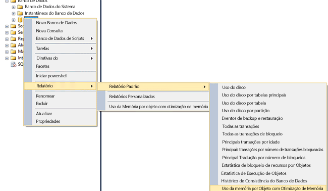
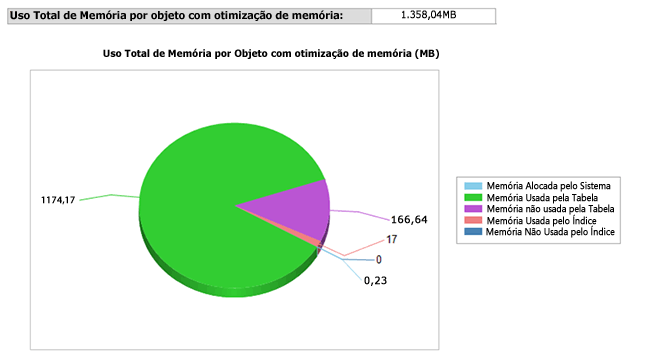

# <a name="monitor-and-troubleshoot-memory-usage"></a>Monitorar e solucionar problemas de uso da memória
[!INCLUDE[appliesto-ss-asdb-xxxx-xxx-md](../../includes/appliesto-ss-asdb-xxxx-xxx-md.md)]
  [!INCLUDE[hek_1](../../includes/hek-1-md.md)] consome memória em padrões diferentes comparado a tabelas baseadas em disco. Você pode monitorar a quantidade de memória alocada e usada pelas tabelas e índices com otimização de memória em seu banco de dados, usando as DMVs ou os contadores de desempenho fornecidos para a memória e o subsistema de coleta de lixo.  Isso oferece visibilidade em nível de sistema e banco de dados, e permite que você evite problemas devido ao esgotamento de memória.  
  
 Este tópico abrange o monitoramento do uso de memória de [!INCLUDE[hek_2](../../includes/hek-2-md.md)] .  
  
## <a name="sections-in-this-topic"></a>Seções neste tópico  
  
-   [Criar um banco de dados de exemplo com tabelas com otimização de memória](../../relational-databases/in-memory-oltp/monitor-and-troubleshoot-memory-usage.md#bkmk_CreateDB)  
  
-   [Monitorando o uso da memória](../../relational-databases/in-memory-oltp/monitor-and-troubleshoot-memory-usage.md#bkmk_Monitoring)  
  
    -   [Usando o SQL Server Management Studio](../../relational-databases/in-memory-oltp/monitor-and-troubleshoot-memory-usage.md#bkmk_UsingSSMS)  
  
    -   [Usando DMVs](../../relational-databases/in-memory-oltp/monitor-and-troubleshoot-memory-usage.md#bkmk_UsingDMVs)  
  
-   [Gerenciando a memória consumida por objetos com otimização de memória](../../relational-databases/in-memory-oltp/monitor-and-troubleshoot-memory-usage.md#bkmk_MemOptObjects)  
  
-   [Solucionando problemas de memória](../../relational-databases/in-memory-oltp/monitor-and-troubleshoot-memory-usage.md#bkmk_Troubleshooting)  
  
##  <a name="bkmk_CreateDB"></a> Criar um banco de dados de exemplo com tabelas com otimização de memória  
 Você poderá ignorar esta seção se já tiver um banco de dados com tabelas com otimização de memória.  
  
 As etapas a seguir criam um banco de dados com três tabelas com otimização de memória que você pode usar no restante deste tópico. No exemplo, mapeamos o banco de dados para um pool de recursos a fim de controlar a quantidade de memória que pode ser usada por tabelas com otimização de memória.  
  
1.  Inicie o [!INCLUDE[ssManStudioFull](../../includes/ssmanstudiofull-md.md)].  
  
2.  Clicar em **Nova Consulta**.  
  
3.  Colar este código na nova janela de consulta e executar cada seção.  
  
    ```  
    -- create a database to be used  
    CREATE DATABASE IMOLTP_DB  
    GO  
  
    ALTER DATABASE IMOLTP_DB ADD FILEGROUP IMOLTP_DB_xtp_fg CONTAINS MEMORY_OPTIMIZED_DATA  
    ALTER DATABASE IMOLTP_DB ADD FILE( NAME = 'IMOLTP_DB_xtp' , FILENAME = 'C:\Data\IMOLTP_DB_xtp') TO FILEGROUP IMOLTP_DB_xtp_fg;  
    GO  
  
    USE IMOLTP_DB  
    GO  
  
    -- create the resoure pool  
    CREATE RESOURCE POOL PoolIMOLTP WITH (MAX_MEMORY_PERCENT = 60);  
    ALTER RESOURCE GOVERNOR RECONFIGURE;  
    GO  
  
    -- bind the database to a resource pool  
    EXEC sp_xtp_bind_db_resource_pool 'IMOLTP_DB', 'PoolIMOLTP'  
  
    -- you can query the binding using the catalog view as described here  
    SELECT d.database_id  
         , d.name  
         , d.resource_pool_id  
    FROM sys.databases d  
    GO  
  
    -- take database offline/online to finalize the binding to the resource pool  
    USE master  
    GO  
  
    ALTER DATABASE IMOLTP_DB SET OFFLINE  
    GO  
    ALTER DATABASE IMOLTP_DB SET ONLINE  
    GO  
  
    -- create some tables  
    USE IMOLTP_DB  
    GO  
  
    -- create table t1  
    CREATE TABLE dbo.t1 (  
           c1 int NOT NULL CONSTRAINT [pk_t1_c1] PRIMARY KEY NONCLUSTERED  
         , c2 char(40) NOT NULL  
         , c3 char(8000) NOT NULL  
         ) WITH (MEMORY_OPTIMIZED = ON, DURABILITY = SCHEMA_AND_DATA)  
    GO  
  
    -- load t1 150K rows  
    DECLARE @i int = 0  
    BEGIN TRAN  
    WHILE (@i <= 150000)  
       BEGIN  
          INSERT t1 VALUES (@i, 'a', replicate ('b', 8000))  
          SET @i += 1;  
       END  
    Commit  
    GO  
  
    -- Create another table, t2  
    CREATE TABLE dbo.t2 (  
           c1 int NOT NULL CONSTRAINT [pk_t2_c1] PRIMARY KEY NONCLUSTERED  
         , c2 char(40) NOT NULL  
         , c3 char(8000) NOT NULL  
         ) WITH (MEMORY_OPTIMIZED = ON, DURABILITY = SCHEMA_AND_DATA)  
    GO  
  
    -- Create another table, t3   
    CREATE TABLE dbo.t3 (  
           c1 int NOT NULL CONSTRAINT [pk_t3_c1] PRIMARY KEY NONCLUSTERED HASH (c1) WITH (BUCKET_COUNT = 1000000)  
         , c2 char(40) NOT NULL  
         , c3 char(8000) NOT NULL  
         ) WITH (MEMORY_OPTIMIZED = ON, DURABILITY = SCHEMA_AND_DATA)  
    GO  
    ```  
  
##  <a name="bkmk_Monitoring"></a> Monitorando o uso da memória  
  
###  <a name="bkmk_UsingSSMS"></a> Usando o [!INCLUDE[ssManStudioFull](../../includes/ssmanstudiofull-md.md)]  
 [!INCLUDE[ssSQL14](../../includes/sssql14-md.md)] é fornecido com relatórios internos padrão para monitorar a memória consumida por tabelas na memória. Você pode acessar esses relatórios usando o Pesquisador de Objetos, conforme descrito [aqui](http://blogs.msdn.com/b/managingsql/archive/2006/05/16/ssms-reports-1.aspx). Você também pode usar o Pesquisador de Objetos para monitorar a memória consumida por tabelas individuais com otimização de memória.  
  
#### <a name="consumption-at-the-database-level"></a>Consumo em nível de banco de dados  
 Você pode monitorar o uso da memória em nível de banco de dados da forma a seguir.  
  
1.  Inicie o [!INCLUDE[ssManStudioFull](../../includes/ssmanstudiofull-md.md)] e conecte-se a um servidor.  
  
2.  No Pesquisador de Objetos, clique com o botão direito do mouse no banco de dados sobre o qual você deseja obter relatórios.  
  
3.  No menu de contexto, selecione **Relatórios** -> **Relatórios Padrão** -> **Uso de Memória por Objetos com Otimização de Memória**  
  
   
  
 Esse relatório mostra o consumo de memória pelo banco de dados criado anteriormente.  
  
   
  
###  <a name="bkmk_UsingDMVs"></a> Usando DMVs  
 Há várias DMVs disponíveis para monitorar a memória consumida por tabelas com otimização de memória, índices, objetos de sistema e estruturas de tempo de execução.  
  
#### <a name="memory-consumption-by-memory-optimized-tables-and-indexes"></a>Consumo de memória por tabelas com otimização de memória e índices  
 Você pode localizar o consumo de memória para todas as tabelas de usuário, índices e objetos do sistema consultando `sys.dm_db_xtp_table_memory_stats` , conforme mostrado aqui.  
  
```sql  
SELECT object_name(object_id) AS Name  
     , *  
   FROM sys.dm_db_xtp_table_memory_stats  
```  
  
 **Saída de exemplo**  
  
```  
Name       object_id   memory_allocated_for_table_kb memory_used_by_table_kb memory_allocated_for_indexes_kb memory_used_by_indexes_kb  
---------- ----------- ----------------------------- ----------------------- ------------------------------- -------------------------  
t3         629577281   0                             0                       128                             0  
t1         565577053   1372928                       1200008                 7872                            1942  
t2         597577167   0                             0                       128                             0  
NULL       -6          0                             0                       2                               2  
NULL       -5          0                             0                       24                              24  
NULL       -4          0                             0                       2                               2  
NULL       -3          0                             0                       2                               2  
NULL       -2          192                           25                      16                              16  
```  
  
 Para obter mais informações, veja [sys.dm_db_xtp_table_memory_stats](../../relational-databases/system-dynamic-management-views/sys-dm-db-xtp-table-memory-stats-transact-sql.md).  
  
#### <a name="memory-consumption-by-internal-system-structures"></a>Consumo de memória por estruturas internas do sistema  
 A memória também é consumida por objetos do sistema, tais como estruturas transacionais, buffers para arquivos de dados e delta, estruturas de coleta de lixo, entre outros. Você pode localizar a memória usada para esses objetos de sistema consultando `sys.dm_xtp_system_memory_consumers` , conforme mostrado aqui.  
  
```sql  
SELECT memory_consumer_desc  
     , allocated_bytes/1024 AS allocated_bytes_kb  
     , used_bytes/1024 AS used_bytes_kb  
     , allocation_count  
   FROM sys.dm_xtp_system_memory_consumers  
```  
  
 **Saída de exemplo**  
  
```  
memory_consumer_ desc allocated_bytes_kb   used_bytes_kb        allocation_count  
------------------------- -------------------- -------------------- ----------------  
VARHEAP                   0                    0                    0  
VARHEAP                   384                  0                    0  
DBG_GC_OUTSTANDING_T      64                   64                   910  
ACTIVE_TX_MAP_LOOKAS      0                    0                    0  
RECOVERY_TABLE_CACHE      0                    0                    0  
RECENTLY_USED_ROWS_L      192                  192                  261  
RANGE_CURSOR_LOOKSID      0                    0                    0  
HASH_CURSOR_LOOKASID      128                  128                  455  
SAVEPOINT_LOOKASIDE       0                    0                    0  
PARTIAL_INSERT_SET_L      192                  192                  351  
CONSTRAINT_SET_LOOKA      192                  192                  646  
SAVEPOINT_SET_LOOKAS      0                    0                    0  
WRITE_SET_LOOKASIDE       192                  192                  183  
SCAN_SET_LOOKASIDE        64                   64                   31  
READ_SET_LOOKASIDE        0                    0                    0  
TRANSACTION_LOOKASID      448                  448                  156  
PGPOOL:256K               768                  768                  3  
PGPOOL: 64K               0                    0                    0  
PGPOOL:  4K               0                    0                    0  
```  
  
 Para obter mais informações, veja [sys.dm_xtp_system_memory_consumers &#40;Transact-SQL&#41;](../../relational-databases/system-dynamic-management-views/sys-dm-xtp-system-memory-consumers-transact-sql.md).  
  
#### <a name="memory-consumption-at-run-time-when-accessing-memory-optimized-tables"></a>Consumo de memória em tempo de execução ao acessar tabelas com otimização de memória  
 Você pode determinar a memória consumida por estruturas em tempo de execução; por exemplo, o cache de procedimento com a seguinte consulta: execute esta consulta para obter a memória usada por estruturas em tempo de execução, como o cache de procedimento. Todas as estruturas em tempo de execução são marcadas com XTP.  
  
```sql  
SELECT memory_object_address  
     , pages_in_bytes  
     , bytes_used  
     , type  
   FROM sys.dm_os_memory_objects WHERE type LIKE '%xtp%'  
```  
  
 **Saída de exemplo**  
  
```  
memory_object_address pages_ in_bytes bytes_used type  
--------------------- ------------------- ---------- ----  
0x00000001F1EA8040    507904              NULL       MEMOBJ_XTPDB  
0x00000001F1EAA040    68337664            NULL       MEMOBJ_XTPDB  
0x00000001FD67A040    16384               NULL       MEMOBJ_XTPPROCCACHE  
0x00000001FD68C040    16384               NULL       MEMOBJ_XTPPROCPARTITIONEDHEAP  
0x00000001FD284040    16384               NULL       MEMOBJ_XTPPROCPARTITIONEDHEAP  
0x00000001FD302040    16384               NULL       MEMOBJ_XTPPROCPARTITIONEDHEAP  
0x00000001FD382040    16384               NULL       MEMOBJ_XTPPROCPARTITIONEDHEAP  
0x00000001FD402040    16384               NULL       MEMOBJ_XTPPROCPARTITIONEDHEAP  
0x00000001FD482040    16384               NULL       MEMOBJ_XTPPROCPARTITIONEDHEAP  
0x00000001FD502040    16384               NULL       MEMOBJ_XTPPROCPARTITIONEDHEAP  
0x00000001FD67E040    16384               NULL       MEMOBJ_XTPPROCPARTITIONEDHEAP  
0x00000001F813C040    8192                NULL       MEMOBJ_XTPBLOCKALLOC  
0x00000001F813E040    16842752            NULL       MEMOBJ_XTPBLOCKALLOC  
```  
  
 Para obter mais informações, veja [sys.dm_os_memory_objects (Transact-SQL)](../../relational-databases/system-dynamic-management-views/sys-dm-os-memory-objects-transact-sql.md).  
  
#### <a name="memory-consumed-by-includehek2includeshek-2-mdmd-engine-across-the-instance"></a>Memória consumida pelo mecanismo [!INCLUDE[hek_2](../../includes/hek-2-md.md)] na instância  
 A memória alocada para o mecanismo [!INCLUDE[hek_2](../../includes/hek-2-md.md)] e os objetos com otimização de memória são gerenciados da mesma maneira que qualquer outro consumidor de memória em uma instância do [!INCLUDE[ssNoVersion](../../includes/ssnoversion-md.md)] . Os administradores do tipo MEMORYCLERK_XTP respondem por toda a memória alocada para o mecanismo [!INCLUDE[hek_2](../../includes/hek-2-md.md)] . Use a consulta a seguir para localizar toda a memória usada pelo mecanismo [!INCLUDE[hek_2](../../includes/hek-2-md.md)] .  
  
```sql  
-- this DMV accounts for all memory used by the hek_2 engine  
SELECT type  
     , name  
     , memory_node_id  
     , pages_kb/1024 AS pages_MB   
   FROM sys.dm_os_memory_clerks WHERE type LIKE '%xtp%'  
```  
  
 A saída de exemplo mostra que a memória total alocada equivale a 18MB de consumo de memória em nível de sistema e a 1358MB alocados para a ID de banco de dados de valor 5. Como esse banco de dados é mapeado para um pool de recursos dedicados, essa memória é contabilizada nesse pool de recursos.  
  
 **Saída de exemplo**  
  
```  
type                 name       memory_node_id pages_MB  
-------------------- ---------- -------------- --------------------  
MEMORYCLERK_XTP      Default    0              18  
MEMORYCLERK_XTP      DB_ID_5    0              1358  
MEMORYCLERK_XTP      Default    64             0  
```  
  
 Para obter mais informações, veja [sys.dm_os_memory_clerks (Transact-SQL)](../../relational-databases/system-dynamic-management-views/sys-dm-os-memory-clerks-transact-sql.md).  
  
##  <a name="bkmk_MemOptObjects"></a> Gerenciando a memória consumida por objetos com otimização de memória  
 É possível controlar a memória total consumida por tabelas com otimização de memória, associando-a a um grupo de recursos nomeado, conforme descrito no tópico [Associar um banco de dados com tabelas com otimização de memória a um pool de recursos](../../relational-databases/in-memory-oltp/bind-a-database-with-memory-optimized-tables-to-a-resource-pool.md).  
  
##  <a name="bkmk_Troubleshooting"></a> Solucionando problemas de memória  
 A solução de problemas de memória é um processo de três etapas:  
  
1.  Identificar a quantidade de memória que está sendo consumido pelos objetos no banco de dados ou instância. Você pode usar um excelente conjunto de ferramentas de monitoramento disponíveis para tabelas com otimização de memória, conforme descrito anteriormente.  Por exemplo, os DMVs `sys.dm_db_xtp_table_memory_stats` ou `sys.dm_os_memory_clerks`.  
  
2.  Determine como o consumo de memória aumenta e o espaço disponível para você. Ao monitorar o consumo de memória periodicamente, você pode saber como o uso da memória está aumentando. Por exemplo, se você mapeou o banco de dados para um pool de recursos nomeado, poderá monitorar o contador de desempenho Memória Usada (KB) para ver o aumento no uso de memória.  
  
3.  Execute uma ação para reduzir os problemas potenciais de memória. Para obter mais informações, veja [Resolver problemas de memória insuficiente](../../relational-databases/in-memory-oltp/resolve-out-of-memory-issues.md).  
  
## <a name="see-also"></a>Consulte Também  
 [Associar um banco de dados com tabelas com otimização de memória a um pool de recursos](../../relational-databases/in-memory-oltp/bind-a-database-with-memory-optimized-tables-to-a-resource-pool.md)   
 [Alterar MIN_MEMORY_PERCENT e MAX_MEMORY_PERCENT em um pool existente](../../relational-databases/in-memory-oltp/bind-a-database-with-memory-optimized-tables-to-a-resource-pool.md#bkmk_ChangeAllocation)  
  
  
