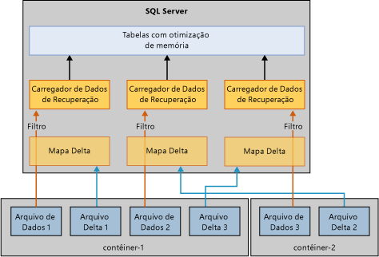

# Restauração e recuperação de tabelas com otimização de memória
[!INCLUDE[appliesto-ss-xxxx-xxxx-xxx-md](../../includes/appliesto-ss-xxxx-xxxx-xxx-md.md)]

O mecanismo básico para recuperar ou restaurar um banco de dados que usa tabelas com otimização de memória é semelhante ao mecanismo de um banco de dados que usa apenas tabelas baseadas em disco. Mas, ao contrário das tabelas baseadas em disco, as tabelas com otimização de memória devem ser carregadas na memória antes que o banco de dados esteja disponível para o acesso do usuário. Esse requisito adiciona uma nova etapa na recuperação de banco de dados.  
  
Se o servidor não tiver memória suficiente disponível, haverá falha na recuperação de banco de dados e o banco de dados será marcado como suspeito. Para resolver esse problema, consulte [Resolver problemas de memória insuficiente](resolve-out-of-memory-issues.md). 
  
## Fatores que afetam o tempo de carregamento
Durante as operações de recuperação ou restauração, o mecanismo OLTP na memória lê os arquivos delta e de dados para carregamento na memória física. O tempo de carregamento é determinado pelos seguintes fatores:  
  
-   A quantidade de dados a serem carregados.  
  
-   Largura de banda de E/S sequencial.  
  
-   O grau de paralelismo, determinado pelo número de contêineres de arquivo e núcleos de processador.  
  
-   O número de registros de log na parte ativa do log que precisam ser refeitos.  

## Fases de recuperação
Quando o [!INCLUDE[ssNoVersion](../../includes/ssnoversion-md.md)] é reiniciado, cada banco de dados passa por um processo de recuperação que consiste em três fases:  
  
1.  **Análise**. Nessa fase, os logs de transações ativas são verificados para detectar transações confirmadas e não confirmadas. O mecanismo de OLTP na memória identifica o ponto de verificação para carregamento e pré-carrega suas entradas de log da tabela do sistema. Ele também processa alguns registros de log de alocação de arquivo.  
  
2.  **Refazer**. Essa fase é executada simultaneamente em tabelas baseadas em disco e com otimização de memória.  
  
    - Para tabelas baseadas em disco, o banco de dados é movido para o momento atual e adquire bloqueios usados por transações não confirmadas.  
  
    - Para tabelas com otimização de memória, os dados dos pares de arquivos de dados e delta são carregados na memória. Em seguida, os dados são atualizados com o log de transações ativas com base no último ponto de verificação durável.  
  
    Quando as operações anteriores em tabelas baseadas em disco e tabelas com otimização de memória são concluídas, o banco de dados fica disponível para acesso.  
  
3.  **Desfazer**. Nessa fase, as transações não confirmadas são revertidas.  
  
## Processo para melhorar o tempo de carregamento
Carregar tabelas com otimização de memória na memória pode afetar o desempenho do RTO (objetivo de tempo de recuperação). Para melhorar o tempo de carregamento dos dados com otimização de memória em arquivos de dados e delta, o mecanismo OLTP na memória carrega os arquivos de dados/delta em paralelo desta forma:  
  
-   **Criando um filtro de mapa delta**. Referências de repositórios de arquivos delta para as linhas excluídas. Um thread por contêiner lê os arquivos delta e cria um filtro de mapa delta. (Um grupo de arquivo de dados com otimização de memória pode ter um ou mais contêineres.)  
  
-   **Transmitindo os arquivos de dados**. Após a criação do filtro de mapa delta, os arquivos de dados são lidos pelo número de threads que corresponde às CPUs lógicas existentes. Cada thread que lê as linhas de dados, verifica o mapa delta associado e insere a linha na tabela apenas se a linha não foi marcada como excluída. Esta parte da recuperação pode estar associada à CPU em alguns casos, conforme observado neste diagrama:  
  
      
  
## Casos específicos de tempos de carregamento lentos
As tabelas com otimização de memória normalmente podem ser carregadas na memória na velocidade de E/S, mas, às vezes, o carregamento de linhas de dados na memória é mais lento. Os casos específicos são:  
  
-   O baixo número de buckets para um índice de hash pode levar à colisão excessiva, o que causa lentidão nas inserções de linhas de dados. Em geral, isso resulta na alta utilização da CPU como um todo, especialmente no final da recuperação. Se você configurou o índice de hash corretamente, ele não deve afetar o tempo de recuperação.  
  
-   Tabelas grandes com otimização de memória com um ou mais índices não clusterizados podem causar uma alta utilização da CPU. Ao contrário de um índice de hash cujo número de buckets é dimensionado no momento da criação, índices não clusterizados aumentam dinamicamente.  
  
## Confira também  
 [Backup, restauração e recuperação de tabelas com otimização de memória](http://msdn.microsoft.com/library/3f083347-0fbb-4b19-a6fb-1818d545e281)  
  
  
