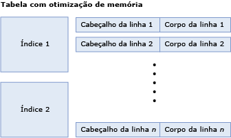
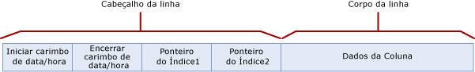
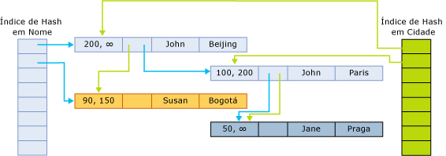

# <a name="table-and-row-size-in-memory-optimized-tables"></a>Tamanho da tabela e da linha em tabelas com otimização de memória
[!INCLUDE[tsql-appliesto-ss2016-asdb-xxxx-xxx_md](../../includes/tsql-appliesto-ss2016-asdb-xxxx-xxx-md.md)]

  Uma tabela com otimização de memória consiste em uma coleção de linhas e índices que contêm ponteiros para linhas. Em uma tabela com otimização de memória, as linhas não podem ter mais de 8.060 bytes. No entanto, a partir do [!INCLUDE[ssSQL15](../../includes/sssql15-md.md)] , é possível criar uma tabela com várias colunas grandes [por exemplo, várias colunas varbinary (8000)] e colunas LOB [ou seja, varbinary(max), varchar(max) e nvarchar(max)]. Colunas que excedem o tamanho máximo de dados em linha são colocadas fora de linha, em tabelas internas especiais. Para obter detalhes sobre essas tabelas internas, veja [sys.memory_optimized_tables_internal_attributes &#40;Transact-SQL&#41;](../../relational-databases/system-catalog-views/sys-memory-optimized-tables-internal-attributes-transact-sql.md).
  
 Há duas razões para calcular o tamanho da tabela e da linha:  
  
-   Qual a quantidade de memória que uma tabela usa?  
  
    -   A quantidade de memória usada pela tabela não pode ser calculada exatamente. Muitos fatores afetam a quantidade de memória usada, como alocação de memória baseada na página, localidade, cache e preenchimento. Além disso, várias versões de linhas têm transações ativas associadas ou estão aguardando a coleta de lixo.  
  
    -   O tamanho mínimo necessário para os dados e índices na tabela é determinado pelo cálculo de [tamanho da tabela], discutido a seguir.  
  
    -   Calcular o uso da memória é, na melhor das hipóteses, uma aproximação; portanto, é recomendável incluir o planejamento de capacidade nos planos de implantação.  
  
-   O tamanho dos dados de uma linha; ele se ajusta à limitação de tamanho de linha de 8.060 bytes? Para responder a essas perguntas, use a computação para [tamanho do corpo da linha], discutida abaixo.  

Colunas que não se ajustam ao limite de tamanho de linha de 8.060 bytes são colocadas fora de linha, em uma tabela interna separada. Cada coluna fora de linha tem uma tabela interna correspondente, que por sua vez, tem um único índice não clusterizado. Para obter detalhes sobre as tabelas internas usadas para colunas fora da linha, veja [sys.memory_optimized_tables_internal_attributes &#40;Transact-SQL&#41;](../../relational-databases/system-catalog-views/sys-memory-optimized-tables-internal-attributes-transact-sql.md). 
  
 A figura a seguir ilustra uma tabela com índices e linhas que, por sua vez, têm cabeçalhos e corpos de linha:  
  
   
Tabela com otimização de memória composta por índices e linhas.  
  
 O tamanho de uma tabela na memória, em bytes, é calculado da seguinte forma:  
  
```  
[table size] = [size of index 1] + … + [size of index n] + ([row size] * [row count])  
```  
  
 O tamanho de um índice de hash é fixado no momento da criação da tabela e depende do número real de buckets. O bucket_count na especificação de índice é arredondado para a potência mais próxima de 2, de modo a obter [número real de buckets]. Por exemplo, se o bucket_count especificado for 100000, o [número real de buckets] para o índice será 131072.  
  
```  
[hash index size] = 8 * [actual bucket count]  
```  

 O tamanho de um índice não clusterizado está na ordem de `[row count] * [index key size]`.
  
 O tamanho da linha é calculado adicionando-se o cabeçalho e o corpo:  
  
```  
[row size] = [row header size] + [actual row body size]  
[row header size] = 24 + 8 * [number of indices]  
```  
  
 **Tamanho do corpo da linha**  
  
 O cálculo do [tamanho do corpo da linha] é abordado na tabela a seguir.  
  
 Há dois cálculos diferentes para o tamanho do corpo da linha: tamanho calculado e o tamanho real:  
  
-   O tamanho calculado, marcado com [tamanho do corpo da linha calculado], é usado para determinar se a limitação do tamanho da linha de 8.060 bytes foi excedida.  
  
-   O tamanho real, marcado com [tamanho do corpo da linha real], é o tamanho real do armazenamento do corpo da linha na memória e nos arquivos de ponto de verificação.  
  
 O [tamanho do corpo da linha calculado] e o [tamanho do corpo da linha real] são calculados de modo semelhante. A única diferença é o cálculo do tamanho das colunas (n)varchar(i) e varbinary(i), como refletido na parte inferior da tabela seguinte. O tamanho do corpo da linha calculado usa o tamanho declarado *i* como o tamanho da coluna, enquanto o tamanho do corpo da linha real usa o tamanho real dos dados.  
  
 A tabela a seguir descreve o cálculo do tamanho do corpo da linha, fornecido como [tamanho do corpo real da linha] = SUM([tamanho de tipos rasos]) + 2 + 2 * [número de colunas de tipo profundo].  
  
|Seção|Tamanho|Comentários|  
|-------------|----------|--------------|  
|Colunas do tipo superficial|SUM([tamanho dos tipos superficiais]). O tamanho dos tipos individuais em bytes é o seguinte:<br /><br /> **Bit**: 1<br /><br /> **Tinyint**: 1<br /><br /> **Smallint**: 2<br /><br /> **Int**: 4<br /><br /> **Real**: 4<br /><br /> **Smalldatetime**: 4<br /><br /> **Smallmoney**: 4<br /><br /> **Bigint**: 8<br /><br /> **Datetime**: 8<br /><br /> **Datetime2**: 8<br /><br /> **Float**: 8<br /><br /> **Money**: 8<br /><br /> **Numeric** (precisão < = 18): 8<br /><br /> **Time**: 8<br /><br /> **Numeric** (precisão > 18): 16<br /><br /> **Uniqueidentifier**: 16||  
|Preenchimento da coluna superficial|Os valores possíveis são:<br /><br /> 1 se houver colunas do tipo profundas e o tamanho total dos dados das colunas superficiais for como um número ímpar.<br /><br /> Caso contrário, será 0|Os tipos profundos são os tipos (var)binary e (n)(var)char.|  
|Matriz de deslocamento para colunas do tipo profundas|Os valores possíveis são:<br /><br /> 0 se não houver nenhuma coluna do tipo profunda<br /><br /> Caso contrário, 2 + 2 * [número de colunas do tipo profundas]|Os tipos profundos são os tipos (var)binary e (n)(var)char.|  
|Matriz NULL|[número de colunas que permitem valor nulo] / 8, arredondado para bytes completos.|A matriz tem um bit por coluna que permite valor nulo. Ele é arredondado para bytes completos.|  
|Preenchimento da matriz NULL|Os valores possíveis são:<br /><br /> 1 se houver colunas do tipo profundas e o tamanho da matriz NULL é um número ímpar de bytes.<br /><br /> Caso contrário, será 0|Os tipos profundos são os tipos (var)binary e (n)(var)char.|  
|Preenchimento|Se não houver nenhuma coluna do tipo profunda: 0<br /><br /> Se houver colunas do tipo profundas, de 0 a 7 bytes de preenchimento serão adicionados, com base no maior alinhamento exigido por uma coluna superficial. Cada coluna superficial exige alinhamento igual a seu tamanho, como documentado acima, exceto pelo fato de que as colunas GUID precisam de alinhamento de 1 byte (e não 16) e as colunas numéricas sempre precisam de alinhamento de 8 bytes (nunca 16). O requisito de maior alinhamento entre todas as colunas superficiais é usado, e de 0 a 7 bytes de preenchimento são adicionados, de modo que o tamanho total até agora (sem as colunas do tipo profundas) é um múltiplo do alinhamento requerido.|Os tipos profundos são os tipos (var)binary e (n)(var)char.|  
|Colunas do tipo profundas de comprimento fixo|SUM([tamanho das colunas do tipo profundas de comprimento fixo])<br /><br /> O tamanho de cada coluna é o seguinte:<br /><br /> i para char(i) e binary(i).<br /><br /> 2 * i para nchar(i)|As colunas do tipo profundas de comprimento fixo são colunas do tipo char(i), nchar(i) ou binary(i).|  
|Colunas do tipo profundas de comprimento variável [tamanho calculado]|SUM([tamanho calculado das colunas do tipo profundas de comprimento variável])<br /><br /> O tamanho calculado de cada coluna é o seguinte:<br /><br /> i para varchar(i) e varbinary(i)<br /><br /> 2 * i para nvarchar(i)|Essa linha é aplicada somente ao [tamanho do corpo da linha calculado].<br /><br /> As colunas do tipo profundas de comprimento variável são colunas do tipo varchar(i), nvarchar(i) ou varbinary(i). O tamanho calculado é determinado pelo comprimento máximo (i) da coluna.|  
|Colunas do tipo profundas de comprimento variável [tamanho real]|SUM([tamanho real das colunas do tipo profundas de comprimento variável])<br /><br /> O tamanho real de cada coluna é o seguinte:<br /><br /> n, onde n é o número de caracteres armazenados na coluna, para varchar(i).<br /><br /> 2 * n, onde n é o número de caracteres armazenados na coluna, para nvarchar(i).<br /><br /> n, onde n é o número de bytes armazenados na coluna, para varbinary(i).|Essa linha é aplicada somente ao [tamanho do corpo da linha real].<br /><br /> O tamanho real é determinado pelos dados armazenados nas colunas da linha.|  
  
##  <a name="bkmk_RowStructure"></a> Estrutura da linha  
 As linhas em uma tabela com otimização de memória têm os seguintes componentes:  
  
-   O cabeçalho de linha contém o carimbo de data/hora necessário para implementar o controle de versão de linha. O cabeçalho da linha também contém o ponteiro de índice para implementar o encadeamento de linhas nos buckets de hash (descrito acima).  
  
-   O corpo da linha contém os dados reais da coluna, que incluem algumas informações auxiliares como a matriz nula das colunas que permitem valor nulo e a matriz de deslocamento dos tipos de dados de comprimento variável.  
  
 A figura a seguir ilustra a estrutura de linha de uma tabela que tem dois índices:  
  
   
  
 Os carimbos de data/hora de início e de término indicam o período em que uma determinada versão de linha é válida. As transações que começam nesse intervalo podem ver essa versão de linha. Para obter mais detalhes, veja [Transações com tabelas com otimização de memória](../../relational-databases/in-memory-oltp/transactions-with-memory-optimized-tables.md).  
  
 Os ponteiros de índice apontam para a próxima linha da cadeia de caracteres que pertence ao bucket de hash. A figura a seguir ilustra a estrutura de uma tabela com duas colunas (nome, cidade), e com dois índices, um na coluna nome e outro na coluna cidade.  
  
   
  
 Nesta figura, os nomes John e Jane são transformados em hash no primeiro bucket. Susan é transformado em hash no segundo bucket. As cidades Beijing e Bogotá são transformadas em hash no primeiro bucket. Paris e Praga são transformadas em hash no segundo bucket.  
  
 Desse modo, as cadeias do índice de hash na coluna nome são as seguintes:  
  
-   Primeiro bucket: (John, Beijing); (John, Paris); (Jane, Praga)  
  
-   Segundo bucket: (Susan, Bogotá)  
  
 As cadeias do índice de cidade são as seguintes:  
  
-   Primeiro bucket: (John, Beijing), (Susan, Bogotá)  
  
-   Segundo bucket: (John, Paris), (Jane, Praga)  
  
 Um carimbo de data/hora de término ∞ (infinito) indica que essa é a versão atualmente válida da linha. A linha não foi atualizada nem excluída desde que essa versão de linha foi gravada.  
  
 Para um tempo maior que 200, a tabela contém as seguintes linhas:  
  
|Nome|Cidade|  
|----------|----------|  
|John|Beijing|  
|Jane|Praga|  
  
 Entretanto, qualquer transação ativa com tempo inicial igual a 100 resultará na seguinte versão da tabela:  
  
|Nome|Cidade|  
|----------|----------|  
|John|Paris|  
|Jane|Praga|  
|Susan|Bogotá|  
  
##  <a name="bkmk_ExampleComputation"></a> Exemplo: Cálculo do tamanho da tabela e da linha  
 Para índices de hash, o número de buckets real é arredondado até a potência mais próxima de 2. Por exemplo, se o bucket_count especificado for 100000, o número real de buckets para o índice será 131072.  
  
 Considere uma tabela Orders com a seguinte definição:  
  
```tsql  
CREATE TABLE dbo.Orders (  
     OrderID int NOT NULL   
           PRIMARY KEY NONCLUSTERED,  
     CustomerID int NOT NULL   
           INDEX IX_CustomerID HASH WITH (BUCKET_COUNT=10000),  
     OrderDate datetime NOT NULL,  
     OrderDescription nvarchar(1000)  
) WITH (MEMORY_OPTIMIZED=ON)  
GO  
```  
  
 Observe que esta tabela tem um índice de hash e um índice não clusterizado (a chave primária). Ela também tem três colunas de comprimento fixo e uma coluna de comprimento variável, com uma das colunas sendo NULLable (OrderDescription). Vamos considerar que a tabela Orders tem 8379 linhas e o comprimento médio dos valores na coluna OrderDescription é de 78 caracteres.  
  
 Para determinar o tamanho da tabela, primeiro determine o tamanho dos índices. O bucket_count para ambos os índices é especificado como 10000. Isso é arredondado para a potência mais próxima de 2: 16384. Consequentemente, o tamanho total dos índices da tabela Orders é:  
  
```  
8 * 16384 = 131072 bytes  
```  
  
 O que sobra é o tamanho dos dados da tabela, que é  
  
```  
[row size] * [row count] = [row size] * 8379  
```  
  
 (A tabela de exemplo tem 8379 linhas.) Agora, temos:  
  
```  
[row size] = [row header size] + [actual row body size]  
[row header size] = 24 + 8 * [number of indices] = 24 + 8 * 1 = 32 bytes  
```  
  
 Em seguida, vamos calcular o [tamanho do corpo da linha real]:  
  
-   Colunas do tipo superficial:  
  
    ```  
    SUM([size of shallow types]) = 4 [int] + 4 [int] + 8 [datetime] = 16  
    ```  
  
-   O preenchimento da coluna superficial é 0, pois o tamanho total da coluna superficial é par.  
  
-   Matriz de deslocamento para colunas do tipo profundas:  
  
    ```  
    2 + 2 * [number of deep type columns] = 2 + 2 * 1 = 4  
    ```  
  
-   Matriz NULL = 1  
  
-   Preenchimento da matriz NULL = 1, pois o tamanho da matriz é ímpar e há uma coluna do tipo profunda.  
  
-   Preenchimento  
  
    -   8 é o maior requisito de alinhamento.  
  
    -   O tamanho até agora é 16 + 0 + 4 + 1 + 1 = 22.  
  
    -   O múltiplo mais próximo de 8 é 24.  
  
    -   O preenchimento total é 24 – 22 = 2 bytes.  
  
-   Não há colunas do tipo profundas de comprimento fixo (Colunas do tipo profundas de comprimento fixo: 0.).  
  
-   O tamanho real da coluna do tipo profunda é 2 * 78 = 156. Uma única coluna do tipo profunda OrderDescription tem o tipo nvarchar.  
  
```  
[actual row body size] = 24 + 156 = 180 bytes  
```  
  
 Para concluir o cálculo:  
  
```  
[row size] = 32 + 180 = 212 bytes  
[table size] = 8 * 16384 + 212 * 8379 = 131072 + 1776348 = 1907420  
```  
  
 O tamanho total da tabela na memória é de aproximadamente 2 megabytes. Isso não conta para a possível sobrecarga incorrida pela alocação de memória, bem como para qualquer controle de versão de linha exigido para as transações que acessam essa tabela.  
  
 A memória real alocada para essa tabela, e usada por ela, bem como seus índices, podem ser obtidos por meio da seguinte consulta:  
  
```tsql  
select * from sys.dm_db_xtp_table_memory_stats  
where object_id = object_id('dbo.Orders')  
```  
  
## <a name="see-also"></a>Consulte também  
 [Tabelas com otimização de memória](../../relational-databases/in-memory-oltp/memory-optimized-tables.md)  
  
  
