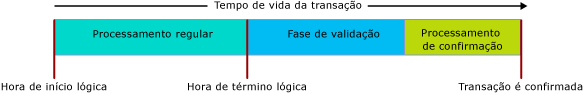

# Transações com tabelas com otimização de memória
[!INCLUDE[tsql-appliesto-ss2016-asdb-xxxx-xxx_md](../../includes/tsql-appliesto-ss2016-asdb-xxxx-xxx-md.md)]

  
Este artigo descreve todos os aspectos de transações que são específicas de tabelas com otimização de memória e de procedimentos armazenados compilados de modo nativo.  
  
Os níveis de isolamento de transação no SQL Server são aplicados de maneira diferente para tabelas com otimização de memória versus tabelas baseadas em disco rígido e os mecanismos subjacentes são diferentes. Uma compreensão das diferenças ajuda o programador a criar um sistema de alta taxa de transferência. O objetivo da integridade da transação é pertinente a todos os casos.  

Para obter condições de erro específicas de transações em tabelas com otimização de memória, vá para a seção [Detecção de conflito e lógica de repetição](#confdetretry34ni).
  
Para saber mais gerais, veja [SET TRANSACTION ISOLATION LEVEL (Transact-SQL)](../../t-sql/statements/set-transaction-isolation-level-transact-sql.md).  
  
  
<a name="pessvoptim22ni"/>  
  
## Pessimista versus otimista  
  
As diferenças funcionais são devido a diferenças nas abordagens, pessimista ou otimista, à integridade da transação. As tabelas com otimização de memória usam a abordagem otimista:  
  
- a abordagem pessimista usa travas para bloquear os conflitos em potencial antes de ocorrerem. Bloqueios são usados quando a instrução é executada e liberados quando a transação é confirmada.  
  
- Uma abordagem otimista detecta conflitos conforme eles ocorrem e executa verificações de validação no momento da confirmação.  
  - O erro 1205, um deadlock, não pode ocorrer em uma tabela com otimização de memória.  
  
A abordagem otimista tem menos sobrecarga e normalmente é mais eficiente, em parte porque conflitos de transação são incomuns na maioria dos aplicativos. A principal diferença funcional entre as abordagens otimista e pessimista é que se ocorrer um conflito, na abordagem pessimista você aguardará, enquanto na abordagem otimista, uma das transações falhará e deverá ser repetida pelo cliente. As diferenças funcionais são maiores quando o nível de isolamento REPEATABLE READ está em vigor e maiores para o nível SERIALIZABLE.  
  
<a name="txninitmodes24ni"/>  
  
## Modos de iniciação da transação  
  
O SQL Server tem os seguintes modos de iniciação de transação:  
  
- **Confirmação automática** – O início de uma consulta simples ou instrução DML abre implicitamente uma transação e o término da instrução implicitamente confirma a transação. Esse é o padrão.  
  - No modo de confirmação automática, geralmente não é necessário codificar uma dica de tabela sobre o nível de isolamento da transação na tabela com otimização de memória na cláusula FROM.  
  
- **Explícita** - o Transact-SQL contém o código BEGIN TRANSACTION, juntamente com uma eventual COMMIT TRANSACTION. Duas ou mais instruções podem ser agrupadas na mesma transação.  
  - No modo explícito, é necessário usar a opção de banco de dados MEMORY_OPTIMIZED_ELEVATE_TO_SNAPSHOT ou um código de uma dica de tabela sobre o nível de isolamento da transação na tabela com otimização de memória da cláusula FROM.  
  
- **Implícita** - quando SET IMPLICIT_TRANSACTION ON está em vigor. Talvez um nome melhor teria sido IMPLICIT_BEGIN_TRANSACTION, porque essas opções implicitamente realizam o equivalente a uma BEGIN TRANSACTION antes de cada instrução UPDATE se 0 = @@trancount. Portanto, depende do seu código T-SQL eventualmente emitir uma COMMIT TRANSACTION explícita.   
  
- **ATOMIC BLOCK** – Todas as instruções nos blocos ATOMIC, necessárias com procedimentos armazenados compilados de modo nativo, sempre são executadas como parte de uma única transação – as ações do bloco atômico como um todo são confirmadas ou são todas revertidas, em caso de falha.  
  
<a name="codeexamexpmode25ni"/>  
  
### Exemplo de código com o modo Explicit  
  
O script Transact-SQL interpretado a seguir usa:  
  
- Uma transação explícita.  
  
- Uma tabela com otimização de memória, denominada dbo.Order_mo.  
  
- O contexto do nível de isolamento da transação READ COMMITTED.  
  
Portanto, é necessário ter uma dica de tabela na tabela com otimização de memória. A dica deve ser para um SNAPSHOT ou nível com ainda mais isolamento. No caso do exemplo de código, a dica é WITH (SNAPSHOT). Se essa dica for removida, o script deverá sofrer um erro 41368, para o qual uma repetição automática seria inadequada:  
  
- 41368: o acesso às tabelas com otimização de memória usando o nível de isolamento READ COMMITTED tem suporte somente para transações de confirmação automática. Ele não tem suporte para transações implícitas ou explícitas. Forneça um nível de isolamento com suporte para a tabela com otimização de memória usando uma dica de tabela, como WITH (SNAPSHOT).  
  
  
  
    SET TRANSACTION ISOLATION LEVEL READ COMMITTED;  
    GO  
  
    BEGIN TRANSACTION; – Transação explícita.  
  
      -- Order_mo  is a memory-optimized table.  
    SELECT *  
       FROM  
                dbo.Order_mo  as o  WITH (SNAPSHOT)  – Dica de tabela.  
           JOIN dbo.Customer  as c  on c.CustomerId = o.CustomerId;  
      
    COMMIT TRANSACTION;  
  
Observe que pode-se evitar a necessidade da dica `WITH (SNAPSHOT)` com o uso da opção de banco de dados `MEMORY_OPTIMIZED_ELEVATE_TO_SNAPSHOT`. Quando essa opção é definida como `ON`, o acesso a uma tabela com otimização de memória em um nível de isolamento inferior é elevado automaticamente para o isolamento SNAPSHOT.  
  
    ALTER DATABASE CURRENT SET MEMORY_OPTIMIZED_ELEVATE_TO_SNAPSHOT=ON  
  
<a name="rowver28ni"/>  
  
## Controle de versão de linha  
  
As tabelas com otimização de memória usam um sistema de controle de versão de linha sofisticado que torna o nível de isolamento eficiente, até mesmo o nível de isolamento SERIALIZABLE, mais restrito. Para obter detalhes, veja [Introdução às tabelas com otimização de memória](../../relational-databases/in-memory-oltp/introduction-to-memory-optimized-tables.md).  
  
As tabelas baseadas em disco indiretamente têm um sistema de controle de versão de linha quando READ_COMMITTED_SNAPSHOT ou SNAPSHOT está em vigor. Esse sistema baseia-se no tempdb, enquanto as estruturas de dados com otimização de memória têm controle de versão de linha embutido, para máxima eficiência.  
  
<a name="confdegreeiso30ni"/>  
  
## Níveis de isolamento 
  
A tabela a seguir lista os possíveis níveis de isolamento da transação, na sequência de isolamento do menor para o maior. Para obter detalhes sobre os conflitos que podem ocorrer e a lógica de repetição para lidar com esses conflitos, veja [Detecção de conflito e lógica de repetição](#confdetretry34ni). 
  
| Nível de Isolamento | Descrição |   
| :-- | :-- |   
| READ UNCOMMITTED | Indisponível: as tabelas com otimização de memória não podem ser acessadas com isolamento Read Uncommitted. Ainda é possível acessar tabelas com otimização de memória no isolamento SNAPSHOT se TRANSACTION ISOLATION LEVEL no nível da sessão é definido como READ UNCOMMITTED, usando a dica de tabela WITH (SNAPSHOT) ou definindo a configuração de banco de dados MEMORY_OPTIMIZED_ELEVATE_TO_SNAPSHOT como ON. | 
| READ COMMITTED | Suporte para tabelas com otimização de memória somente quando o modo de confirmação automática está em vigor. Ainda é possível acessar tabelas com otimização de memória no isolamento SNAPSHOT se TRANSACTION ISOLATION LEVEL no nível da sessão é definido como READ COMMITTED, usando a dica de tabela WITH (SNAPSHOT) ou definindo a configuração de banco de dados MEMORY_OPTIMIZED_ELEVATE_TO_SNAPSHOT como ON.    Observe que, se a opção de banco de dados READ_COMMITTED_SNAPSHOT estiver definida como ON, não será permitido acessar uma tabela com otimização de memória e uma tabela baseada em disco em isolamento READ COMMITTED na mesma instrução. |  
| SNAPSHOT | Há suporte para tabelas com otimização de memória.    Internamente, SNAPSHOT é o nível de isolamento de transação menos exigente para tabelas com otimização de memória.    SNAPSHOT usa menos recursos do sistema que o REPEATABLE READ ou SERIALIZABLE. |  
| REPEATABLE READ | Há suporte para tabelas com otimização de memória. A garantia fornecida pelo isolamento REPEATABLE READ é que, no momento da confirmação, nenhuma transação simultânea atualizou nenhuma das linhas lidas por essa transação.    Por causa do modelo otimista, as transações simultâneas não são impedidas de atualizar as linhas lidas por essa transação. Em vez disso, no momento da confirmação, essa transação validou que o isolamento REPEATABLE READ não foi violado. Em caso afirmativo, essa transação será revertida e deverá ser repetida. | 
| SERIALIZABLE | Há suporte para tabelas com otimização de memória.    Chamado de *Serializable* porque o isolamento é tão rígido que é praticamente como ter as transações executadas em série em vez de simultaneamente. | 

<a name="txnphaslife32ni"/>  
  
## Tempo de vida e fases da transação  
  
Quando uma tabela com otimização de memória está envolvida, o tempo de vida de uma transação progride pelas fases, conforme exibido na imagem a seguir.  
  
  
  
Seguem as descrições das fases.  
  
#### Processamento regular: fase 1 (de 3)  
  
- Essa fase é composta pela execução de todas as consultas e instruções DML na consulta.  
- Durante essa fase, as instruções consideram a versão das tabelas com otimização de memória a partir da hora de início lógica da transação.  
  
#### Validação: fase 2 (de 3)  
  
- A fase de validação começa com a atribuição da hora de término, marcando a transação como logicamente completa. Isso torna todas as alterações visíveis da transação visíveis para outras transações, o que usará uma dependência nessa transação, e não poderá ser confirmado até que a transação seja confirmada com êxito. Além disso, as transações que mantêm essas dependências não poderão retornar conjuntos de resultados para o cliente, a fim de garantir que o cliente veja apenas os dados que foram confirmados com êxito no banco de dados.  
- Essa fase compreende as validações de leitura repetida e serializável. Para a validação de leitura repetida, ela verifica se qualquer uma das linhas lidas pela transação foi atualizada desde então. Para a validação serializável, ela verifica se nenhuma linha foi inserida em nenhum intervalo de dados verificado por essa transação. Observe que, de acordo com a tabela em [Conflitos e níveis de isolamento](#confdegreeiso30ni), as validações de leitura repetida e serializável podem ocorrer ao usar o isolamento de instantâneo, para validar a consistência de restrições de chaves estrangeira e exclusiva.  
  
#### Processamento de confirmação: fase 3 (de 3)  
  
- Durante essa fase de confirmação, as alterações nas tabelas duráveis são gravadas no log e o log é gravado em disco. Em seguida, o controle é retornado para o cliente.  
- Após a conclusão do processamento de confirmação, todas as transações dependentes são notificadas de que elas podem ser confirmadas.  
  
Como sempre, você deve tentar manter suas unidades de trabalho transacionais mínimas e breves, conforme forem válidas para suas necessidades de dados.  
  
<a name="confdetretry34ni"/>  
  
## Detecção de conflito e lógica de repetição 

Há dois tipos de condições de erro relacionadas à transação que causam a falha e reversão de uma transação. Na maioria dos casos, quando ocorre uma falha desse tipo, a transação precisa ser repetida, de forma semelhante a quando ocorre um deadlock.
- Conflitos entre transações simultâneas. Esses são os conflitos de atualização e as falhas de validação e podem ocorrer devido a violações no nível de isolamento da transação ou a violações de restrição.
- Falhas de dependência. Isso resulta da falha da transação dependente em ser confirmada ou do aumento excessivo do número de dependências.

Veja abaixo as condições de erro que podem causar falhas nas transações que acessam as tabelas com otimização de memória.

| Código do Erro | Descrição | Causa |
| :-- | :-- | :-- |
| **41302** | Tentou atualizar uma linha que foi atualizada em uma transação diferente desde o início da transação atual. | Essa condição de erro ocorre se duas transações simultâneas tentam atualizar ou excluir a mesma linha ao mesmo tempo. Uma das duas transações recebe essa mensagem de erro e precisará ser repetida.     | 
| **41305**| Falha de validação de leitura repetida. Uma linha lida de uma tabela com otimização de memória – esta transação foi atualizada por outra transação que foi confirmada antes da confirmação dessa transação. | Esse erro pode ocorrer ao usar o isolamento REPEATABLE READ ou SERIALIZABLE e também se as ações de uma transação simultânea causam a violação de uma restrição FOREIGN KEY.   Em geral, uma violação simultânea de restrição de chave estrangeira desse tipo é rara e, normalmente, indica um problema com a lógica do aplicativo ou a entrada de dados. No entanto, o erro também pode ocorrer se não há nenhum índice nas colunas envolvidas com a restrição FOREIGN KEY. Portanto, a orientação é sempre criar um índice em colunas de chave estrangeira em uma tabela com otimização de memória.    Para obter considerações mais detalhadas sobre as falhas de validação causadas por violações de chave estrangeira, confira [esta postagem no blog](https://blogs.msdn.microsoft.com/sqlcat/2016/03/24/considerations-around-validation-errors-41305-and-41325-on-memory-optimized-tables-with-foreign-keys/) da Equipe de Consultoria ao Cliente do SQL Server. |  
| **41325** | Falha de validação serializável. Uma nova linha foi inserida em um intervalo que foi examinado anteriormente pela transação atual. Chamamos isso de uma linha fantasma. | Esse erro pode ocorrer ao usar o isolamento SERIALIZABLE e também se as ações de uma transação simultânea causam a violação de uma restrição PRIMARY KEY, UNIQUE ou FOREIGN KEY.    Em geral, uma violação de restrição simultânea desse tipo é rara e, normalmente, indica um problema com a lógica do aplicativo ou a entrada de dados. No entanto, de forma semelhante às falhas de validação de leitura repetida, esse erro também pode ocorrer se há uma restrição FOREIGN KEY sem nenhum índice nas colunas envolvidas. |  
| **41301** | Falha de dependência: uma dependência foi usada em outra transação que posteriormente não foi confirmada. | Esta transação (Tx1) usou uma dependência em outra transação (Tx2) enquanto a transação (Tx2) estava em sua fase de validação ou processamento de confirmação, com a leitura dos dados gravados por Tx2. Consequentemente, ocorreu uma falha na confirmação de Tx2. As causas mais comuns de falha na confirmação de Tx2 são falhas de validação de leitura repetida (41305) e de validação serializável (41325); uma causa menos comum é a falha de E/S de log. |
| **41839** | A transação excedido o número máximo de dependências de confirmação. | Há um limite no número de transações do qual determinada transação pode depender (Tx1) – essas são as dependências de saída. Além disso, há um limite no número de transações que podem depender de determinada transação (Tx1) – essas são as dependências de entrada. O limite para ambos é de 8.    O caso mais comum dessa falha é quando há um grande número de transações de leitura que acessam os dados gravados por uma única transação de gravação. A probabilidade de atingir essa condição aumentará se as transações de leitura estiverem todas executando verificações grandes dos mesmos dados e se o processamento de validação ou confirmação da transação de gravação levar muito tempo; por exemplo, a transação de gravação executa verificações grandes no isolamento serializável (aumenta o tamanho da fase de validação) ou o log de transações é colocado em um dispositivo de E/S de log lento (aumenta o tamanho do processamento de confirmação). Se as transações de leitura executam verificações grandes e devem acessar apenas algumas linhas, isso pode ser uma indicação de um índice ausente. Da mesma forma, se a transação de gravação usar o isolamento serializável e estiver realizando verificações grandes, mas se for esperado que ela acesse apenas algumas linhas, isso também será uma indicação de um índice ausente.    O limite do número de dependências de confirmação pode ser aumentado com o uso do Sinalizador de Rastreamento **9926**. Use este sinalizador de rastreamento somente se ainda estiver recebendo essa condição de erro depois de confirmar que não há nenhum índice ausente, pois isso pode mascarar esses problemas nos casos mencionados acima. Outra advertência é que os gráficos de dependência complexos, em que cada transação tem um grande número de dependências de entrada, bem como dependências de saída, e transações individuais têm várias camadas de dependências, o que pode levar a ineficiências no sistema.  |
 
  
### Lógica de repetição 

Quando uma transação falha devido a alguma das condições mencionadas acima, a transação deve ser repetida.
  
A lógica de repetição pode ser implementada no lado do cliente ou servidor. A recomendação geral é implementar a lógica de repetição no lado do cliente, pois é mais eficiente, e permite lidar com os conjuntos de resultados retornados pela transação antes que ocorra a falha.  
  
<a name="retrytsqlcodeexam35ni"/>  
  
#### Repita o exemplo de código T-SQL  
  
A lógica de repetição do lado do servidor com T-SQL deve ser usada somente para transações que não retornam conjuntos de resultados para o cliente, pois as repetições possivelmente poderão fazer com que conjuntos de resultados adicionais sejam retornados para o cliente, que podem não estar previstos.  
  
O script T-SQL interpretado a seguir ilustra a aparência de uma lógica de repetição para os erros associados com conflitos de transações que envolvem tabelas com otimização de memória.  
  
      -- Retry logic, in Transact-SQL.  
    DROP PROCEDURE If Exists usp_update_salesorder_dates;  
    GO  
  
    CREATE PROCEDURE usp_update_salesorder_dates  
    AS  
    BEGIN  
        DECLARE @retry INT = 10;  
  
        WHILE (@retry > 0)  
        BEGIN  
            BEGIN TRY  
                BEGIN TRANSACTION;  
  
                UPDATE dbo.SalesOrder_mo WITH (SNAPSHOT)  
                    set OrderDate = GetUtcDate()  
                    where CustomerId = 42;  
  
                UPDATE dbo.SalesOrder_mo WITH (SNAPSHOT)  
                    set OrderDate = GetUtcDate()  
                    where CustomerId = 43;  
  
                COMMIT TRANSACTION;  
                SET @retry = 0;  -- //Stops the loop.  
            END TRY  
  
            BEGIN CATCH  
                SET @retry -= 1;  
  
                IF (@retry > 0 AND  
                    ERROR_NUMBER() in (41302, 41305, 41325, 41301, 41839, 1205)  
                    )  
                BEGIN  
                    IF XACT_STATE() = -1  
                        ROLLBACK TRANSACTION;  
  
                    WAITFOR DELAY '00:00:00.001';  
                END  
                ELSE  
                BEGIN  
                    PRINT 'Suffered an error for which Retry is inappropriate.';  
                    THROW;  
                END  
            END CATCH  
  
        END -- //While loop  
    END;  
    GO  
  
      --  EXECUTE usp_update_salesorder_dates;  
  
  
  
<a name="crossconttxn38ni"/>  
  
## Transação entre contêineres  
  
  
Uma transação é chamada de transação entre contêineres se:  
  
- Acessar uma tabela com otimização de memória de um Transact-SQL interpretado; ou  
- Execute um procedimento nativo quando uma transação já estiver aberta (XACT_STATE() = 1).  
  
O termo “entre contêineres” deriva do fato de que a transação é executada nos dois contêineres de gerenciamento de transações: um para as tabelas baseadas em disco e outro para as tabelas com otimização de memória.  
  
Em uma transação única entre contêineres, diferentes níveis de isolamento podem ser usados para acessar tabelas baseadas em disco e com otimização de memória. Essa diferença é expressa por meio de dicas de tabela explícitas, como WITH (SERIALIZABLE) ou por meio da opção de banco de dados MEMORY_OPTIMIZED_ELEVATE_TO_SNAPSHOT, que implicitamente eleva o nível de isolamento da tabela com otimização de memória para instantâneo, caso TRANSACTION ISOLATION LEVEL seja configurado como READ COMMITTED ou READ UNCOMMITTED.  
  
No exemplo de código Transact-SQL a seguir:  
  
- A tabela baseada em disco, Table_D1, é acessada usando o nível de isolamento READ COMMITTED.  
- A tabela com otimização de memória Table_MO7 é acessada com o nível de isolamento SERIALIZABLE. Table_MO6 não tem um nível de isolamento associado específico, já que as inserções sempre são consistentes e executadas basicamente no isolamento serializável.  
  
  
  
      -- Different isolation levels for  
      -- disk-based tables versus memory-optimized tables,  
      -- within one explicit transaction.  
  
    SET TRANSACTION ISOLATION LEVEL READ COMMITTED;  
    GO  
  
    BEGIN TRANSACTION;  
  
        -- Table_D1 is a traditional disk-based table, accessed using READ COMMITTED isolation.  
        --  
        SELECT * FROM Table_D1;  
  
  
  
        -- Table_MO6 and Table_MO7 are memory-optimized tables. Table_MO7 is accessed using SERIALIZABLE isolation,  
    – enquanto Table_MO6 não tem um específico   
        --  
        INSERT Table_MO6  
            SELECT * FROM Table_MO7 WITH (SERIALIZABLE);  
  
  
    COMMIT TRANSACTION;  
    GO  
  
  
  
<a name="limitations40ni"/>  
  
## Limitações  
  
  
- As transações entre bancos de dados não têm suporte para tabelas com otimização de memória. Se uma transação acessar uma tabela com otimização de memória, a transação não poderá acessar nenhum outro banco de dados, exceto para:  
  - banco de dados tempdb.  
  - Somente leitura do banco de dados mestre.  
  
- Não há suporte para transações distribuídas: quando BEGIN DISTRIBUTED TRANSACTION é usado, a transação não pode acessar uma tabela com otimização de memória.  
  
  
<a name="natcompstorprocs42ni"/>  
  
## Procedimentos armazenados compilados nativamente  
  
- Em um processo nativo, o bloco ATOMIC deve declarar o nível de isolamento de transação para o bloco inteiro, por exemplo:  
  - `... BEGIN ATOMIC WITH (TRANSACTION ISOLATION LEVEL = SNAPSHOT, ...) ...`  
  
- Nenhuma instrução explícita de controle de transação é permitida dentro do corpo de um processo nativo BEGIN TRANSACTION, ROLLBACK TRANSACTION e assim por diante são todos não permitidos.  
  
- Para obter mais informações sobre o controle de transações com blocos ATOMIC, veja [Blocos atômicos](https://msdn.microsoft.com/library/dn452281.aspx)  
  
<a name="othertxnlinks44ni"/>  
  
## Outros links de transação  
  
- [SET IMPLICIT_TRANSACTIONS](../../t-sql/statements/set-implicit-transactions-transact-sql.md)  
  
- [sp_getapplock (Transact-SQL)](../../relational-databases/system-stored-procedures/sp-getapplock-transact-sql.md)  
  
- [Níveis de isolamento com base no controle de versão de linha no Mecanismo de Banco de Dados](http://msdn.microsoft.com/library/ms177404.aspx)  
  
- [Controlar a durabilidade da transação](../../relational-databases/logs/control-transaction-durability.md)   

