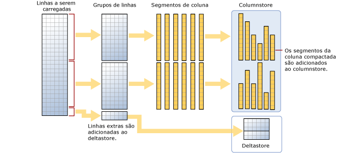

# <a name="columnstore-indexes---data-loading-guidance"></a>Índices columnstore – diretrizes de carregamento de dados
[!INCLUDE[appliesto-ss-asdb-asdw-pdw-md](../../includes/appliesto-ss-asdb-asdw-pdw-md.md)]

Opções e recomendações para carregar dados em um índice columnstore usando o carregamento em massa de SQL padrão e métodos de inserção de fluxo. Carregar dados em um índice columnstore é uma parte essencial de qualquer processo de data warehousing porque ele move os dados para o índice em preparação para análise.
  
 Novato em índices columnstore? Consulte [Índices columnstore – visão geral](../../relational-databases/indexes/columnstore-indexes-overview.md) e [Índices columnstore – arquitetura](../../relational-databases/sql-server-index-design-guide.md#columnstore_index).
  
## <a name="what-is-bulk-loading"></a>O que é carregamento em massa?
*Carregamento em massa* refere-se ao modo em que um grande número de linhas é adicionado a um armazenamento de dados. É o modo de melhor desempenho para mover dados para um índice columnstore porque opera em lotes de linhas. O carregamento em massa preenche rowgroups até a capacidade máxima e compacta-os diretamente no columnstore. Somente as linhas ao final de uma carga que não atende ao mínimo de 102.400 linhas por rowgroup vão para o deltastore.  

Para executar uma carga em massa, você pode usar o [Utilitário bcp](../../tools/bcp-utility.md), o [Integration Services](../../integration-services/sql-server-integration-services.md) ou selecionar linhas de uma tabela de preparo.

  
  
 Como sugere o diagrama, um carregamento em massa:  
  
* Não classifica previamente os dados. Os dados são inseridos em rowgroups na ordem em que são recebidos.
* Se o tamanho do lote for superior ou igual a 102.400, as linhas serão carregadas diretamente em rowgroups compactados. É recomendável escolher um tamanho de lote superior ou igual a 102.400 para uma importação em massa eficiente, pois você pode evitar mover linhas de dados para um rowgroup delta antes que as linhas sejam finalmente movidas para rowgroups compactados por um thread em segundo plano, o TM (Motor de Tupla).
* Se o tamanho do lote for inferior a 102.400 ou se as linhas restantes forem inferiores a 102.400, as linhas serão carregadas em rowgroups delta.

> [!NOTE]
> Em uma tabela rowstore com os dados de um índice columnstore não clusterizado, o [!INCLUDE[ssNoVersion](../../includes/ssnoversion-md.md)] sempre insere dados na tabela base. Os dados nunca são inseridos diretamente no índice columnstore.  

O carregamento em tem estas otimizações de desempenho internas:
-   **Cargas paralelas:** é possível ter várias cargas em massa simultâneas (bcp ou inserção em massa), cada uma carregando um arquivo de dados separado. Ao contrário dos carregamentos em massa rowstore no [!INCLUDE[ssNoVersion](../../includes/ssnoversion-md.md)], não é necessário especificar `TABLOCK` porque cada thread de importação em massa carregará dados exclusivamente em um rowgroup separado (rowgroups compactados ou delta) com um bloqueio exclusivo nele. O uso de `TABLOCK` forçará um bloqueio exclusivo na tabela e não será possível importar dados em paralelo.  
-   **Log mínimo:** um carregamento em massa usa o log mínimo nos dados que vão diretamente para rowgroups compactados. Todos os dados que vão para um rowgroup delta são totalmente registrados. Isso inclui qualquer tamanho de lote com menos de 102.400 linhas. No entanto, no carregamento em massa a meta é que a maioria dos dados ignore os rowgroups delta.  
-   **Otimização de bloqueio:** durante o carregamento em um rowgroup compactado, o bloqueio X no rowgroup é adquirido. No entanto, durante o carregamento em massa em um rowgroup delta, um bloqueio X é adquirido em um rowgroup, mas o [!INCLUDE[ssNoVersion](../../includes/ssnoversion-md.md)] ainda bloqueia os bloqueios PAGE/EXTENT porque o bloqueio do rowgroup X não faz parte da hierarquia de bloqueios.  
  
Se você tiver um índice de árvore B não clusterizado em um índice columnstore, não haverá otimização de log nem de bloqueio para o índice em si, mas as otimizações no índice columnstore clusterizado, conforme descrito acima, ainda permanecerão.  
  
## <a name="plan-bulk-load-sizes-to-minimize-delta-rowgroups"></a>Planejar tamanhos de carga em massa para minimizar os rowgroups delta
Os índices columnstore têm um desempenho melhor quando a maioria das linhas é compactada no columnstore e não permanece nos rowgroups delta. É melhor dimensionar suas cargas de tamanho para que as linhas vão diretamente para o columnstore e ignorem o deltastore o máximo possível.

Esses cenários descrevem quando as linhas carregadas vão diretamente para o columnstore ou quando elas vão para o deltastore. No exemplo, cada rowgroup pode ter de 102.400 a 1.048.576 linhas por rowgroup. Na prática, o tamanho máximo de um rowgroup poderá ser inferior a 1.048.576 linhas quando houver pressão de memória.  
  
|Linhas para carregamento em massa|Linhas adicionadas ao rowgroup compactado|Linhas adicionadas ao rowgroup delta|  
|-----------------------|-------------------------------------------|--------------------------------------|  
|102.000|0|102.000|  
|145.000|145.000<br /><br /> Tamanho do rowgroup: 145.000|0|  
|1,048,577|1.048.576<br /><br /> Tamanho do rowgroup: 1.048.576.|1|  
|2,252,152|2,252,152<br /><br /> Tamanhos do rowgroup: 1.048.576, 1.048.576, 155.000.|0|  
  
 O exemplo a seguir mostra os resultados do carregamento de 1.048.577 linhas em uma tabela. Os resultados mostram um rowgroup COMPRESSED no columnstore (como segmentos de coluna compactados) e 1 linha no deltastore.  
  
```sql  
SELECT object_id, index_id, partition_number, row_group_id, delta_store_hobt_id, 
  state state_desc, total_rows, deleted_rows, size_in_bytes   
FROM sys.dm_db_column_store_row_group_physical_stats  
```  
  
   
  
## <a name="use-a-staging-table-to-improve-performance"></a>Usar uma tabela de preparo para melhorar o desempenho
Se você estiver carregando dados apenas para prepará-los antes de executar mais transformações, carregar a tabela na tabela de heap será muito mais rápido do que carregar os dados em uma tabela columnstore clusterizada. Além disso, carregar dados em uma [tabela temporária] [Temporária] também será muito mais rápido do que carregar uma tabela em um armazenamento permanente.  

 Um padrão comum do carregamento de dados é carregar os dados em uma tabela de preparo, fazer alguma transformação e carregá-la na tabela de destino usando o comando a seguir  
  
```sql  
INSERT INTO <columnstore index>  
SELECT <list of columns> FROM <Staging Table>  
```  
  
 Esse comando carrega os dados no índice columnstore de forma semelhante ao BCP ou à Inserção em Massa, mas em um único lote. Se o número de linhas na tabela de preparo for inferior a 102.400, as linhas serão carregadas em um rowgroup delta, caso contrário, as linhas serão carregadas diretamente no rowgroup compactado. Uma importante limitação era que essa operação `INSERT` era single-threaded. Para carregar dados em paralelo, era possível criar várias tabelas de preparo ou emitir `INSERT`/`SELECT` com intervalos não sobrepostos de linhas da tabela de preparo. Essa limitação não existe no [!INCLUDE[ssSQL15](../../includes/sssql15-md.md)]. O comando abaixo carrega os dados da tabela de preparo em paralelo, mas você precisará especificar `TABLOCK`.  
  
```sql  
INSERT INTO <columnstore index> WITH (TABLOCK) 
SELECT <list of columns> FROM <Staging Table>  
```  
  
 Estas são as otimizações disponíveis ao fazer um carregamento em um índice columnstore clusterizado da tabela de preparo:
-   **Otimização de log:** minimamente registrado em log quando os dados são carregados em um rowgroup compactado. Não haverá registro mínimo quando os dados forem carregados no rowgroup delta.  
-   **Otimização de bloqueio:** durante o carregamento em um rowgroup compactado, o bloqueio X no rowgroup é adquirido. No entanto, com o rowgroup delta, um bloqueio X é adquirido em um rowgroup, mas o [!INCLUDE[ssNoVersion](../../includes/ssnoversion-md.md)] ainda bloqueia os bloqueios PAGE/EXTENT porque o bloqueio do rowgroup X não faz parte da hierarquia de bloqueios.  
  
 Se você tiver um ou mais índices não clusterizados, não haverá otimização de registro nem bloqueio para o índice em si, mas as otimizações no índice columnstore clusterizado, conforme descrito acima, permanecerão.  
  
## <a name="what-is-trickle-insert"></a>O que é a inserção de fluxo?

*Inserção de fluxo* refere-se à forma como linhas individuais são movidas para o índice columnstore. As inserções de fluxo usam a instrução [INSERT INTO](../../t-sql/statements/insert-transact-sql.md). Com a inserção de fluxo, todas as linhas vão para o deltastore. Isso é útil para um número pequeno de linhas, mas não é prático para grandes cargas.
  
```sql  
INSERT INTO <table-name> VALUES (<set of values>)  
```  
  
 > [!NOTE]
 > Os threads simultâneos que usam INSERT INTO para inserir valores em um índice columnstore clusterizado podem inserir linhas no mesmo rowgroup deltastore.  
  
 Depois que o rowgroup contiver 1.048.576 linhas, o rowgroup delta será marcado como fechado, mas ainda ficará disponível para consultas e operações de atualização/exclusão. No entanto, as linhas recém-inseridas irão para um rowgroup deltastore existente ou recém-criado. Há um thread em segundo plano, *TM (Motor de Tupla)* , que compacta os rowgroups delta fechados periodicamente a cada 5 minutos mais ou menos. Você pode invocar explicitamente o comando a seguir para compactar o rowgroup delta fechado  
  
```sql  
ALTER INDEX <index-name> on <table-name> REORGANIZE  
```  
  
 Se quiser forçar um rowgroup delta a ser fechado e compactado, você poderá executar o comando a seguir. Convém executar esse comando se você tiver terminado de carregar as linhas e não espera linhas novas. Ao fechar e compactar explicitamente o rowgroup delta, você poderá salvar mais armazenamento e melhorar o desempenho da consulta analítica. Uma prática recomendada é invocar esse comando se você não espera que novas linhas sejam inseridas.  
  
```sql  
ALTER INDEX <index-name> on <table-name> REORGANIZE with (COMPRESS_ALL_ROW_GROUPS = ON)  
```  
  
## <a name="how-loading-into-a-partitioned-table-works"></a>Como funciona o carregamento em uma tabela particionada  
 Para dados particionados, primeiro o [!INCLUDE[ssNoVersion](../../includes/ssnoversion-md.md)] atribui cada linha a uma partição e, depois, executa operações columnstore nos dados na partição. Cada partição tem seus próprios rowgroups e pelo menos um rowgroup delta.  
  
 ## <a name="next-steps"></a>Próximas etapas
 Para obter mais detalhes sobre o carregamento, consulte esta [postagem no blog](http://blogs.msdn.com/b/sqlcat/archive/2015/03/11/data-loading-performance-considerations-on-tables-with-clustered-columnstore-index.aspx).  
