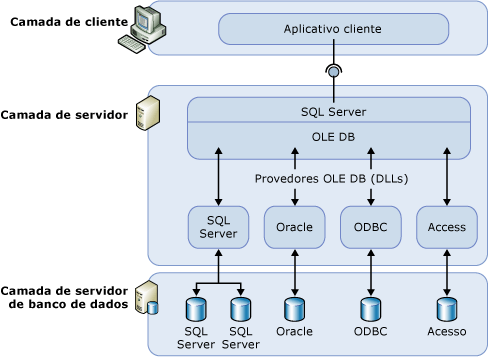

# Servidores vinculados (Mecanismo de Banco de Dados)
  Configure um servidor vinculado para permitir que o [!INCLUDE[ssDEnoversion](../../includes/ssdenoversion-md.md)] execute comandos em fontes de dados do OLE DB fora da instância do [!INCLUDE[ssNoVersion](../../includes/ssnoversion-md.md)]. Normalmente, servidores vinculados são configurados para habilitar o [!INCLUDE[ssDE](../../includes/ssde-md.md)] a executar uma instrução [!INCLUDE[tsql](../../includes/tsql-md.md)] que inclui tabelas em outra instância do [!INCLUDE[ssNoVersion](../../includes/ssnoversion-md.md)]ou outro produto de banco de dados como Oracle. Muitos tipos de fontes de dados do OLE DB podem ser configurados, como servidores vinculados, inclusive o Access e o Excel do [!INCLUDE[msCoName](../../includes/msconame-md.md)] . Servidores vinculados têm as seguintes vantagens:  
  
-   A capacidade de acessar dados de fora do [!INCLUDE[ssNoVersion](../../includes/ssnoversion-md.md)].  
  
-   A capacidade de emitir consultas distribuídas, atualizações, comandos e transações em fontes de dados heterogêneos em toda a empresa.  
  
-   A capacidade de endereçar de forma semelhante diversas fontes de dados.  
  
 É possível configurar um servidor vinculado usando [!INCLUDE[ssManStudioFull](../../includes/ssmanstudiofull-md.md)] ou a instrução [sp_addlinkedserver &#40;Transact-SQL&#41;](../../relational-databases/system-stored-procedures/sp-addlinkedserver-transact-sql.md). Provedores do OLE DB variam muito no tipo e número de parâmetros requeridos. Por exemplo, alguns provedores exigem que você forneça um contexto de segurança para a conexão usando [sp_addlinkedsrvlogin &#40;Transact-SQL&#41;](../../relational-databases/system-stored-procedures/sp-addlinkedsrvlogin-transact-sql.md). Alguns provedores OLE DB permitem que o [!INCLUDE[ssNoVersion](../../includes/ssnoversion-md.md)] atualize dados na origem de OLE DB. Outros fornecem apenas o acesso a dados somente leitura. Para obter informações sobre cada provedor do OLE DB, consulte a documentação desse provedor do OLE DB.  
  
## Componentes de servidores vinculados  
 Uma definição de servidor vinculado especifica os seguintes objetos:  
  
-   Um provedor de OLE DB  
  
-   Uma fonte de dados de OLE DB  
  
 Um *provedor de OLE DB* é uma DLL que gerencia e interage com uma fonte de dados específica. Uma *fonte de dados de OLE DB* identifica o banco de dados específico que pode ser acessado por meio de OLE DB. Embora fontes de dados consultadas através de definições de servidores vinculados sejam, ordinariamente, bancos de dados, existem provedores de OLE DB para uma variedade de arquivos e formatos de arquivo. Eles compreendem arquivos de texto, dados de planilha e resultados de pesquisas de conteúdo de texto completo.  
  
 O provedor de OLE DB [!INCLUDE[msCoName](../../includes/msconame-md.md)] [!INCLUDE[ssNoVersion](../../includes/ssnoversion-md.md)] Native Client (PROGID: SQLNCLI11) é o provedor de OLE DB oficial do [!INCLUDE[ssNoVersion](../../includes/ssnoversion-md.md)].  
  
> [!NOTE]  
>  [!INCLUDE[ssNoVersion](../../includes/ssnoversion-md.md)] foram criadas de modo a funcionar com qualquer provedor de OLE DB que implemente as interfaces de OLE DB exigidas. Porém, o [!INCLUDE[ssNoVersion](../../includes/ssnoversion-md.md)] foi testado apenas no provedor OLE DB do [!INCLUDE[ssNoVersion](../../includes/ssnoversion-md.md)] Native Client e em alguns outros provedores.  
  
## Detalhes sobre servidores vinculados  
 A ilustração a seguir mostra os fundamentos básicos de uma configuração de servidores vinculados.  
  
   
  
 Normalmente, servidores vinculados são usados para manipular consultas distribuídas. Quando um aplicativo cliente executa uma consulta distribuída através de um servidor vinculado, o [!INCLUDE[ssNoVersion](../../includes/ssnoversion-md.md)] analisa o comando e envia solicitações ao OLE DB. Essa solicitação de conjunto de linhas pode ser a execução de uma consulta em relação ao provedor ou a abertura de uma tabela base do provedor.  
  
 Para que uma fonte de dados retorne dados através de um servidor vinculado, seu provedor de OLE DB (DLL) deve estar presente no mesmo servidor da instância do [!INCLUDE[ssNoVersion](../../includes/ssnoversion-md.md)].  
  
 Quando é usado um provedor de OLE DB de terceiros, a conta sob a qual o serviço do [!INCLUDE[ssNoVersion](../../includes/ssnoversion-md.md)] é executado deve ter permissões de leitura e execução no diretório e em todos os subdiretórios no qual o provedor está instalado.  
  
## Gerenciando provedores  
 Há uma série de opções que controlam como o [!INCLUDE[ssNoVersion](../../includes/ssnoversion-md.md)] carrega e usa os provedores de OLE DB especificados no registro.  
  
## Gerenciando definições de servidores vinculados  
 Ao configurar um servidor vinculado, registre as informações de conexão e de fonte de dados com o [!INCLUDE[ssNoVersion](../../includes/ssnoversion-md.md)]. Depois de registrada, a fonte de dados pode ser chamada por um único nome lógico.  
  
 É possível usar procedimentos armazenados e exibições do catálogo para gerenciar definições de servidores vinculados:  
  
-   Crie uma definição de servidor vinculado, executando **sp_addlinkedserver**.  
  
-   Exiba informações sobre os servidores vinculados definidos em uma instância específica do [!INCLUDE[ssNoVersion](../../includes/ssnoversion-md.md)] , executando uma consulta em relação às exibições do catálogo do sistema **sys.servers** .  
  
-   Exclua uma definição de servidor vinculado, executando **sp_dropserver**. Você também pode usar esse procedimento armazenado para remover um servidor remoto.  
  
 Também é possível definir servidores vinculados por meio do [!INCLUDE[ssManStudioFull](../../includes/ssmanstudiofull-md.md)]. No Pesquisador de Objetos, clique com o botão direito do mouse em **Objetos de Servidor**, selecione **Novo** e **Servidor Vinculado**. Você pode excluir uma definição de servidor vinculado clicando com o botão direito do mouse no nome do servidor vinculado e selecionando **Excluir**.  
  
 Ao executar uma consulta distribuída em relação a um servidor vinculado, inclua um nome de tabela de quatro partes totalmente qualificado para cada fonte de dados a consultar. Esse nome de quatro partes deve estar no formato *linked_server_name.catalog***.***schema***.***object_name*.  
  
> [!NOTE]  
>  Servidores vinculados podem ser definidos para apontar novamente (loopback) para o servidor no qual eles são definidos. Servidores de loopback são mais úteis ao testar um aplicativo que usa consultas distribuídas em uma única rede de servidores. Os servidores de loopback vinculados devem ser usados em testes e não têm suporte para várias operações, como transações distribuídas.  
  
## Tarefas relacionadas  
 [Criar servidores vinculados &#40;Mecanismo de Banco de Dados do SQL Server&#41;](../../relational-databases/linked-servers/create-linked-servers-sql-server-database-engine.md)  
  
 [sp_addlinkedserver &#40;Transact-SQL&#41;](../../relational-databases/system-stored-procedures/sp-addlinkedserver-transact-sql.md)  
  
 [sp_addlinkedsrvlogin &#40;Transact-SQL&#41;](../../relational-databases/system-stored-procedures/sp-addlinkedsrvlogin-transact-sql.md)  
  
 [sp_dropserver &#40;Transact-SQL&#41;](../../relational-databases/system-stored-procedures/sp-dropserver-transact-sql.md)  
  
## Conteúdo relacionado  
 [sys.servers &#40;Transact-SQL&#41;](../../relational-databases/system-catalog-views/sys-servers-transact-sql.md)  
  
 [sp_linkedservers &#40;Transact-SQL&#41;](../../relational-databases/system-stored-procedures/sp-linkedservers-transact-sql.md)  
  
  