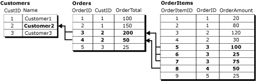
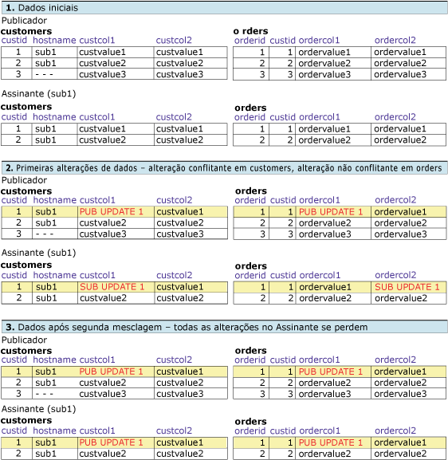
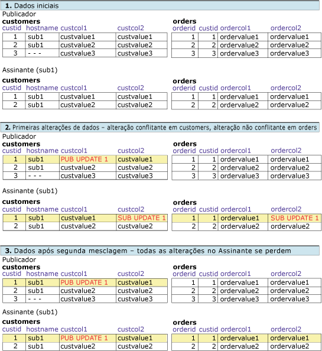
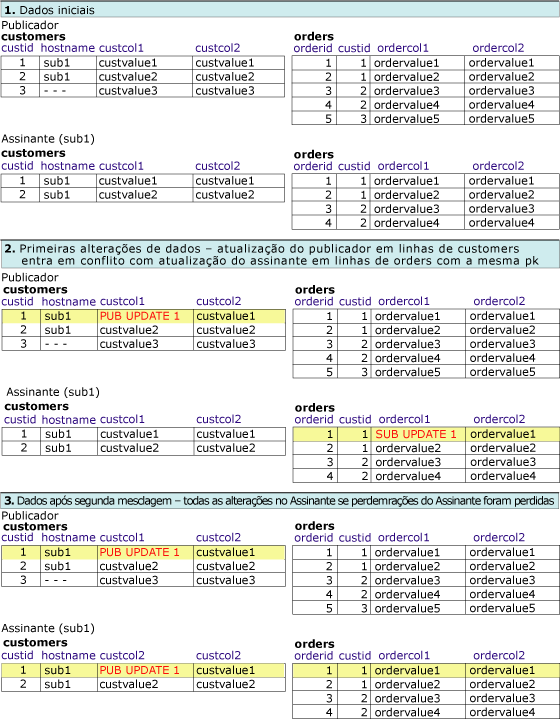

# Conflito de replicação de mesclagem avançada – resolução em registro lógico
[!INCLUDE[appliesto-ss-xxxx-xxxx-xxx-md](../../../includes/appliesto-ss-xxxx-xxxx-xxx-md.md)] Este tópico cobre as várias abordagens de combinações de detecção e resolução de conflitos possíveis ao usar registros lógicos. Um conflito na replicação de mesclagem ocorre quando mais de um nó altera os mesmos dados ou quando a replicação de mesclagem encontra determinados tipos de erros, como violação de restrição, durante a replicação de alterações. Para obter mais informações sobre detecção e resolução de conflitos, consulte [Advanced Merge Replication Conflict Detection and Resolution](../../../relational-databases/replication/merge/advanced-merge-replication-conflict-detection-and-resolution.md).  
  
 Para especificar o nível de controle e resolução de conflitos para um artigo, consulte [Specify the Conflict Tracking and Resolution Level for Merge Articles](../../../relational-databases/replication/publish/specify-the-conflict-tracking-and-resolution-level-for-merge-articles.md).  
  
## Detecção de conflito  
 A forma pela qual os conflitos são detectados para registros lógicos é determinada por duas propriedades do artigo: **column_tracking** e **logical_record_level_conflict_detection**. O[!INCLUDE[ssVersion2005](../../../includes/ssversion2005-md.md)] e versões posteriores também dão suporte à detecção do nível de registro lógico.  
  
 A propriedade de artigo **logical_record_level_conflict_detection** pode ser definida como TRUE ou FALSE. O valor deve ser definido apenas para o artigo pai de alto nível, sendo ignorado pelos artigos filho. Se esse valor for FALSE, a replicação de mesclagem detectará conflitos como nas versões anteriores do [!INCLUDE[ssNoVersion](../../../includes/ssnoversion-md.md)], com base unicamente no valor da propriedade **column_tracking** do artigo. Se esse valor for TRUE, a replicação de mesclagem ignorará a propriedade **column_tracking** do artigo, e detectará um conflito se alterações forem feitas em qualquer lugar do registro lógico. Por exemplo, considere este cenário:  
  
   
  
 Um conflito é detectado caso dois usuários alterem quaisquer valores do registro lógico Customer2 nas tabelas **Customers**, **Orders**ou **OrderItems** . Esse exemplo invoca alterações feitas por meio da instrução UPDATE, mas o conflito pode igualmente ser detectado pelas alterações feitas com as instruções INSERT ou DELETE.  
  
## Resolução de conflitos  
 Por padrão, a replicação de mesclagem usa uma lógica fundamentada na prioridade para resolver conflitos. Se for feita uma alteração conflitante em dois bancos de dados de Assinante, a alteração do Assinante com alta prioridade de assinatura vence ou, se a prioridade for a mesma, a primeira alteração para alcançar o Publicador vence. Com a detecção em nível de linha e em nível de coluna, toda a linha vencedora substitui a linha perdedora.  
  
 A propriedade de artigo **logical_record_level_conflict_resolution** pode ser definida como TRUE ou FALSE. O valor deve ser definido apenas para o artigo pai de alto nível, sendo ignorado pelos artigos filho. Se o valor for TRUE, todo o registro lógico vencedor substituirá o registro lógico perdedor. Se for FALSE, as linhas vencedoras individuais poderão vir de outros Assinantes ou Publicadores. Por exemplo, o Assinante A pode vencer um conflito em uma linha da tabela **Orders** , e o Assinante B pode vencer em uma linha associada da tabela **OrderItems** . O resultado é um registro lógico com as linhas **Orders** do Assinante A e a linha **OrderItems** do Assinante B.  
  
## Interação das configurações de resolução e detecção de conflitos  
 O resultado dos conflitos depende da interação das configurações de detecção e resolução de conflitos. Com relação aos exemplos abaixo, supõe-se que a resolução de conflitos com base na prioridade está em uso. Quando se usam registros lógicos, as possibilidades são:  
  
-   Detecção em nível de linha ou coluna, resolução em nível de linha  
  
-   Detecção em nível de coluna, resolução de registro lógico  
  
-   Detecção em nível de linha, resolução de registro lógico  
  
-   Detecção de registro lógico, resolução de registro lógico  
  
### Detecção em nível de linha ou coluna, resolução em nível de linha  
 Nesse exemplo, a publicação é configurada com:  
  
-   **column_tracking** é TRUE ou FALSE  
  
-   **logical_record_level_conflict_detection** é FALSE  
  
-   **logical_record_level_conflict_resolution** é FALSE  
  
 Nesse caso, a detecção permanece em nível de linha ou coluna e a resolução em nível de linha. Essas configurações são usadas para usufruir o fato de todas as alterações de um registro lógico serem replicadas como uma unidade; contudo, sem detecção ou resolução de conflitos em nível de registro lógico.  
  
### Detecção em nível de coluna, resolução de registro lógico  
 Nesse exemplo, a publicação é configurada com:  
  
-   **column_tracking** é TRUE  
  
-   **logical_record_level_conflict_detection** é FALSE  
  
-   **logical_record_level_conflict_resolution** é TRUE  
  
 Um Publicador ou Assinante começa com o mesmo conjunto de dados, e um registro lógico é definido entre as tabelas **orders** e **customers** . O Publicador altera a coluna **custcol1** na tabela **customers** , e **ordercol1** na tabela **orders** . O Publicador altera **custcol1** na mesma linha da tabela **customers** , e a coluna **ordercol2** , na mesma coluna da tabela **orders** . As alterações na mesma coluna da tabela **customer** resultam em conflito; contudo, as alterações na tabela **orders** não são conflitantes.  
  
 Como os conflitos são resolvidos em nível de registro lógico, as alterações vencedoras feitas no Publicador substituem as alterações feitas nas tabelas do Assinante durante o processo de replicação.  
  
   
  
### Detecção em nível de linha, resolução de registro lógico  
 Nesse exemplo, a publicação é configurada com:  
  
-   **column_tracking** é FALSE  
  
-   **logical_record_level_conflict_detection** é FALSE  
  
-   **logical_record_level_conflict_resolution** é TRUE  
  
 O Publicador e o Assinante são iniciados com o mesmo conjunto de dados. O Publicador altera a coluna **custcol1** na tabela **customers** . O Assinante altera **custcol2** na tabela **customers** , e na coluna **ordercol2** da tabela **orders** . As alterações da mesma linha da tabela **customers** resultam em conflito; contudo, as alterações do Assinante na tabela **orders** não estão em conflito.  
  
 Como os conflitos são resolvidos em nível de registro lógico, as alterações vencedoras feitas no Publicador substituem as alterações feitas nas tabelas do Assinante durante o processamento da replicação.  
  
   
  
### Detecção de registro lógico, resolução de registro lógico  
 Nesse exemplo, a publicação é configurada com:  
  
-   **logical_record_level_conflict_detection** é TRUE  
  
-   **logical_record_level_conflict_resolution** é TRUE  
  
 O Publicador e o Assinante são iniciados com o mesmo conjunto de dados. O Publicador altera a coluna **custcol1** na tabela **customers** . O Assinante altera a coluna **ordercol1** na tabela **orders** . Não há alterações na mesma linha ou colunas, mas, como as alterações são feitas no mesmo registro lógico de **custid**=1, as alterações são detectadas como conflito no nível do registro lógico.  
  
 Como os conflitos são também resolvidos no nível do registro lógico, durante a sincronização a alteração vencedora feita no Publicador substitui a alteração feita nas tabelas do Assinante.  
  
   
  
## Consulte também  
 [Agrupar alterações em linhas relacionadas com registros lógicos](../../../relational-databases/replication/merge/group-changes-to-related-rows-with-logical-records.md)  
  
  
