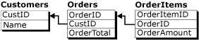
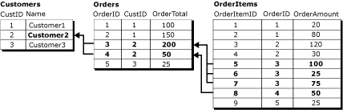
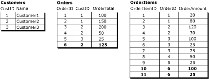
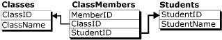

# Agrupar altera&#231;&#245;es a linhas relacionadas com registros l&#243;gicos
    
> [!NOTE]  
>  [!INCLUDE[ssNoteDepFutureAvoid](../../../includes/ssnotedepfutureavoid-md.md)]  
  
 Por padrão, os dados de processos de replicação de mesclagem são alterados em uma base de linha por linha. Em muitas circunstâncias isto é apropriado, mas para alguns aplicativos, é essencial que as linhas relacionadas sejam processadas como uma unidade. O recurso de registro lógico de replicação de mesclagem permite que você defina uma relação entre linhas relacionadas em diferentes tabelas para que as linhas sejam processadas como uma unidade.  
  
> [!NOTE]  
>  O recurso de registros lógicos pode ser usado só ou junto com filtros de junção. Para obter mais informações sobre filtros de junção, consulte [filtros de junção](../../../relational-databases/replication/merge/join-filters.md). Para usar registros lógicos, o nível de compatibilidade da publicação deve ser pelo menos 90RTM.  
  
 Considere estas três tabelas relacionadas:  
  
   
  
 O **clientes** tabela é a tabela pai nesta relação e tem uma coluna de chave primária **CustID**. O **pedidos** tabela possui uma coluna de chave primária **OrderID**, com uma restrição de chave estrangeira no **CustID** coluna que faz referência a **CustID** coluna o **clientes** tabela. Da mesma forma, o **OrderItems** tabela possui uma coluna de chave primária **OrderItemID**, com uma restrição de chave estrangeira no **OrderID** coluna que faz referência a **OrderID** coluna o **pedidos** tabela.  
  
 Neste exemplo, um registro lógico consiste em todas as linhas a **pedidos** relacionadas a uma única tabela **CustID** valor e todas as linhas no **OrderItems** relacionadas àquelas linhas na tabela o **pedidos** tabela. Este diagrama exibe todas as linhas nas três tabelas que estão no registro lógico para Customer2:  
  
   
  
 Para definir uma relação de registro lógico entre artigos, consulte [definem uma lógica registro de relação entre mesclar artigos de tabela](../../../relational-databases/replication/publish/define-a-logical-record-relationship-between-merge-table-articles.md).  
  
## Benefícios de registros lógicos  
 O recurso de registros lógicos tem dois benefícios primários:  
  
-   Aplicação de alterações de dados como uma unidade.  
  
-   A detecção e resolução de conflitos simultaneamente em várias linhas de várias tabelas.  
  
### A aplicação de alterações como uma unidade  
 Se o processamento de mesclagem for interrompido, como no caso de uma conexão descartada, o conjunto parcialmente completado de alterações replicadas relacionadas será revertido se forem usados registros lógicos. Por exemplo, considere o caso em que um assinante adiciona um novo pedido com **OrderID** = 6 e duas novas linhas no **OrderItems** tabela **OrderItemID** = 10 e **OrderItemID** = 11 para **OrderID** = 6.  
  
   
  
 Se o processo de replicação é interrompido após o **pedidos** linha para **OrderID** = 6 estiver concluída, mas antes o **OrderItems** 10 e 11 são concluídas, e não são usados registros lógicos, o **OrderTotal** valor para **OrderID** = 6 não será consistente com a soma da **OrderAmount** valores para o **OrderItems** linhas. Se forem usados registros lógicos, o **pedidos** linha para **OrderID** = 6 não será confirmada até que as **OrderItems** as alterações são replicadas.  
  
 Em um cenário diferente, se forem usados registros lógicos e alguém estiver consultando tabelas quando o processo de mesclagem estiver aplicando alterações, o usuário não verá alterações replicadas parcialmente até que todas elas sejam concluídas. Por exemplo, o processo de replicação tiver carregado a linha de pedidos para **OrderID** = 6, mas um usuário consultar as tabelas antes do processo de replicação foi replicada a **OrderItems** linhas, o **OrderTotal** valor não seria o mesmo que a soma da **OrderAmount** valores. Se forem usados registros lógicos, o **pedidos** linha não será visível até que o **OrderItems** linhas forem concluídas e a transação foi confirmada como uma unidade.  
  
### A aplicação de manipulação de conflito para mais do que uma tabela  
 Considere o caso e quem dois Assinantes têm os dados acima definidos:  
  
-   Um usuário no primeiro assinante altera o **OrderAmount** de **OrderItemID** 5 de 100 para 150 e o **OrderTotal** de **OrderID** 3 de 200 para 250.  
  
-   Um usuário no segundo assinante altera o **OrderAmount** de **OrderItemID** 6 de 25 para 125 e o **OrderTotal** de **OrderID** 3 de 200 a 300.  
  
 Se essas alterações são replicadas sem usar registros lógicos diferentes **OrderTotal** valores resultaria em um conflito e apenas um deles será replicado. Mas as alterações não conflitantes no **OrderItems** tabela será replicada sem conflito, deixando o último **OrderTotal** valores em um estado inconsistente em relação de **OrderItems** linhas. Se forem usados registros lógicos neste cenário, o **OrderItems** associada com a perda **pedidos** alteração de tabela será revertida back e o último **OrderTotal** valor seria um resumo preciso do **OrderItems** linhas.  
  
 Para obter mais informações sobre opções relacionadas a detecção de conflito e resolução com registros lógicos, consulte [detectando e resolvendo conflitos em registros lógicos](../../../relational-databases/replication/merge/detecting-and-resolving-conflicts-in-logical-records.md).  
  
## Considerações para usar registros lógicos  
 Lembre-se das seguintes considerações ao usar registros lógicos:  
  
### Considerações gerais  
  
-   É recomendável que você mantenha o número de tabelas em um registro lógico o mais baixo possível; cinco tabelas ou menos é o recomendável.  
  
-   Registros lógicos não podem fazer referência a colunas com quaisquer dos tipos de dados seguintes:  
  
    -   **varchar (max)** e **nvarchar (max)**  
  
    -   **varbinary(max)**  
  
    -   **texto** e **ntext**  
  
    -   **image**  
  
    -   **XML**  
  
    -   **UDT**  
  
-   Não podem ser definidas relações de chave estrangeira em tabelas publicadas com a opção CASCADE. Para obter mais informações, consulte [CREATE TABLE & #40. O Transact-SQL e 41;](../../../t-sql/statements/create-table-transact-sql.md) e [Alterar tabela & #40. O Transact-SQL e 41;](../../../t-sql/statements/alter-table-transact-sql.md).  
  
-   Você não pode atualizar qualquer coluna que é usada na cláusula de relação lógica.  
  
-   A resolução de conflitos personalizada com manipuladores de lógica de negócios ou resolvedores personalizados não tem suporte para artigos que não são incluídos em um registro lógico.  
  
-   Se registros lógicos forem usados em uma publicação que inclui filtros com parâmetros, você deverá inicializar cada Assinante com um instantâneo de sua partição. Se você inicializar um Assinante com outro método, o Merge Agent falhará. Para obter mais informações, consulte [Snapshots for Merge Publications with Parameterized Filters](../../../relational-databases/replication/snapshots-for-merge-publications-with-parameterized-filters.md).  
  
-   Não são exibidos conflitos que envolvem registros lógicos no Visualizador de Conflitos. Para exibir informações sobre esses conflitos, use procedimentos armazenados de replicação. Para obter mais informações, consulte [Exibir informações de conflito para publicações de mesclagem e 40; Programação Transact-SQL de replicação e 41;](../../../relational-databases/replication/view conflict information for merge publications.md).  
  
### Configurações de Publicação  
  
-   A publicação deve ter um nível de compatibilidade de 90RTM ou maior. Para obter mais informações, consulte a seção "Nível de compatibilidade da publicação" [compatibilidade com versões anteriores de replicação](../../../relational-databases/replication/replication-backward-compatibility.md).  
  
-   A publicação deve usar modo de instantâneo nativo. Este é o padrão a menos que você esteja replicando para [!INCLUDE[ssEW](../../../includes/ssew-md.md)], que não oferece suporte a registros lógicos.  
  
-   A publicação não pode permitir sincronização da Web. Para obter mais informações sobre a sincronização da Web, consulte [Web Synchronization for Merge Replication](../../../relational-databases/replication/web-synchronization-for-merge-replication.md).  
  
-   Para usar registros lógicos em uma publicação filtrada:  
  
    -   Também devem ser usadas partições pré-computadas. Os requisitos de partições pré-computadas também se aplicam a registros lógicos. Para obter mais informações, consulte [otimizar desempenho de filtro parametrizado com partições pré-calculadas](../../../relational-databases/replication/merge/optimize-parameterized-filter-performance-with-precomputed-partitions.md).  
  
    -   Você não pode usar filtros com parâmetros que não se sobrepõem. Para obter mais informações, consulte a seção "Configurando opções de partição" em [Parameterized Row Filters](../../../relational-databases/replication/merge/parameterized-row-filters.md).  
  
-   Se a publicação usar filtros de junção, o **chave exclusiva** propriedade deve ser definida como **true** para todos os filtros de junção que estão envolvidos em relações de registro lógico. Para obter mais informações, consulte [Join Filters](../../../relational-databases/replication/merge/join-filters.md).  
  
### Relações entre tabelas  
  
-   Tabelas relacionadas por registros lógicos devem ter uma relação chave primária-chave estrangeira.  
  
-   A opção NOT FOR REPLICATION não pode ser definida para restrições de chave estrangeira.  
  
-   Tabelas filho podem ter só uma tabela pai.  
  
     Por exemplo, um banco de dados que rastreia classes e estudantes poderá ter um design semelhante a:  
  
       
  
     Você não pode usar um registro lógico para representar as três tabelas nessa relação, porque as linhas em **ClassMembers** não estão associados uma única linha de chave primária. As tabelas **Classes** e **ClassMembers** poderiam ainda formar um registro lógico, como poderiam as tabelas **ClassMembers** e **os alunos**, mas nem todos os três.  
  
-   A publicação não pode conter relações de filtro de junção circulares.  
  
     Usando o exemplo com as tabelas **clientes**, **pedidos**, e **OrderItems**, você não poderia usar registros lógicos se o **pedidos** tabela também tinha uma restrição de chave estrangeira que referenciados a **OrderItems** tabela.  
  
## Implicações de desempenho de registros lógicos  
 O recurso de registro lógico vem com um custo de desempenho. Se não forem usados registros lógicos, o agente de replicação poderá processar todas as alterações para um determinado artigo ao mesmo tempo, e como as alterações são aplicadas no modo linha por linha, os requisitos de bloqueio e log de transação, necessários para aplicar as alterações, serão mínimos.  
  
 Se registros lógicos forem usados, o Merge Agent deverá processar as alterações para cada registro lógico inteiro, de forma conjunta. Isto tem um efeito no tempo necessário para o Merge Agent replicar as linhas. Adicionalmente, como o agente abre uma transação separada para cada registro lógico, os requisitos de bloqueio podem aumentar.  
  
## Consulte também  
 [Opções de artigo para replicação de mesclagem](../../../relational-databases/replication/merge/article-options-for-merge-replication.md)  
  
  