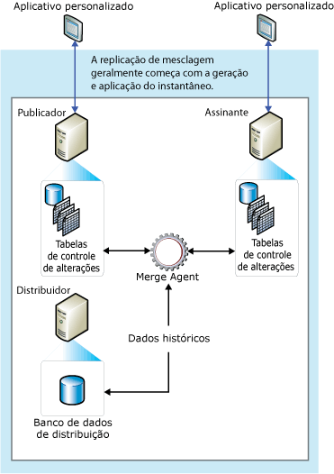

# Replica&#231;&#227;o de mesclagem
  A replicação de mesclagem, como a replicação transacional, normalmente inicia com um instantâneo dos objetos e dos dados do banco de dados de publicação. As alterações dos dados subsequentes e as modificações de esquema feitas no Publicador e nos Assinantes são rastreadas com gatilhos. O Assinante sincroniza com o Publicador quando está conectado à rede e permuta todas as linhas que foram alteradas entre o Publicador e o Assinante desde a última vez que a sincronização ocorreu.  
  
 Normalmente, a replicação de mesclagem é usada normalmente em ambientes do tipo servidor para clientes. A replicação de mesclagem é apropriada em quaisquer das seguintes situações:  
  
-   Diversos Assinantes podem atualizar os mesmos dados diversas vezes e propagar essas alterações para o Publicador e outros Assinantes.  
  
-   Os Assinantes precisam receber dados, fazer alterações offline e sincronizar posteriormente as alterações com o Publicador e outros Assinantes.  
  
-   Cada Assinante requer uma partição diferente de dados.  
  
-   Conflitos podem ocorrer e, quando isto acontecer, você precisará do recurso para detectá-los e encontrar a solução.  
  
-   O aplicativo requer a alteração nos dados da rede no lugar do acesso aos estados de dados intermediários. Por exemplo, se uma linha for alterada cinco vezes em um Assinante antes de ele sincronizar com um Publicador, a linha será alterada somente uma vez no Publicador pra refletir a alteração dos dados na rede (ou seja, o quinto valor).  
  
 A replicação de mesclagem permite que diversos sites operem de forma autônoma e que as atualizações posteriores de mesclagem obtenham um único resultado uniforme. Como as atualizações são feitas em mais de um nó, os mesmos dados podem ter sido atualizados pelo Publicador e por mais de um Assinante. Portanto, os conflitos podem ocorrer quando as atualizações forem mescladas e a replicação de mesclagem fornecer várias maneiras para controlar os conflitos.  
  
 A replicação de mesclagem é implementada pelo [!INCLUDE[ssNoVersion](../../../includes/ssnoversion-md.md)] Agente de Instantâneo e Agente de Mesclagem. Se a publicação não for filtrada ou usar filtros estáticos, o Agente de Instantâneo criará um único instantâneo. Se a publicação usar filtros com parâmetros, o Agente de Instantâneo criará um instantâneo para cada partição de dados. O Agente de Mesclagem aplica os instantâneos iniciais aos Assinantes. Ele também mescla as alterações incrementais de dados que ocorreram no Publicador ou nos Assinantes após a criação do instantâneo inicial, e detecta e soluciona qualquer conflito de acordo com as regras que você configura.  
  
 Para rastrear as alterações, a replicação de mesclagem (e a replicação transacional, com assinaturas de atualização em fila) deve poder identificar exclusivamente cada linha em cada tabela publicada. Para realizar essa mesclagem replicação adiciona a coluna **rowguid** a cada tabela, a menos que a tabela já tiver uma coluna de tipo de dados **uniqueidentifier** com o **ROWGUIDCOL** propriedade definida (neste caso esta coluna é usada). Se a tabela for descartada da publicação, a coluna **rowguid** será removida; mas, se uma coluna existente foi usada para o rastreamento, ela não será removida. Um filtro não deve incluir o **rowguidcol** usado por replicação para identificar linhas. O **NEWID ()** função é fornecida como um padrão para o **rowguid** coluna, porém os clientes podem fornecer um guid para cada linha se necessário. No entanto, não forneça valor 00000000-0000-0000-0000-000000000000.  
  
 O diagrama a seguir mostra os componentes usados em replicação de mesclagem.  
  
   
  
  