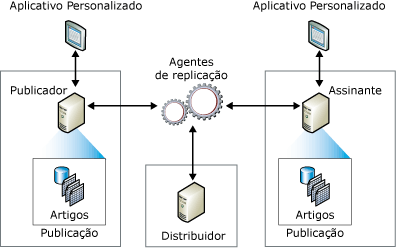

# Vis&#227;o geral do modelo de publica&#231;&#227;o de replica&#231;&#227;o
  A replicação utiliza uma metáfora da indústria de publicação para representar os componentes de uma topologia de replicação, que inclui o Publicador, Distribuidor, Assinantes, publicações, artigos e assinaturas. É útil para pensar em replicação [!INCLUDE[msCoName](../../../includes/msconame-md.md)] [!INCLUDE[ssNoVersion](../../../includes/ssnoversion-md.md)] como uma revista:  
  
-   Um publicador de revista produz uma ou mais publicações  
  
-   Uma publicação contém artigos  
  
-   O publicador distribui a revista diretamente ou usa um distribuidor  
  
-   Os Assinantes recebem as publicações que assinaram  
  
 Apesar da metáfora de revista ser útil para compreender a replicação, é importante observar que a replicação do [!INCLUDE[ssNoVersion](../../../includes/ssnoversion-md.md)] inclui a funcionalidade que não é representada nesta metáfora, particularmente o recurso de um Assinante efetuar atualizações e de um Publicador enviar alterações incrementais para os artigos de uma publicação.  
  
 Uma *topologia de replicação* define a relação entre os servidores e cópias de dados e esclarece a lógica que determina como os dados fluem entre os servidores. Existem diversos processos de replicação (mencionados como *agentes*) responsáveis pela cópia e movimentação de dados entre o Editor e os Assinantes. A ilustração a seguir é uma visão geral dos componentes e processos envolvidos em replicação.  
  
   
  
## Publicador  
 O Editor é uma instância de banco de dados que disponibiliza dados para outros locais por meio de replicação. O Publicador pode ter uma ou mais publicações, cada uma definindo um conjunto de objetos relacionado de forma lógica e os dados para replicar.  
  
## Distribuidor  
 O Distribuidor é uma instância de banco de dados que atua como um repositório para replicação de dados específicos associados a um ou mais Publicadores. Cada Publicador é associado a um único banco de dados (conhecido como um banco de dados de distribuição) ao Distribuidor. O banco de dados de distribuição armazena os dados de status de replicação, metadados sobre a publicação e, em alguns casos, atua como uma fila para mover dados do Publicador para os Assinantes. Em muitos casos, uma única instância de servidor de banco de dados atua como Publicador e Distribuidor. Isto é conhecido como um *Distribuidor local*. Quando o Editor e o Publicador estão configurados em instâncias separadas de servidor de banco de dados, o Distribuidor é conhecido como *Distribuidor remoto*.  
  
## Assinantes  
 Um Assinante é uma instância de banco de dados que recebe dados replicados. Um Assinante pode receber dados de diversos Publicadores e publicações. Dependendo do tipo de replicação escolhida, o Assinante também pode passar as alterações de dados de volta ao Publicador ou republicar os dados para outros Assinantes.  
  
## Artigo  
 Um artigo identifica um objeto de banco de dados que é incluído em uma publicação. Uma publicação pode conter tipos diferentes de artigos, incluindo tabelas, exibições, procedimentos armazenados e outros objetos. Quando as tabelas são publicadas como artigos, os filtros podem ser usados para restringir as colunas e linhas dos dados enviados aos Assinantes.  
  
## Publicação  
 Uma publicação é uma coleção de um ou mais artigos de um banco de dados. O agrupamento de diversos artigos em uma publicação facilita especificar um conjunto de objetos de banco de dados logicamente relacionado e os dados que são replicados como uma unidade.  
  
## Assinatura  
 Uma assinatura é uma solicitação para uma cópia de uma publicação a ser distribuída a um Assinante. A assinatura define qual publicação será recebida, onde e quando. Existem dois tipos de assinatura: push e pull. Para obter mais informações sobre assinaturas push e pull, consulte [Assinar Publicações](../../../relational-databases/replication/subscribe-to-publications.md).  
  
## Consulte também  
 [Visão geral dos agentes de replicação.](../../../relational-databases/replication/agents/replication-agents-overview.md)   
 [Tipos de replicação](../../../relational-databases/replication/types-of-replication.md)   
 [Configurar a replicação para Grupos de Disponibilidade AlwaysOn (SQL Server)](../../../database-engine/availability-groups/windows/configure-replication-for-always-on-availability-groups-sql-server.md)   
 [Mantendo um banco de dados de publicação AlwaysOn (SQL Server)](../../../database-engine/availability-groups/windows/maintaining-an-always-on-publication-database-sql-server.md)  
  
  