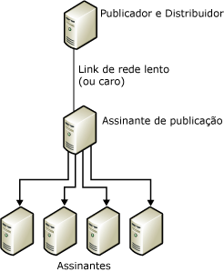
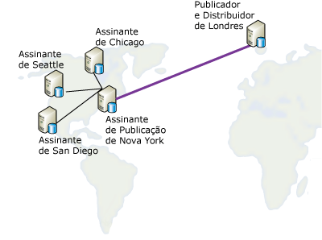

# Republicar dados
[!INCLUDE[appliesto-ss-xxxx-xxxx-xxx-md](../../includes/appliesto-ss-xxxx-xxxx-xxx-md.md)]
  Em um modelo de republicação, o Publicador envia dados a um Assinante, que então republica os dados para qualquer número de outros Assinantes. Isso é útil quando um Publicador precisa enviar dados a Assinantes por um link de comunicação lento ou caro. Se houver um número de Assinantes na extremidade daquele link, o uso de um republicador alterna a massa da carga de distribuição àquele lado do link.  
  
 Republicar dados envolve as etapas seguintes:  
  
1.  Crie uma publicação no Publicador.  
  
2.  Crie uma assinatura à publicação para o Assinante de republicação.  
  
3.  Inicialize a assinatura. A assinatura deve ser inicializada antes de a publicação ser criada no Assinante de republicação ou a replicação falhará.  
  
4.  Crie uma publicação no banco de dados de assinatura do Assinante de republicação.  
  
5.  Crie assinaturas à publicação no Assinante de republicação para os outros Assinantes.  
  
6.  Inicialize as assinaturas.  
  
> [!NOTE]  
>  Se você usar replicação de mesclagem em uma topologia de republicação, todos os Assinantes de republicação deverão usar assinatura de servidor. Para obter mais informações sobre tipos de assinaturas, veja [Assinar Publicações](../../relational-databases/replication/subscribe-to-publications.md).  
  
 Na ilustração a seguir, o Publicador e o republicador estão agindo como os seus próprios Distribuidores locais. Se cada um fosse definido para usar um Distribuidor remoto, cada Distribuidor precisaria estar do mesmo lado do link de comunicações lento ou caro do seu Publicador. Os Publicadores devem ser conectados a Distribuidores remotos por links de comunicação confiáveis, de alta velocidade.  
  
   
  
 Qualquer servidor pode agir como um Publicador e Assinante. Por exemplo, considere o diagrama a seguir em que uma publicação de uma tabela existe em Londres e deverá ser distribuída a quatro cidades diferentes nos Estados Unidos: Chicago, Nova York, San Diego e Seattle. O servidor em Nova Iorque é escolhido para assinar a tabela publicada originada em Londres, porque o site de Nova Iorque atende às seguintes condições:  
  
-   O link de retorno da rede para Londres é relativamente confiável.  
  
-   Os custos de comunicação de Londres para Nova Iorque são aceitáveis.  
  
-   Existem boas linhas de comunicações de rede de Nova Iorque para todos os outros sites de Assinante nos Estados Unidos.  
  
       
  
 A replicação fornece suporte aos cenários de republicação mostrados na tabela a seguir.  
  
|Publicador|Assinante de publicação|Assinante|  
|---------------|---------------------------|----------------|  
|Publicação transacional|Assinatura transacional/publicação transacional|Assinatura transacional|  
|Publicação transacional|Assinatura transacional/publicação de mesclagem*|Assinatura de mesclagem|  
|Publicação de mesclagem|Assinatura de mesclagem/publicação de mesclagem|Assinatura de mesclagem|  
|Publicação de mesclagem|Assinatura de mesclagem/publicação transacional|Assinatura transacional|  
  
 \*Você deverá definir a propriedade **@published_in_tran_pub** na publicação de mesclagem. Por padrão, a replicação transacional espera que as tabelas no Assinante sejam tratadas como somente leitura. Se a replicação de mesclagem fizer alterações de dados de uma tabela em uma assinatura transacional, poderá ocorrer não convergência de dados. Para evitar esse risco, recomendamos que qualquer tabela desse tipo seja especificada como somente para download na publicação de mesclagem. Isso impede que um Assinante de mesclagem carregue alterações de dados na tabela. Para obter mais informações, consulte [Otimizar o desempenho da replicação de mesclagem com artigos somente para download](../../relational-databases/replication/merge/optimize-merge-replication-performance-with-download-only-articles.md).  
  
## Consulte Também  
 [Configurar Distribuição](../../relational-databases/replication/configure-distribution.md)   
 [Publicar dados e objetos de banco de dados](../../relational-databases/replication/publish/publish-data-and-database-objects.md)   
 [Subscribe to Publications](../../relational-databases/replication/subscribe-to-publications.md)   
 [Inicializar uma assinatura](../../relational-databases/replication/initialize-a-subscription.md)   
 [Sincronizar dados](../../relational-databases/replication/synchronize-data.md)  
  
  
