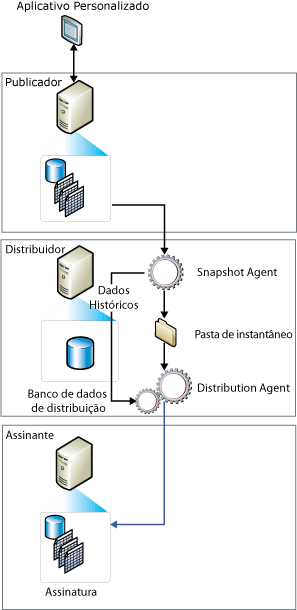

# Replicação de instantâneo
[!INCLUDE[appliesto-ss-asdb-xxxx-xxx-md](../../includes/appliesto-ss-asdb-xxxx-xxx-md.md)] A replicação de instantâneo distribui os dados exatamente como eles aparecem em um momento específico e não monitora as atualizações feitas aos dados. Quando a sincronização ocorre, todo o instantâneo é gerado e enviado aos Assinantes.  
  
> [!NOTE]  
>  A replicação de instantâneo pode ser usada por si só, mas o processo de instantâneo (o que cria uma cópia de todos os objetos e dados especificados por uma publicação) também é usado regularmente para fornecer o conjunto inicial dos dados e dos objetos do banco de dados para publicações de mesclagem e transacionais.  
  
 O uso da replicação de instantâneo por si só é mais apropriado quando um ou mais dos itens a seguir for real:  
  
-   As alterações de dados ocorrerem raramente.  
  
-   É aceitável ter cópias de dados desatualizadas em relação ao Publicador por um período de tempo.  
  
-   Replicação de pequenos volumes de dados.  
  
-   Um volume grande de alterações ocorre por um curto período de tempo.  
  
 A replicação de instantâneo é mais apropriada quando as alterações de dados forem significativas, mas pouco frequentes. Por exemplo, se uma empresa de vendas mantiver uma lista de preços de produtos e os preços forem todos atualizados ao mesmo tempo uma ou duas vezes por ano, é recomendada a replicação de todo o instantâneo de dados após ele ter sido alterado. Ao ter certos tipos de dados determinados, os instantâneos mais frequentes também podem ser apropriados. Por exemplo, se uma tabela relativamente pequena for atualizada no Publicador durante o dia, mas alguma latência for aceitável, as alterações podem ser distribuídas pela noite como um instantâneo.  
  
 A replicação de instantâneo tem uma sobrecarga contínua no Publicador inferior à replicação transacional, porque as alterações incrementais não são rastreadas. No entanto, se o ajuste do conjunto de dados que estiver sendo replicado for muito grande, ele exigirá recursos substanciais para gerar e aplicar o instantâneo. Considere a dimensão de todo o conjunto de dados e a frequência de alterações nos dados ao avaliar a possibilidade de utilizar a replicação de instantâneo.  
  
 **Neste tópico**  
  
 [Como a replicação de instantâneo funciona](#HowWorks)  
  
 [Snapshot Agent](#SnapshotAgent)  
  
 [Agentes de Distribuição e Mesclagem](#DistAgent)  
  
##   Como a replicação de instantâneo funciona  
 Por padrão, todos os três tipos de replicação usam um instantâneo para inicializar os Assinantes. O Snapshot Agent do [!INCLUDE[ssNoVersion](../../includes/ssnoversion-md.md)] sempre gera os arquivos de instantâneo, mas o agente que distribui os arquivos pode diferir dependendo do tipo de replicação que estiver sendo usada. A replicação transacional e a de instantâneo usam o Distribution Agent para distribuir os arquivos, ao passo que a replicação de mesclagem usa o Merge Agent do [!INCLUDE[ssNoVersion](../../includes/ssnoversion-md.md)] . O Agente de Instantâneo executa no Distribuidor. O Agente de Distribuição e o Agente de Mesclagem são executados no Distribuidor para as assinaturas push ou no Assinante para assinaturas pull.  
  
 Os instantâneos podem ser gerados e aplicados imediatamente após a assinatura ser criada ou de acordo com uma programação definida no momento que a publicação for criada. O Snapshot Agent prepara os arquivos de instantâneo que contêm o esquema e os dados das tabelas publicadas e os objetos do banco de dados, armazena os arquivos na pasta do instantâneo para o Publicador e registra o rastreamento de informações do banco de dados de distribuição no Distribuidor. Você especifica uma pasta padrão de instantâneo quando configura um Distribuidor, mas você pode especificar um local alternativo para uma publicação além do padrão.  
  
 Além do processo de instantâneo padrão descrito neste tópico, um processo de instantâneo em duas partes é usado para publicação de mesclagem com filtros com parâmetros.  
  
 A ilustração a seguir mostra os principais componentes de replicação de instantâneo.  
  
   
  
##   Snapshot Agent  
 Para replicação de mesclagem, é gerado um instantâneo toda vez que o Agente de Instantâneo é executado. Para replicação transacional, a geração de instantâneo depende da configuração da propriedade de publicação de **immediate_sync**. Se a propriedade estiver definida como TRUE (padrão ao usar o Assistente para Nova Publicação), um instantâneo é gerado toda vez que o Agente de Instantâneo for executado e pode ser aplicado ao Assinante a qualquer momento. Se a propriedade estiver definida como FALSE (padrão ao usar **sp_addpublication**), o instantâneo só é gerado se uma assinatura nova for adicionada desde a última execução do Agente de Instantâneo; Assinantes devem esperar que o Agente de Instantâneo termine antes de poder sincronizar-se.  
  
 O Snapshot Agent executa as seguintes etapas:  
  
1.  Estabelece uma conexão do Distribuidor para o Publicador e, em seguida, leva os bloqueios em tabelas publicadas, se necessário:  
  
    -   Para as publicações de mesclagem, o Snapshot Agent não requer nenhum bloqueio.  
  
    -   Para publicações transacionais, por padrão o Snapshot Agent leva bloqueios somente durante a fase inicial de geração de instantâneo.  
  
    -   Para publicações de instantâneo, bloqueios são retidos durante todo o processo de geração de instantâneo.  
  
2.  Grava uma cópia do esquema de tabela para cada artigo em um arquivo .sch. Se outros objetos de banco de dados forem publicados, como índices, exibições, tipos de dados, procedimentos armazenados, exibições, funções definidas pelo usuário, e assim por diante, arquivos de script adicionais serão gerados.  
  
3.  Copia os dados da tabela publicada no Publicador e grava os dados na pasta de instantâneo. O instantâneo é gerado como um conjunto de arquivos de programa de cópia em massa (BCP).  
  
4.  Para as publicações transacionais e de instantâneo, o Snapshot Agent acrescenta linhas nas tabelas **MSrepl_commands** e **MSrepl_transactions** no banco de dados de distribuição. As entradas na tabela **MSrepl_commands** são comandos indicando o local dos arquivos .sch e .bcp, qualquer outro arquivo de instantâneo e as referências a qualquer script pré ou pós-instantâneo. As entradas na tabela **MSrepl_transactions** são comandos importantes para sincronizar o Assinante.  
  
     Para publicações de mesclagem, o Agente de Instantâneo executa etapas adicionais.  
  
5.  Libera qualquer bloqueio em tabelas publicadas.  
  
 Durante a geração de instantâneo, você não pode fazer alterações de esquema em tabelas publicadas. Depois que os arquivos de instantâneo forem gerados, você pode exibi-los na pasta de instantâneo usando o Windows Explorer.  
  
##   Agente de Distribuição e Agente de Mesclagem  
 Para publicações de instantâneo, sempre que o Agente de Distribuição for executado para a publicação, ele moverá um novo instantâneo para cada Assinante que ainda não tiver sido sincronizado, que não tenha sido marcado para reinicialização, ou incluirá novos artigos.  
  
 Para replicação de instantâneo e transacional, o Distribution Agent executará as seguintes etapas:  
  
1.  Estabelece uma conexão com o Distribuidor.  
  
2.  Examina as tabelas **do MSrepl_commands** e **MSrepl_transactions** no banco de dados de distribuição do Distribuidor. O agente lê o local dos arquivos de instantâneo da primeira tabela e os comandos de sincronização do Assinante de ambas as tabelas.  
  
3.  Aplica o esquema e os comandos ao banco de dados de assinatura.  
  
 Para uma publicação de replicação de mesclagem não filtrada, o Merge Agent executa as seguintes etapas:  
  
1.  Estabelece uma conexão com o Publicador.  
  
2.  Examina a tabela **sysmergeschemachange** no Publicador e determina se existe um novo instantâneo que deve ser aplicado no Assinante.  
  
3.  Se um novo instantâneo estiver disponível, o Agente de Mesclagem aplicará ao banco de dados de assinatura os arquivos de instantâneo do local especificado em **sysmergeschemachange**.  
  
  
