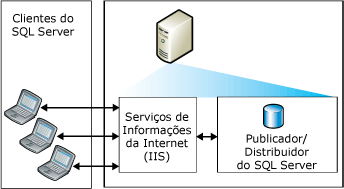
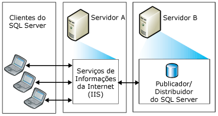
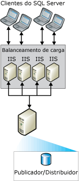
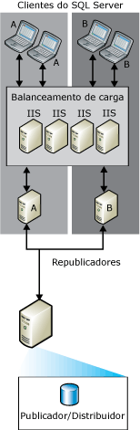

# Topologias para sincroniza&#231;&#227;o da Web
  Você pode escolher entre uma variedade de [!INCLUDE[msCoName](../../includes/msconame-md.md)] [!INCLUDE[ssNoVersion](../../includes/ssnoversion-md.md)] Web topologias de replicação de sincronização. Os modos comuns para configurar a sincronização da Web incluem:  
  
-   Servidor único  
  
-   Dois servidores  
  
-   Vários sistemas de Serviços de Informações da Internet (IIS) da [!INCLUDE[msCoName](../../includes/msconame-md.md)] e republicação do [!INCLUDE[ssNoVersion](../../includes/ssnoversion-md.md)]  
  
 Para obter informações sobre como configurar a sincronização da Web, consulte [Configurar sincronização da Web](../../relational-databases/replication/configure-web-synchronization.md).  
  
## Servidor único  
 Na topologia mais simples, o IIS, o Editor [!INCLUDE[ssNoVersion](../../includes/ssnoversion-md.md)] e o Distribuidor [!INCLUDE[ssNoVersion](../../includes/ssnoversion-md.md)] residem em um único servidor. Os assinantes sincronizam conectando-se ao IIS no Publicador. O Publicador pode ser localizado atrás de um firewall.  
  
> [!NOTE]  
>  Essa configuração só é recomendada para cenários de intranet. Para demais cenários, é recomendado que o servidor de IIS e o Publicador/Distribuidor [!INCLUDE[ssNoVersion](../../includes/ssnoversion-md.md)] estejam em computadores separados.  
  
   
  
## Dois servidores  
 Você pode colocar o IIS em um servidor e configurar o Publicador e o Distribuidor [!INCLUDE[ssNoVersion](../../includes/ssnoversion-md.md)] em outro servidor. O servidor que executa o IIS pode ser isolado da Internet por um firewall. Os assinantes sincronizam conectando-se ao IIS.  
  
   
  
## Vários sistemas ISS e republicação do SQL Server  
 Se precisar dar suporte a um grande número de Assinantes que sincronizam ao mesmo tempo, você pode particionar o trabalho em vários computadores executando o IIS.  
  
   
  
 Se um equilíbrio de carga adicional for necessário no computador executando o [!INCLUDE[ssNoVersion](../../includes/ssnoversion-md.md)], você pode criar uma hierarquia de republicação em vários computadores. O Publicador de alto nível publica dados aos Assinantes, que por sua vez publicam novamente os dados, equilibrando a carga das solicitações dos Assinantes.  
  
> [!NOTE]  
>  Assinantes só podem sincronizar com um Publicador específico. Por exemplo, um Assinante para o republicador A não pode sincronizar com o republicador B quando A não estiver disponível.  
  
   
  
## Consulte também  
 [Configure a sincronização da Web](../../relational-databases/replication/configure-web-synchronization.md)   
 [Sincronização da Web para replicação de mesclagem.](../../relational-databases/replication/web-synchronization-for-merge-replication.md)  
  
  