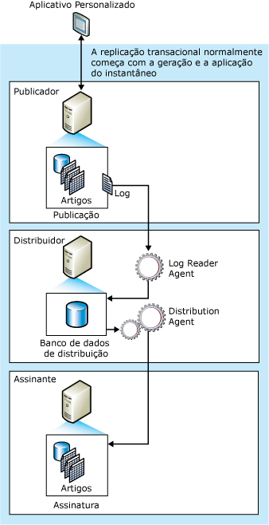

# Replicação transacional
[!INCLUDE[sql-asdb](../../../includes/applies-to-version/sql-asdb.md)]
  A replicação transacional normalmente inicia com um instantâneo dos objetos e dados do banco de dados de publicação. Assim que o instantâneo inicial é tirado, as alterações subsequentes nos dados e as modificações no esquema efetuadas no Publicador geralmente são distribuídas para o Assinante assim que ocorrem (quase em tempo real). As alterações nos dados são aplicadas ao Assinante na mesma ordem e dentro dos mesmos limites de transação conforme ocorreram no Publicador; por isso, dentro de uma publicação, a consistência transacional é assegurada.  
  
 A replicação transacional é normalmente usada em ambientes do tipo servidor para servidor e é apropriada em cada um dos seguintes casos:  
  
-   Você quer que as alterações com incremento sejam propagadas para os Assinantes à medida que ocorrem.  
  
-   O aplicativo requer baixa latência entre as mudanças de hora feitas no Publicador, assim as mudanças chegarão ao Assinante.  
  
-   O aplicativo requer acesso aos estados de dados intermediários. Por exemplo, se uma linha muda cinco vezes, a replicação transacional permite que um aplicativo responda a cada mudança (como acionar um gatilho), e não simplesmente uma mudança de dados da rede na linha.  
  
-   O Publicador tem um volume muito alto de atividade de inserção, atualização e exclusão.  
  
-   O Publicador ou Assinante é um banco de dados que não é do tipo[!INCLUDE[ssNoVersion](../../../includes/ssnoversion-md.md)] , como Oracle.  
  
 Por padrão, os Assinantes de publicações transacionais devem ser tratados como somente leitura, porque as alterações não são propagadas de volta para o Publicador. Porém, replicação transacional oferece opções que permitem atualizações ao Assinante.  

[!INCLUDE[azure-sql-db-replication-supportability-note](../../../includes/azure-sql-db-replication-supportability-note.md)]
  
##   Como a replicação transacional funciona  
 A replicação transacional é implementada pelo Agente de Instantâneo, Agente de Leitor de Log e Agente de Distribuição do [!INCLUDE[ssNoVersion](../../../includes/ssnoversion-md.md)] . O Snapshot Agent prepara os arquivos de instantâneo que contêm o esquema e os dados das tabelas publicadas e os objetos do banco de dados, armazena os arquivos na pasta do instantâneo e registra os trabalhos de sincronização do banco de dados de distribuição no Distribuidor.  
  
 O Log Reader Agent monitora o log de transações de cada banco de dados configurado para replicação transacional e copia as transações marcadas para replicação do log de transações no banco de dados de distribuição, que atua como uma fila confiável para armazenar e avançar. O Distribution Agent copia os arquivos do instantâneo inicial da pasta de instantâneo e as transações contidas nas tabelas do banco de dados de distribuição para os Assinantes.  
  
 As alterações incrementais feitas no Publicador fluem para os Assinantes de acordo com a programação do Distribution Agent, que pode ser executado continuamente para ficar com latência mínima, ou em intervalos programados. Como as alterações nos dados devem ser feitas no Publicador (quando a replicação transacional for usada sem as opções de atualização imediata ou atualizações em fila), os conflitos de atualizações serão evitados. Por fim, todos os Assinantes alcançarão os mesmos valores que o Publicador. Se as opções de atualização imediata ou atualizações em fila forem usadas com a replicação transacional, as atualizações poderão ser feitas no Assinante, e com a atualização em fila, poderão ocorrer conflitos.  
  
 A ilustração a seguir mostra os principais componentes de replicação transacional.  
  
   
  
##   Conjunto de dados inicial  
 Antes que um novo Assinante de replicação transacional possa receber alterações incrementais de um Publicador, o Assinante deverá conter as tabelas com o mesmo esquema e dados que as tabelas do Publicador. O conjunto de dados inicial normalmente é um instantâneo criado pelo Snapshot Agent e distribuído e aplicado pelo Distribution Agent. O conjunto de dados inicial também pode ser fornecido por meio de um backup ou outros meios, como [!INCLUDE[ssNoVersion](../../../includes/ssnoversion-md.md)] Integration Services.  
  
 Quando os instantâneos forem distribuídos e aplicados aos Assinantes, somente esses Assinantes à espera dos instantâneos iniciais serão afetados. Outros Assinantes dessa publicação (que já foram inicializados) não serão afetados.  
  
## Processamento simultâneo de instantâneos  
 A replicação de instantâneo coloca bloqueios compartilhados em todas as tabelas publicadas como parte de replicação pela duração da geração do instantâneo. Isto pode impedir que as atualizações sejam feitas nas tabelas de publicação. O processamento simultâneo de instantâneos, o padrão com a replicação transacional, não mantém os bloqueios compartilhados no lugar durante toda a geração do instantâneo, o que permite que os usuários continuem trabalhando ininterruptamente enquanto a replicação cria os arquivos iniciais de instantâneo.  
  
##   Snapshot Agent  
 Os procedimentos pelos quais o Agente de Instantâneo implementa o instantâneo inicial na replicação transacional são os mesmos usados na replicação de instantâneo (exceto como é descrito acima em relação ao processamento simultâneo de instantâneos).  
  
 Depois que os arquivos de instantâneo foram gerados, você pode exibi-los na pasta de instantâneo usando o Windows Explorer [!INCLUDE[msCoName](../../../includes/msconame-md.md)] .  
  
##   Modificação de Dados e o Agente de Leitor de Log  
 O Agente de Leitor de Log é executado no Distribuidor; em geral, ele é executado continuamente, mas ele também pode ser executado de acordo com uma programação que você estabeleça. Ao executar, o Log Reader Agent primeiro lê o log de transação de publicação (o mesmo log de banco de dados usado para rastreamento de transações e recuperação durante as operações regulares do Mecanismo do Banco de Dados do [!INCLUDE[ssNoVersion](../../../includes/ssnoversion-md.md)] ), e identifica qualquer instrução de INSERT, UPDATE e DELETE ou outras modificações feitas nos dados em transações que foram marcadas para replicação. Em seguida, o agente copia essas transações em lotes para o banco de dados de distribuição no Distribuidor. O Log Reader Agent usa o procedimento armazenado interno **sp_replcmds** para obter o conjunto seguinte de comandos do log marcados para replicação. O banco de dados de distribuição se torna em seguida a fila de armazenamento e avanço da qual as alterações são enviadas aos Assinantes. Somente as transações confirmadas são enviadas ao banco de dados de distribuição.  
  
 Após o lote inteiro de transações ter sido gravado com êxito no banco de dados de distribuição, ele é confirmado. Após a confirmação de cada lote de comandos no Distribuidor, o Log Reader Agent chama o **sp_repldone** para marcar onde a replicação foi concluída por último. Por fim, o agente marca as linhas no log de transação que estão prontas para serem purgadas. As linhas que ainda esperam para serem replicadas não são purgadas.  
  
 Os comandos de transação são armazenados no banco de dados de distribuição até serem propagados a todos os Assinantes ou até que o período de retenção máxima de distribuição tenha sido atingido. Os Assinantes recebem as transações na mesma ordem em que foram aplicados no Publicador.  
  
##   Agente de Distribuição  
 O Distribution Agent é executado no Distribuidor para assinaturas push e no Assinante para assinaturas pull. O agente move as transações do banco de dados de distribuição para o Assinante. Se uma assinatura estiver marcada para validação, o Agente de Distribuição também verificará se os dados do Publicador e do Assinante coincidem.  

## Tipos de publicação 
Replicação transacional oferece três tipos de publicação:  
  
|Tipo de Publicação|Descrição|  
|----------------------|-----------------|  
|Publicação Transacional padrão|Apropriada para topologias em que todos os dados do Assinante são do modo somente leitura (a replicação transacional não impõe isto no Assinante).   As publicações transacionais padrão são criadas por padrão ao usar Transact-SQL ou RMO (Replication Management Objects). Ao usar o Assistente para Nova Publicação, elas são criadas selecionando **Publicação Transacional** na página **Tipo de Publicação** .   Para obter mais informações sobre como criar publicações, veja [Publicar dados e objetos de banco de dados](../../../relational-databases/replication/publish/publish-data-and-database-objects.md).|  
|Publicação transacional com assinaturas atualizáveis|As características deste tipo de publicação são:   – Cada localização tem dados idênticos, com um Editor e um Assinante.   – É possível atualizar linhas no Assinante  -Esta topologia é melhor adequada para ambientes de servidor que requerem alta disponibilidade e escalabilidade de leitura.  Para obter mais informações, confira [Inscrições Atualizáveis](../../../relational-databases/replication/transactional/updatable-subscriptions-for-transactional-replication.md).|  
|Topologia ponto a ponto|As características deste tipo de publicação são:  – Cada localização tem dados idênticos e atua tanto como Editor quanto como Assinante.  – A mesma linha pode ser alterada apenas em uma localização de cada vez.  – Dá suporte para [detecção de conflitos](../../../relational-databases/replication/transactional/peer-to-peer-conflict-detection-in-peer-to-peer-replication.md)   – Esta topologia é melhor adequada para ambientes de servidor que requerem alta disponibilidade e escalabilidade de leitura.  Para obter mais informações, consulte [Peer-to-Peer Transactional Replication](../../../relational-databases/replication/transactional/peer-to-peer-transactional-replication.md).|  
|Replicação transacional bidirecional|As características deste tipo de publicação são: A replicação bidirecional é semelhante à replicação ponto a ponto, no entanto, não fornece resolução de conflitos. Além disso, a replicação bidirecional está limitada a dois servidores.    Para obter mais informações, confira [Replicação Transacional Bidirecional](../../../relational-databases/replication/transactional/bidirectional-transactional-replication.md) |  
  
  
