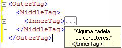

# <a name="code-outlining"></a>Estruturação do código
[!INCLUDE[appliesto-ss-asdb-asdw-pdw-md](../../includes/appliesto-ss-asdb-asdw-pdw-md.md)]
  Você pode usar o recurso de estrutura de tópicos nos editores de consultas do [!INCLUDE[ssManStudioFull](../../includes/ssmanstudiofull-md.md)] para ocultar código, de forma seletiva, ao editar consultas. Isso permite exibir com mais facilidade o código em que você está trabalhando, principalmente em arquivos de consulta grandes.  
  
## <a name="outlining-overview"></a>Visão geral da estrutura de tópicos  
 Por padrão, todo o código é visível quando você abre uma janela do editor de consultas. Regiões do código podem ser recolhidas para não serem exibidas. Na extremidade esquerda da janela do editor há uma linha vertical onde um quadrado com um sinal de menos (-) serve para identificar o início de cada região de código que pode ser recolhida. Quando você clica em um sinal de menos, o texto da região de código é substituído por uma caixa com três pontos (…) e o sinal de menos muda para um sinal de mais (+). Quando você clica em um sinal de mais, o código recolhido é exibido e o sinal de mais muda para um sinal de menos. Quando você move o ponteiro sobre uma caixa com três pontos, uma dica de ferramenta é exibida com o código da seção recolhida.  
  
## <a name="system-outline-regions"></a>Regiões de estrutura de tópicos do sistema  
 Cada editor do [!INCLUDE[ssManStudioFull](../../includes/ssmanstudiofull-md.md)] gera um conjunto de regiões de estrutura de tópicos padrão definidas pelo sistema.  
  
 Os editores de códigos MDX e DMX criam regiões de estrutura de tópicos para cada instrução multilinha. Esse é o único nível de estrutura de tópicos que tem o suporte desses editores.  
  
### <a name="analysis-services-xmla-query-editor-regions"></a>Regiões do Editor de Consultas XMLA do Analysis Services  
 O Editor de Consultas XMLA do [!INCLUDE[ssASnoversion](../../includes/ssasnoversion-md.md)] gera uma região de estrutura de tópicos para cada atributo XML multilinha. O editor aninha essas regiões para marcas aninhadas. Por exemplo, o Editor XMLA cria três regiões de estrutura de tópicos para o documento seguinte.  
  
   
  
 Quando você clica no sinal de subtração na linha \<InnerTag>, apenas a InnerTag é recolhida, conforme é mostrado na ilustração a seguir.  
  
   
  
 Quando você move o ponteiro sobre a caixa com os três pontos, o código da região recolhida é exibido em uma dica de ferramenta, como mostra a ilustração a seguir.  
  
   
  
 Quando você clica no sinal de subtração na linha \<MiddleTag>, tanto a MiddleTag e quanto a InnerTag são recolhidas, como é mostrado na ilustração a seguir.  
  
   
  
 Quando você clica no sinal de menos na linha \<OuterTag>, todas as três linhas são recolhidas, como mostra a ilustração a seguir.  
  
   
  
### <a name="database-engine-query-editor-regions"></a>Regiões do Editor de Consultas do Mecanismo de Banco de Dados  
 O Editor de Consultas do [!INCLUDE[ssDE](../../includes/ssde-md.md)] gera regiões de estrutura de tópicos para cada elemento na seguinte hierarquia:  
  
1.  Lotes. O primeiro lote é o código, do início do arquivo até o primeiro comando GO ou até o fim do arquivo, quando não há comandos GO. Após o primeiro GO, há um lote de cada comando GO até o próximo comando GO, ou até o fim do arquivo.  
  
2.  Blocos delimitados pelas seguintes palavras-chave:  
  
    -   BEGIN - END  
  
    -   BEGIN TRY - END TRY  
  
    -   BEGIN CATCH - END CATCH  
  
3.  Instruções multilinha.  
  
 Por exemplo, o Editor de Consultas do [!INCLUDE[ssDE](../../includes/ssde-md.md)] cria três regiões de estrutura de tópicos para a seguinte consulta:  
  
```  
CREATE PROCEDURE Sales.SampleProc --Outline region 1  
AS  
BEGIN --Outline region 2   
  SELECT GETDATE() AS TimeOfQuery;  
  SELECT * --Outline region 3  
  FROM sys.transmission_queue;  
  SELECT @@VERSION;  
END;  
GO  
```  
  
 Você pode clicar no sinal de menos na linha `SELECT *` para recolher somente essa instrução `SELECT` . Para recolher todo o bloco `BEGIN - END` , clique no sinal de menos na linha `BEGIN` . Para recolher todo o lote para o comando `GO` , clique no sinal de menos na linha `CREATE PROCEDURE` . Não é possível recolher as linhas `SELECT GETDATE()` ou `SELECT @@VERSION` individualmente, pois elas são instruções de linha única e não têm regiões de estrutura de tópicos.  
  
  
