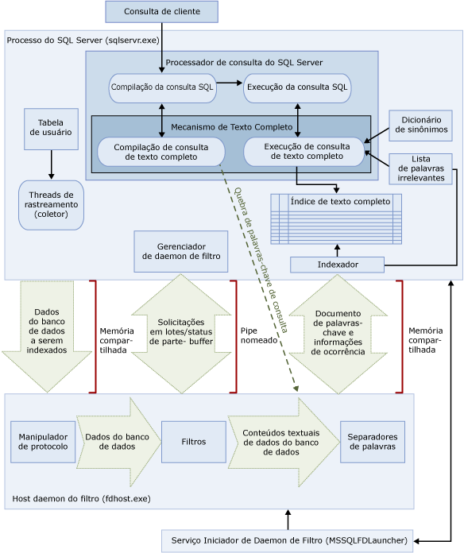

# <a name="full-text-search"></a>Pesquisa de Texto Completo
[!INCLUDE[appliesto-ss-asdb-xxxx-xxx-md](../../includes/appliesto-ss-asdb-xxxx-xxx-md.md)] A Pesquisa de Texto Completo no [!INCLUDE[ssNoVersion](../../includes/ssnoversion-md.md)] e [!INCLUDE[ssSDSFull](../../includes/sssdsfull-md.md)] permite que usuários e aplicativos executem consultas de texto completo em dados baseados em caracteres nas tabelas do [!INCLUDE[ssNoVersion](../../includes/ssnoversion-md.md)].
  
## <a name="basic-tasks"></a>Tarefas básicas
Este tópico fornece uma visão geral da pesquisa de texto completo e descreve sua arquitetura e seus componentes. Se você preferir começar imediatamente, aqui estarão as tarefas básicas.
-   [Iniciar a pesquisa de texto completo](../../relational-databases/search/get-started-with-full-text-search.md)
-   [Criar e gerenciar catálogos de texto completo](../../relational-databases/search/create-and-manage-full-text-catalogs.md)
-   [Criar e gerenciar índices de texto completo](../../relational-databases/search/create-and-manage-full-text-indexes.md)
-   [Popular índices de texto completo](../../relational-databases/search/populate-full-text-indexes.md)
-   [Consulta com pesquisa de texto completo](../../relational-databases/search/query-with-full-text-search.md)

> [!NOTE]
> Full-Text Search is an optional component of the [!INCLUDE[ssNoVersion](../../includes/ssnoversion-md.md)] . Se você não selecionou a pesquisa de texto completo quando instalou o SQL Server, execute a instalação do SQL Server novamente para adicioná-la.

## <a name="overview"></a>Visão geral
Um índice de texto completo inclui uma ou mais colunas baseadas em caractere em uma tabela. Essas colunas podem ter qualquer um destes tipos de dados: **char**, **varchar**, **nchar**, **nvarchar**, **text**, **ntext**, **image**, **xml** ou **varbinary(max)** e **FILESTREAM**. Cada índice de texto completo indexa uma ou mais colunas da tabela base, e cada coluna pode usar um idioma específico.  
  
 As consultas de texto completo executam pesquisas linguísticas nos dados de texto em índices de texto completo trabalhando em palavras e frases com base em regras de um idioma específico, como inglês ou japonês. As consultas de texto completo podem incluir palavras e frases simples ou várias formas de uma palavra ou frase. Uma consulta de texto completo retorna todos os documentos que contiverem, pelo menos, uma correspondência (também conhecida como uma *ocorrência*). Uma correspondência ocorre quando um documento de destino contém todos os termos especificados na consulta de texto completo e atende a quaisquer outros critérios de pesquisa, como a distância entre os termos correspondentes.    
  
##  <a name="queries"></a> Consultas da pesquisa de texto completo  
 Depois que colunas forem adicionadas a um índice de texto completo, os usuários e aplicativos poderão executar consultas de texto completo no texto das colunas. Essas consultas podem procurar qualquer um dos seguintes itens:  
  
-   Uma ou mais palavras ou frases específicas (*termo simples*)  
  
-   Uma palavra ou frase na qual as palavras começam com o texto especificado (*termo de prefixo*)  
  
-   As formas flexionadas de uma palavra específica (*termo de geração*)  
  
-   Uma palavra ou frase perto de outra palavra ou frase (*termo de proximidade*).  
  
-   Os sinônimos de uma palavra específica (*dicionário de sinônimos*)  
  
-   Palavras ou frases que usam valores ponderados (*termo ponderado*)  
  
 As consultas de texto completo não diferenciam maiúsculas de minúsculas. Por exemplo, a pesquisa de "Alumínio" ou "alumínio" retorna os mesmos resultados.  
  
 As consultas de texto completo usam um pequeno conjunto de predicados [!INCLUDE[tsql](../../includes/tsql-md.md)] (CONTAINS e FREETEXT) e funções (CONTAINSTABLE e FREETEXTTABLE). Entretanto, as metas de pesquisa de um determinado cenário comercial influenciam a estrutura das consultas de texto completo. Por exemplo:  
  
-   E-business — procurar por um produto em um site:  
  
    ```  
    SELECT product_id   
    FROM products   
    WHERE CONTAINS(product_description, ”Snap Happy 100EZ” OR FORMSOF(THESAURUS,’Snap Happy’) OR ‘100EZ’)   
    AND product_cost < 200 ;  
    ```  
  
-   Cenário de recrutamento — procurar candidatos a uma vaga de trabalho que tenham experiência prática com o [!INCLUDE[ssNoVersion](../../includes/ssnoversion-md.md)]:  
  
    ```  
    SELECT candidate_name,SSN   
    FROM candidates   
    WHERE CONTAINS(candidate_resume,”SQL Server”) AND candidate_division =DBA;  
    ```  
  
 Para obter mais informações, veja [Consulta com pesquisa de texto completo](../../relational-databases/search/query-with-full-text-search.md).  
  
##  <a name="like"></a> Compare as consultas de pesquisa de texto completo para o predicado LIKE
 Ao contrário da pesquisa de texto completo, o predicado [LIKE](../../t-sql/language-elements/like-transact-sql.md) [!INCLUDE[tsql](../../includes/tsql-md.md)] funciona apenas com padrões de caracteres. Além disso, não é possível usar o predicado LIKE para consultar dados binários formatados. Além disso, uma consulta LIKE feita em uma grande quantidade de dados de texto não estruturados é bem mais lenta do que uma consulta de texto completo equivalente feita nos mesmos dados. Uma consulta LIKE executada em milhões de linhas de dados de texto pode demorar muitos minutos, enquanto uma consulta de texto completo pode demorar alguns segundos ou menos para ser executada nos mesmos dados, dependendo do número de linhas retornadas.  
  
##  <a name="architecture"></a> Arquitetura da pesquisa de texto completo
 A arquitetura de pesquisa de texto completo é formada pelos seguintes processos:  
  
-   O processo do [!INCLUDE[ssNoVersion](../../includes/ssnoversion-md.md)] (sqlservr.exe).  
  
-   O processo de host do daemon de filtro (fdhost.exe).  
  
     Por motivos de segurança, os filtros são carregados por processos separados que são chamados de hosts do daemon de filtro. Os processos fdhost.exe são criados por um serviço Iniciador FDHOST (MSSQLFDLauncher) e executados sob as credenciais de segurança da conta deste serviço. Por isso, o serviço Iniciador FDHOST deve estar em execução para que a indexação de texto completo e a consulta de texto completo funcionem. Para obter informações sobre como configurar a conta de serviço para esse serviço, veja [Definir a conta de serviço do Iniciador do Daemon de Filtro de Texto Completo](../../relational-databases/search/set-the-service-account-for-the-full-text-filter-daemon-launcher.md).  
  
 Esses dois processos contêm os componentes da arquitetura de pesquisa de texto completo. Esses componentes e suas relações são resumidas na ilustração a seguir. Os componentes são descritos após a ilustração.  
  
   

###  <a name="sqlprocess"></a> Processo do SQL Server  
 O processo do [!INCLUDE[ssNoVersion](../../includes/ssnoversion-md.md)] usa os seguintes componentes na pesquisa de texto completo:  
  
-   **Tabelas de usuário.** Essas tabelas contêm os dados para serem indexados com texto completo.  
  
-   **Gatherer de texto completo.** O gatherer de texto completo funciona com os threads de rastreamento de texto completo. Ele é responsável por agendar e orientar a população de índices de texto completo e também por monitorar os catálogos de texto completo.  
  
-   **Arquivos de dicionário de sinônimos.** Esses arquivos contêm sinônimos de termos de pesquisa. Para obter mais informações, veja [Configurar e gerenciar arquivos de dicionário de sinônimos para pesquisa de texto completo](../../relational-databases/search/configure-and-manage-thesaurus-files-for-full-text-search.md).  
  
-   **Objetos da lista de palavras irrelevantes (stoplist).** Os objetos da lista de palavras irrelevantes contêm uma lista de palavras comuns que não são úteis para a pesquisa. Para obter mais informações, veja [Configurar e gerenciar palavras irrelevantes e listas de palavras irrelevantes para pesquisa de texto completo](../../relational-databases/search/configure-and-manage-stopwords-and-stoplists-for-full-text-search.md).  
  
-   **[!INCLUDE[ssNoVersion](../../includes/ssnoversion-md.md)] processador de consultas.** O processador de consulta compila e executa consultas SQL. Se uma consulta SQL incluir uma consulta de pesquisa de texto completo, a consulta será enviada ao Mecanismo de Texto Completo, durante a compilação e durante a execução. O resultado da consulta é comparado com o índice de texto completo.  
  
-   **Mecanismo de Texto Completo.** O Mecanismo de Texto Completo do [!INCLUDE[ssNoVersion](../../includes/ssnoversion-md.md)] está totalmente integrado ao processador de consultas. O Mecanismo de Texto Completo compila e executa consultas de texto completo. Como parte da execução da consulta, o Mecanismo de Texto Completo pode receber entrada do dicionário de sinônimos e da lista de palavras irrelevantes.  

    >[!NOTE]  
    >  No [!INCLUDE[ssKatmai](../../includes/sskatmai-md.md)] e em versões posteriores, o Mecanismo de Texto Completo reside no processo do [!INCLUDE[ssNoVersion](../../includes/ssnoversion-md.md)] e não em um serviço separado. A integração do Mecanismo de Texto Completo ao Mecanismo de Banco de Dados melhora a capacidade de gerenciamento de texto completo, a otimização de consultas mistas e o desempenho como um todo.  
 
-   **Gravador de índice (indexador).** O gravador de índice cria a estrutura usada para armazenar os tokens indexados.  
  
-   **Gerenciador de daemon de filtro.** O gerenciador de daemon de filtro é responsável por monitorar o status do host do daemon de filtro do Mecanismo de Texto Completo.  
  
###  <a name="fdhostprocess"></a> Filter Daemon Host process  
 O host do daemon de filtro é um processo que é iniciado pelo Mecanismo de Texto Completo. Ele executa os seguintes componentes de pesquisa de texto completo que são responsáveis por acessar, filtrar e separar palavras de dados de tabelas, bem como por separar palavras e lematizar a entrada da consulta.  
  
 Os componentes do host do daemon de filtro são os seguintes:  
  
-   **Manipulador de protocolo.** Esse componente extrai os dados da memória para processamento adicional e acessa dados de uma tabela de usuário de um banco de dados especificado. Uma de suas responsabilidades é coletar dados das colunas que estão sendo indexadas com texto completo e transmiti-los ao host do daemon de filtro, que aplicará a filtragem e o separador de palavras conforme exigido.  
  
-   **Filtros.** Alguns tipos de dados requerem filtragem para que os dados contidos em um documento possam ser indexados com texto completo, inclusive dados em colunas **varbinary**, **varbinary(max)**, **image**ou **xml** . O filtro usado para um dado documento depende de seu tipo de documento. Por exemplo, são usados filtros diferentes para documentos do Microsoft Word (.doc), do Microsoft Excel (.xls) e no formato XML (.xml). O filtro extrai partes de texto do documento, removendo a formatação inserida e mantendo o texto e, potencialmente, as informações sobre a posição deste. O resultado é um fluxo de informações textuais. Para obter mais informações, veja [Configurar e gerenciar filtros para pesquisa](../../relational-databases/search/configure-and-manage-filters-for-search.md).  
  
-   **Separadores de palavras e lematizadores.** Um separador de palavras é um componente específico a um idioma que encontra limites de palavras com base nas regras lexicais de determinado idioma (*separação de palavras*). Cada separador de palavras é associado a um componente lematizador específico do idioma, que conjuga verbos e executa expansões flexionadas. No momento da indexação, o host do daemon de filtro usa um separador de palavras e um lematizador para executar a análise linguística dos dados textuais de uma determinada coluna de tabela. O idioma associado a uma coluna de tabela no índice de texto completo determina qual separador de palavras e qual lematizador são usados para indexar a coluna. Para obter mais informações, veja [Configurar e gerenciar separadores de palavras e lematizadores para pesquisa](../../relational-databases/search/configure-and-manage-word-breakers-and-stemmers-for-search.md).  
  
##  <a name="processing"></a> Processamento da pesquisa de texto completo  
 A pesquisa de texto completo é ativada pelo Mecanismo de Texto Completo. O Mecanismo de Texto Completo tem duas funções: suporte a indexação e suporte a consulta.  
  
###  <a name="indexing"></a> Processo de indexação de texto completo  
 Quando uma população de texto completo (também conhecida como rastreamento) é iniciada, o mecanismo de texto completo entrega grandes lotes de dados à memória e notifica o host do daemon de filtro. O host filtra e o Word divide os dados e converte os dados convertidos em listas de palavras invertidas. A pesquisa de texto completo pega os dados convertidos nas listas de palavras, processa-os para remover palavras irrelevantes e mantém as listas de palavras para um lote em um ou mais índices invertidos.  
  
 Durante a indexação de dados armazenados em uma coluna **varbinary(max)** ou **image** , o filtro, que implementa a interface **IFilter** , extrai texto com base no formato de arquivo especificado para aqueles dados (por exemplo, [!INCLUDE[msCoName](../../includes/msconame-md.md)] Word). Em alguns casos, os componentes de filtro exigem que os dados de **varbinary(max)**ou **image** sejam gravados fora da pasta de dados do filtro, em vez de serem postos na memória.  
  
 Como parte do processamento, os dados de texto reunidos são passados por um separador de palavras para que o texto seja separado em tokens individuais ou palavras-chave. A linguagem usada para geração de tokens é especificada no nível da coluna, podendo ser identificada em dados **varbinary(max)**, **image**ou **xml** , pelo componente de filtro.  
  
 Processamentos adicionais podem ser realizados para remover palavras irrelevantes e para normalizar os tokens antes de eles serem armazenados no índice de texto completo ou em um fragmento de índice.  
  
 Quando a população for concluída, um processo de mesclagem final será disparado, mesclando os fragmentos de índice em um índice de texto completo mestre. Isso resulta em desempenho aprimorado de consultas, uma vez que apenas o índice precisa ser consultado, em vez de uma série de fragmentos de índice, e melhores estatísticas de pontuação podem ser usadas para classificação de relevância.  
  
###  <a name="querying"></a> Processo de consulta de texto completo  
 O processador de consultas passa as partes do texto completo de uma consulta para o Mecanismo de Texto Completo para processamento. O Mecanismo de Texto Completo executa a quebra de palavras e, opcionalmente, expansões do dicionário de sinônimos, lematização e processamento de palavras irrelevantes (palavras de ruído). Em seguida, as partes de texto completo da consulta são representadas na forma de operadores SQL, principalmente como STVFs (funções com valor de tabela de fluxo). Durante a execução da consulta, essas STVFs acessam o índice invertido para recuperar os resultados corretos. Os resultados são retornados para o cliente neste momento ou processados mais um pouco antes de serem retornados ao cliente.  

## <a name="full-text-index-architecture"></a>Arquitetura de índice de texto completo
  As informações contidas em índices de texto completo são usadas pelo Mecanismo de Texto Completo para compilar consultas de texto completo que podem procurar determinadas palavras ou combinações de palavras rapidamente em uma tabela. Um índice de texto completo armazena informações sobre palavras importantes e sua localização em uma ou mais colunas de uma tabela de banco de dados. Um índice de texto completo consiste em um tipo especial de índice funcional com base em token que é criado e mantido pelo Mecanismo de Texto Completo do [!INCLUDE[ssNoVersion](../../includes/ssnoversion-md.md)]. O processo de criação de um índice de texto completo é diferente da criação de outros tipos de índices. Em vez de criar uma estrutura de árvore B com base em um valor armazenado em uma linha específica, o Mecanismo de Texto Completo cria uma estrutura de índice compactada, empilhada e invertida com base em tokens individuais do texto que está sendo indexado.  O tamanho de um índice de texto completo é limitado apenas pelos recursos de memória disponíveis do computador no qual a instância do [!INCLUDE[ssNoVersion](../../includes/ssnoversion-md.md)] está sendo executada.  
  
 A partir do [!INCLUDE[ssKatmai](../../includes/sskatmai-md.md)], os índices de texto completo são integrados ao Mecanismo de Banco de Dados e deixam de residir no sistema de arquivos, como ocorria nas versões anteriores do [!INCLUDE[ssNoVersion](../../includes/ssnoversion-md.md)]. Em um novo banco de dados, agora o catálogo de texto completo é um objeto virtual que não pertence a nenhum grupo de arquivos; ele é simplesmente um conceito lógico que faz referência a um grupo dos índices de texto completo. Porém, observe que, durante a atualização de um banco de dados do [!INCLUDE[ssVersion2005](../../includes/ssversion2005-md.md)] , para qualquer catálogo de texto completo que contenha arquivos de dados, é criado um novo grupo de arquivos. Para obter mais informações, veja [Atualizar pesquisa de texto completo](../../relational-databases/search/upgrade-full-text-search.md).  
  
Só é permitido um índice de texto completo por tabela. Para que um índice de texto completo seja criado em uma tabela, a tabela deve ter uma única coluna não nula exclusiva. É possível criar um índice de texto completo em colunas do tipo **char**, **varchar**, **nchar**, **nvarchar**, **text**, **ntext**, **image**, **xml**, **varbinary**e **varbinary(max)** , que podem ser indexadas para a pesquisa de texto completo. A criação de um índice de texto completo em uma coluna cujo tipo de dados é  **varbinary**, **varbinary(max)**, **image**ou **xml** exige a especificação de uma coluna de tipo. Uma *coluna de tipo* consiste em uma coluna de tabela em que você armazena a extensão de arquivo (.doc, .pdf, .xls, etc.) do documento em cada linha.  

###  <a name="structure"></a> Estrutura de índice de texto completo  
 Um bom conhecimento da estrutura do índice de texto completo ajudará você a entender como funciona o Mecanismo de Texto Completo. Este tópico usa o trecho a seguir da tabela **Document** em [!INCLUDE[ssSampleDBCoShort](../../includes/sssampledbcoshort-md.md)] como tabela de exemplo. Esse trecho mostra apenas duas colunas, **DocumentID** e **Title** , e três linhas da tabela.  
  
 Para este exemplo, assumiremos que um índice de texto completo foi criado na coluna **Title** .  
  
|DocumentID|Title|  
|----------------|-----------|  
|1|Crank Arm and Tire Maintenance|  
|2|Front Reflector Bracket and Reflector Assembly 3|  
|3|Front Reflector Bracket Installation|  
  
 Por exemplo, a tabela a seguir, que mostra o Fragment 1, descreve o conteúdo do índice de texto completo criado na coluna **Title** da tabela **Document** . Os índices de texto completo contêm mais informações do que é apresentado nessa tabela. A tabela é uma representação lógica de um índice de texto completo e é fornecida somente para fins de demonstração. As linhas são armazenadas em um formato compactado para otimizar o uso do disco.  
  
 Observe que os dados foram invertidos em relação aos documentos originais. A inversão ocorre porque as palavras-chave são mapeadas para as IDs de documento. Por esse motivo, geralmente um índice de texto completo é chamado de índice invertido.  
  
 Observe também que a palavra-chave "and" foi removida do índice de texto completo. Isso ocorre porque "and" é uma palavra irrelevante e remover essas palavras de um índice de texto completo pode levar a economias consideráveis do espaço em disco, melhorando o desempenho de consulta. Para obter mais informações sobre palavras irrelevantes, veja [Configurar e gerenciar palavras irrelevantes (stop words) e listas de palavras irrelevantes para pesquisa de texto completo](../../relational-databases/search/configure-and-manage-stopwords-and-stoplists-for-full-text-search.md).  
  
 **Fragmento 1**  
  
|Palavra-chave|ColId|DocId|Ocorrência|  
|-------------|-----------|-----------|----------------|  
|Crank|1|1|1|  
|Arm|1|1|2|  
|Tire|1|1|4|  
|Manutenção|1|1|5|  
|Front|1|2|1|  
|Front|1|3|1|  
|Reflector|1|2|2|  
|Reflector|1|2|5|  
|Reflector|1|3|2|  
|Bracket|1|2|3|  
|Bracket|1|3|3|  
|Assembly|1|2|6|  
|3|1|2|7|  
|Instalação|1|3|4|  
  
 A coluna **Keyword** contém uma representação de um único token extraído no momento da indexação. Os separadores de palavras determinam o que compõe um token.  
  
 A coluna **ColId** contém um valor que corresponde a uma coluna específica indexada com texto completo.  
  
 A coluna **DocId** contém valores para um inteiro de oito bytes que é mapeado para um valor de chave de texto completo específico em uma tabela indexada com texto completo. Esse mapeamento é necessário quando a chave de texto completo não é um tipo de dados integer. Em casos como esses, os mapeamentos entre valores de chave de texto completo e valores da coluna **DocId** são mantidos em uma tabela à parte, chamada tabela de Mapeamento de DocId. Para examinar esses mapeamentos, use o procedimento armazenado do sistema [sp_fulltext_keymappings](../../relational-databases/system-stored-procedures/sp-fulltext-keymappings-transact-sql.md) . Para atender a um critério de pesquisa, os valores de DocId da tabela acima precisam ser unidos à tabela de mapeamento DocId para recuperar linhas da tabela base que está sendo consultada. Se o valor da chave de texto completo da tabela base for do tipo inteiro, o valor funcionará diretamente como DocId, e nenhum mapeamento será necessário. Por isso, o uso de valores de chave de texto completo pode ajudar a otimizar consultas de texto completo.  
  
 A coluna **Occurrence** contém um valor inteiro. Para cada valor de DocId, há uma lista de valores de ocorrência que correspondem aos deslocamentos relativos de palavras de uma palavra-chave específica dentro de DocId. Os valores de ocorrência são úteis para definir as correspondências de frase ou de proximidade, por exemplo, as frases têm valores de ocorrência numericamente adjacentes. Eles também são úteis para calcular pontuações de relevância; por exemplo, o número de ocorrências de uma palavra-chave em DocId pode ser usado na pontuação.   
  
###  <a name="fragments"></a> Fragmentos de índice de texto completo  
 O índice de texto completo lógico normalmente é dividido entre várias tabelas internas. Cada tabela interna é chamada de fragmento de índice de texto completo. Alguns desses fragmentos podem conter dados mais novos do que outros. Por exemplo, se um usuário atualiza a linha a seguir cujo DocId é 3 e a tabela tem controle de alterações automático, é criado um novo fragmento.  
  
|DocumentID|Title|  
|----------------|-----------|  
|3|Refletor traseiro|  
  
 No exemplo a seguir, que mostra o Fragmento 2, o fragmento contém dados mais recentes sobre DocId 3 em comparação com Fragmento 1. Portanto, quando o usuário procura por “Refletor Traseiro", os dados de Fragmento 2 são usados para DocId 3. Cada fragmento é marcado com um carimbo de data/hora da criação, que pode ser consultado usando a exibição de catálogo [sys.fulltext_index_fragments](../../relational-databases/system-catalog-views/sys-fulltext-index-fragments-transact-sql.md) .  
  
 **Fragmento 2**  
  
|Palavra-chave|ColId|DocId|Occ|  
|-------------|-----------|-----------|---------|  
|Traseiro|1|3|1|  
|Reflector|1|3|2|  
  
 Como pode ser visto no Fragmento 2, as consultas de texto completo precisam examinar cada fragmento internamente e descartar entradas mais antigas. Por isso, um número excessivo de fragmentos de índice de texto completo no índice de texto completo pode levar a uma diminuição considerável do desempenho de consulta. Para reduzir o número de fragmentos, reorganize o catálogo de texto completo usando a opção REORGANIZE da instrução [ALTER FULLTEXT CATALOG](../../t-sql/statements/alter-fulltext-catalog-transact-sql.md)[!INCLUDE[tsql](../../includes/tsql-md.md)] . Essa instrução executa uma *mesclagem mestra*que mescla os fragmentos em um único fragmento maior e remove todas as entradas obsoletas do índice de texto completo.  
  
 Depois de reorganizado, o índice de exemplo conterá as linhas seguintes:  
  
|Palavra-chave|ColId|DocId|Occ|  
|-------------|-----------|-----------|---------|  
|Crank|1|1|1|  
|Arm|1|1|2|  
|Tire|1|1|4|  
|Manutenção|1|1|5|  
|Front|1|2|1|  
|Traseiro|1|3|1|  
|Reflector|1|2|2|  
|Reflector|1|2|5|  
|Reflector|1|3|2|  
|Bracket|1|2|3|  
|Assembly|1|2|6|  
|3|1|2|7|  

### <a name="differences-between-full-text-indexes-and-regular-sql-server-indexes"></a>Diferenças entre índices de texto completo e índices regulares do SQL Server:  
  
|Índices de texto completo|Índices regulares do SQL Server|  
|------------------------|--------------------------------|  
|Só é permitido um índice de texto completo por tabela.|Vários índices regulares são permitidos por tabela.|  
|A adição de dados a índices de texto completo, chamada de *população*, pode ser solicitada através de uma agenda ou de uma solicitação específica e pode ocorrer automaticamente com a inclusão de novos dados.|Atualizados automaticamente quando os dados nos quais eles se baseiam são inseridos, atualizados ou excluídos.|  
|Agrupados no mesmo banco de dados em um ou mais catálogos de texto completo.|Não agrupado.|  

##  <a name="components"></a> Componentes linguísticos e suporte de idioma na pesquisa de texto completo
 A pesquisa de texto completo oferece suporte a quase 50 idiomas diferentes, como inglês, espanhol, chinês, japonês, árabe, bengalês e híndi. Para obter uma lista completa dos idiomas de texto completo com suporte, veja [sys.fulltext_languages &#40;Transact-SQL&#41;](../../relational-databases/system-catalog-views/sys-fulltext-languages-transact-sql.md). Cada uma das colunas do índice de texto completo é associada a um LCID (identificador de localidade) do Microsoft Windows que equivale a um idioma suportado pela pesquisa de texto completo. Por exemplo, o LCID 1033 equivale ao inglês norte-americano e o LCID 2057, ao inglês britânico. Para cada idioma de texto completo suportado, o [!INCLUDE[ssNoVersion](../../includes/ssnoversion-md.md)] fornece componentes linguísticos que dão suporte à indexação e à consulta de dados de texto completo armazenados nesse idioma.  
  
 Os componentes específicos de idioma incluem:  
  
-   **Separadores de palavras e lematizadores.** Um separador de palavras encontra limites de palavras com base nas regras lexicais de determinado idioma (*separação de palavras*). Cada separador de palavras é associado a um lematizador que conjuga verbos desse idioma. Para obter mais informações, veja [Configurar e gerenciar separadores de palavras e lematizadores para pesquisa](../../relational-databases/search/configure-and-manage-word-breakers-and-stemmers-for-search.md).  
  
-   **Listas de palavras irrelevantes.** É fornecida uma lista de palavras irrelevantes (stoplist) do sistema, que contém um conjunto básico de palavras irrelevantes (também chamadas de palavras de ruído). Uma *palavra irrelevante* consiste em uma palavra que não ajuda a pesquisa e é ignorada por consultas de texto completo. Por exemplo, no português, palavras como "um/uma", "e", "é" e "o/a" são consideradas palavras irrelevantes. Normalmente, é preciso configurar um ou mais arquivos de dicionário de sinônimos e listas de palavras irrelevantes. Para obter mais informações, veja [Configurar e gerenciar palavras irrelevantes e listas de palavras irrelevantes para pesquisa de texto completo](../../relational-databases/search/configure-and-manage-stopwords-and-stoplists-for-full-text-search.md).  
  
-   **Arquivos de dicionário de sinônimos.** [!INCLUDE[ssNoVersion](../../includes/ssnoversion-md.md)] também instala um arquivo de dicionário de sinônimos para cada idioma de texto completo, bem como um arquivo de dicionário de sinônimos global. Os arquivos de dicionário de sinônimos instalados são basicamente vazios, mas você pode editá-los para definir sinônimos para um determinado cenário comercial ou de idioma. Ao desenvolver um dicionário de sinônimos personalizado para seus dados de texto completo, você pode efetivamente ampliar o escopo de consultas de texto completo baseadas nesses dados. Para obter mais informações, veja [Configurar e gerenciar arquivos de dicionário de sinônimos para pesquisa de texto completo](../../relational-databases/search/configure-and-manage-thesaurus-files-for-full-text-search.md).  
  
-   **Filtros (iFilters).**  A indexação de um documento em uma coluna de tipo de dados **varbinary(max)**, **image**ou **xml** exige um filtro para processamento extra. O filtro deve ser específico do tipo de documento (.doc, .pdf, .xls, .xml e assim por diante). Para obter mais informações, veja [Configurar e gerenciar filtros para pesquisa](../../relational-databases/search/configure-and-manage-filters-for-search.md).  
  
 Os separadores de palavras (e lematizadores) e filtros são executados no processo do host do daemon de filtro (fdhost.exe).  

[!INCLUDE[tsql-appliesto-ss2008-asdb-xxxx-xxx_md](../../includes/tsql-appliesto-ss2008-asdb-xxxx-xxx-md.md)]

