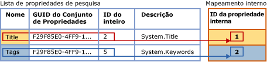
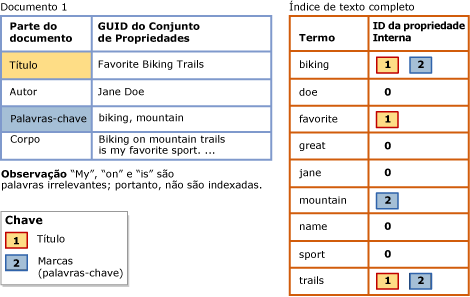

# <a name="search-document-properties-with-search-property-lists"></a>Pesquisar propriedades de documento com listas de propriedades de pesquisa
[!INCLUDE[appliesto-ss-asdb-xxxx-xxx-md](../../includes/appliesto-ss-asdb-xxxx-xxx-md.md)]
  Anteriormente, o conteúdo das propriedades de documento não podia ser diferenciado do conteúdo do corpo do documento. Essa limitação restringia as consultas de texto completo a pesquisas genéricas em documentos inteiros. No entanto, agora você pode configurar um índice de texto completo para dar suporte à pesquisa com escopo de propriedade, como Author e Title, para tipos de documento com suporte em uma coluna de dados binários **varbinary**, **varbinary(max)** (incluindo **FILESTREAM**) ou **image** . Esse formulário de pesquisa é conhecido como *pesquisa de propriedade*.  
  
 O [filtro](../../relational-databases/search/configure-and-manage-filters-for-search.md) associado (IFilter) determina se a pesquisa de propriedade é possível em um tipo de documento específico. Em alguns tipos de documento, o IFilter associado extrai algumas ou todas as propriedades definidas para esse tipo de documento, bem como o conteúdo do corpo do documento. É possível configurar um índice de texto completo para oferecer suporte à pesquisa de propriedade somente em propriedades que são extraídas por um IFilter durante a indexação de texto completo. Entre os IFilters que extraem várias propriedades de documento estão os IFilters para tipos de documento do Microsoft Office (como .docx, .xlsx e .pptx). Por outro lado, o IFilter de XML não emite propriedades.  
  
##  <a name="How_FTS_Works_with_search_properties"></a> Como a pesquisa de texto completo funciona com as propriedades de pesquisa  
  
### <a name="internal-property-ids"></a>IDs de propriedade interna  
 O Mecanismo de Texto Completo arbitrariamente atribui a cada propriedade registrada uma ID de propriedade interna, que identifica exclusivamente a propriedade nessa lista de pesquisa específica e que é específica a essa lista de propriedades de pesquisa. Assim, se uma propriedade for adicionada a várias listas de propriedades de pesquisa, sua ID de propriedade interna provavelmente será diferente entre as várias listas.  
  
 Quando uma propriedade é registrada em uma lista de pesquisa, o Mecanismo de Texto Completo atribui arbitrariamente uma *ID de propriedade interna* à propriedade. A ID de propriedade interna é um inteiro que identifica exclusivamente a propriedade nessa lista de propriedades de pesquisa.  
  
 A ilustração a seguir mostra uma exibição lógica de uma lista de propriedades de pesquisa que especifica duas propriedades, Title e Keywords. O nome da lista de propriedades para Keywords é "Tags". Essas propriedades pertencem ao mesmo conjunto de propriedades, cujo GUID é F29F85E0-4FF9-1068-AB91-08002B27B3D9. Os identificadores de inteiro da propriedade são 2 para Title e 5 para Tags (Keywords). O Mecanismo de Texto Completo mapeia arbitrariamente cada propriedade para uma ID de propriedade interna que é exclusiva à lista de propriedades de pesquisa. A ID de propriedade interna para a propriedade Title é 1 e a ID de propriedade interna para a propriedade Tags é 2.  
  
   
  
 A ID de propriedade interna provavelmente será diferente do identificador de inteiro da propriedade. Se uma determinada propriedade for registrada para várias listas de propriedades de pesquisa, uma ID de propriedade interna diferente poderá ser atribuída para cada lista de propriedades de pesquisa. Por exemplo, a ID de propriedade interna poderia ser 4 em uma lista de propriedades de pesquisa, 1 em outra, 3 em outra, e assim por diante. Em contrapartida, o identificador de inteiro de propriedade é intrínseco à propriedade e permanece o mesmo onde quer que a propriedade seja usada.  
  
### <a name="indexing-of-registered-properties"></a>Indexação de propriedades registradas  
 Depois que um índice de texto completo é associado a uma lista de propriedades de pesquisa, o índice deve ser populado novamente para indexar termos de pesquisa específicos da propriedade. Durante a indexação de texto completo, o conteúdo de todas as propriedades é armazenado no índice de texto completo juntamente com outro conteúdo. No entanto, ao indexar um termo de pesquisa encontrado em uma propriedade registrada, o indexador de texto completo também armazenará a ID de propriedade interna correspondente com o termo. Em contrapartida, se uma propriedade não estiver registrada, ela será armazenada no índice de texto completo como se fosse parte do corpo do documento e terá um valor de zero para a ID de propriedade interna.  
  
 A ilustração a seguir mostra uma exibição lógica de como os termos de pesquisa aparecem em um índice de texto completo associado à lista de propriedades de pesquisa mostrada na ilustração anterior. Um documento de exemplo, Document 1, contém três propriedades – Title, Author e Keywords –, bem como o corpo do documento. Para as propriedades Title e Keywords, que são especificadas na lista de propriedades de pesquisa, os termos de pesquisa são associados às suas IDs de propriedade interna correspondentes no índice de texto completo. Em contrapartida, o conteúdo da propriedade Author é indexado como se fosse parte do corpo do documento. Isso significa que registrar uma propriedade aumenta um pouco o tamanho do índice de texto completo, dependendo da quantidade de conteúdo armazenada na propriedade.  
  
   
  
 Os termos de pesquisa na propriedade Title – "Favorite", "Biking" e "Trails" – são associados à ID de propriedade interna atribuída a Title para esse índice, 1. Os termos de pesquisa na propriedade Keywords – "biking" e "mountain" – são associados à ID de propriedade interna atribuída a Tags para esse índice, 2. Para os termos de pesquisa na propriedade Author – "Jane" e "Doe" – e termos de pesquisa no corpo do documento, a ID da propriedade interna é 0. O termo "biking" ocorre na propriedade Title, na propriedade Keywords (Tags) e no corpo do documento. Uma pesquisa de propriedade por "biking" na propriedade Title ou Keywords (Tags) retornaria esse documento nos resultados. Uma consulta genérica de texto completo por "biking" também retornaria esse documento, como se o índice não estivesse configurado para a pesquisa de propriedade. Uma pesquisa de propriedade por "biking" na propriedade Author não retornaria esse documento.  
  
 Uma consulta de texto completo com escopo de propriedade usa as IDs de propriedade interna para a lista de propriedades de pesquisa atual do índice de texto completo.  
  
##  <a name="impact"></a> Impacto de habilitar a pesquisa de propriedade  
 Configurar um índice de texto completo para oferecer suporte à pesquisa em uma ou mais propriedades aumenta um pouco o tamanho do índice, dependendo do número de propriedades que você especifica na sua lista de propriedades de pesquisa e do conteúdo de cada propriedade.  
  
 No teste de arquivos típicos de documentos do Microsoft Word, Excel e PowerPoint, configuramos um índice de texto completo para indexar propriedades comuns de pesquisa. Indexar essas propriedades aumentou o tamanho do índice de texto completo em, aproximadamente, 5%. Estimamos que esse aumento aproximado de tamanho será típico para a maioria dos arquivos de documentos. No entanto, o aumento de tamanho dependerá, basicamente, da quantidade de dados de propriedade de um determinado documento em relação à quantidade de dados geral.  
  
##  <a name="creating"></a> Criando uma lista de propriedades de pesquisa e habilitando a pesquisa de propriedade  
  
###  <a name="creating_sub"></a> Criando uma lista de propriedades de pesquisa  
 **Para criar uma lista de propriedades de pesquisa com Transact-SQL**  
  
 Use a instrução [CREATE SEARCH PROPERTY LIST &#40;Transact-SQL&#41;](../../t-sql/statements/create-search-property-list-transact-sql.md) e forneça, pelo menos, um nome na lista.  
  
##### <a name="to-create-a-search-property-list-in-management-studio"></a>Para criar uma lista de propriedades de pesquisa no Management Studio  
  
1.  No Pesquisador de Objetos, expanda o servidor.  
  
2.  Expanda **Bancos de Dados**e o banco de dados no qual você deseja criar a lista de propriedades de pesquisa.  
  
3.  Expanda **Armazenamento**e clique com o botão direito do mouse em **Listas de Propriedades de Pesquisa**.  
  
4.  Selecione **Nova Lista de Propriedades de Pesquisa**.  
  
5.  Especifique o nome da lista de propriedades.  
  
6.  Opcionalmente, especifique outra pessoa como proprietária da lista de propriedades.  
  
7.  Selecione uma das opções a seguir:  
  
    -   **Criar uma lista de propriedades de pesquisa vazia**  
  
    -   **Criar de uma lista de propriedades de pesquisa existente**  
  
     Para obter mais informações, veja [Nova lista de propriedades de pesquisa](https://msdn.microsoft.com/library/ffca78e9-8608-4b15-bd38-b2d78da4247a).  
  
8.  [!INCLUDE[clickOK](../../includes/clickok-md.md)]  
  
###  <a name="adding"></a> Adicionando propriedades a uma lista de propriedades de pesquisa  
 A pesquisa de propriedade exige a criação de uma *lista de propriedades de pesquisa* e a especificação de uma ou mais propriedades que você deseja tornar pesquisáveis. Quando você adiciona uma propriedade a uma lista de propriedades de pesquisa, a propriedade é registrada para essa lista específica. Para adicionar uma propriedade a uma lista de propriedades de pesquisa, são necessários os seguintes valores:  
  
-   GUID do conjunto de propriedades  
  
     Cada propriedade de pesquisa pertence a um único conjunto de propriedades que contém um grupo de propriedades relacionadas. Cada conjunto de propriedades é identificado por um GUID (identificador global exclusivo).  
  
-   Identificador de inteiro de propriedade  
  
     Cada propriedade de pesquisa possui um identificador que é exclusivo no conjunto de propriedades. Para uma determinada propriedade, o identificador pode ser um inteiro ou uma cadeia de caracteres. No entanto, a pesquisa de texto completo é compatível somente com identificadores de inteiro.  
  
-   Nome da propriedade  
  
     Esse é o nome que os usuários especificarão nas consultas de texto completo para pesquisar na propriedade. Um nome de propriedade pode conter espaços internos. O tamanho máximo é de 256 caracteres.  
  
     O nome da propriedade pode ser qualquer um destes:  
  
    -   O nome canônico do Windows da propriedade, como **System.Author** ou **System.Contact.HomeAddress**.  
  
    -   Um nome amigável fácil de ser lembrado pelos usuários. Algumas propriedades são associadas a um nome amigável familiar ao usuário, como "Autor" ou "Endereço residencial", mas você pode especificar o nome mais apropriado aos usuários.  
  
    > [!NOTE]  
    >  Uma determinada combinação do GUID do conjunto de propriedades e do identificador de propriedade deve ser exclusiva em uma determinada lista de propriedades de pesquisa. Isso significa que você não pode adicionar a mesma propriedade mais de uma vez com nomes ou descrições diferentes.  
  
-   Descrição da propriedade (opcional)  
  
     Ao adicionar uma propriedade de pesquisa a uma lista de propriedades de pesquisa, você pode fornecer uma descrição opcional. Por exemplo, talvez seja conveniente fornecer informações sobre uma propriedade que não esteja evidente a partir do nome ou seja conveniente descrever o conjunto de propriedades da propriedade.  
  
 **Para obter valores para uma lista de propriedades de pesquisa**  
  
 Veja [Localizar GUIDs do conjunto de propriedades e IDs de inteiro de propriedade para propriedades de pesquisa](../../relational-databases/search/find-property-set-guids-and-property-integer-ids-for-search-properties.md).  
  
 **Para adicionar uma propriedade a uma lista de propriedades de pesquisa com Transact-SQL**  
  
 Use a instrução [ALTER SEARCH PROPERTY LIST &#40;Transact-SQL&#41;](../../t-sql/statements/alter-search-property-list-transact-sql.md) com os valores obtidos usando um dos métodos descritos no artigo [Localizar GUIDs do conjunto de propriedades e IDs de inteiro de propriedade para propriedades de pesquisa](../../relational-databases/search/find-property-set-guids-and-property-integer-ids-for-search-properties.md).  
  
 O exemplo a seguir demonstra o uso desses valores ao adicionar uma propriedade a uma lista de propriedades de pesquisa:  
  
```  
ALTER SEARCH PROPERTY LIST DocumentTablePropertyList  
   ADD 'Title'  
   WITH ( PROPERTY_SET_GUID = 'F29F85E0-4FF9-1068-AB91-08002B27B3D9', PROPERTY_INT_ID = 2,   
      PROPERTY_DESCRIPTION = 'System.Title - Title of the item.' );  
```  
  
 **Para adicionar uma propriedade a uma lista de propriedades de pesquisa no Management Studio**  
  
 Use a caixa de diálogo **Propriedades da Lista de Propriedades de Pesquisa** para adicionar e remover propriedades de pesquisa. Você pode encontrar **Listas de Propriedades de Pesquisa** no Pesquisador de Objetos, no nó **Armazenamento** do banco de dados associado.  
  
###  <a name="associating"></a> Associando uma lista de propriedades de pesquisa a um índice de texto completo  
 Para que um índice de texto completo ofereça suporte à pesquisa de propriedade nas propriedades registradas para uma lista de propriedades de pesquisa, você precisa associar a lista a um índice e popular novamente o índice. Popular novamente o índice de texto completo cria entradas de índice específico da propriedade para pesquisar termos em cada uma das propriedades registradas.  
  
 Uma vez que o índice de texto completo permanece associado a essa lista de propriedades de pesquisa, a consulta de texto completo pode usar a opção PROPERTY do predicado CONTAINS para fazer pesquisas nas propriedades que estão registradas para essa lista de propriedades de pesquisa.  
  
 Se você alterar a lista de propriedades de pesquisa associada ao índice de texto completo, o índice deverá ser recriado para ficar em um estado consistente. O índice é truncado imediatamente e fica vazio até que a população completa seja executada. Para obter mais informações sobre quando a alteração da lista de propriedades de pesquisa causa a recriação do índice, veja “Comentários” em [ALTER FULLTEXT INDEX &#40;Transact-SQL&#41;](../../t-sql/statements/alter-fulltext-index-transact-sql.md).  
  
 **Para associar uma lista de propriedades de pesquisa a um índice de texto completo com Transact-SQL**  
  
 Use a instrução [ALTER FULLTEXT INDEX &#40;Transact-SQL&#41;](../../t-sql/statements/alter-fulltext-index-transact-sql.md) com a cláusula `SET SEARCH PROPERTY LIST = <property_list_name>`.  
  
 **Para associar uma lista de propriedades de pesquisa a um índice de texto completo com o Management Studio**  
  
 Especifique um valor para **Lista de Propriedades de Pesquisa** na página **Geral** da caixa de diálogo **Propriedades do Índice de Texto Completo** .  
  
##  <a name="Ov_CONTAINS_using_PROPERTY"></a> Consultando propriedades de pesquisa com CONTAINS  
 A sintaxe básica de [CONTAINS](../../t-sql/queries/contains-transact-sql.md) de uma consulta de texto completo com escopo de propriedade é a seguinte:  
  
```sql  
SELECT column_name FROM table_name  
  WHERE CONTAINS ( PROPERTY ( column_name, 'property_name' ), '<contains_search_condition>' )  
```  
  
 Por exemplo, a consulta a seguir pesquisa em uma propriedade indexada, `Title`, na coluna `Document` da tabela `Production.Document` do banco de dados `AdventureWorks` . A consulta retorna apenas documentos cuja propriedade `Title` contém a cadeia de caracteres `Maintenance` ou `Repair`  
  
```  
USE AdventureWorks  
GO  
SELECT Document FROM Production.Document  
  WHERE CONTAINS ( PROPERTY ( Document, 'Title' ), 'Maintenance OR Repair')  
GO  
```  
  
 Este exemplo presume que o IFilter para o documento extrai sua propriedade Title, que a propriedade Title é adicionada à lista de propriedades de pesquisa e que a lista de propriedades de pesquisa está associada ao índice de texto completo.  
  
##  <a name="managing"></a> Gerenciando listas de propriedades de pesquisa  
  
###  <a name="viewing"></a> Exibindo e alterando uma lista de propriedades de pesquisa  
 **Para alterar uma lista de propriedades de pesquisa com Transact-SQL**  
  
 Use a instrução [ALTER SEARCH PROPERTY LIST &#40;Transact-SQL&#41;](../../t-sql/statements/alter-search-property-list-transact-sql.md) para adicionar ou remover propriedades de pesquisa.  
  
##### <a name="to-view-and-change-a-search-property-list-in-management-studio"></a>Como exibir e alterar listas de propriedades de pesquisa (SQL Server Management Studio)  
  
1.  No Pesquisador de Objetos, expanda o servidor.  
  
2.  Expanda **Bancos de Dados**e, em seguida, expanda o banco de dados.  
  
3.  Expanda **Armazenamento**.  
  
4.  Expanda **Pesquisar Listas de Propriedades** para exibir as listas de propriedades de pesquisa.  
  
5.  Clique com o botão direito do mouse na lista de propriedades e selecione **Propriedades**.  
  
6.  Na caixa de diálogo **Editor da Lista de Pesquisa de Propriedades** , use a grade Propriedades para adicionar ou remover propriedades de pesquisa:  
  
    1.  Para remover uma propriedade de documento, clique no cabeçalho da linha à esquerda da propriedade e pressione DEL.  
  
    2.  Para adicionar uma propriedade de documento, clique na linha vazia na parte inferior da lista, à direita do **\***, e insira os valores para a nova propriedade.  
  
         Para obter informações sobre esses valores, veja [Editor da Lista de Pesquisa de Propriedades](https://msdn.microsoft.com/library/0f3ced6e-0dfd-49fc-b175-82378c3d668e). Para obter informações sobre como obter esses valores de propriedades definidos pela Microsoft, veja [Localizar GUIDs do conjunto de propriedades e IDs de inteiro de propriedade para propriedades de pesquisa](../../relational-databases/search/find-property-set-guids-and-property-integer-ids-for-search-properties.md). Para obter informações sobre propriedades definidas por um ISV (fornecedor independente de software), consulte a documentação daquele fornecedor.  
  
7.  [!INCLUDE[clickOK](../../includes/clickok-md.md)]  
  
###  <a name="deleting"></a> Excluindo uma lista de propriedades de pesquisa  
 Não é possível cancelar uma lista de propriedades de um banco de dados enquanto a lista está associada a um índice de texto completo.  
  
 **Para excluir uma lista de propriedades de pesquisa com Transact-SQL**  
  
 Use a instrução [DROP SEARCH PROPERTY LIST &#40;Transact-SQL&#41;](../../t-sql/statements/drop-search-property-list-transact-sql.md).  
  
##### <a name="to-delete-a-search-property-list-in-management-studio"></a>Para excluir uma lista de propriedades de pesquisa no Management Studio  
  
1.  No Pesquisador de Objetos, expanda o servidor.  
  
2.  Expanda **Bancos de Dados**e, em seguida, expanda o banco de dados.  
  
3.  Expanda **Armazenamento**e o nó **Listas de Propriedades de Pesquisa** .  
  
4.  Clique com o botão direito do mouse na lista de propriedades que você deseja excluir e clique em **Excluir**.  
  
5.  [!INCLUDE[clickOK](../../includes/clickok-md.md)]  
  
## <a name="see-also"></a>Consulte Também  
 [Localizar GUIDs do conjunto de propriedades e IDs de inteiro de propriedade para propriedades de pesquisa](../../relational-databases/search/find-property-set-guids-and-property-integer-ids-for-search-properties.md)   
 [Configurar e gerenciar filtros para pesquisa](../../relational-databases/search/configure-and-manage-filters-for-search.md)  
  
  
