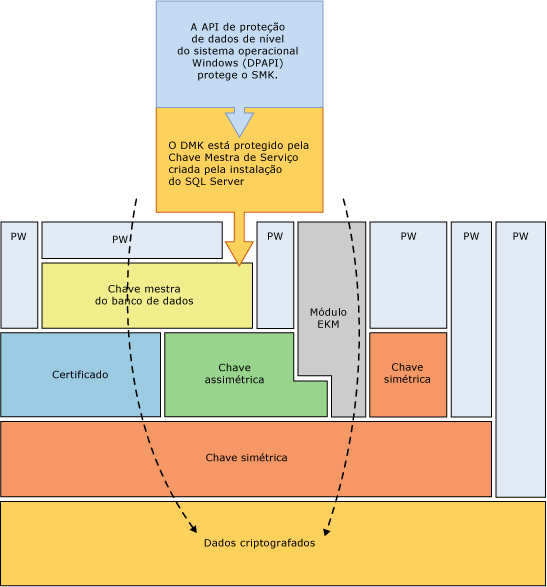
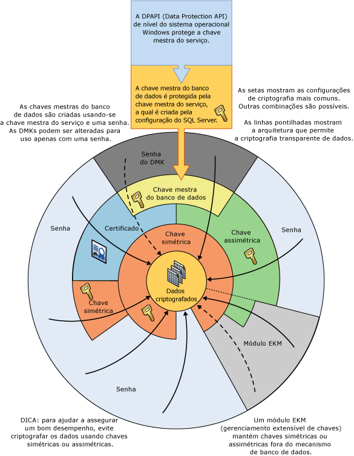

# Hierarquia de criptografia
[!INCLUDE[appliesto-ss-asdb-xxxx-xxx-md](../../../includes/appliesto-ss-asdb-xxxx-xxx-md.md)]
  [!INCLUDE[ssNoVersion](../../../includes/ssnoversion-md.md)] criptografa dados com uma criptografia hierárquica e infraestrutura de gerenciamento de chaves. Cada camada criptografa a camada abaixo dela usando uma combinação de certificados, chaves assimétricas e chaves simétricas. Chaves assimétricas e chaves simétricas podem ser armazenadas fora do [!INCLUDE[ssNoVersion](../../../includes/ssnoversion-md.md)] em um módulo EKM (Gerenciamento Extensível de Chaves).  
  
 A ilustração a seguir mostra que cada camada da hierarquia de criptografia criptografa a camada abaixo dela e exibe as configurações de criptografia mais comuns. O acesso ao início da hierarquia normalmente é protegido por uma senha.  
  
   
  
 Lembre-se dos seguintes conceitos:  
  
-   Para obter melhor desempenho, criptografe os dados usando chaves simétricas em vez de certificados ou chaves assimétricas.  
  
-   As chaves-mestre do banco de dados são protegidas pela Chave Mestra do Serviço. A Chave Mestra do Serviço é criada pela configuração do [!INCLUDE[ssNoVersion](../../../includes/ssnoversion-md.md)] e é criptografada com a DPAPI (API de proteção de dados) do Windows.  
  
-   Outras hierarquias de criptografia que empilham camadas adicionais são possíveis.  
  
-   Um módulo de Gerenciamento Extensível de Chaves (EKM) mantém chaves simétricas ou assimétricas fora do SQL Server.  
  
-   A TDE (Criptografia Transparente de Dados) deve usar uma chave simétrica chamada de chave de criptografia de banco de dados que é protegida por um certificado protegido pela chave mestra de banco de dados do banco de dados mestre ou por uma chave assimétrica armazenada em um EKM.  
  
-   A Chave Mestra do Serviço e todas as Chaves Mestras do Banco de Dados são chaves simétricas.  
  
 A ilustração a seguir mostra as mesmas informações de uma maneira alternativa.  
  
   
  
 Este diagrama ilustra os seguintes conceitos adicionais:  
  
-   Nesta ilustração, as setas indicam hierarquias de criptografia comuns.  
  
-   As chaves simétricas e assimétricas no EKM podem proteger o acesso às chaves simétricas e assimétricas armazenadas no [!INCLUDE[ssNoVersion](../../../includes/ssnoversion-md.md)]. A linha pontilhada associada ao EKM indica que as chaves no EKM podem substituir as chaves simétricas e assimétricas armazenadas no [!INCLUDE[ssNoVersion](../../../includes/ssnoversion-md.md)].  
  
## Mecanismos de criptografia  
 [!INCLUDE[ssNoVersion](../../../includes/ssnoversion-md.md)] fornece os seguintes mecanismos para criptografia:  
  
-   [!INCLUDE[tsql](../../../includes/tsql-md.md)] funções  
  
-   Chaves assimétricas  
  
-   Chaves simétricas  
  
-   Certificados  
  
-   Criptografia de Dados Transparente  
  
### Funções Transact-SQL  
 Itens individuais podem ser criptografados quando são inseridos ou atualizados usando funções [!INCLUDE[tsql](../../../includes/tsql-md.md)]. Para obter mais informações, veja [ENCRYPTBYPASSPHRASE &#40;Transact-SQL&#41;](../../../t-sql/functions/encryptbypassphrase-transact-sql.md) e [DECRYPTBYPASSPHRASE &#40;Transact-SQL&#41;](../../../t-sql/functions/decryptbypassphrase-transact-sql.md).  
  
### Certificados  
 Um certificado de chave pública, geralmente chamado apenas de certificado, é uma instrução assinada digitalmente que associa o valor de uma chave pública à identidade da pessoa, dispositivo ou serviço que mantém a chave privada correspondente. Os certificados são emitidos e assinados por uma autoridade de certificação (CA). A entidade que recebe um certificado de uma CA é o assunto desse certificado. Normalmente os certificados contêm as seguintes informações.  
  
-   A chave pública do assunto.  
  
-   A informações de identificador do assunto, como o nome e endereço de email.  
  
-   O período de validade. Este é o período no qual o certificado é considerado válido.  
  
     Um certificado só é válido pelo período de tempo especificado nele; cada certificado contém as datas **Válido a partir de** e **Válido até** . Estas datas definem os limites do período de validade. Depois que o período de validade de um certificado chega ao fim, um novo certificado deve ser solicitado pelo assunto do certificado agora expirado.  
  
-   Informações de identificador de emissor.  
  
-   A assinatura digital do emissor.  
  
     Esta assinatura atesta a validade da associação entre a chave pública e as informações de identificador do assunto. (O processo de assinar digitalmente as informações força a transformação de informações, bem como de algumas informações secretas mantidas pelo remetente, em uma marca chamada assinatura).  
  
 O principal benefício dos certificados é que o host não precisa manter um conjunto de senhas para assuntos individuais. Ao contrário, o host só precisa estabelecer confiança em um emissor de certificado, que pode então assinar um número ilimitado de certificados.  
  
 Quando um host,como um servidor Web seguro, designa um emissor como uma autoridade raiz confiável, ele confia implicitamente nas políticas que o emissor usou para estabelecer as associações dos certificados que ele emitiu. Consequentemente, o host confia que o emissor verificou a identidade do assunto do certificado. Um host designa um emissor como uma autoridade raiz confiável colocando o certificado autoassinado do emissor, que contém a chave pública dele, no repositório de certificados da autoridade de certificação raiz confiável do computador host. As autoridades de certificação intermediárias ou subordinadas são confiáveis apenas se tiverem um caminho de certificação válido de uma autoridade de certificação raiz confiável.  
  
 O emissor pode revogar um certificado antes de sua expiração. A revogação cancela a associação de uma chave pública para uma identidade que é declarada no certificado. Cada emissor mantém uma lista de revogação de certificados que pode ser usada pelos programas quando eles estiverem verificando a validade de qualquer certificado especificado.  
  
 Os certificados autoassinados criados pelo [!INCLUDE[ssNoVersion](../../../includes/ssnoversion-md.md)] seguem o padrão X.509 e oferecem suporte aos campos X.509 v1.  
  
### Chaves assimétricas  
 Uma chave assimétrica é composta de uma chave privada e uma chave pública correspondente. Cada chave pode descriptografar dados criptografados por outra chave. A criptografia assimétrica e a descriptografia usam muitos recursos, mas eles fornecem um nível mais alto de segurança que a criptografia simétrica. Uma chave assimétrica pode ser usada ao criptografar uma chave simétrica para armazenamento em um banco de dados.  
  
### Chaves simétricas  
 Uma chave simétrica é uma chave usada para criptografia e descriptografia. A criptografia e a descriptografia que usam uma chave simétrica são rápidas e adequadas ao uso de rotina com dados confidenciais no banco de dados.  
  
### Criptografia de Dados Transparente  
 A TDE (Criptografia Transparente de Dados) é um caso especial de criptografia que usa uma chave simétrica. Ela criptografa um banco de dados inteiro usando a chave simétrica chamada de chave de criptografia de banco de dados. A chave de criptografia de banco de dados é protegida por outras chaves ou certificados que são protegidos pela chave mestra de banco de dados ou por uma chave assimétrica armazenada em um módulo EKM. Para obter mais informações, veja [TDE &#40;Transparent Data Encryption&#41;](../../../relational-databases/security/encryption/transparent-data-encryption.md).  
  
## Conteúdo relacionado  
 [Protegendo o SQL Server](../../../relational-databases/security/securing-sql-server.md)  
  
 [Funções de segurança &#40;Transact-SQL&#41;](../../../t-sql/functions/security-functions-transact-sql.md)  
  
## Consulte Também  
 [Hierarquia de permissões &#40;Mecanismo de Banco de Dados&#41;](../../../relational-databases/security/permissions-hierarchy-database-engine.md)   
 [Protegíveis](../../../relational-databases/security/securables.md)  
  
  
