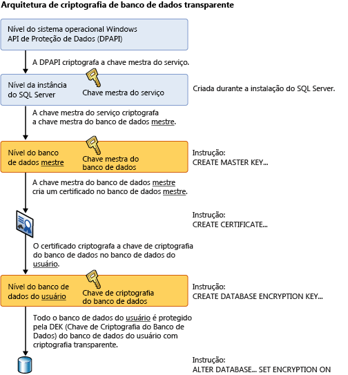

# <a name="transparent-data-encryption-tde"></a>Criptografia de Dados Transparente (TDE)
[!INCLUDE[appliesto-ss-asdb-asdw-pdw-md](../../../includes/appliesto-ss-asdb-asdw-pdw-md.md)]

 > Para ver o conteúdo relacionado a versões anteriores do SQL Server, consulte [TDE (Transparent Data Encryption)](https://msdn.microsoft.com/library/bb934049(SQL.120).aspx).

  *TDE* (Transparent Data Encryption) criptografa os arquivos de dados [!INCLUDE[ssNoVersion](../../../includes/ssnoversion-md.md)], [!INCLUDE[ssSDSFull](../../../includes/sssdsfull-md.md)]e [!INCLUDE[ssSDWfull](../../../includes/sssdwfull-md.md)] , o que é conhecido como criptografia de dados em repouso. Você pode tomar várias precauções para ajudar a proteger o banco de dados como, por exemplo, projetando um sistema seguro, criptografando ativos confidenciais e criando um firewall em torno dos servidores de banco de dados. No entanto, em um cenário no qual a mídia física (como unidades ou fitas de backup) é roubada, um terceiro mal-intencionado pode restaurar ou anexar o banco de dados e navegar pelos dados. Uma solução é criptografar dados confidenciais no banco de dados e proteger as chaves usadas para criptografar os dados com um certificado. Isso impede que alguém sem as chaves use os dados, mas esse tipo de proteção deve ser planejado antecipadamente.  
  
 A TDE realiza a criptografia e a descriptografia de E/S em tempo real dos arquivos de dados e de log. A criptografia usa uma DEK (chave de criptografia do banco de dados), que é armazenada no registro de inicialização do banco de dados para disponibilidade durante a recuperação. A DEK é uma chave simétrica protegida por um certificado armazenado no banco de dados mestre do servidor ou uma chave assimétrica protegida por um módulo EKM. A TDE protege os dados “em repouso”, ou seja, os dados e arquivos de log. Fornece a capacidade de se adequar a muitas leis, regulamentos e diretrizes estabelecidos em vários setores. Isso permite que os desenvolvedores de software criptografem dados usando algoritmos de criptografia AES e 3DES, sem alterar os aplicativos existentes.  
  
> [!IMPORTANT]  
>  A TDE não fornece criptografia em canais de comunicação. Para obter mais informações sobre como criptografar dados em canais de comunicação, veja [Habilitar conexões criptografadas no Mecanismo de Banco de Dados &#40;SQL Server Configuration Manager&#41;](../../../database-engine/configure-windows/enable-encrypted-connections-to-the-database-engine.md).  
>   
>  **Tópicos relacionados:**  
>   
>  -   [Transparent Data Encryption com o Banco de Dados SQL do Azure](../../../relational-databases/security/encryption/transparent-data-encryption-azure-sql.md)  
> -   [Introdução à TDE (Transparent Data Encryption) no SQL Data Warehouse](https://azure.microsoft.com/documentation/articles/sql-data-warehouse-encryption-tde-tsql/)  
> -   [Mover um banco de dados protegido por TDE para outro SQL Server](../../../relational-databases/security/encryption/move-a-tde-protected-database-to-another-sql-server.md)  
> -   [Habilitar TDE no SQL Server usando EKM](../../../relational-databases/security/encryption/enable-tde-on-sql-server-using-ekm.md)   
> -   [Usar o Conector do SQL Server com recursos de criptografia do SQL](../../../relational-databases/security/encryption/use-sql-server-connector-with-sql-encryption-features.md)
> - [O blog de segurança do SQL Server na TDE com Perguntas frequentes](https://blogs.msdn.microsoft.com/sqlsecurity/2016/10/05/feature-spotlight-transparent-data-encryption-tde/)
 
  
## <a name="about-tde"></a>Sobre a TDE  
 A criptografia do arquivo de banco de dados é executada no nível de página. As páginas em um banco de dados criptografado são criptografadas antes de serem gravadas no disco e descriptografadas quando lidas na memória. A TDE não aumenta o tamanho do banco de dados criptografado.  
  
 **Informações aplicáveis a [!INCLUDE[ssSDS](../../../includes/sssds-md.md)]**  
  
 Ao usar a TDE com o [!INCLUDE[sqldbesa](../../../includes/sqldbesa-md.md)] V12, o certificado de nível de servidor armazenado no banco de dados mestre é criado automaticamente pelo [!INCLUDE[ssSDS](../../../includes/sssds-md.md)]. Para mover um banco de dados de TDE no [!INCLUDE[ssSDS](../../../includes/sssds-md.md)] é necessário descriptografar o banco de dados, movê-lo e habilitar novamente a TDE no destino [!INCLUDE[ssSDS](../../../includes/sssds-md.md)]. Para obter instruções passo a passo para a TDE em [!INCLUDE[ssSDS](../../../includes/sssds-md.md)], consulte [Transparent Data Encryption with Azure SQL Database](../../../relational-databases/security/encryption/transparent-data-encryption-azure-sql.md).  
  
 **Informações aplicáveis a [!INCLUDE[ssNoVersion](../../../includes/ssnoversion-md.md)]**  
  
 Depois de protegido, o banco de dados pode ser restaurado usando o certificado correto. Para obter mais informações sobre certificados, consulte [SQL Server Certificates and Asymmetric Keys](../../../relational-databases/security/sql-server-certificates-and-asymmetric-keys.md).  
  
 Ao habilitar a TDE, você deve imediatamente fazer o backup do certificado e da chave privada associada ao certificado. Se em algum momento o certificado ficar indisponível ou caso você deseje restaurar ou anexar o banco de dados a outro servidor, você precisará dos backups do certificado e da chave privada ou não será possível abrir o banco de dados. O certificado de criptografia deve ser retido até mesmo se o TDE já não estiver habilitado no banco de dados. Mesmo que o banco de dados não seja criptografado, partes do log de transações ainda poderão permanecer protegidas e talvez o certificado seja necessário para algumas operações até a realização do backup completo do banco de dados. Um certificado que excedeu sua data de validade ainda pode ser usado para criptografar e descriptografar dados com TDE.  
  
 **Hierarquia de criptografia**  
  
 A ilustração a seguir mostra a arquitetura de criptografia da TDE. Somente os itens de nível de banco de dados (a chave de criptografia do banco de dados e partes de ALTER DATABASE são configuráveis pelo usuário ao usar TDE em [!INCLUDE[ssSDS](../../../includes/sssds-md.md)]).  
  
   
  
## <a name="using-transparent-data-encryption"></a>Usando Transparent Data Encryption  
 Para usar a TDE, execute estes procedimentos.  
  
**Aplica-se a**: [!INCLUDE[ssNoVersion](../../../includes/ssnoversion-md.md)].  
  
-   Crie uma chave mestra  
  
-   Crie ou obtenha um certificado protegido pela chave mestra  
  
-   Crie uma chave de criptografia de banco de dados e proteja-a com o certificado  
  
-   Defina o banco de dados para usar criptografia  
  
 O exemplo a seguir ilustra criptografia e descriptografia do banco de dados `AdventureWorks2012` usando um certificado instalado no servidor nomeado `MyServerCert`.  
  
```sql  
USE master;  
GO  
CREATE MASTER KEY ENCRYPTION BY PASSWORD = '<UseStrongPasswordHere>';  
go  
CREATE CERTIFICATE MyServerCert WITH SUBJECT = 'My DEK Certificate';  
go  
USE AdventureWorks2012;  
GO  
CREATE DATABASE ENCRYPTION KEY  
WITH ALGORITHM = AES_128  
ENCRYPTION BY SERVER CERTIFICATE MyServerCert;  
GO  
ALTER DATABASE AdventureWorks2012  
SET ENCRYPTION ON;  
GO  
```  
  
 As operações de criptografia e descriptografia são agendadas em threads em segundo plano pelo [!INCLUDE[ssNoVersion](../../../includes/ssnoversion-md.md)]. É possível exibir o status dessas operações usando exibições do catálogo e de gerenciamento dinâmico na lista mostrada posteriormente neste tópico.  
  
> [!CAUTION]  
>  Os arquivos de backup de bancos de dados com TDE habilitada também são criptografados usando a chave de criptografia do banco de dados. Como resultado, quando você restaura esses backups, o certificado que protege a chave de criptografia do banco de dados deve estar disponível. Isso significa que, além de fazer backup do banco de dados, você deve assegurar que os backups dos certificados de servidor sejam mantidos para evitar perda de dados. Se o certificado não estiver mais disponível, haverá perda de dados. Para obter mais informações, consulte [SQL Server Certificates and Asymmetric Keys](../../../relational-databases/security/sql-server-certificates-and-asymmetric-keys.md).  
  
## <a name="commands-and-functions"></a>Comandos e funções  
 Os certificados da TDE devem ser criptografados pela chave mestra do banco de dados para serem aceitos pelas instruções a seguir. Se forem criptografados somente pela senha, serão rejeitados pelas instruções como criptografadores.  
  
> [!IMPORTANT]  
>  A alteração de certificados para que sejam protegidos por senha após usarem a TDE fará com que o banco de dados se torne inacessível após uma reinicialização.  
  
 A tabela a seguir fornece links e explicações de comandos e funções da TDE.  
  
|Comando ou função|Finalidade|  
|-------------------------|-------------|  
|[CREATE DATABASE ENCRYPTION KEY &#40;Transact-SQL&#41;](../../../t-sql/statements/create-database-encryption-key-transact-sql.md)|Cria uma chave usada para criptografar um banco de dados.|  
|[ALTER DATABASE ENCRYPTION KEY &#40;Transact-SQL&#41;](../../../t-sql/statements/alter-database-encryption-key-transact-sql.md)|Altera a chave usada para criptografar um banco de dados.|  
|[DROP DATABASE ENCRYPTION KEY &#40;Transact-SQL&#41;](../../../t-sql/statements/drop-database-encryption-key-transact-sql.md)|Remove a chave usada para criptografar um banco de dados.|  
|[Opções ALTER DATABASE SET &#40;Transact-SQL&#41;](../../../t-sql/statements/alter-database-transact-sql-set-options.md)|Explica a opção **ALTER DATABASE** usada para habilitar a TDE.|  
  
## <a name="catalog-views-and-dynamic-management-views"></a>Exibições do catálogo e exibições de gerenciamento dinâmico  
 A tabela a seguir mostra exibições do catálogo de TDE e exibições de gerenciamento dinâmico.  
  
|Exibição do catálogo ou exibição de gerenciamento dinâmico|Finalidade|  
|---------------------------------------------|-------------|  
|[sys.databases &#40;Transact-SQL&#41;](../../../relational-databases/system-catalog-views/sys-databases-transact-sql.md)|Exibição do catálogo que exibe informações do banco de dados.|  
|[sys.certificates &#40;Transact-SQL&#41;](../../../relational-databases/system-catalog-views/sys-certificates-transact-sql.md)|Exibição do catálogo que mostra os certificados em um banco de dados.|  
|[sys.dm_database_encryption_keys &#40;Transact-SQL&#41;](../../../relational-databases/system-dynamic-management-views/sys-dm-database-encryption-keys-transact-sql.md)|Exibição de gerenciamento dinâmico que fornece informações sobre as chaves de criptografia usadas em um banco de dados e o estado da criptografia de um banco de dados.|  
  
## <a name="permissions"></a>Permissões  
 Cada recurso e comando da TDE têm requisitos individuais de permissões, descritos nas tabelas anteriores.  
  
 A exibição de metadados envolvidos com TDE requer a permissão VIEW DEFINITION no certificado.  
  
## <a name="considerations"></a>Considerações  
 Quando um exame de recriptografia para uma operação de criptografia de banco de dados está em andamento, as operações de manutenção no banco de dados são desabilitadas. Você pode usar a configuração de modo de usuário único para que o banco de dados execute a operação de manutenção. Para obter mais informações, veja [Definir um banco de dados como modo de usuário único](../../../relational-databases/databases/set-a-database-to-single-user-mode.md).  
  
 É possível localizar o estado da criptografia do banco de dados usando a exibição de gerenciamento dinâmico sys.dm_database_encryption_keys. Para obter mais informações, veja a seção “Exibições de catálogo e exibições de gerenciamento dinâmico” no início deste tópico).  
  
 Na TDE, todos os arquivos e os grupos de arquivos do banco de dados são criptografados. Se algum grupo de arquivos em um banco de dados estiver marcado como READ ONLY, haverá falha na operação de criptografia de banco de dados.  
  
 Se um banco de dados estiver sendo usado no espelhamento de banco de dados ou envio de logs, ambos os bancos de dados serão criptografados. As transações de logs serão criptografadas quando enviadas entre eles.  
  
> [!IMPORTANT]  
>  Índices de texto completo novos serão criptografados quando um banco de dados for definido para criptografia. Índices de texto completo criados antes do SQL Server 2008 serão importados para o banco de dados durante a atualização para o SQL Server 2008 ou posterior e serão criptografados por TDE.  

> [!TIP]  
> Para monitorar alterações no status de TDE do banco de dados, use a Auditoria do SQL Server ou a Auditoria de Banco de Dados SQL. Para o SQL Server, o TDE é controlado no grupo de ação de auditoria DATABASE_CHANGE_GROUP que pode ser encontrado em [Ações e grupos de ações de auditoria do SQL Server](../../../relational-databases/security/auditing/sql-server-audit-action-groups-and-actions.md).
  
### <a name="restrictions"></a>Restrições  
 As operações seguintes não são permitidas durante criptografia de banco de dados inicial, alteração de chave ou descriptografia de banco de dados:  
  
-   Descartando um arquivo de um grupo de arquivos no banco de dados  
  
-   Descartando o banco de dados  
  
-   Colocando o banco de dados offline  
  
-   Desanexando um banco de dados  
  
-   Fazendo a transição de um banco de dados ou grupo de arquivos para um estado READ ONLY  
  
 As operações a seguir não são permitidas durante a execução das instruções CREATE DATABASE ENCRYPTION KEY, ALTER DATABASE ENCRYPTION KEY, DROP DATABASE ENCRYPTION KEY ou ALTER DATABASE...SET ENCRYPTION.  
  
-   Descartando um arquivo de um grupo de arquivos no banco de dados.  
  
-   Descartando o banco de dados.  
  
-   Colocando o banco de dados offline.  
  
-   Desanexando um banco de dados.  
  
-   Fazendo a transição de um banco de dados ou grupo de arquivos para um estado READ ONLY.  
  
-   Usando um comando ALTER DATABASE.  
  
-   Iniciando um banco de dados ou backup de arquivo de banco de dados.  
  
-   Iniciando um banco de dados ou restauração de arquivo de banco de dados.  
  
-   Criando um instantâneo.  
  
 As operações e as condições a seguir impedirão a execução das instruções CREATE DATABASE ENCRYPTION KEY, ALTER DATABASE ENCRYPTION KEY, DROP DATABASE ENCRYPTION KEY ou ALTER DATABASE...SET ENCRYPTION.  
  
-   O banco de dados é somente leitura ou tem grupos de arquivo somente leitura.  
  
-   Um comando ALTER DATABASE está em execução.  
  
-   Algum backup de dados está sendo executado.  
  
-   O banco de dados está em condição de restauração ou offline.  
  
-   Um instantâneo está em andamento.  
  
-   Tarefas de manutenção do banco de dados.  
  
 Durante a criação de arquivos de banco de dados, a inicialização instantânea do arquivo não está disponível quando a TDE está habilitada.  
  
 Para criptografar a chave de criptografia de banco de dados com uma chave assimétrica, essa chave deve residir em um provedor de gerenciamento extensível de chaves.  
  
### <a name="transparent-data-encryption-and-transaction-logs"></a>Transparent Data Encryption e logs de transação  
 A habilitação de um banco de dados para usar TDE tem o efeito de zerar a parte remanescente do log de transações virtuais para impor o próximo log de transações virtuais. Isso garante que nenhum texto não criptografado seja deixado nos logs de transações depois que o banco de dados for definido para criptografia. Você pode localizar o status da criptografia de arquivo de log visualizando a coluna `encryption_state` na exibição `sys.dm_database_encryption_keys`, como neste exemplo:  
  
```  
USE AdventureWorks2012;  
GO  
/* The value 3 represents an encrypted state   
   on the database and transaction logs. */  
SELECT *  
FROM sys.dm_database_encryption_keys  
WHERE encryption_state = 3;  
GO  
```  
  
 Para obter mais informações sobre a arquitetura de arquivos de log do [!INCLUDE[ssNoVersion](../../../includes/ssnoversion-md.md)], veja [O log de transações &#40;SQL Server&#41;](../../../relational-databases/logs/the-transaction-log-sql-server.md).  
  
 Todos os dados gravados no log de transações antes de uma alteração na chave de criptografia do banco de dados serão criptografados usando a chave de criptografia do banco de dados anterior.  
  
 Depois que uma chave de criptografia de banco de dados foi modificada duas vezes, um backup de log deve ser executado para que a chave de criptografia de banco de dados possa ser modificada novamente.  
  
### <a name="transparent-data-encryption-and-the-tempdb-system-database"></a>Transparent Data Encryption e o banco de dados do sistema tempdb  
 O banco de dados do sistema tempdb será criptografado se nenhum outro banco de dados na instância do [!INCLUDE[ssNoVersion](../../../includes/ssnoversion-md.md)] for criptografado usando TDE. Isso pode ter um efeito de desempenho em bancos de dados não criptografados na mesma instância do [!INCLUDE[ssNoVersion](../../../includes/ssnoversion-md.md)]. Para obter mais informações sobre o banco de dados do sistema tempdb, [Banco de dados tempdb](../../../relational-databases/databases/tempdb-database.md).  
  
### <a name="transparent-data-encryption-and-replication"></a>Transparent Data Encryption e replicação  
 A replicação não replica automaticamente os dados de um banco de dados habilitado para TDE em um formulário criptografado. É necessário habilitar separadamente a TDE se você deseja proteger a distribuição e os bancos de dados dos assinantes. A replicação de instantâneo, assim como a distribuição inicial de dados para replicações transacionais e de mesclagem, pode armazenar dados em arquivos intermediários não criptografados, como os arquivos bcp, por exemplo.  Durante replicação transacional ou de mesclagem, a criptografia pode ser habilitada para proteger o canal de comunicação. Para obter mais informações, veja [Habilitar conexões criptografadas no Mecanismo de Banco de Dados &#40;SQL Server Configuration Manager&#41;](../../../database-engine/configure-windows/enable-encrypted-connections-to-the-database-engine.md).  
  
### <a name="transparent-data-encryption-and-filestream-data"></a>Transparent Data Encryption e FILESTREAM DATA  
 Os dados FILESTREAM não são criptografados nem mesmo quando a TDE está habilitada.  
  
## <a name="transparent-data-encryption-and-buffer-pool-extension"></a>Transparent Data Encryption e Extensão do Pool de Buffers  
 Arquivos relacionados à BPE (extensão do pool de buffers) não são criptografados quando o banco de dados é criptografado usando TDE. Você deve usar ferramentas de criptografia no nível de sistema de arquivos como Bitlocker ou EFS para arquivos relacionados à BPE.  
  
## <a name="transparent-data-encryption-and-in-memory-oltp"></a>Transparent Data Encryption e OLTP na memória  
 A TDE pode ser habilitada em um banco de dados que tenha objetos OLTP na memória. No [!INCLUDE[ssSQL15](../../../includes/sssql15-md.md)] e no [!INCLUDE[ssSDSfull](../../../includes/sssdsfull-md.md)] , os dados e os registros de log do OLTP in-memory serão criptografados se a TDE estiver habilitada. No [!INCLUDE[ssSQL14](../../../includes/sssql14-md.md)] , os registros de log do OLTP in-memory serão criptografados se a TDE estiver habilitada, mas os arquivos no grupo de arquivos MEMORY_OPTIMIZED_DATA não serão criptografados.  
  
## <a name="related-tasks"></a>Tarefas relacionadas  
 [Mover um banco de dados protegido por TDE para outro SQL Server](../../../relational-databases/security/encryption/move-a-tde-protected-database-to-another-sql-server.md)  
 [Habilitar TDE no SQL Server usando EKM](../../../relational-databases/security/encryption/enable-tde-on-sql-server-using-ekm.md)  
 [Gerenciamento extensível de chaves usando o Cofre de Chaves do Azure &#40;SQL Server&#41;](../../../relational-databases/security/encryption/extensible-key-management-using-azure-key-vault-sql-server.md)  
  
## <a name="related-content"></a>Conteúdo relacionado  
 [Transparent Data Encryption com o Banco de Dados SQL do Azure](../../../relational-databases/security/encryption/transparent-data-encryption-azure-sql.md)  
 [Introdução à TDE (Transparent Data Encryption) no SQL Data Warehouse](https://azure.microsoft.com/documentation/articles/sql-data-warehouse-encryption-tde-tsql/)  
 [Criptografia do SQL Server](../../../relational-databases/security/encryption/sql-server-encryption.md)  
 [Chaves de criptografia do SQL Server e banco de dados &#40;Mecanismo de Banco de Dados&#41;](../../../relational-databases/security/encryption/sql-server-and-database-encryption-keys-database-engine.md)  
   
## <a name="see-also"></a>Consulte também  
 [Central de segurança do Mecanismo de Banco de Dados do SQL Server e Banco de Dados SQL do Azure](../../../relational-databases/security/security-center-for-sql-server-database-engine-and-azure-sql-database.md)   
 [FILESTREAM &#40;SQL Server&#41;](../../../relational-databases/blob/filestream-sql-server.md)  
  
  
