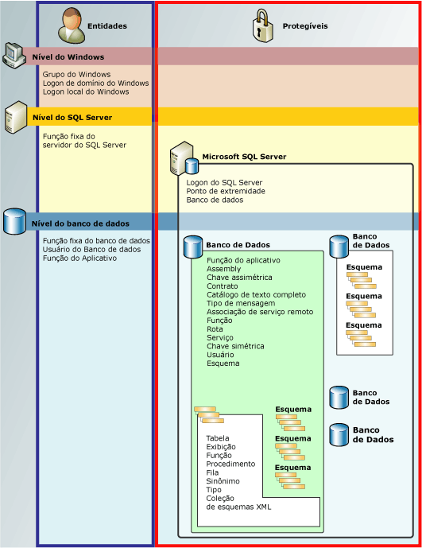

# Hierarquia de permissões (Mecanismo de Banco de Dados)
[!INCLUDE[appliesto-ss-asdb-asdw-pdw-md](../../includes/appliesto-ss-asdb-asdw-pdw-md.md)]

  O [!INCLUDE[ssDE](../../includes/ssde-md.md)] gerencia uma coleção hierárquica de entidades que podem ser protegidas com permissões. Essas entidades são conhecidas como *protegíveis*. Os protegíveis mais proeminentes são servidores e bancos de dados, mas podem ser definidas permissões discretas em um nível muito mais específico. [!INCLUDE[ssNoVersion](../../includes/ssnoversion-md.md)] regula as ações de entidades de segurança em protegíveis verificando se as permissões apropriadas foram concedidas.  
  
 A ilustração a seguir mostra todas as relações entre as hierarquias de permissões do [!INCLUDE[ssDE](../../includes/ssde-md.md)] .  
  
 O sistema de permissões funciona da mesma em todas as versões do [!INCLUDE[ssNoVersion](../../includes/ssnoversion-md.md)], [!INCLUDE[ssSDS](../../includes/sssds-md.md)], [!INCLUDE[ssDW](../../includes/ssdw-md.md)]e [!INCLUDE[ssAPS](../../includes/ssaps-md.md)]. No entanto, alguns recursos não estão disponíveis em todas as versões. Por exemplo, a permissão de nível de servidor não pode ser configurada em produtos do Azure.  
  
   
  
## Gráfico de permissões do SQL Server  
 Para obter um cartaz gráfico dimensionado de todas as permissões do [!INCLUDE[ssDE](../../includes/ssde-md.md)] em formato pdf, veja [http://go.microsoft.com/fwlink/?LinkId=229142](http://go.microsoft.com/fwlink/?LinkId=229142).  
  
## Trabalhando com permissões  
 As permissões podem ser manipuladas com as conhecidas consultas [!INCLUDE[tsql](../../includes/tsql-md.md)] GRANT, DENY e REVOKE. Informações sobre permissões são visíveis nas exibições de catálogo [sys.server_permissions](../../relational-databases/system-catalog-views/sys-server-permissions-transact-sql.md) e [sys.database_permissions](../../relational-databases/system-catalog-views/sys-database-permissions-transact-sql.md) . Há também suporte para informações de permissões de consulta usando funções internas.  
  
 Para obter informações sobre como criar um sistema de permissões, veja [Introdução às permissões do mecanismo de banco de dados](../../relational-databases/security/authentication-access/getting-started-with-database-engine-permissions.md).  
  
## Consulte também  
 [Protegendo o SQL Server](../../relational-databases/security/securing-sql-server.md)   
 [Permissões &#40;Mecanismo de Banco de Dados&#41;](../../relational-databases/security/permissions-database-engine.md)   
 [Securables](../../relational-databases/security/securables.md)   
 [Entidades &#40;Mecanismo de Banco de Dados&#41;](../../relational-databases/security/authentication-access/principals-database-engine.md)   
 [GRANT &#40;Transact-SQL&#41;](../../t-sql/statements/grant-transact-sql.md)   
 [REVOKE &#40;Transact-SQL&#41;](../../t-sql/statements/revoke-transact-sql.md)   
 [DENY &#40;Transact-SQL&#41;](../../t-sql/statements/deny-transact-sql.md)   
 [HAS_PERMS_BY_NAME &#40;Transact-SQL&#41;](../../t-sql/functions/has-perms-by-name-transact-sql.md)   
 [sys.fn_builtin_permissions &#40;Transact-SQL&#41;](../../relational-databases/system-functions/sys-fn-builtin-permissions-transact-sql.md)   
 [sys.server_permissions &#40;Transact-SQL&#41;](../../relational-databases/system-catalog-views/sys-server-permissions-transact-sql.md)   
 [sys.database_permissions &#40;Transact-SQL&#41;](../../relational-databases/system-catalog-views/sys-database-permissions-transact-sql.md)  
  
  
