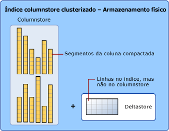
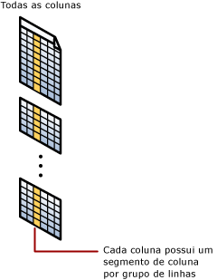

# <a name="sql-server-index-architecture-and-design-guide"></a>Guia de arquitetura e design de índices do SQL Server
[!INCLUDE[appliesto-ss-asdb-asdw-pdw-md](../includes/appliesto-ss-asdb-asdw-pdw-md.md)]

Os índices criados inadequadamente e a falta de índices são as principais fontes de gargalos do aplicativo de banco de dados. A criação eficiente de índices é muito importante para alcançar um bom desempenho de banco de dados e de aplicativo. Este guia de design de índices do [!INCLUDE[ssNoVersion](../includes/ssnoversion-md.md)] contém informações sobre a arquitetura de índices e as melhores práticas para ajudá-lo a criar índices efetivos de acordo com as necessidades de seu aplicativo.  
    
Este guia presume que o leitor tenha uma compreensão geral dos tipos de índices disponíveis no [!INCLUDE[ssNoVersion](../includes/ssnoversion-md.md)]. Para obter uma descrição geral dos tipos de índices, consulte [Tipos de índice](../relational-databases/indexes/indexes.md).  

Este guia aborda os seguintes tipos de índices:

-   Clusterizado
-   Não clusterizado
-   Exclusivo
-   Filtered
-   columnstore
-   Hash
-   Não clusterizado com otimização de memória

Para obter informações sobre índices XML, consulte [Visão geral de índices XML](../relational-databases/xml/xml-indexes-sql-server.md).

Para obter informações sobre índices espaciais, consulte [Visão geral de índices espaciais](../relational-databases/spatial/spatial-indexes-overview.md).

Para obter informações sobre índices de texto completo, consulte [Popular índices de texto completo](../relational-databases/search/populate-full-text-indexes.md).
  
##  <a name="Basics"></a> Noções básicas sobre criação de índice  
 Pense em um livro normal: no final do livro, há um índice que ajuda a localizar rapidamente as informações dentro dele. O índice é uma lista classificada de palavras-chave e, ao lado de cada palavra-chave, está um conjunto de números de página que aponta para as páginas em que cada palavra-chave pode ser encontrada. Um índice do SQL Server não é diferente: é uma lista ordenada de valores e, para cada valor, há ponteiros para as [páginas](../relational-databases/pages-and-extents-architecture-guide.md) de dados em que esses valores estão localizados. O índice em si é armazenado em páginas, compondo as Páginas de Índice no SQL Server. Em um livro normal, se o índice abranger várias páginas e você precisar localizar ponteiros para todas as páginas que contêm a palavra "SQL", por exemplo, você precisará folhear até encontrar a página de índice que contém a palavra-chave "SQL". De lá, você seguirá os ponteiros para todas as páginas do livro.  Isso poderá ser otimizado ainda mais se, no início do índice, você criar uma única página contendo uma lista alfabética do local em que cada letra pode ser encontrada. Por exemplo:  "A a D – página 121", "E a G – página 122" e assim por diante. Essa página adicional eliminaria a etapa de folhear no índice para encontrar o local inicial. Essa página não existe em livros normais, mas existe em um índice do SQL Server. Essa página única é chamada de página raiz do índice. A página raiz é a página inicial da estrutura de árvore usada por um índice do SQL Server. Seguindo a analogia da árvore, as páginas finais que contêm ponteiros para os dados reais são chamadas de "páginas de folha" da árvore. 

 Um índice do SQL Server é uma estrutura em disco ou na memória associada a uma tabela ou exibição que acelera a recuperação de linhas de uma tabela ou exibição. Um índice contém chaves criadas de uma ou mais colunas da tabela ou exibição. Para índices em disco, essas chaves são armazenadas em uma estrutura de árvore (árvore B) que permite ao SQL Server localizar a linha ou as linhas associadas aos valores de chave de forma rápida e eficaz.  

 Um índice armazena dados logicamente organizados como uma tabela com linhas e colunas e fisicamente armazenados em um formato de dados de linha chamado *rowstore* <sup>1</sup> ou armazenados em um formato de dados de coluna chamado *[columnstore](#columnstore_index)* .  
    
 A seleção dos índices certos para um banco de dados e sua carga de trabalho é um ato de balanceamento complexo entre a velocidade de consulta e o custo de atualização. Índices limitados ou com poucas colunas na chave de índice exigem menos espaço em disco e sobrecarga de manutenção. Por outro lado, índices amplos cobrem mais consultas. Talvez você precise experimentar vários projetos diferentes antes de encontrar o índice mais eficiente. Os índices podem ser adicionados, modificados e descartados sem afetar o esquema de banco de dados ou o design do aplicativo. Portanto, você não deve hesitar em experimentar índices diferentes.  
  
 O otimizador de consulta no [!INCLUDE[ssNoVersion](../includes/ssnoversion-md.md)] escolhe o índice mais eficaz de forma confiável na grande maioria dos casos. Sua estratégia geral de criação de índice deveria fornecer uma variedade de opções de índices para o otimizador de consulta escolher e confiar durante a tomada de decisão correta. Isso reduz o tempo de análise e atinge um bom desempenho em várias situações. Para consultar quais índices o otimizador de consulta usa em uma consulta específica, no [!INCLUDE[ssManStudioFull](../includes/ssmanstudiofull-md.md)], no menu **Consulta** , selecione **Incluir Plano de Execução Real**.  
  
 Não equipare sempre o uso de índice com bom desempenho e bom desempenho com uso de índice eficiente. Se o uso de um índice sempre ajudasse a produzir o melhor desempenho, a tarefa do otimizador de consulta seria simples. Na realidade, a escolha incorreta de um índice pode causar um desempenho insatisfatório. Portanto, a tarefa do otimizador de consulta é selecionar um índice ou uma combinação de índices apenas quando isso gerar melhoria de desempenho e evitar a recuperação indexada quando isso atrapalhar o desempenho.  

 <sup>1</sup> Rowstore tem sido o modo tradicional de armazenar dados de tabela relacional. No [!INCLUDE[ssNoVersion](../includes/ssnoversion-md.md)], rowstore refere-se à tabela em que o formato de armazenamento de dados subjacente é um heap, uma árvore B ([índice clusterizado](#Clustered)) ou uma tabela com otimização de memória.

### <a name="index-design-tasks"></a>Tarefas de criação de índice  
 As seguintes tarefas compõem a estratégia recomendada para criação de índices:  
  
1.  Entenda as características do banco de dados. 
    * Por exemplo, é um banco de dados OLTP (processamento de transações online) com modificações frequentes de dados que deve manter uma alta taxa de transferência. A partir do [!INCLUDE[ssSQL14](../includes/sssql14-md.md)], as tabelas e os índices com otimização de memória são especialmente apropriados para este cenário, fornecendo um design livre de travas. Para obter mais informações, consulte [Índices para tabelas com otimização de memória](../relational-databases/in-memory-oltp/indexes-for-memory-optimized-tables.md) ou [Diretrizes de design de índice não clusterizado para tabelas com otimização de memória](#inmem_nonclustered_index) e [Diretrizes de design de índice de hash para tabelas com otimização de memória](#hash_index) neste guia.
    * Se preferir, veja um exemplo de um banco de dados DSS (sistema de apoio à decisão) ou OLAP (data warehouse) que deve processar conjuntos de dados muito grandes rapidamente. A partir do [!INCLUDE[ssSQL11](../includes/sssql11-md.md)], os índices columnstores são especialmente apropriados para conjuntos de dados de data warehouse típicos. Os índices columnstore podem transformar a experiência com data warehouse para usuários proporcionando um desempenho mais rápido para consultas de data warehouse comuns, como filtragem, agregação, agrupamento ou consultas de junção em estrela. Para obter mais informações, consulte [Visão geral de índices columnstore](../relational-databases/indexes/columnstore-indexes-overview.md) ou [Diretrizes de design de índice columnstore](#columnstore_index) neste guia.  

2.  Entenda as características das consultas mais usadas. Por exemplo, saber que uma consulta usada frequentemente associa duas ou mais tabelas o ajudará a determinar o melhor tipo de índice a ser usado.  
  
3.  Entenda as características das colunas usadas nas consultas. Por exemplo, um índice é ideal para colunas que tenham um tipo de dados de inteiro e, também, colunas exclusivas ou não nulas. Para colunas que têm subconjuntos bem definido de dados, é possível usar um índice filtrado no [!INCLUDE[ssKatmai](../includes/sskatmai-md.md)] e versões posteriores. Para obter mais informações, consulte [Diretrizes de criação de índice filtrado](#Filtered) neste guia.  
  
4.  Determine quais opções de índice poderiam aumentar o desempenho na criação ou manutenção do índice. Por exemplo, a criação de um índice clusterizado em uma tabela grande existente se beneficiará da opção de índice `ONLINE`. A opção ONLINE permite que atividade simultânea nos dados subjacentes continue enquanto o índice está sendo criado ou reconstruído. Para obter mais informações sobre opções de índice, consulte [Definir opções de índice](../relational-databases/indexes/set-index-options.md).  
  
5.  Determine o melhor local de armazenamento para o índice. Um índice não clusterizado pode ser armazenado no mesmo grupo de arquivos que a tabela subjacente ou em um grupo de arquivos diferente. O local de armazenamento de índices pode melhorar o desempenho de consulta aumentando desempenho de E/S do disco. Por exemplo, o armazenamento de um índice não clusterizado em um grupo de arquivos que está em um disco diferente do grupo de arquivos de tabela pode melhorar o desempenho porque vários discos podem ser lidos ao mesmo tempo.  
     Alternativamente, os índices clusterizados e não clusterizados podem usar um esquema de partição em vários grupos de arquivos. O particionamento facilita o gerenciamento de tabelas ou índices grandes permitindo o acesso ou o gerenciamento de subconjuntos de dados de forma rápida e eficaz, enquanto mantém a integridade geral da coleção. Para saber mais, confira [Partitioned Tables and Indexes](../relational-databases/partitions/partitioned-tables-and-indexes.md). Quando você pensar em particionamento, determine se o índice deve ser alinhado; isto é, particionado essencialmente da mesma maneira que a tabela ou particionado de forma independente.   

##  <a name="General_Design"></a> Diretrizes para criação de índice geral  
 Administradores de banco de dados experientes podem projetar um bom conjunto de índices, mas essa tarefa é muito complexa, demorada e propensa a erros até mesmo para bancos de dados e cargas de trabalho moderadamente complexos. Compreender as características de seu banco de dados, consultas e colunas de dados pode lhe ajudar a projetar índices melhores.  
  
### <a name="database-considerations"></a>Considerações sobre banco de dados  
 Quando você projeta um índice, considere as seguintes diretrizes para banco de dados:  
  
-   Números grandes de índices em uma tabela afetam o desempenho das instruções `INSERT`, `UPDATE`, `DELETE` e `MERGE` porque todos os índices precisam ser ajustados adequadamente à medida que os dados são alterados em uma tabela. Por exemplo, se uma coluna for usada em vários índices e você executar uma instrução `UPDATE` que modifica os dados dessa coluna, todos os índices que contêm essa coluna deverão ser atualizados, bem como a coluna na tabela base subjacente (heap ou índice clusterizado).  
  
    -   Evite tabelas fortemente atualizadas em cima desindexações e mantenha os índices estreitos, ou seja, com o mínimo de colunas possível.  
  
    -   Use muitos índices para aperfeiçoar o desempenho da consulta em tabelas com baixos requisitos de atualização, mas com grandes volumes de dados. Grandes números de índices podem ajudar o desempenho de consultas que não modificam dados, como instruções SELECT, porque o otimizador de consulta tem mais índices para escolher para determinar o método de acesso mais rápido.  
  
-   Indexar tabelas pequenas pode não ser bom porque pode fazer o otimizador de consulta levar mais tempo para atravessar o índice procurando dados do que executar uma simples varredura de tabela. Portanto, os índices em tabelas pequenas talvez nunca sejam usados, mas ainda devem ser mantidos como dados nas alterações de tabela.  
  
-   Índices em exibições pode prover ganhos de desempenho significantes quando a exibição contiver agregações, junções de tabela ou uma combinação de agregações e junções. A exibição não precisa estar explicitamente referenciada na consulta para o otimizador de consulta usá-la.  
  
-   Use o Orientador de Otimização do Mecanismo de Banco de Dados para analisar seu banco de dados e fazer recomendações de índice. Para obter mais informações, consulte [Database Engine Tuning Advisor](../relational-databases/performance/database-engine-tuning-advisor.md).  
  
### <a name="query-considerations"></a>Considerações sobre consultas  
 Quando você projeta um índice, considere as seguintes diretrizes para consultas:  
  
-   Crie índices não clusterizados nas colunas frequentemente usadas em predicados e condições de junção em consultas. Essas são as colunas SARGable<sup>1</sup>. No entanto, evite adicionar colunas desnecessárias. Acrescentar muitas colunas de índice pode afetar adversamente o espaço em disco e o desempenho de manutenção de índice.  
  
-   Cobrindo índices pode melhorar desempenho de consulta porque todos os dados precisaram satisfazer os requisitos da consulta existe dentro do próprio índice. Ou seja, apenas as páginas de índice, e não as páginas de dados da tabela ou do índice clusterizado, são necessárias para recuperar os dados solicitados, portanto reduzindo as operações de E/S gerais do disco. Por exemplo, uma consulta de colunas **a** e **b** em uma tabela que tem um índice composto criado em colunas **a**, **b**e **c** pode recuperar os dados especificados somente do índice.  

    > [!IMPORTANT]
    > Índices abrangentes são a designação para um [índice não clusterizado](#nonclustered-index-architecture) que resolve um ou vários resultados de consulta semelhantes diretamente, sem acesso à tabela base e sem incorrer em pesquisas.
    > Esses índices têm todas as colunas não [SARGable](#sargable) necessárias em seu nível de folha. Isso significa que as colunas retornadas por qualquer cláusula SELECT e todos os argumentos WHERE e JOIN são cobertos pelo índice.
    > Haverá potencialmente muito menos E/S para executar a consulta, se o índice for estreito o suficiente em comparação com as linhas e colunas da tabela em si, o que significa que ele é um subconjunto real do total de colunas. Considere cobrir índices ao selecionar uma pequena parte de uma tabela grande e quando essa pequena parte for definida por um predicado fixo, como [colunas esparsas](../relational-databases/tables/use-sparse-columns.md) que contêm apenas alguns valores não NULL, por exemplo.
    
-   Escreva consultas que insiram ou modifiquem o máximo de filas possível em uma única instrução, em vez de usar consultas múltiplas para atualizar essas mesmas filas. Ao usar apenas uma instrução, pode-se explorar uma manutenção otimizada do índice.  
  
-   Avalie o tipo da consulta e como as colunas são usadas na consulta. Por exemplo, uma coluna usada em uma consulta de correspondência exata seria uma boa candidata para um índice clusterizado ou não clusterizado.

<a name="sargable"></a><sup>1</sup> o termo SARGable em bancos de dados relacionais se refere a um predicado **S**earch **ARG**ument-**able** que pode aproveitar um índice para acelerar a execução da consulta.
  
### <a name="column-considerations"></a>Considerações sobre colunas  
 Quando você projeta um índice, considere as seguintes diretrizes para as colunas:  
  
-   Mantenha o comprimento da chave de índice curto para os índices clusterizados. Além disso, os índices clusterizados se beneficiam de serem criados em colunas exclusivas ou não nulas.  
  
-   Colunas que são dos tipos de dados **ntext**, **text**, **image**, **varchar(max)** , **nvarchar(max)** e **varbinary(max)** não podem ser especificadas como colunas de chave de índice. Entretanto, os tipos de dados **varchar(max)** , **nvarchar(max)** , **varbinary(max)** e **xml** podem participar de um índice não clusterizado, como colunas de índice não chave. Para obter mais informações, consulte a seção ['Índice com colunas incluídas](#Included_Columns)' neste guia.  
  
-   Um tipo de dados **xml** só pode ser uma coluna de chave em um índice XML. Para obter mais informações, veja [Índices XML &#40;SQL Server&#41;](../relational-databases/xml/xml-indexes-sql-server.md). O SQL Server 2012 SP1 apresenta um novo tipo de índice XML conhecido como um índice XML seletivo. Esse novo índice pode melhorar o desempenho da consulta dos dados armazenados como XML no SQL Server, permitir uma indexação muito mais rápida de cargas de trabalho de dados XML grandes e melhorar a escalabilidade ao reduzir os custos de armazenamento do próprio índice. Para obter mais informações, consulte [Índices XML seletivos &#40;SXI&#41;](../relational-databases/xml/selective-xml-indexes-sxi.md).  
  
-   Examine a singularidade da coluna. Um índice exclusivo em vez de um índice não exclusivo na mesma combinação de colunas, provê informações adicional para o otimizador de consulta, o que torna o índice mais útil. Para obter mais informações, consulte [Diretrizes de design de índice exclusivo](#Unique) neste guia.  
  
-   Examine a distribuição de dados na coluna. Frequentemente, uma consulta longa é causada ao se indexar uma coluna com poucos valores exclusivos, ou ao executar uma junção em tal coluna. Isto é um problema fundamental com dados e consulta, e geralmente não pode ser resolvido sem identificar esta situação. Por exemplo, uma lista telefônica física ordenada alfabeticamente pelo último nome não será rápida em localizar uma pessoa, se todas as pessoas na cidade tiverem nomes de Smith ou Jones. Para obter mais informações sobre distribuição de dados, consulte [Statistics](../relational-databases/statistics/statistics.md).  
  
-   Considere o uso de índices filtrados em colunas com subconjuntos bem definidos, por exemplo, colunas esparsas, colunas com grande a maioria dos valores NULL, colunas com categorias de valores e colunas com intervalos diferentes de valores. Um índice filtrado bem projetado pode melhorar o desempenho da consulta e reduzir os custos de manutenção de índice e de armazenamento.  
  
-   Considere a ordem das colunas se o índice contiver colunas múltiplas. A coluna que é usada na cláusula WHERE em um critério de consulta igual a (=), maior que (>), menor que (>) ou BETWEEN, ou que participa em uma junção, deve ser posicionada primeiro. Colunas adicionais devem ser ordenadas com base em seu nível de distinção, ou seja, do mais distinto ao menos distinto.  
  
     Por exemplo, se o índice for definido como `LastName`, `FirstName` o índice será útil quando o critério de consulta for `WHERE LastName = 'Smith'` ou `WHERE LastName = Smith AND FirstName LIKE 'J%'`. Porém, o otimizador de consulta não usaria o índice para uma consulta que tivesse pesquisado apenas em `FirstName (WHERE FirstName = 'Jane')`.  
  
-   Considere indexar as colunas computadas. Para obter mais informações, consulte [Indexes on Computed Columns](../relational-databases/indexes/indexes-on-computed-columns.md).  
  
### <a name="index-characteristics"></a>Características do índice  
 Depois de ter determinado que um índice é apropriado para uma consulta, você pode selecionar o tipo de índice que melhor se adéque a sua situação. Características de índice incluem o seguinte:  
  
-   Clusterizado X não clusterizado.  
-   Exclusivo X não exclusivo  
-   Única coluna X multicoluna  
-   Ordem crescente ou decrescente em colunas no índice  
-   Tabela completa versus filtrada para índices não clusterizados  
-   Columnstore versus rowstore
-   Hash versus não clusterizado para tabelas com otimização de memória
  
Você também pode personalizar as características de armazenamento inicial do índice para aperfeiçoar seu desempenho ou manutenção definindo uma opção como FILLFACTOR. Além disso, você pode determinar o local de armazenamento de índice usando grupos de arquivos ou esquemas de partição para aperfeiçoar o desempenho.  
  
###  <a name="Index_placement"></a> Posição do índice em grupos de arquivos ou esquemas de partição  
 À medida que desenvolve sua estratégia de design de índices, considere a colocação dos índices nos grupos de arquivos associados ao banco de dados. A seleção cuidadosa do grupo de arquivos ou esquema de partição pode melhorar o desempenho da consulta.  
  
 Por padrão, os índices são armazenados no mesmo grupo de arquivos que a tabela base na qual o índice é criado. Um índice cluster não particionado e a tabela base sempre residem no mesmo grupo de arquivos. No entanto, você pode fazer o seguinte:  
  
-   Crie índices não clusterizados em um grupo de arquivos diferente do grupo de arquivos da tabela base ou do índice clusterizado.  
-   Particione índices cluster e não cluster para que ocupem vários grupos de arquivos.  
-   Mova uma tabela de um grupo de arquivos para outro descartando o índice cluster e especificando um novo grupo de arquivos ou esquema de partição na cláusula MOVE TO da instrução DROP INDEX ou usando a instrução CREATE INDEX com a cláusula DROP_EXISTING.  
  
Ao criar o índice não cluster em um grupo de arquivos diferente, você pode obter ganhos de desempenho se os grupos de arquivos estiverem usando unidades físicas diferentes com seus próprios controladores. As informações de índices e de dados podem ser lidas em paralelo pelas várias cabeças de disco. Por exemplo, se `Table_A` no grupo de arquivos `f1` e `Index_A` no grupo de arquivos `f2` estiverem ambos sendo usados pela mesma consulta, podem-se obter ganhos de desempenho porque os dois grupos de arquivos estão sendo completamente usados sem contenção. Porém, se `Table_A` for verificado pela consulta, mas `Index_A` não for referenciado, apenas o grupo de arquivos `f1` será usado. Isso não cria nenhum ganho de desempenho.  
  
Como você não pode prever que tipo de acesso acontecerá e quando ocorrerá, pode ser preferível distribuir suas tabelas e índices por todos os grupos de arquivos. Isso garantirá que todos os discos estejam sendo acessados, pois todos os dados e índices estarão distribuídos igualmente por todos os discos, independentemente da maneira como os dados sejam acessados. Essa também é uma abordagem mais simples para os administradores do sistema.  
  
#### <a name="partitions-across-multiple-filegroups"></a>Partições em vários grupos de arquivos  
 Você também pode considerar o particionamento de índices cluster e não cluster em vários grupos de arquivos. Os índices particionados são particionados horizontalmente, ou por linha, com base na função de uma partição. A função da partição define como cada linha é mapeada para um conjunto de partições, com base nos valores de certas colunas, chamadas colunas de particionamento. Um esquema de partição especifica o mapeamento das partições para um conjunto de grupos de arquivos.  
  
 O particionamento de um índice pode proporcionar os seguintes benefícios:  
  
-   Proporcionar sistemas evolutivos que tornam grandes índices mais gerenciáveis. Sistemas OLTP, por exemplo, podem implementar aplicativos que reconhecem partição que tratam de índices grandes.  
  
-   Fazer as consultas serem executadas de maneira mais rápida e eficiente. Quando as consultas acessarem várias partições de um índice, o otimizador de consulta pode processar partições individuais ao mesmo tempo e pode excluir partições que não sejam afetadas pela consulta.  
  
Para saber mais, confira [Partitioned Tables and Indexes](../relational-databases/partitions/partitioned-tables-and-indexes.md).  
  
###  <a name="Sort_Order"></a> Diretrizes de criação de ordem de classificação de índice  
 Ao definir índices, confirme se os dados da coluna de chave de índice deverão ser armazenados em ordem crescente ou decrescente. Ordem crescente é o padrão e assegura a compatibilidade com as versões anteriores do [!INCLUDE[ssNoVersion](../includes/ssnoversion-md.md)]. A sintaxe das instruções CREATE INDEX, CREATE TABLE e ALTER TABLE dá suporte às palavras-chave ASC (crescente) e DESC (decrescente) em colunas individuais de índices e restrições.  
  
 A especificação da ordem de armazenamento dos valores de chave em um índice é útil quando as consultas que fazem referência à tabela contêm cláusulas ORDER BY que especificam direcionamentos diferentes para a coluna de chave ou as colunas daquele índice. Nesses casos, o índice pode eliminar a necessidade de um operador SORT no plano de consulta, o que torna a consulta mais eficaz. Por exemplo, os compradores do departamento de compras da [!INCLUDE[ssSampleDBCoFull](../includes/sssampledbcofull-md.md)] devem avaliar a qualidade dos produtos que adquirem de fornecedores. Os compradores estão mais interessados em localizar os produtos enviados por esses fornecedores, e que têm alta taxa de rejeição. Como demonstrado pela consulta a seguir, recuperar os dados para atender esses critérios requer que a coluna `RejectedQty` da tabela `Purchasing.PurchaseOrderDetail` seja classificada em ordem decrescente (do maior para o menor) e que a coluna `ProductID` seja classificada em ordem crescente (do menor para o maior).  
  
```sql  
SELECT RejectedQty, ((RejectedQty/OrderQty)*100) AS RejectionRate,  
    ProductID, DueDate  
FROM Purchasing.PurchaseOrderDetail  
ORDER BY RejectedQty DESC, ProductID ASC;  
```  
  
 O plano de execução a seguir, dessa consulta, mostra que o otimizador de consultas usou um operador SORT para retornar o conjunto de resultados na ordem especificada pela cláusula ORDER BY.  
  
 
  
 Se um índice for criado com colunas de chave correspondentes às da cláusula ORDER BY da consulta, o operador SORT poderá ser eliminado do plano de consulta, e este se tornará mais eficaz.  
  
```sql  
CREATE NONCLUSTERED INDEX IX_PurchaseOrderDetail_RejectedQty  
ON Purchasing.PurchaseOrderDetail  
    (RejectedQty DESC, ProductID ASC, DueDate, OrderQty);  
```  
  
 Depois que a consulta for novamente executada, o plano de execução a seguir mostra que o operador SORT foi eliminado e que o índice não clusterizado recentemente criado é utilizado.  
  
 
  
 O [!INCLUDE[ssDE](../includes/ssde-md.md)] pode se mover para qualquer direção de forma igualmente eficaz. Um índice definido como `(RejectedQty DESC, ProductID ASC)` ainda pode ser usado em uma consulta na qual a direção de classificação das colunas da cláusula ORDER BY é invertida. Por exemplo, uma consulta com a cláusula ORDER BY `ORDER BY RejectedQty ASC, ProductID DESC` pode utilizar o índice.  
  
 A ordem de classificação só pode ser especificada para colunas de chave. A exibição de catálogo [sys.index_columns](../relational-databases/system-catalog-views/sys-index-columns-transact-sql.md) e a função INDEXKEY_PROPERTY relatam se a coluna de índice está armazenada em ordem crescente ou decrescente.  

## <a name="metadata"></a>Metadados  
Use essas exibições de metadados para ver os atributos de índices. Mais informações arquitetônicas são inseridas em algumas dessas exibições.

> [!NOTE]
> Em índices columnstore, todas as colunas são armazenadas nos metadados como colunas incluídas. O índice columnstore não tem colunas de chave.  

||| 
|-|-|
|[sys.indexes &#40;Transact-SQL&#41;](../relational-databases/system-catalog-views/sys-indexes-transact-sql.md)|[sys.index_columns &#40;Transact-SQL&#41;](../relational-databases/system-catalog-views/sys-index-columns-transact-sql.md)|  
|[sys.partitions &#40;Transact-SQL&#41;](../relational-databases/system-catalog-views/sys-partitions-transact-sql.md)|[sys.internal_partitions &#40;Transact-SQL&#41;](../relational-databases/system-catalog-views/sys-internal-partitions-transact-sql.md)|
|[sys.dm_db_index_operational_stats &#40;Transact-SQL&#41;](../relational-databases/system-dynamic-management-views/sys-dm-db-index-operational-stats-transact-sql.md)|[sys.dm_db_index_physical_stats &#40;Transact-SQL&#41;](../relational-databases/system-dynamic-management-views/sys-dm-db-index-physical-stats-transact-sql.md)|  
|[sys.column_store_segments &#40;Transact-SQL&#41;](../relational-databases/system-catalog-views/sys-column-store-segments-transact-sql.md)|[sys.column_store_dictionaries &#40;Transact-SQL&#41;](../relational-databases/system-catalog-views/sys-column-store-dictionaries-transact-sql.md)|  
|[sys.column_store_row_groups &#40;Transact-SQL&#41;](../relational-databases/system-catalog-views/sys-column-store-row-groups-transact-sql.md)|[sys.dm_db_column_store_row_group_operational_stats &#40;Transact-SQL&#41;](../relational-databases/system-dynamic-management-views/sys-dm-db-column-store-row-group-operational-stats-transact-sql.md)|
|[sys.dm_db_column_store_row_group_physical_stats &#40;Transact-SQL&#41;](../relational-databases/system-dynamic-management-views/sys-dm-db-column-store-row-group-physical-stats-transact-sql.md)|[sys.dm_column_store_object_pool &#40;Transact-SQL&#41;](../relational-databases/system-dynamic-management-views/sys-dm-column-store-object-pool-transact-sql.md)|  
|[sys.dm_db_column_store_row_group_operational_stats &#40;Transact-SQL&#41;](../relational-databases/system-dynamic-management-views/sys-dm-db-column-store-row-group-operational-stats-transact-sql.md)|[sys.dm_db_xtp_hash_index_stats &#40;Transact-SQL&#41;](../relational-databases/system-dynamic-management-views/sys-dm-db-xtp-hash-index-stats-transact-sql.md)| 
|[sys.dm_db_xtp_index_stats &#40;Transact-SQL&#41;](../relational-databases/system-dynamic-management-views/sys-dm-db-xtp-index-stats-transact-sql.md)|[sys.dm_db_xtp_object_stats &#40;Transact-SQL&#41;](../relational-databases/system-dynamic-management-views/sys-dm-db-xtp-object-stats-transact-sql.md)|
|[sys.dm_db_xtp_nonclustered_index_stats &#40;Transact-SQL&#41;](../relational-databases/system-dynamic-management-views/sys-dm-db-xtp-nonclustered-index-stats-transact-sql.md)|[sys.dm_db_xtp_table_memory_stats &#40;Transact-SQL&#41;](../relational-databases/system-dynamic-management-views/sys-dm-db-xtp-table-memory-stats-transact-sql.md)|
|[sys.hash_indexes &#40;Transact-SQL&#41;](../relational-databases/system-catalog-views/sys-hash-indexes-transact-sql.md)|[sys.memory_optimized_tables_internal_attributes &#40;Transact-SQL&#41;](../relational-databases/system-catalog-views/sys-memory-optimized-tables-internal-attributes-transact-sql.md)|  

##  <a name="Clustered"></a> Diretrizes de design de índices clusterizados  
 Os índices clusterizados classificam e armazenam as linhas de dados da tabela com base em seus valores de chave. Pode haver apenas um índice clusterizado por tabela, porque as próprias linhas de dados podem ser classificadas apenas em uma única ordem. Com poucas exceções, toda tabela deveria ter um índice clusterizado definido na coluna ou colunas, o qual proporciona o seguinte:  
  
-   Pode ser usado para consultas frequentemente usadas.  
  
-   Oferece um alto grau de singularidade.  
  
    > [!NOTE]  
    > Quando você cria uma restrição PRIMARY KEY, um índice exclusivo na coluna, ou colunas, é criado automaticamente. Por padrão, esse índice é cluster. Porém, você pode especificar um índice não clusterizado ao criar a restrição.  
  
-   Pode ser usado em consultas de intervalo.  
  
Se o índice clusterizado não for criado com a propriedade `UNIQUE`, o [!INCLUDE[ssDE](../includes/ssde-md.md)] adicionará automaticamente uma coluna de indicador de exclusividade de 4 bytes à tabela. Quando necessário, o [!INCLUDE[ssDE](../includes/ssde-md.md)] acrescenta um valor de indicador de exclusividade automaticamente a uma linha para tornar cada chave exclusiva. Essa coluna e seus valores são usados internamente e não podem ser vistos ou avaliados por usuários.  
  
### <a name="clustered-index-architecture"></a>Arquitetura de índice clusterizado  
 No [!INCLUDE[ssNoVersion](../includes/ssnoversion-md.md)], os índices são organizados como Árvores B. Cada página em uma árvore B de índice é chamada de nó do índice. O nó superior da árvore B é chamado de nó raiz. Os nós inferiores no índice são chamados de nós folha. Quaisquer níveis de índice entre os nós raiz e folha são coletivamente conhecidos como níveis intermediários. Em um índice clusterizado, os nós folha contêm as páginas de dados da tabela subjacente. Os nós de nível intermediário e raiz contêm páginas de índice com linhas de índice. Cada linha de índice contém um valor de chave e um ponteiro para uma página de nível de intermediário na árvore B ou uma linha de dados no nível folha do índice. As páginas de cada nível do índice são vinculadas a uma lista vinculada duas vezes.  
  
 Índices clusterizados têm uma linha em [sys.partitions](../relational-databases/system-catalog-views/sys-partitions-transact-sql.md), com **index_id** = 1 para cada partição usada pelo índice. Por padrão, um índice clusterizado tem um único particionamento. Quando um índice clusterizado tem particionamentos múltiplos, cada particionamento tem uma estrutura de árvore B que contém os dados para aquele particionamento específico. Por exemplo, se um índice clusterizado tiver quatro particionamentos, haverá quatro estruturas de árvore B; uma em cada particionamento.  
  
 Dependendo dos tipos de dados no índice clusterizado, cada estrutura de índice clusterizado terá uma ou mais unidades de alocação para armazenar e gerenciar os dados de um particionamento específico. No mínimo, cada índice clusterizado terá uma unidade de alocação IN_ROW_DATA por particionamento. O índice clusterizado também terá uma unidade de alocação *LOB_DATA* por partição se contiver colunas LOB (objetos grandes). Ele também terá uma unidade de alocação *ROW_OVERFLOW_DATA* por partição se tiver colunas de comprimento variável que excedem o limite de tamanho de linha de 8.060 bytes.  
  
 As páginas da cadeia de dados e as linhas são classificadas pelo valor da chave de índice clusterizado. Todas as inserções são feitas no ponto em que o valor de chave da linha inserida se ajusta à sequência de classificação entre as linhas existentes.  
  
 Esta ilustração mostra a estrutura de um índice clusterizado em um único particionamento.  
 
   
  
### <a name="query-considerations"></a>Considerações sobre consultas  
 Antes de criar índices clusterizados, entenda como seus dados serão acessados. Considere utilizar um índice clusterizado para consultas que façam o seguinte:  
  
-   Retornam um intervalo de valores usando os operadores como `BETWEEN`, >, >=, < e <=.  
  
     Depois que a linha com o primeiro valor for encontrada usando o índice cluster, garante-se que as linhas com valores indexados subsequentes estejam fisicamente adjacentes. Por exemplo, se uma consulta recuperar registros entre um intervalo de números de ordem de vendas, um índice clusterizado na coluna `SalesOrderNumber` poderá localizar rapidamente a linha que contém o número de ordem de vendas inicial e em seguida recuperará todas as linhas sucessivas na tabela, até que o último número de ordem de vendas seja alcançado.  
  
-   Retornam grandes conjuntos de resultados.  
  
-   Usam cláusulas `JOIN`. Normalmente, elas são colunas de chave estrangeira.  
  
-   Usam cláusulas `ORDER BY` ou `GROUP BY`.  
  
     Um índice nas colunas especificadas na cláusula ORDER BY ou GROUP BY pode eliminar a necessidade de o [!INCLUDE[ssDE](../includes/ssde-md.md)] classificar os dados, pois as linhas já estão classificadas. Isso melhora o desempenho da consulta.  
  
### <a name="column-considerations"></a>Considerações sobre colunas  
 Geralmente, você deve definir a chave de índice clusterizado com o menor número de colunas possível. Considere colunas que tenham um ou mais dos seguintes atributos:  
  
-   Sejam exclusivas ou contenham muitos valores distintos  
  
    Por exemplo, uma ID de funcionário identifica os funcionários de maneira exclusiva. Um índice clusterizado ou uma restrição [PRIMARY KEY](../relational-databases/tables/create-primary-keys.md) na coluna `EmployeeID` melhorará o desempenho de consultas que pesquisam informações de funcionário com base no número de ID do funcionário. Como alternativa, um índice clusterizado poderia ser criado em `LastName`, `FirstName`, `MiddleName` porque os registros dos funcionários são agrupados e consultados frequentemente dessa maneira e a combinação dessas colunas ainda ofereceria um grau alto de diferença. 

    > [!TIP]
    > Se não for especificado de forma diferente, ao criar uma restrição [PRIMARY KEY](../relational-databases/tables/create-primary-keys.md), [!INCLUDE[ssNoVersion](../includes/ssnoversion-md.md)] criará um [índice clusterizado](#Clustered) para dar suporte a essa restrição.
    > Embora um *[uniqueidentifier](../t-sql/data-types/uniqueidentifier-transact-sql.md)* possa ser usado para impor exclusividade como uma PRIMARY KEY, ele não é uma chave de clustering eficiente.
    > Se estiver usando um *uniqueidentifier* como a PRIMARY KEY, a recomendação é criá-lo como um índice não clusterizado e usar outra coluna, como um `IDENTITY` para criar o índice clusterizado.   
  
-   Sejam acessadas sequencialmente  
  
    Por exemplo, um ID de produto identifica produtos de maneira exclusiva na tabela `Production.Product` no banco de dados [!INCLUDE[ssSampleDBobject](../includes/sssampledbobject-md.md)] . Consultas nas quais uma pesquisa sequencial seja especificada, tais como `WHERE ProductID BETWEEN 980 and 999`, se beneficiariam de um índice clusterizado em `ProductID`. Isso ocorre porque as linhas seriam armazenadas em ordem classificada nessa coluna de chave.  
  
-   Definido como `IDENTITY`.  
  
-   Frequentemente usado para classificar os dados recuperados de uma tabela.  
  
    Pode ser uma boa ideia agrupar, ou seja, classificar fisicamente, a tabela nessa coluna para economizar o custo de uma operação de classificação toda vez que a coluna for consultada.  
  
 Índices clusterizados não são uma boa escolha para os seguintes atributos:  
  
-   Colunas que sofrem mudanças frequentes  
  
    Isso faz com que uma fila inteira se mova, pois o [!INCLUDE[ssDE](../includes/ssde-md.md)] deve manter os valores de dados de uma linha em ordem física. Essa é uma consideração importante em sistemas de processamento de transações de alto volume nos quais os dados sejam normalmente voláteis.  
  
-   Chaves largas  
  
    Chaves largas são uma combinação de várias colunas ou de várias colunas de tamanho grande. Os valores de chave do índice clusterizado são usados por todos os índices não clusterizados como chaves de pesquisa. Qualquer índice não clusterizado definido na mesma tabela será significativamente maior porque as entradas de índice não clusterizado contêm a chave de cluster e também as colunas de chave definidas para aquele índice não clusterizado.  
  
##  <a name="Nonclustered"></a> Diretrizes de criação de índice não clusterizado  
 Um índice não clusterizado contém os valores de chave do índice e os localizadores de linha que apontam para o local de armazenamento dos dados da tabela. Você pode criar vários índices não clusterizados em uma tabela ou exibição indexada. Em geral, os índices não clusterizados devem ser criados para aprimorar o desempenho de consultas utilizadas com frequência que não são cobertas pelo índice clusterizado.  
  
 Semelhante à maneira como o índice de um livro é usado, o otimizador de consulta procura um valor de dados pesquisando o índice não clusterizado para encontrar o local do valor de dados na tabela e, depois, recupera os dados diretamente daquele local. Isso faz com que os índices não clusterizados sejam a opção ideal para consultas de correspondência exata, uma vez que o índice contém entradas que descrevem o local preciso na tabela dos valores de dados pesquisados pelas consultas. Por exemplo, para consultar a tabela `HumanResources. Employee` de todos os funcionários que reportam para um determinado gerente, o otimizador de consulta pode usar o índice não clusterizado `IX_Employee_ManagerID`, que tem `ManagerID` como sua coluna de chave. O otimizador de consulta pode localizar rapidamente todas as entradas no índice que correspondem ao `ManagerID`especificado. Cada entrada do índice aponta para a página e a linha exatas na tabela ou índice clusterizado, em que os dados correspondentes podem ser localizados. Depois que o otimizador de consulta localizar todas as entradas no índice, poderá ir diretamente para a página e a linha exatas e recuperar os dados.  
  
### <a name="nonclustered-index-architecture"></a>Arquitetura de índice não clusterizado  
 Os índices não clusterizados têm a mesma estrutura de árvore B que os índices clusterizados, com exceção das seguintes diferenças significativas:  
  
-   As linhas de dados da tabela subjacente não são classificadas nem armazenadas em ordem com base nas suas chaves não clusterizadas.  
  
-   O nível de folha de um índice não clusterizado é constituído de páginas de índice, em vez de páginas de dados.  
  
Os localizadores de linha, em linhas de índice não clusterizado, são um ponteiro para uma linha ou uma chave de índice clusterizado para uma linha, como descrito a seguir.  
  
-   Se a tabela for um heap, ou seja, se não tiver um índice clusterizado, o localizador de linha será um ponteiro para a linha. O ponteiro é criado a partir do ID (identificador), do número da página e do número da linha na página do arquivo. O ponteiro inteiro é conhecido como RID (Identificação de Linha).  
  
-   Se a tabela tiver um índice clusterizado, ou o índice estiver em uma exibição indexada, o localizador de linha será a chave de índice clusterizado da linha.  
  
Os índices não clusterizados têm uma linha em [sys.partitions](../relational-databases/system-catalog-views/sys-partitions-transact-sql.md) com **index_id** >1 para cada partição usada pelo índice. Por padrão, um índice não clusterizado tem uma única partição. Quando um índice não clusterizado tem várias partições, cada partição tem uma estrutura de árvore B que contém linhas de índice para aquela partição específica. Por exemplo, se um índice não clusterizado tiver quatro partições, haverá quatro estruturas de árvore B, uma em cada partição.  
  
Dependendo dos tipos de dados no índice não clusterizado, cada estrutura de índice não clusterizado terá uma ou mais unidades de alocação para armazenar e gerenciar os dados de uma partição específica. No mínimo, cada índice não clusterizado terá uma unidade de alocação *IN_ROW_DATA* por partição que armazena as páginas de árvore B do índice. O índice não clusterizado também terá uma unidade de alocação *LOB_DATA* por partição se contiver colunas LOB (objetos grandes). Além disso, ele terá uma unidade de alocação *ROW_OVERFLOW_DATA* por partição se contiver colunas de comprimento variável que excedem o limite de tamanho de linha de 8.060 bytes.  
  
A ilustração a seguir mostra a estrutura de um índice não clusterizado em uma única partição.  

  
  
### <a name="database-considerations"></a>Considerações sobre banco de dados  
 Considere as características do banco de dados ao criar índices não clusterizados.  
  
-   Os bancos de dados ou as tabelas com baixos requisitos de atualização, mas volumes grandes de dados, podem se beneficiar de muitos índices não clusterizados para aprimorar o desempenho da consulta. Considere a criação de índices filtrados para subconjuntos bem definidos de dados para aprimorar o desempenho da consulta, reduzir os custos de armazenamento de índice e reduzir os custos de manutenção de índice comparados a índices não clusterizados de tabela completa.  
  
     Os aplicativos do Sistema de Suporte a Decisões e os bancos de dados que contêm fundamentalmente dados somente leitura podem se beneficiar de vários índices não clusterizados. O otimizador de consulta tem mais índices dos quais selecionar para determinar o método de acesso mais rápido e as baixas características de atualização do banco de dados significam que a manutenção do índice não impedirá o desempenho.  
  
-   Os aplicativos de Processamento de Transações online (OLTP) e os bancos de dados que contêm tabelas com grandes atualizações devem evitar a superindexação. Adicionalmente, os índices deveriam ser restritos, ou seja, com o mínimo possível de colunas.  
  
     Números grandes de índices em uma tabela afetam o desempenho das instruções INSERT, UPDATE, DELETE e MERGE porque todos os índices precisam ser ajustados adequadamente à medida que os dados são alterados em uma tabela.  
  
### <a name="query-considerations"></a>Considerações sobre consultas  
 Antes de criar índices não clusterizados, é recomendado entender como os dados são acessados. Considere usar um índice não clusterizado para consultas com os seguintes atributos:  
  
-   Usam cláusulas `JOIN` ou `GROUP BY`.  
  
     Crie vários índices não clusterizados em colunas envolvidas em operações de junção e de agrupamento e um índice clusterizado em qualquer coluna de chave estrangeira.  
  
-   Consultas que não retornam grandes conjuntos de resultados.  
  
     Crie índices filtrados para abranger consultas que retornam um subconjunto bem definido de linhas de uma tabela grande. 
     
     > [!TIP] 
     > Normalmente, a cláusula WHERE da instrução CREATE INDEX corresponde à cláusula WHERE de uma consulta que está sendo abordada.  

-   Contém as colunas envolvidas frequentemente em condições de pesquisa de consulta, como a cláusula WHERE, que retorna correspondências exatas.  

    > [!TIP]
    > Considere o custo versus benefício ao adicionar novos índices. Pode ser preferível para consolidar as necessidades de consulta adicionais em um índice existente. Por exemplo, considere a adição de uma ou duas colunas extras de nível de folha a um índice existente, se isso permitir a cobertura de várias consultas críticas, em vez de ter uma cobertura exata de índice por consulta crítica.
    
### <a name="column-considerations"></a>Considerações sobre colunas  
 Considere as colunas que tenham um ou mais destes atributos:  
  
-   Cubra a consulta.  
  
     São obtidos ganhos de desempenho quando o índice contém todas as colunas da consulta. O otimizador de consulta pode localizar todos os valores da coluna dentro do índice. Os dados de tabela ou de índice clusterizado não são acessados, o que resulta em menos operações de E/S. Use índice com [colunas incluídas](#Included_Columns) para adicionar colunas de cobertura, em vez de criar uma ampla chave de índice.  
  
     Se a tabela tiver um índice clusterizado, a coluna ou as colunas definidas no índice clusterizado serão anexadas automaticamente ao final de cada índice não clusterizado da tabela. Isso pode produzir uma consulta coberta sem especificar as colunas de índice clusterizado na definição do índice não clusterizado. Por exemplo, se uma tabela tiver um índice clusterizado na coluna `C`, um índice não clusterizado nas colunas `B` e `A` , terá como colunas de valores de chave `B`, `A`e `C`.  
      
-   Muitos valores distintos, como uma combinação de sobrenome e nome, caso um índice clusterizado seja usado em outras colunas.  
  
     Se houver poucos valores distintos, como apenas 1 e 0, a maioria das consultas não usará o índice porque uma verificação de tabela é, em geral, mais eficaz. Para esse tipo de dados, considere a criação de um índice filtrado em um valor diferente que ocorra apenas em um número pequeno de linhas. Por exemplo, se a maioria dos valores for 0, o otimizador de consulta pode usar um índice filtrado para as linhas de dados que contêm 1.  
  
####  <a name="Included_Columns"></a> Usar colunas incluídas para estender índices não clusterizados  
 Você pode estender a funcionalidade de índices não clusterizados acrescentando colunas de não chave ao nível folha do índice não cluster. Ao incluir colunas não chave, você pode criar você índices não clusterizados que abrangem mais consultas. Isto porque as colunas não chave têm os seguintes benefícios:  
  
-   Elas podem ser tipos de dados não permitidos como colunas de chave de índice.  
  
-   Eles não são considerados pelo [!INCLUDE[ssDE](../includes/ssde-md.md)] ao calcular o número de colunas de chave de índice ou o tamanho da chave de índice.  
  
 Um índice com colunas não chave incluídas pode melhorar o desempenho de consulta significativamente quando todas as colunas na consulta forem incluídas no índice como colunas de chave ou não chave. Os ganhos de desempenho são alcançados pois o otimizador de consulta pode localizar todos os valores de coluna dentro do índice, a tabela, ou dados de índice clusterizado não são acessados, resultando em poucas operações de E/S de disco.  
  
> [!NOTE]  
> Quando um índice contém todas colunas referenciadas pela consulta, ele costuma ser referenciado como se abrangendo a consulta.  
  
 Enquanto as colunas de chave são armazenadas em todos os níveis do índice, as colunas não chave são armazenadas apenas em nível folha.  
  
##### <a name="using-included-columns-to-avoid-size-limits"></a>Usando colunas incluídas para evitar limites de tamanho  
 Você pode incluir colunas não chave em um índice não clusterizado para evitar exceder as limitações do tamanho atual do índice, de um máximo de 16 colunas de chave, e um máximo de tamanho chave de índice de 900 bytes. O [!INCLUDE[ssDE](../includes/ssde-md.md)] não considera as colunas não chave ao calcular o número de colunas de chave de índice, ou o tamanho da chave do índice.   
 Por exemplo, suponha que você quer indexar as colunas seguintes na tabela `Document` :  
 *  `Title nvarchar(50)`  
 *  `Revision nchar(5)`  
 *  `FileName nvarchar(400)`  
  
 Como os tipos de dados **nchar** e **nvarchar** exigem 2 bytes para cada caractere, um índice que contém essas três colunas ultrapassaria a limitação de tamanho de 900 bytes por 10 bytes (455 * 2). Ao usar a cláusula `INCLUDE` da declaração `CREATE INDEX` , a chave de índice pode ser definida como uma coluna não chave (`Title, Revision`) e `FileName` . Desse modo, o tamanho da chave de índice seria de 110 bytes (55 \* 2) e o índice ainda conteria todas as colunas necessárias. A seguinte declaração cria tal índice.  
  
```sql  
CREATE INDEX IX_Document_Title   
ON Production.Document (Title, Revision)   
INCLUDE (FileName);   
```  
  
##### <a name="index-with-included-columns-guidelines"></a>Índice com diretrizes das colunas incluídas  
Quando você projeta índices não clusterizados com colunas incluídas, considere as seguintes diretrizes:  
  
-   As colunas não chave estão definidas na cláusula INCLUDE da instrução CREATE INDEX.  
  
-   As colunas não chave só podem ser definidas em índices não clusterizados em tabelas, ou em exibições indexadas.  
  
-   São permitidos todos os tipos de dados, exceto **text**, **ntext**e **image**.  
  
-   As colunas computadas que são determinísticas e precisas ou imprecisas podem ser colunas incluídas. Para obter mais informações, consulte [Indexes on Computed Columns](../relational-databases/indexes/indexes-on-computed-columns.md).  
  
-   Assim como com as colunas de chave, as colunas computadas derivadas dos tipos de dados **image**, **ntext**e **text** podem ser colunas não chave (incluídas), desde que o tipo de dados da coluna computada seja permitido como uma coluna de índice não chave.  
  
-   Os nomes das colunas não podem ser especificados na lista INCLUDE e na lista de coluna de chave.  
  
-   Os nomes das colunas não podem ser repetidos na lista INCLUDE.  

##### <a name="column-size-guidelines"></a>Diretrizes do tamanho da coluna  
  
-   Pelo menos uma coluna de chave deve ser definida. O número de máximo de colunas não chave é de 1023 colunas. Esse é o número máximo de colunas de tabela menos 1.  
  
-   As colunas de chave de índice, exceto as não chave, devem seguir as restrições de tamanho de índice de no máximo 16 colunas de chave, e um tamanho total de chave de índice de no máximo 900 bytes.  
  
-   O tamanho total de todas as colunas não chave está limitado somente pelo tamanho especificado das colunas na cláusula INCLUDE; por exemplo, as colunas **varchar(max)** estão limitadas a 2 GB.  
  
##### <a name="column-modification-guidelines"></a>Diretrizes para modificação de coluna  
 Quando você modifica uma coluna de tabela que estava definida como uma coluna incluída, as restrições seguintes se aplicam:  
  
-   As colunas não chave não podem ser soltar das tabelas, a menos que o índice seja solto antes.  
  
-   As colunas não chave não podem ser alteradas, exceto para fazerem o seguinte:  
  
    -   Alterar a nulidade da coluna da coluna NOT NULL até NULL.  
  
    -   Aumente o tamanho das colunas **varchar**, **nvarchar**ou **varbinary** .  
  
        > [!NOTE]  
        >  Estas restrições de modificação de coluna também se aplicam para indexar colunas de chave.  
  
##### <a name="design-recommendations"></a>Recomendações de design  
 Redesenhe índices não clusterizados com um comprimento de chave de índice, de tal forma que apenas as colunas usadas para buscas e pesquisas sejam colunas de chave. Faça todas as outras colunas que abrangem a consulta colunas não chave incluídas. Deste modo, você terá todas as colunas necessárias para abranger a consulta, mas a chave de índice em si é pequena e eficiente.  
  
 Por exemplo, suponha que você quer projetar um índice para abranger a consulta seguinte.  
  
```sql  
SELECT AddressLine1, AddressLine2, City, StateProvinceID, PostalCode  
FROM Person.Address  
WHERE PostalCode BETWEEN N'98000' and N'99999';  
```  
  
 Para abranger a consulta, cada coluna deve ser definida no índice. Embora você possa definir todas as colunas como colunas de chave, o tamanho chave seria de 334 bytes. Em razão da única coluna de fato usada como critério de pesquisa ser a coluna `PostalCode` , que tem um comprimento de 30 bytes, um melhor design de índice definiria `PostalCode` como sendo a coluna de chave e incluiria todas as outras colunas como colunas que não são colunas de chave.  
  
 A seguinte declaração cria um índice com colunas incluídas para abranger a consulta.  
  
```sql  
CREATE INDEX IX_Address_PostalCode  
ON Person.Address (PostalCode)  
INCLUDE (AddressLine1, AddressLine2, City, StateProvinceID);  
```  
  
##### <a name="performance-considerations"></a>Considerações sobre desempenho  
 Evite a adição desnecessária de colunas. Adicionar muitas colunas de índice, sejam elas chave ou não, pode gerar as seguintes implicações no desempenho:  
  
-   Poucas filas de índice se ajustarão em uma página. Isto poderia criar aumentos de E/S e eficiência de cache reduzida.  
  
-   Será necessário mais espaço em disco para armazenar o índice. Em particular, acrescentar os tipos de dados **varchar(max)** , **nvarchar(max)** , **varbinary(max)** ou **xml** como colunas de índice não chave pode aumentar significativamente os requisitos de espaço em disco. Isto porque os valores de coluna são copiados no nível folha de índice. Portanto, eles residem no índice e na tabela base.  
  
-   A manutenção do índice pode aumentar o tempo necessário para executar modificações, inserções, atualizações ou exclusões, para a tabela subjacente ou exibição indexada.  
  
 Você terá que determinar se os ganhos no desempenho de consulta superam o efeito no desempenho durante a modificação de dados, e em requisitos adicionais de espaço em disco.  
  
##  <a name="Unique"></a> Diretrizes de design de índice exclusivo  
 Um índice exclusivo garante que a chave de índice não contém nenhum valor duplicado e, portanto, cada linha na tabela é exclusiva de algum modo. Especificar um índice exclusivo só faz sentido quando a exclusividade for uma característica dos próprios dados. Por exemplo, se você quiser garantir que os valores na coluna `NationalIDNumber` na tabela `HumanResources.Employee` sejam exclusivos, quando a chave primária for `EmployeeID`, crie uma restrição UNIQUE na coluna `NationalIDNumber` . Se o usuário tentar digitar o mesmo valor naquela coluna para mais de um empregado, será exibida uma mensagem de erro e o valor duplicado não é inserido.  
  
 Com índices exclusivos de multicolunas, o índice garante que cada combinação de valores na chave de índice é exclusivo. Por exemplo, se um índice exclusivo for criado em uma combinação de colunas `LastName`, `FirstName`e `MiddleName` , duas linhas na tabela não poderão ter a mesma combinação de valores que essas colunas.  
  
 Tanto os índices clusterizados quanto os não clusterizados podem ser exclusivos. Contanto que os dados na coluna sejam exclusivos, você pode criar um índice clusterizado exclusivo e não clusterizado na mesma tabela.  
  
 Os benefícios dos índices exclusivos incluem o seguinte:  
  
-   A integridade de dados das colunas definidas é garantida.  
  
-   São fornecidas informações úteis adicionais ao otimizador de consultas.  
  
 Criar uma restrição PRIMARY KEY ou UNIQUE automaticamente gera um índice exclusivo nas colunas especificadas. Não há nenhuma diferença significativa entre criar uma restrição UNIQUE e criar um índice exclusivo independente de uma restrição. A validação de dados ocorre da mesma maneira e o otimizador de consultas não diferencia entre um índice exclusivo criado por uma restrição ou manualmente. Entretanto, você deverá criar uma restrição UNIQUE ou PRIMARY KEY na coluna quando o objetivo for a integridade de dados. Fazendo isso o objetivo do índice será claro.  
  
### <a name="considerations"></a>Considerações  
  
-   Um índice exclusivo, uma restrição UNIQUE ou uma restrição PRIMARY KEY não poderão ser criados, se existirem valores de chave duplicados nos dados.  
  
-   Se os dados forem exclusivos e você quiser impor exclusividade, criar um índice exclusivo em vez de um índice não exclusivo, na mesma combinação de colunas, fornecerá informações adicionais para otimizador de consultas que poderá produzir planos de execução mais eficientes. Criar um índice exclusivo (preferivelmente criando uma restrição UNIQUE) é recomendável nesse caso.  
  
-   Um índice não clusterizado exclusivo pode conter colunas não chave incluídas. Para obter mais informações, consulte [Índice com colunas incluídas](#Included_Columns).  
  
  
##  <a name="Filtered"></a> Diretrizes de criação de índice filtrado  
 Um índice filtrado é um índice não clusterizado otimizado, criado especialmente para consultas que fazem seleções a partir de um subconjunto bem-definido de dados. Ele usa um predicado de filtro para indexar uma parte das linhas da tabela. Um índice filtrado bem projetado pode melhorar o desempenho da consulta e reduzir os custos de manutenção e armazenamento do índice em comparação com os índices de tabela completa.  
  
**Aplica-se a**: do [!INCLUDE[ssKatmai](../includes/sskatmai-md.md)] ao [!INCLUDE[ssCurrent](../includes/sscurrent-md.md)].  
  
 Os índices filtrados podem oferecer as seguintes vantagens com relação aos índices de tabela completa:  
  
-   **Melhor desempenho de consultas e qualidade de plano**  
  
     Um índice filtrado bem projetado melhora o desempenho das consultas e a qualidade do plano de execução porque é menor do que um índice não clusterizado de tabela completa e possui estatísticas filtradas. As estatísticas filtradas são mais precisas do que as estatísticas de tabela completa, pois abrangem apenas as linhas do índice filtrado.  
  
-   **Redução dos custos de manutenção do índice**  
  
     A manutenção do índice é feita apenas quando as instruções DML (linguagem de manipulação de dados) afetam os dados do índice. Um índice filtrado reduz os custos de manutenção em comparação com o índice não clusterizado de tabela completa porque é menor e a manutenção é feita somente quando seus dados são afetados. É possível ter um grande número de índices filtrados, especialmente quando eles contêm dados que são raramente afetados. Do mesmo modo, se um índice filtrado tiver apenas dados afetados com frequência, seu tamanho reduzido diminuirá o custo de atualização das estatísticas.  
  
-   **Redução dos custos de armazenamento do índice**  
  
     A criação de um índice filtrado pode reduzir o armazenamento em disco de índices não clusterizados quando um índice de tabela completa não é necessário. É possível substituir um índice não clusterizado de tabela completa por vários índices filtrados sem aumentar de forma significativa os requisitos de armazenamento.  
  
 Os índices filtrados são úteis quando as colunas contêm subconjuntos de dados bem-definidos, a que as consultas fazem referência em instruções SELECT. São exemplos:  
  
-   Colunas esparsas que contêm apenas alguns valores não NULL.  
  
-   Colunas heterogêneas que contêm categorias de dados.  
  
-   Colunas que contêm intervalos de valores como quantias em dinheiro, hora e datas.  
  
-   Partições de tabela definidas pela lógica de comparação simples para obter valores de coluna.  
  
 O custo de manutenção reduzido dos índices filtrados é mais perceptível quando o número de linhas do índice é pequeno, se comparado a um índice de tabela completa. Se o índice filtrado incluir a maioria das linhas da tabela, sua manutenção poderá ser mais cara do que a do índice de tabela completa. Nesse caso, você deve usar um índice de tabela completa em vez do índice filtrado.  
  
 Os índices filtrados são definidos em uma tabela e oferecem suporte apenas a operadores de comparação simples. Se você precisar de uma expressão de filtro que referencie várias tabelas ou que tenha uma lógica complexa, deverá criar uma exibição.  
  
### <a name="design-considerations"></a>Considerações de criação  
 Para criar índices filtrados eficazes, é importante entender quais consultas o aplicativo usa e como elas se relacionam com os subconjuntos de dados. Alguns exemplos de dados com subconjuntos bem-definidos são as colunas com valores predominantemente NULL, as colunas com categorias de valores heterogêneas e as colunas com intervalos de valores diferentes. As considerações sobre criação a seguir apresentam uma variedade de cenários em que um índice filtrado pode ser vantajoso com relação aos índices de tabela completa.  
 
> [!TIP] 
> A definição do [índice columnstore não clusterizado](#columnstore_index) dá suporte ao uso de uma condição filtrada. Para minimizar o impacto no desempenho da adição de um índice columnstore em uma tabela OLTP, use uma condição filtrada para criar um índice columnstore não clusterizado apenas nos dados inativos da sua carga de trabalho operacional. 
  
#### <a name="filtered-indexes-for-subsets-of-data"></a>Índices filtrados para subconjuntos de dados  
Quando a coluna tem apenas uma pequena quantidade de valores relevantes para consultas, você pode criar um índice filtrado no subconjunto de valores. Por exemplo, se os valores de uma coluna forem predominantemente NULL e a consulta selecionar apenas valores não NULL, será possível criar um índice filtrado para linhas de dados não NULL. O índice resultante será menor e sua manutenção será menos dispendiosa em comparação com um índice não clusterizado de tabela completa definido nas mesmas colunas de chave.  
  
Por exemplo, o banco de dados `AdventureWorks2012` tem uma tabela `Production.BillOfMaterials` com 2.679 linhas. A coluna `EndDate` tem apenas 199 linhas que contêm um valor não NULL e outras 2.480 linhas que contêm NULL. O índice filtrado a seguir abrange consultas que retornam as colunas definidas no índice e que selecionam apenas linhas com valor não NULL para `EndDate`.  
  
```sql  
CREATE NONCLUSTERED INDEX FIBillOfMaterialsWithEndDate  
    ON Production.BillOfMaterials (ComponentID, StartDate)  
    WHERE EndDate IS NOT NULL ;  
GO  
```  
  
O índice filtrado `FIBillOfMaterialsWithEndDate` é válido para a consulta a seguir. Você pode exibir o plano de execução da consulta para determinar se o otimizador de consulta usou o índice filtrado.  
  
```sql  
SELECT ProductAssemblyID, ComponentID, StartDate   
FROM Production.BillOfMaterials  
WHERE EndDate IS NOT NULL   
    AND ComponentID = 5   
    AND StartDate > '20080101' ;  
```  
  
Para obter mais informações sobre como criar índices filtrados e definir a expressão de predicado do índice filtrado, consulte [Create Filtered Indexes](../relational-databases/indexes/create-filtered-indexes.md).  
  
#### <a name="filtered-indexes-for-heterogeneous-data"></a>Índices filtrados para dados heterogêneos  
 Quando a tabela contém linhas de dados heterogêneos, é possível criar um índice filtrado para uma ou mais categorias de dados.  
  
 Por exemplo, a cada produto listado na tabela `Production.Product` é atribuído um `ProductSubcategoryID`que, por sua vez, está associado às categorias de produtos Bikes, Components, Clothing ou Accessories. Essas categorias são heterogêneas porque os valores das coluna da tabela `Production.Product` não estão estreitamente correlacionados. Por exemplo, as colunas `Color`, `ReorderPoint`, `ListPrice`, `Weight`, `Class`e `Style` têm características exclusivas para cada categoria de produto. Suponha que haja consultas frequentes sobre acessórios que possuem subcategorias entre 27 e 36. É possível aprimorar o desempenho das consultas sobre acessórios criando um índice filtrado nas subcategorias de acessórios, conforme ilustrado no exemplo a seguir.  
  
```sql  
CREATE NONCLUSTERED INDEX FIProductAccessories  
    ON Production.Product (ProductSubcategoryID, ListPrice)   
        Include (Name)  
WHERE ProductSubcategoryID >= 27 AND ProductSubcategoryID <= 36;  
```  
  
 O índice filtrado `FIProductAccessories` abrange a seguinte consulta porque os resultados da consulta  
  
 estão contidos no índice e o plano da consulta não inclui uma pesquisa de tabela base. Por exemplo, a expressão de predicado da consulta `ProductSubcategoryID = 33` é um subconjunto do predicado de índice filtrado `ProductSubcategoryID >= 27` e `ProductSubcategoryID <= 36`, as colunas `ProductSubcategoryID` e `ListPrice` no predicado de consulta são ambas colunas de chave no índice, e o nome é armazenado no nível folha do índice como uma coluna incluída.  
  
```sql  
SELECT Name, ProductSubcategoryID, ListPrice  
FROM Production.Product  
WHERE ProductSubcategoryID = 33 AND ListPrice > 25.00 ;  
```  
  
#### <a name="key-columns"></a>Colunas de Chave  
 Uma prática recomendada é incluir um pequeno número de colunas de chave ou incluídas em uma definição de índice filtrado e inserir apenas as colunas necessárias para o otimizador de consulta escolher o índice filtrado para o plano de execução da consulta. O otimizador de consulta pode escolher um índice filtrado para a consulta, independentemente de ele abranger ou não a consulta. No entanto, é mais provável que o otimizador de consulta escolha um índice filtrado se ele abranger a consulta.  
  
 Em alguns casos, um índice filtrado abrange a consulta sem incluir as colunas na expressão do índice filtrado como colunas de chave ou incluídas na definição do índice filtrado. As diretrizes a seguir explicam quando uma coluna em uma expressão de índice filtrado deve ser uma coluna de chave ou incluída na definição do índice filtrado. Os exemplos se referem ao índice filtrado `FIBillOfMaterialsWithEndDate` que foi criado anteriormente.  
  
 A coluna na expressão do índice filtrado não precisará ser uma coluna de chave ou incluída na definição do índice filtrado, se a expressão do índice filtrado for equivalente ao predicado da consulta e a consulta não retorná-la com os resultados da consulta. Por exemplo, `FIBillOfMaterialsWithEndDate` abrange a consulta a seguir porque o predicado da consulta é equivalente à expressão de filtro e `EndDate` não é retornado com os resultados da consulta. `FIBillOfMaterialsWithEndDate` não precisa de `EndDate` como uma coluna de chave ou incluída na definição do índice filtrado.  
  
```sql  
SELECT ComponentID, StartDate FROM Production.BillOfMaterials  
WHERE EndDate IS NOT NULL;   
```  
  
 A coluna na expressão de índice filtrado deverá ser uma coluna de chave ou incluída na definição do índice filtrado se o predicado de consulta usá-la em uma comparação que não for equivalente à expressão do índice filtrado. Por exemplo, `FIBillOfMaterialsWithEndDate` é válido para a consulta a seguir, porque seleciona um subconjunto de linhas do índice filtrado. Contudo, não abrange a consulta a seguir porque `EndDate` é usado na comparação de `EndDate > '20040101'`, que não é equivalente à expressão do índice filtrado. O processador de consultas não pode executar essa consulta sem observar os valores de `EndDate`. Portanto, `EndDate` deve ser uma coluna de chave ou incluída na definição do índice filtrado.  
  
```sql  
SELECT ComponentID, StartDate FROM Production.BillOfMaterials  
WHERE EndDate > '20040101';   
```  
  
 A coluna na expressão do índice filtrado deverá ser uma coluna de chave ou incluída na definição do índice filtrado se fizer parte do conjunto de resultados da consulta. Por exemplo, `FIBillOfMaterialsWithEndDate` não abrange a consulta a seguir, porque retorna a coluna `EndDate` nos resultados da consulta. Portanto, `EndDate` deve ser uma coluna de chave ou incluída na definição do índice filtrado.  
  
```sql  
SELECT ComponentID, StartDate, EndDate FROM Production.BillOfMaterials  
WHERE EndDate IS NOT NULL;  
```  
  
 A chave de índice clusterizado da tabela não precisa ser uma coluna de chave ou incluída na definição do índice filtrado. A chave de índice clusterizado é incluída automaticamente em todos os índices não clusterizados, inclusive índices filtrados.  
  
#### <a name="data-conversion-operators-in-the-filter-predicate"></a>Operadores de conversão de dados no predicado do filtro  
 Se o operador de comparação especificado na expressão do índice filtrado resultar em uma conversão de dados implícita ou explícita, ocorrerá um erro se a conversão ocorrer à esquerda do operador de comparação. Uma solução seria gravar a expressão do índice filtrado com o operador de conversão de dados (CAST ou CONVERT) à direita do operador de comparação.  
  
 O exemplo a seguir cria uma tabela com diversos tipos de dados.  
  
```sql  
USE AdventureWorks2012;  
GO  
CREATE TABLE dbo.TestTable (a int, b varbinary(4));  
```  
  
 Na definição de índice filtrado a seguir, a coluna `b` é convertida implicitamente em um tipo de dados de número inteiro para comparação com a constante 1. Isso gera a mensagem de erro 10611 porque a conversão ocorre à esquerda do operador no predicado filtrado.  
  
```sql  
CREATE NONCLUSTERED INDEX TestTabIndex ON dbo.TestTable(a,b)  
WHERE b = 1;  
```  
  
 A solução é converter a constante à direita para o mesmo tipo da coluna `b`, como mostra o seguinte exemplo:  
  
```sql  
CREATE INDEX TestTabIndex ON dbo.TestTable(a,b)  
WHERE b = CONVERT(Varbinary(4), 1);  
```  
  
 A movimentação da conversão de dados da esquerda para a direita de um operador de comparação pode alterar o significado da conversão. No exemplo anterior, quando o operador CONVERT foi adicionado à direita, a comparação mudou de uma comparação de número inteiro para uma comparação **varbinary** .  
  
## <a name="columnstore_index"></a> Diretrizes de design de índice columnstore

Um *columnstore index* é uma tecnologia para armazenamento, recuperação e gerenciamento de dados usando um formato de dados colunar, chamado columnstore. Para obter mais informações, consulte [Visão geral de índices columnstore](../relational-databases/indexes/columnstore-indexes-overview.md). 

Para obter informações de versão, veja [Índices Columnstore – Novidades](../relational-databases/indexes/columnstore-indexes-what-s-new.md).

### <a name="columnstore-index-architecture"></a>Arquitetura de índices columnstore

Com estas noções básicas ficará mais fácil entender outros artigos sobre columnstore que explicam como usá-los com eficiência.

#### <a name="data-storage-uses-columnstore-and-rowstore-compression"></a>O armazenamento de dados usa compactação de columnstore e rowstore
Em discussões sobre índices columnstore, usamos os termos *rowstore* e *columnstore* para enfatizar o formato do armazenamento de dados. Os índices columnstore usam os dois tipos de armazenamento.

 

- Um **columnstore** são dados logicamente organizados como uma tabela com linhas e colunas e fisicamente armazenados em um formato de dados com reconhecimento de coluna.
  
  Um índice columnstore armazena fisicamente a maioria dos dados no formato columnstore. No formato columnstore, os dados são compactados e descompactados como colunas. Não é necessário descompactar outros valores em cada linha que não sejam solicitados pela consulta. Isso acelera a verificação de uma coluna inteira de uma tabela grande. 

- Um **rowstore** são dados logicamente organizados como uma tabela com linhas e colunas e fisicamente armazenados em um formato de dados com reconhecimento de linha. Essa tem sido a maneira tradicional de armazenar dados de tabelas relacionais, como um índice de heap ou árvore B clusterizado.

  Um índice columnstore também armazena fisicamente algumas linhas em um formato de rowstore, chamado deltastore. O deltastore, também chamado de rowgroups delta, é um espaço reservado para linhas que são muito poucas para se qualificarem para compactação no columnstore. Cada rowgroup delta é implementado como um índice de árvore B clusterizado. 

- O **deltastore** é um local de espera para linhas que são muito poucas para serem compactadas no columnstore. O deltastore armazena as linhas no formato rowstore. 
  
#### <a name="operations-are-performed-on-rowgroups-and-column-segments"></a>Operações são executadas em rowgroups e em segmentos de colunas

O índice columnstore agrupa linhas em unidades gerenciáveis. Cada uma dessas unidades é chamada de um **rowgroup**. Para melhor desempenho, o número de linhas em um rowgroup é grande o suficiente para melhorar as taxas de compactação e pequeno o suficiente para beneficiar-se de operações na memória.

Por exemplo, o índice columnstore executa estas operações em rowgroups:

* Compacta rowgroups no columnstore. A compactação é executada em cada segmento de coluna dentro de um rowgroup.
* Mescla rowgroups durante uma operação `ALTER INDEX ... REORGANIZE`.
* Cria novos rowgroups durante uma operação `ALTER INDEX ... REBUILD`.
* Relata a integridade e a fragmentação do rowgroup nas DMVs (exibições de gerenciamento dinâmico).

O deltastore é composto de um ou mais rowgroups chamados **rowgroups delta**. Cada rowgroup delta é um índice de árvore B clusterizado que armazena pequenas cargas e inserções em massa até que o rowgroup contenha 1.048.576 linhas ou até que o índice seja recompilado.  Quando um rowgroup delta contém 1.048.576 linhas, ele é marcado como fechado e espera por um processo chamado motor de tupla para compactá-lo no columnstore. 

Cada coluna tem alguns de seus valores em cada rowgroup. Esses valores são chamados de **segmentos de coluna**. Cada rowgroup contém um segmento de coluna para cada coluna na tabela. Cada coluna tem um segmento de coluna em cada rowgroup.

 
 
Quando o índice columnstore compacta um rowgroup, ele compacta cada segmento de coluna separadamente. Para descompactar uma coluna inteira, o índice columnstore só precisa descompactar um segmento de coluna de cada rowgroup.   

#### <a name="small-loads-and-inserts-go-to-the-deltastore"></a>Cargas e inserções pequenas vão para o deltastore
Um índice columnstore melhora a compactação e o desempenho do columnstore por compactar pelo menos 102.400 linhas por vez no índice columnstore. Para compactar linhas em massa, o índice columnstore acumula pequenas cargas e insere no deltastore. As operações de deltastore são tratadas em segundo plano. Para retornar os resultados corretos da consulta, o índice columnstore clusterizado combina os resultados da consulta de columnstore e deltastore. 

As linhas vão para o deltastore quando:
* São inseridas com a instrução `INSERT INTO ... VALUES`.
* Estão no final de uma carga em massa e em número menor de 102.400.
* São atualizadas. Cada atualização é implementada como uma exclusão e uma inserção.

O deltastore também armazena uma lista de IDs de linhas excluídas que foram marcadas como excluídas, mas ainda não foram excluídas fisicamente do columnstore. 

#### <a name="when-delta-rowgroups-are-full-they-get-compressed-into-the-columnstore"></a>Quando os rowgroups delta estão cheios, eles são compactados para o columnstore

Os índices columnstore clusterizados coletam até 1.048.576 linhas em cada rowgroup delta antes de compactar o rowgroup no columnstore. Isso melhora a compactação do índice columnstore. Quando um rowgroup delta contém 1.048.576 linhas, o índice columnstore marca o rowgroup como fechado. Um processo em segundo plano, chamado *motor de tupla*, localiza cada rowgroup fechado e compacta-o no columnstore. 

Você pode forçar rowgroups delta para o columnstore usando [ALTER INDEX](../t-sql/statements/alter-index-transact-sql.md) para reccompilar ou reorganizar o índice.  Observe que, se houver pressão de memória durante a compactação, o índice columnstore poderá reduzir o número de linhas no rowgroup compactado.

#### <a name="each-table-partition-has-its-own-rowgroups-and-delta-rowgroups"></a>Cada partição de tabela tem seus próprios rowgroups e rowgroups delta

O conceito de particionamento é o mesmo em um índice clusterizado, um heap e um índice columnstore. Particionar uma tabela divide a tabela em grupos menores de linhas de acordo com um intervalo de valores de coluna. Geralmente, ele é usado para gerenciar os dados. Por exemplo, você pode criar uma partição para cada ano de dados e usar a alternância de partição para arquivar dados em um armazenamento mais barato. A alternância de partição funciona em índices columnstore e facilita a movimentação de uma partição de dados para outro local.

Os rowgroups sempre são definidos dentro de uma partição de tabela. Quando um índice columnstore é particionado, cada partição tem seus próprios rowgroups compactados e rowgroups delta.

##### <a name="each-partition-can-have-multiple-delta-rowgroups"></a>Cada partição pode ter vários rowgroups delta
Cada partição pode ter mais de um rowgroup delta. Quando o índice columnstore precisar adicionar dados a um rowgroup delta e o rowgroup delta estiver bloqueado, o índice columnstore tentará obter um bloqueio em um rowgroup delta diferente. Se não houver nenhum rowgroup delta disponível, o índice columnstore criará um novo rowgroup delta.  Por exemplo, uma tabela com 10 partições poderia facilmente ter 20 ou mais rowgroups delta. 

#### <a name="you-can-combine-columnstore-and-rowstore-indexes-on-the-same-table"></a>Você pode combinar índices columnstore e rowstore na mesma tabela
Um índice não clusterizado contém uma cópia de parte ou de todas as linhas e colunas na tabela subjacente. O índice é definido como uma ou mais colunas da tabela e tem uma condição opcional que filtra as linhas. 

A partir do [!INCLUDE[ssSQL15](../includes/sssql15-md.md)], é possível criar um **índice columnstore não clusterizado atualizável em uma tabela rowstore**. O índice columnstore armazena uma cópia dos dados, portanto, você precisa de armazenamento extra. No entanto, os dados no índice columnstore serão compactados em um tamanho menor do que a tabela rowstore precisa.  Com isso, você pode executar análises no índice columnstore e transações no índice rowstore ao mesmo tempo. O repositório de colunas é atualizado quando dados são alterados na tabela rowstore, assim, ambos os índices trabalham com os mesmos dados.  
  
A partir do [!INCLUDE[ssSQL15](../includes/sssql15-md.md)], é possível ter **um ou mais índices rowstore não clusterizados em um índice columnstore**. Fazendo isso, você pode executar buscas de tabela eficientes no columnstore subjacente. Outras opções também são disponibilizadas. Por exemplo, você pode impor uma restrição de chave primária usando uma restrição UNIQUE na tabela rowstore. Como um valor não exclusivo não poderá ser inserido na tabela rowstore, o SQL Server não pode inserir o valor no columnstore.  
 
### <a name="performance-considerations"></a>Considerações sobre o desempenho 

-   A definição do índice columnstore não clusterizado oferece suporte ao uso de uma condição filtrada. Para minimizar o impacto no desempenho da adição de um índice columnstore em uma tabela OLTP, use uma condição filtrada para criar um índice columnstore não clusterizado apenas nos dados inativos da sua carga de trabalho operacional. 
  
-   Uma tabela na memória pode ter um índice columnstore. Você pode criá-lo quando a tabela for criada ou adicioná-lo mais tarde com [ALTER TABLE &#40;Transact-SQL&#41;](../t-sql/statements/alter-table-transact-sql.md). Antes do [!INCLUDE[ssSQL15](../includes/sssql15-md.md)], somente uma tabela baseada em disco podia ter um índice columnstore. 

Para obter mais informações, consulte [Índices columnstore – desempenho de consultas](../relational-databases/indexes/columnstore-indexes-query-performance.md).

### <a name="design-guidance"></a>Diretrizes de design 

-   Uma tabela rowstore pode ter um índice columnstore não clusterizado atualizável. Antes do [!INCLUDE[ssSQL14](../includes/sssql14-md.md)], o índice columnstore não clusterizado era somente leitura.  
 
Para obter mais informações, consulte [Índices columnstore – diretrizes de design](../relational-databases/indexes/columnstore-indexes-design-guidance.md).

##  <a name="hash_index"></a> Diretrizes de design de índice de hash 

Todas as tabelas com otimização de memória devem ter, pelo menos, um índice, porque são os índices que conectam as linhas. Em uma tabela com otimização de memória, cada índice também tem otimização de memória. Índices de hash são um dos tipos de índice possíveis em uma tabela com otimização de memória. Para obter mais informações, consulte [Índices para tabelas com otimização de memória](../relational-databases/in-memory-oltp/indexes-for-memory-optimized-tables.md).

**Aplica-se a**: do [!INCLUDE[ssSQL14](../includes/sssql14-md.md)] ao [!INCLUDE[ssCurrent](../includes/sscurrent-md.md)].  

### <a name="hash-index-architecture"></a>Arquitetura de índice de hash
Um índice de hash consiste em uma matriz de ponteiros e cada elemento da matriz é chamado um bucket de hash.
- Cada bucket tem 8 bytes, que são usados para armazenar o endereço de memória de uma lista de links de entradas de chave.  
- Cada entrada é um valor de uma chave de índice, mais o endereço de sua linha correspondente na tabela com otimização de memória subjacente.  
- Cada um dos pontos de entrada para a próxima entrada em uma lista de links de entradas, todos encadeados no bucket atual.  

O número de buckets deve ser especificado no momento da definição do índice:
- Quanto menor a proporção de buckets para linhas ou valores distintos, maior será a lista média de links de bucket.  
- Listas de links curtas executam com mais rapidez do que listas de links longas.
- O número máximo de buckets em índices de hash é de 1.073.741.824.

> [!TIP]
> Para determinar a `BUCKET_COUNT` certa para seus dados, consulte [Configurando a contagem de buckets do índice de hash](#configuring_bucket_count).

A função de hash é aplicada às colunas de chave do índice e o resultado da função determina em qual bucket a chave se enquadra. Cada bucket tem um ponteiro para linhas cujos valores de chave de hash são mapeados para o bucket.

A função de hash usada para índices de hash tem as seguintes características:
- O [!INCLUDE[ssNoVersion](../includes/ssnoversion-md.md)] tem uma função de hash que é usada para todos os índices de hash.
- A função de hash é determinística. O mesmo valor de chave de entrada sempre é mapeado para o mesmo bucket no índice de hash.
- Várias chaves de índice podem ser mapeadas para o mesmo bucket de hash.
- A função de hash é equilibrada, o que significa que a distribuição de valores de chave do índice em buckets de hash geralmente segue uma distribuição de Poisson ou curva de sino, não uma distribuição linear simples.
- A distribuição de Poisson não é uma distribuição uniforme. Os valores de chave de índice não são distribuídos uniformemente nos buckets de hash.
- Se duas chaves de índice forem mapeadas para o mesmo bucket de hash, haverá uma *colisão de hash*. Um número grande de colisões de hash pode afetar o desempenho das operações de leitura. Uma meta realista é que 30% dos buckets contenham dois valores de chave diferentes.
  
A interação entre o índice de hash e os buckets é resumida na imagem a seguir.  
  
  

### <a name="configuring_bucket_count"></a> Configurando o número de buckets do índice de hash
O número de buckets do índice de hash é especificado no momento da criação do índice e pode ser alterado com a sintaxe `ALTER TABLE...ALTER INDEX REBUILD`.  
  
Na maioria dos casos, o ideal é que a contagem de buckets deve estar entre 1 e 2 vezes o número de valores distintos na chave de índice.   
Talvez nem sempre seja possível prever quantos valores determinada chave de índice tem ou terá. Em geral, o desempenho ainda será bom se o valor de **BUCKET_COUNT** estiver dentro de 10 vezes o número real de valores de chave, e valores superestimados são geralmente melhores que os subestimados.  
  
Um **número muito pequeno** de buckets tem as seguintes desvantagens:  
  
- Mais colisões de hash de valores de chave distintos.  
- Cada valor distinto é forçado a compartilhar o mesmo bucket com um valor distinto diferente.  
- O comprimento médio de cadeia por bucket aumenta.  
- Quanto maior é a cadeia de bucket, mais lentas são as pesquisas de igualdade no índice.  
  
Um **número muito grande** de buckets tem as seguintes desvantagens:  
  
- Um número de buckets muito alto pode resultar em mais buckets vazios.  
- Buckets vazios afetam o desempenho de verificações de índice completas. Se elas forem executadas regularmente, considere escolher uma contagem de buckets próximo ao número de valores de chave de índice distintos.  
- Buckets vazios usam a memória, embora cada bucket use apenas 8 bytes.  
  
> [!NOTE]
> A adição de mais buckets não contribui para reduzir o encadeamento de entradas que compartilham um valor duplicado. A taxa de duplicação de valor é usada para decidir se um hash é o tipo de índice apropriado, não para calcular o número de buckets.  

### <a name="performance-considerations"></a>Considerações sobre o desempenho  
  
O desempenho de um índice de hash é:  
  
- Excelente quando o predicado na cláusula `WHERE` especifica um valor **exato** para cada coluna na chave de índice de hash. Um índice de hash reverterá para um exame de acordo com um predicado de desigualdade. 
- Fraco quando o predicado na cláusula `WHERE` procura um **intervalo** de valores na chave de índice.  
- Fraco quando o predicado na cláusula `WHERE` estipula um valor específico para a **primeira** coluna de uma chave de índice de hash de duas colunas, mas não especifica um valor para **outras** colunas da chave.  

> [!TIP]
> O predicado deve incluir todas as colunas na chave de índice de hash. O índice de hash requer uma chave (para submeter a hash) para realizar a busca no índice. Se uma chave de índice consistir em duas colunas e a cláusula `WHERE` fornecer apenas a primeira coluna, [!INCLUDE[ssNoVersion](../includes/ssnoversion-md.md)] não terá uma chave completa para o hash. Isso resultará em um plano de consulta de exame de índice.

Se um índice de hash for usado e o número de chaves de índice exclusivo for 100 vezes (ou mais) a contagem de linhas, considere a possibilidade de aumentar o número de buckets para evitar cadeias de linhas grandes ou use um [índice não clusterizado](#inmem_nonclustered_index).

### <a name="h3-b2-declaration-limitations"></a> Considerações sobre declaração  
Um índice de hash apenas pode existir em uma tabela com otimização de memória. Ele não pode existir em uma tabela baseada em disco.  
  
Um índice de hash pode ser declarado como:  
  
- UNIQUE ou pode usar Não Exclusivo como padrão.  
- NONCLUSTERED, que é o padrão.   
  
Este é um exemplo da sintaxe para criar um índice de hash fora da instrução CREATE TABLE:  
  
```sql
ALTER TABLE MyTable_memop  
ADD INDEX ix_hash_Column2 UNIQUE  
HASH (Column2) WITH (BUCKET_COUNT = 64);
``` 

### <a name="row-versions-and-garbage-collection"></a>Versões de linha e coleta de lixo  
Em uma tabela com otimização de memória, quando uma linha é afetada por um `UPDATE`, a tabela cria uma versão atualizada da linha. Durante a transação de atualização, é possível que outras sessões consigam ler a versão mais antiga da linha, evitando a lentidão de desempenho associada a um bloqueio de linha.  
  
O índice de hash também pode ter versões diferentes de suas entradas para acomodar a atualização.  
  
Posteriormente, quando as versões mais antigas não forem mais necessárias, um thread de GC (coleta de lixo) percorrerá os buckets e suas listas de links para limpar as entradas antigas. A execução do thread da GC é melhor se os tamanhos de cadeia de lista de link são curtos. Para obter mais informações, consulte [Coleta de lixo de OLTP in-memory](../relational-databases/in-memory-oltp/in-memory-oltp-garbage-collection.md). 

##  <a name="inmem_nonclustered_index"></a> Diretrizes de design de índice não clusterizado com otimização de memória 

Índices não clusterizados são um dos tipos de índice possíveis em uma tabela com otimização de memória. Para obter mais informações, consulte [Índices para tabelas com otimização de memória](../relational-databases/in-memory-oltp/indexes-for-memory-optimized-tables.md).

**Aplica-se a**: do [!INCLUDE[ssSQL14](../includes/sssql14-md.md)] ao [!INCLUDE[ssCurrent](../includes/sscurrent-md.md)].  

### <a name="in-memory-nonclustered-index-architecture"></a>Arquitetura de índice não clusterizado na memória

Índices não clusterizados na memória são implementados com uma estrutura de dados chamada Árvore Bw, originalmente concebida e descrita pela Microsoft Research em 2011. Uma Árvore Bw é uma variação livre de bloqueios e travas de uma Árvore B. Veja mais detalhes em [A Árvore BW: uma árvore B para novas plataformas de hardware](https://www.microsoft.com/research/publication/the-bw-tree-a-b-tree-for-new-hardware/). 

Em um nível muito alto, a Árvore BW pode ser interpretada como um mapa de páginas organizadas por ID de página (PidMap), um recurso para alocar e reutilizar IDs de página (PidAlloc) e um conjunto de páginas vinculadas no mapa de páginas umas às outras. Esses três subcomponentes de alto nível formam a estrutura básica interna de uma Árvore Bw.

A estrutura é semelhante a uma Árvore B normal, pois cada página tem um conjunto de valores de chave ordenados e existem níveis no índice que apontam para um nível inferior e os níveis folha apontam para uma linha de dados. Entretanto, há várias diferenças.

Assim como os índices de hash, várias linhas de dados podem ser vinculadas (versões). Os ponteiros de página entre os níveis são IDs de página lógicas, que são deslocamentos em uma tabela de Mapeamento de Página, que, por sua vez, tem o endereço físico de cada página.

Não existem atualizações in-loco de páginas de índice. Novas páginas delta são introduzidas para essa finalidade.
-  Nenhum bloqueio ou trava é necessário para atualizações de página.
-  Páginas de índice não são de tamanho fixo.

O valor de chave em cada página de nível não folha mostrada é o valor mais alto que o filho para o qual ele aponta contém e cada linha também contém essa ID de página lógica. Nas páginas no nível de folha, juntamente com o valor de chave, ele contém o endereço físico da linha de dados.

Pesquisas de ponto são semelhantes às Árvores B, exceto pelo fato de as páginas serem vinculadas em uma única direção e o [!INCLUDE[ssDEnoversion](../includes/ssdenoversion-md.md)] seguir ponteiros de página direita, em que cada página não folha tem o valor mais alto de seu filho, em vez do valor mais baixo, como em uma Árvore B.

Se uma página no nível de Folha precisar ser alterada, o [!INCLUDE[ssDEnoversion](../includes/ssdenoversion-md.md)] não modificará a página propriamente dita. Em vez disso, o [!INCLUDE[ssDEnoversion](../includes/ssdenoversion-md.md)] criará um registro delta que descreve a alteração e o acrescentará à página anterior. Em seguida, ele também atualizará o endereço da tabela de mapa da página anterior para o endereço do registro delta, que agora se torna o endereço físico dessa página.

Há três operações diferentes que podem ser necessárias para gerenciar a estrutura de uma Árvore Bw: consolidação, divisão e mesclagem.

#### <a name="delta-consolidation"></a>Consolidação de delta
Uma cadeia grande de registros delta pode acabar prejudicando o desempenho de pesquisas, pois isso pode significar que estamos percorrendo cadeias longas durante a pesquisa por meio de um índice. Se um novo registro delta for adicionado a uma cadeia que já tem 16 elementos, as alterações nos registros delta serão consolidadas na página de índice referenciada e, em seguida, a página será recriada, incluindo as alterações indicadas pelo novo registro delta que dispararam a consolidação. A página recém-recriada terá a mesma ID de página, mas um novo endereço de memória. 


#### <a name="split-page"></a>Dividir página
Uma página de índice na Árvore Bw aumenta conforme a necessidade, começando com o armazenamento de uma única linha até um máximo de 8 KB. Depois que a página de índice aumentar para 8 KB, uma nova inserção de uma única linha fará com que a página de índice seja dividida. Para uma página interna, isso significa que quando não há mais nenhum espaço para adição de outro ponteiro e valor de chave, e para uma página de folha, isso significa que a linha será muito grande para se ajustar à página depois que todos os registros delta forem incorporados. As informações de estatísticas no cabeçalho de uma página de folha controlam a quantidade de espaço que será necessário para consolidar os registros delta e essas informações são ajustadas a cada adição de um novo registro delta. 

Uma operação de Divisão é feita em duas etapas atômicas. Na imagem abaixo, suponha que uma página de Folha force uma divisão porque uma chave com o valor 5 está sendo inserida e existe uma página não folha apontando para o final da página atual no nível de folha (valor de chave 4).


**Etapa 1:** alocar duas novas páginas P1 e P2 e dividir as linhas da página P1 antiga nessas novas páginas, incluindo a linha recém-inserida. Um novo slot na Tabela de Mapeamento de Página é usado para armazenar o endereço físico da página P2. Essas páginas, P1 e P2, ainda não são acessíveis a todas as operações simultâneas. Além disso, o ponteiro lógico de P1 para P2 é definido. Em seguida, em uma única etapa atômica, atualize a Tabela de Mapeamento de Página para alterar o ponteiro do P1 antigo para o novo P1. 

**Etapa 2:** a página não folha aponta para P1, mas não há nenhum ponteiro direto de uma página não folha para P2. P2 só é acessível por meio de P1. Para criar um ponteiro de uma página não folha para P2, aloque uma nova página não folha (página de índice interna), copie todas as linhas da página não folha antiga e adicione uma nova linha para que ela aponte para P2. Depois que isso for feito, em uma única etapa atômica, atualize a Tabela de Mapeamento de Página para alterar o ponteiro da página não folha antiga para a nova página não folha.

#### <a name="merge-page"></a>Mesclar página
Quando uma operação `DELETE` resultar em uma página com menos de 10% do tamanho máximo da página (atualmente, 8 KB) ou com uma única linha nela, essa página será mesclada com uma página contígua.

Quando uma linha é excluída de uma página, um registro delta para a exclusão é adicionado. Além disso, é feita uma verificação para determinar se a página de índice (página não folha) se qualifica para a Mesclagem. Essa verificação verifica se o espaço restante após a exclusão da linha será menor que 10% do tamanho máximo da página. Se ela se qualificar, a Mesclagem será executada em três etapas atômicas.

Na imagem abaixo, suponha que uma operação `DELETE` excluirá o valor de chave 10. 


**Etapa 1:** uma página delta que representa o valor da chave 10 (triângulo azul) é criada e seu ponteiro na página não folha Pp1 é definido como a nova página delta. Além disso, uma página especial delta de mesclagem (triângulo verde) é criada e é vinculada para apontar para a página delta. Neste estágio, nenhuma das páginas (página delta e página delta de mesclagem) é visível para transação simultânea. Em uma única etapa atômica, o ponteiro para a página nível Folha P1 na Tabela de Mapeamento de Página é atualizado para apontar para a página delta de mesclagem. Após essa etapa, a entrada do valor de chave 10 em Pp1 agora apontará para a página delta de mesclagem. 

**Etapa 2:** a linha que representa o valor da chave 7 na página não folha Pp1 precisa ser removida e a entrada do valor da chave 10 atualizada para apontar para P1. Para fazer isso, uma nova página não folha Pp2 é alocada e todas as linhas de Pp1 são copiadas, exceto a linha que representa o valor de chave 7; em seguida, a linha do valor de chave 10 é atualizada para apontar para a página P1. Depois que isso é feito, em uma única etapa atômica, a entrada da Tabela de Mapeamento de Página que aponta para Pp1 é atualizada para apontar para Pp2. Pp1 não é mais acessível. 

**Etapa 3:** as páginas de nível folha P2 e P1 são mescladas e as páginas delta, removidas. Para fazer isso, uma nova página P3 é alocada e as linhas de P2 e P1 são mescladas e as alterações da página delta são incluídas no novo P3. Em seguida, em uma única etapa atômica, a entrada da Tabela de Mapeamento de Página que aponta para a página P1 é atualizada para apontar para a página P3. 

### <a name="performance-considerations"></a>Considerações sobre o desempenho

O desempenho de um índice não clusterizado é melhor do que o de índices de hash não clusterizados ao consultar uma tabela com otimização de memória com predicados de desigualdade.

> [!NOTE]
> Uma coluna em uma tabela com otimização de memória pode fazer parte de um índice de hash e de um índice não clusterizado.

> [!TIP]
> Quando uma coluna em colunas de chave de índice não clusterizado tem muitos valores duplicados, o desempenho pode ser prejudicado para atualizações, inserções e exclusões. Uma maneira de melhorar o desempenho nessa situação é adicionar outra coluna ao índice não clusterizado.

##  <a name="Additional_Reading"></a> Leitura adicional  
[CREATE INDEX &#40;Transact-SQL&#41;](../t-sql/statements/create-index-transact-sql.md)    
[ALTER INDEX &#40;Transact-SQL&#41;](../t-sql/statements/alter-index-transact-sql.md)   
[CREATE XML INDEX &#40;Transact-SQL&#41;](../t-sql/statements/create-xml-index-transact-sql.md)  
[CREATE SPATIAL INDEX &#40;Transact-SQL&#41;](../t-sql/statements/create-spatial-index-transact-sql.md)     
[Reorganizar e recompilar índices](../relational-databases/indexes/reorganize-and-rebuild-indexes.md)         
[Melhorando o desempenho com exibições indexadas do SQL Server 2008](https://msdn.microsoft.com/library/dd171921(v=sql.100).aspx)  
[Tabelas e índices particionados](../relational-databases/partitions/partitioned-tables-and-indexes.md)  
[Criar uma chave primária](../relational-databases/tables/create-primary-keys.md)    
[Índices para tabelas com otimização de memória](../relational-databases/in-memory-oltp/indexes-for-memory-optimized-tables.md)  
[Visão geral de Índices columnstore](../relational-databases/indexes/columnstore-indexes-overview.md)  
[Solução de problemas de índices de hash para tabelas com otimização de memória](../relational-databases/in-memory-oltp/hash-indexes-for-memory-optimized-tables.md)    
[Exibições de gerenciamento dinâmico de tabela com otimização de memória &#40;Transact-SQL&#41;](../relational-databases/system-dynamic-management-views/memory-optimized-table-dynamic-management-views-transact-sql.md)   
[Exibições e funções de gerenciamento dinâmico relacionadas ao índice &#40;Transact-SQL&#41;](../relational-databases/system-dynamic-management-views/index-related-dynamic-management-views-and-functions-transact-sql.md)       
[Índices em colunas computadas](../relational-databases/indexes/indexes-on-computed-columns.md)   
[Índices e ALTER TABLE](../t-sql/statements/alter-table-transact-sql.md#indexes-and-alter-table)      
[Desfragmentação de índice adaptável](https://github.com/Microsoft/tigertoolbox/tree/master/AdaptiveIndexDefrag)      
