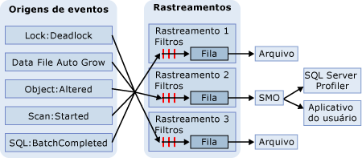

# Rastreamento do SQL
[!INCLUDE[appliesto-ss-xxxx-xxxx-xxx-md](../../includes/appliesto-ss-xxxx-xxxx-xxx-md.md)]
  No Rastreamento do SQL, são coletados eventos se estes forem instâncias de classes de evento listadas na definição de rastreamento. Esses eventos podem ser filtrados do rastreamento ou colocados na fila para seus destinos. O destino pode ser um arquivo ou o SMO ([!INCLUDE[ssNoVersion](../../includes/ssnoversion-md.md)] Management Objects), que pode usar as informações do rastreamento em aplicativos que gerenciam o [!INCLUDE[ssNoVersion](../../includes/ssnoversion-md.md)].  
  
> [!IMPORTANT]  
>  [!INCLUDE[ssNoteDepFutureAvoid](../../includes/ssnotedepfutureavoid-md.md)] Em vez disso, use Eventos Estendidos.  
  
## Benefícios do Rastreamento do SQL  
 O Microsoft [!INCLUDE[ssNoVersion](../../includes/ssnoversion-md.md)] fornece procedimentos armazenados do sistema [!INCLUDE[tsql](../../includes/tsql-md.md)] para criar rastreamentos em uma instância do [!INCLUDE[ssDEnoversion](../../includes/ssdenoversion-md.md)]. Esses procedimentos armazenados do sistema podem ser usados nos seus próprios aplicativos para criar rastreamentos manualmente em vez de usar o [!INCLUDE[ssSqlProfiler](../../includes/sssqlprofiler-md.md)]. Isso lhe permite escrever aplicativos personalizados específicos às necessidades de sua empresa.  
  
## Arquitetura do Rastreamento do SQL  
 As Origens do Evento podem ser quaisquer origens que produzam o evento de rastreamento, tais como lotes [!INCLUDE[tsql](../../includes/tsql-md.md)] ou então eventos do [!INCLUDE[ssNoVersion](../../includes/ssnoversion-md.md)] , como deadlocks. Para obter mais informações sobre eventos, consulte [SQL Server Event Class Reference](../../relational-databases/event-classes/sql-server-event-class-reference.md). Quando ocorre um evento, se a classe de evento estiver incluída na definição de um rastreamento, serão coletadas informações sobre o evento. Se houver filtros definidos para a classe de evento na definição do rastreamento, eles serão aplicados e as informações do evento serão transmitidas a uma fila. Da fila, as informações do rastreamento serão gravadas em um arquivo ou poderão ser usadas pelo SMO em aplicativos, tais como o [!INCLUDE[ssSqlProfiler](../../includes/sssqlprofiler-md.md)]. O diagrama a seguir mostra como o Rastreamento do SQL coleta eventos durante um rastreamento.  
  
   
  
## Terminologia do Rastreamento do SQL  
 Os termos a seguir descrevem os conceitos fundamentais do Rastreamento do SQL.  
  
 **Evento**  
 A ocorrência de uma ação dentro de uma instância do [!INCLUDE[msCoName](../../includes/msconame-md.md)] [!INCLUDE[ssDEnoversion](../../includes/ssdenoversion-md.md)].  
  
 **Coluna de dados**  
 Um atributo de um evento.  
  
 **Classe de evento**  
 Um tipo de evento que pode ser rastreado. A classe de evento contém todas as colunas de dados que podem ser informadas por um evento.  
  
 **Categoria de evento**  
 Um grupo de classes de evento relacionadas.  
  
 **Rastreamento** (substantivo)  
 Uma coleção de eventos e dados retornado pelo [!INCLUDE[ssDE](../../includes/ssde-md.md)].  
  
 **Rastrear** (verbo)  
 Coletar e monitorar eventos em uma instância do [!INCLUDE[ssNoVersion](../../includes/ssnoversion-md.md)].  
  
 **Tracedefinition**  
 Uma coleção de classes de eventos, colunas de dados e filtros que identificam os tipos de evento a serem coletados durante um rastreamento.  
  
 **Filter**  
 Critérios que limitam os eventos coletados em um rastreamento.  
  
 **Arquivo de rastreamento**  
 Um arquivo criado quando um rastreamento é salvo.  
  
 **Modelo**  
 No [!INCLUDE[ssSqlProfiler](../../includes/sssqlprofiler-md.md)], um arquivo que define as classes de evento e colunas de dados a serem coletadas em um rastreamento.  
  
 **Tabela de rastreamento**  
 No [!INCLUDE[ssSqlProfiler](../../includes/sssqlprofiler-md.md)], uma tabela criada quando um rastreamento é salvo em uma tabela.  
  
## Use colunas de dados para descrever eventos retornados  
 O Rastreamento do SQL usa colunas de dados na saída de rastreamento para descrever os eventos retornados por sua execução. A tabela a seguir descreve as colunas de dados do [!INCLUDE[ssSqlProfiler](../../includes/sssqlprofiler-md.md)] , que são as mesmas usadas pelo Rastreamento do SQL, e indica as colunas selecionadas por padrão.  
  
|Coluna de dados|Número da coluna|Descrição|  
|-----------------|-------------------|-----------------|  
|**ApplicationName***|10|O nome do aplicativo cliente que criou a conexão com uma instância do [!INCLUDE[ssNoVersion](../../includes/ssnoversion-md.md)]. Essa coluna é populada com os valores transmitidos pelo aplicativo e não com o nome do programa.|  
|**BigintData1**|52|Valor (tipo de dados**bigint** ) que depende da classe de evento especificada no rastreamento.|  
|**BigintData2**|53|Valor (tipo de dados**bigint** ) que depende da classe de evento especificada no rastreamento.|  
|**Binary Data**|2|Valor binário dependente da classe de evento capturada no rastreamento.|  
|**ClientProcessID***|9|A ID atribuída pelo computador host ao processo em que está sendo executado o aplicativo cliente. Essa coluna de dados será populada se a ID do processo do cliente for fornecida pelo cliente.|  
|**ColumnPermissions**|44|Indica se uma permissão de coluna foi definida ou não. Você pode analisar o texto da instrução para determinar quais permissões foram aplicadas a quais colunas.|  
|**CPU**|18|O tempo de CPU (em milissegundos) usado pelo evento.|  
|**ID do banco de dados***|3|A ID do banco de dados especificada pela instrução USE *database_name* ou a ID do banco de dados padrão se nenhuma instrução USE *database_name*tiver sido emitida para determinada instância. [!INCLUDE[ssSqlProfiler](../../includes/sssqlprofiler-md.md)] exibirá o nome do banco de dados se a coluna de dados **ServerName** for capturada no rastreamento e o servidor estiver disponível. Determine o valor para um banco de dados usando a função DB_ID.|  
|**DatabaseName**|35|O nome do banco de dados no qual a instrução do usuário está sendo executada.|  
|**DBUserName***|40|Nome de usuário do cliente no [!INCLUDE[ssNoVersion](../../includes/ssnoversion-md.md)] .|  
|**Duration**|13|A duração do evento (em microssegundos).   O servidor relata a duração de um evento em microssegundos (um milionésimo de segundo ou 10-6segundo) e o tempo de CPU usado pelo evento em milissegundos (um milésimo de segundo ou 10-3segundo). A interface gráfica do usuário do [!INCLUDE[ssSqlProfiler](../../includes/sssqlprofiler-md.md)] exibe a coluna **Duration** em milissegundos, por padrão; porém, quando um rastreamento é salvo em um arquivo ou tabela de banco de dados, o valor da coluna **Duration** é gravado em microssegundos.|  
|**EndTime**|15|A hora em que o evento terminou. Essa coluna não é populada para classes de evento que se referem a um evento que está sendo iniciado, como **SQL:BatchStarting** ou **SP:Starting**.|  
|**Erro**|31|O número do erro de um determinado evento. Muitas vezes, é o número de erro armazenado na tabela **sysmessages**.|  
|**EventClass***|27|O tipo de classe de evento capturado.|  
|**EventSequence**|51|Número de sequência para esse evento.|  
|**EventSubClass***|21|O tipo de subclasse de evento, fornecendo mais informações sobre cada classe de evento. Por exemplo, valores de subclasse de evento para a classe de evento **Execution Warning** representam o tipo de aviso de execução:   **1** = Espera da consulta. A consulta deve esperar por recursos para poder ser executada; por exemplo, memória.   **2** = Tempo limite de consulta. A espera da consulta por recursos para sua execução atingiu o tempo limite. Essa coluna de dados não é populada para todas as classes de evento.|  
|**GUID**|54|Valor da GUID, que depende da classe de evento especificada no rastreamento.|  
|**FileName**|36|O nome lógico do arquivo que é modificado.|  
|**Handle**|33|O inteiro usado por ODBC, OLE DB ou DB-Library para coordenar execução de servidor.|  
|**HostName***|8|O nome do computador no qual o cliente está sendo executado. Essa coluna de dados será populada se o nome do host for fornecido pelo cliente. Para determinar o nome do host, use a função HOST_NAME.|  
|**IndexID**|24|A ID do índice no objeto afetado pelo evento. Para determinar a ID do índice de um objeto, use a coluna **indid** da tabela do sistema **sysindexes** .|  
|**IntegerData**|25|Valor inteiro dependente da classe de evento capturada no rastreamento.|  
|**IntegerData2**|55|Valor inteiro dependente da classe de evento capturada no rastreamento.|  
|**IsSystem**|60|Indica se o evento ocorreu em um processo do sistema ou do usuário:   **1** = sistema   **0** = usuário|  
|**LineNumber**|5|O número da linha que contém o erro. No caso de eventos que envolvem instruções [!INCLUDE[tsql](../../includes/tsql-md.md)] , como **SP:StmtStarting**, **LineNumber** contém o número de linha da instrução no procedimento armazenado ou lote.|  
|**LinkedServerName**|45|Nome do servidor vinculado.|  
|**LoginName**|11|Nome do logon do usuário (logon de segurança do SQL Server ou credenciais de logon do Windows na forma DOMÍNIO\Nome_de_usuário).|  
|**LoginSid***|41|SID (identificador de segurança) do usuário que fez logon. Você pode encontrar estas informações na exibição **sys.server_principals** do banco de dados **master** . Cada logon no servidor tem uma ID exclusiva.|  
|**MethodName**|47|Nome do método OLEDB.|  
|**Modo**|32|O inteiro usado por vários eventos para descrever um estado que o evento está solicitando ou recebeu.|  
|**NestLevel**|29|O inteiro que representa os dados retornados por @@NESTLEVEL.|  
|**NTDomainName***|7|O domínio Microsoft Windows ao qual pertence o usuário.|  
|**NTUserName***|6|Nome de usuário no Windows.|  
|**ObjectID**|22|ID do objeto atribuída pelo sistema.|  
|**ObjectID2**|56|ID do objeto ou entidade relacionada, se disponível.|  
|**ObjectName**|34|Nome do objeto referido.|  
|**ObjectType***\*|28|Valor que representa o tipo do objeto envolvido no evento. Este valor corresponde à coluna **type** em **sysobjects**.|  
|**Deslocamento**|61|O deslocamento inicial da instrução no procedimento armazenado ou lote.|  
|**OwnerID**|58|Apenas para eventos de bloqueio. O tipo do objeto que possui um bloqueio.|  
|**OwnerName**|37|Nome de usuário de banco de dados do proprietário do objeto.|  
|**ParentName**|59|O nome do esquema no qual reside o objeto.|  
|**Permissões**|19|Valor inteiro que representa o tipo das permissões verificadas. Os valores são:   **1** = SELECT ALL   **2** = UPDATE ALL   **4** = REFERENCES ALL   **8** = INSERT   **16** = DELETE   **32** = EXECUTE (somente procedimentos)   **4096** = SELECT ANY (pelo menos, uma coluna)   **8192** = UPDATE ANY   **16384** = REFERENCES ANY|  
|**ProviderName**|46|Nome do provedor OLEDB.|  
|**Reads**|16|O número de operações de leitura no disco lógico que são executados pelo servidor em nome do evento. Compreendem todas as leituras de tabelas e buffers durante a execução da instrução.|  
|**RequestID**|49|ID da solicitação que contém a instrução.|  
|**RoleName**|38|O nome da função de aplicativo que está sendo habilitada.|  
|**RowCounts**|48|O número de linhas no lote.|  
|**ServerName***|26|O nome da instância do [!INCLUDE[ssNoVersion](../../includes/ssnoversion-md.md)] que está sendo rastreada.|  
|**SessionLoginName**|64|O nome de logon do usuário que originou a sessão. Por exemplo, se você se conectar ao [!INCLUDE[ssNoVersion](../../includes/ssnoversion-md.md)] usando **Login1** e executar uma instrução como **Login2**, **SessionLoginName** irá exibir **Login1**, enquanto que **LoginName** exibirá **Login2**. Esta coluna de dados exibe logons tanto do [!INCLUDE[ssNoVersion](../../includes/ssnoversion-md.md)] , quanto do Windows.|  
|**Severity**|20|Nível de severidade do evento de exceção.|  
|**SourceDatabaseID**|62|ID do banco de dados em que se encontra a origem do objeto.|  
|**SPID**|12|ID de processo de servidor (SPID) atribuída pelo [!INCLUDE[ssNoVersion](../../includes/ssnoversion-md.md)] ao processo associado ao cliente.|  
|**SqlHandle**|63|Hash de 64 bits com base no texto de uma consulta ad hoc ou na ID de objeto e banco de dados de um objeto SQL. Esse valor pode ser passado a **sys.dm_exec_sql_text()** para recuperar o texto SQL associado.|  
|**StartTime***|14|O horário no qual o evento foi iniciado, quando disponível.|  
|**Estado**|30|Código do estado de erro.|  
|**Êxito**|23|Indica se o evento teve êxito ou não. Os valores são:   **1** = Êxito.   **0** = Falha   Por exemplo, **1** significa êxito em uma verificação de permissões e **0** , falha.|  
|**TargetLoginName**|42|Em ações que visam um logon, é o nome do logon de destino; por exemplo, para adicionar um novo logon.|  
|**TargetLoginSid**|43|Em ações que visam um logon, é a SID do logon de destino; por exemplo, para adicionar um novo logon.|  
|**TargetUserName**|39|Em ações que visam um usuário de banco de dados, é o nome desse usuário; por exemplo, para conceder permissão a um usuário.|  
|**TextData**|1|Valor de texto dependente da classe de evento capturada no rastreamento. Porém, se você rastrear uma consulta parametrizada, as variáveis não serão exibidas com valores de dados na coluna **TextData** .|  
|**ID da transação**|4|ID da transação atribuída pelo sistema.|  
|**Tipo**|57|Valor inteiro dependente da classe de evento capturada no rastreamento.|  
|**Writes**|17|O número de operações de gravação no disco físico que são executados pelo servidor em nome do evento.|  
|**XactSequence**|50|Token usado para descrever a transação atual.|  
  
 *Essas colunas de dados são populadas, por padrão, em todos os eventos.  
  
 \*\*Para obter mais informações sobre a coluna de dados **ObjectType**, veja [Coluna de evento de rastreamento ObjectType](../../relational-databases/event-classes/objecttype-trace-event-column.md).  
  
## Tarefas de Rastreamento do SQL  
  
|Descrição da tarefa|Tópico|  
|----------------------|-----------|  
|Descreve como criar e executar rastreamentos usando procedimentos armazenados de Transact-SQL.|[Criar e executar rastreamentos usando procedimentos armazenados de Transact-SQL](../../relational-databases/sql-trace/create-and-run-traces-using-transact-sql-stored-procedures.md)|  
|Descreve como criar rastreamentos manuais usando procedimentos armazenados em uma instância do [!INCLUDE[ssDEnoversion](../../includes/ssdenoversion-md.md)].|[Criar rastreamentos manuais usando procedimentos armazenados](../../relational-databases/sql-trace/create-manual-traces-using-stored-procedures.md)|  
|Descreve como salvar resultados de rastreamento no arquivo onde os resultados de rastreamento foram gravados.|[Salvar resultados de rastreamento em um arquivo](../../relational-databases/sql-trace/save-trace-results-to-a-file.md)|  
|Descreve como melhorar o acesso a dados de rastreamento usando espaço no diretório **temporário** .|[Aprimorar o acesso aos dados de rastreamento](../../relational-databases/sql-trace/improve-access-to-trace-data.md)|  
|Descreve como usar procedimentos armazenados para criar um rastreamento.|[Criar um rastreamento &#40;Transact-SQL&#41;](../../relational-databases/sql-trace/create-a-trace-transact-sql.md)|  
|Descreve como usar procedimentos armazenados para criar um filtro que recupera apenas as informações que você necessita em um evento que está sendo rastreado.|[Definir um filtro de rastreamento &#40;Transact-SQL&#41;](../../relational-databases/sql-trace/set-a-trace-filter-transact-sql.md)|  
|Descreve como usar procedimentos armazenados para modificar um rastreamento existente.|[Modificar um rastreamento existente &#40;Transact-SQL&#41;](../../relational-databases/sql-trace/modify-an-existing-trace-transact-sql.md)|  
|Descreve como usar funções internas para exibir um rastreamento salvo.|[Exibir um rastreamento salvo &#40;Transact-SQL&#41;](../../relational-databases/sql-trace/view-a-saved-trace-transact-sql.md)|  
|Descreve como usar funções internas para exibir informações de filtro de rastreamento.|[Exibir informações de filtro &#40;Transact-SQL&#41;](../../relational-databases/sql-trace/view-filter-information-transact-sql.md)|  
|Descreve como usar procedimentos armazenados para excluir um rastreamento.|[Excluir um rastreamento &#40;Transact-SQL&#41;](../../relational-databases/sql-trace/delete-a-trace-transact-sql.md)|  
|Descreve como minimizar os custos de desempenho devidos a um rastreamento.|[Otimizar o rastreamento do SQL](../../relational-databases/sql-trace/optimize-sql-trace.md)|  
|Descreve como filtrar um rastreamento para minimizar a sobrecarga incorrida durante um rastreamento.|[Filtrar um rastreamento](../../relational-databases/sql-trace/filter-a-trace.md)|  
|Descreve como minimizar a quantidade de dados que o rastreamento coleta.|[Limitar o tamanho de arquivos e tabelas de rastreamento](../../relational-databases/sql-trace/limit-trace-file-and-table-sizes.md)|  
|Descreve os dois modos de agendar rastreamento no Microsoft [!INCLUDE[ssNoVersion](../../includes/ssnoversion-md.md)].|[Agendar rastreamentos](../../relational-databases/sql-trace/schedule-traces.md)|  
  
## Consulte Também  
 [Modelos e permissões do SQL Server Profiler](../../tools/sql-server-profiler/sql-server-profiler-templates-and-permissions.md)   
 [Guia de Programação do SMO &#40;SQL Server Management Objects&#41;](../../relational-databases/server-management-objects-smo/sql-server-management-objects-smo-programming-guide.md)  
  
  
