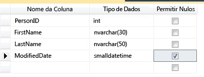
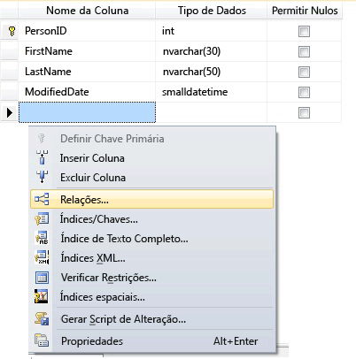
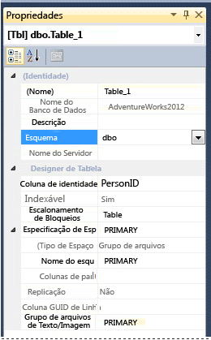

# <a name="create-tables-database-engine"></a>Criar tabelas (Mecanismo de Banco de Dados)
[!INCLUDE[tsql-appliesto-ss2016-all-md](../../includes/tsql-appliesto-ss2016-all-md.md)]

  Você pode criar uma nova tabela, nomeá-la e adicioná-la a um banco de dados existente usando o [!INCLUDE[ssManStudioFull](../../includes/ssmanstudiofull-md.md)] ou [!INCLUDE[tsql](../../includes/tsql-md.md)].  
  

  
##  <a name="Permissions"></a> Verifique suas permissões primeiro!  
Esta tarefa requer a permissão CREATE TABLE no banco de dados e a permissão ALTER no esquema no qual a tabela está sendo criada.  
  
 Se alguma coluna da instrução CREATE TABLE for definida como um tipo de dado CLR definido pelo usuário, a propriedade do tipo ou a permissão REFERENCES será necessária.  
  
 Se alguma coluna da instrução CREATE TABLE tiver uma coleção de esquemas XML associada a ela, a propriedade da coleção de esquemas XML ou a permissão REFERENCES é necessária.  
  
 
## <a name="using-table-designer"></a>Uso do Designer de Tabela  
  
1.  No SSMS, no **Pesquisador de Objetos**, conecte-se à instância do [!INCLUDE[ssDE](../../includes/ssde-md.md)] que contém o banco de dados a ser modificado.  
  
2.  No **Pesquisador de Objetos**, expanda o nó **Bancos de Dados** e, em seguida, expanda o banco de dados que conterá a nova tabela.  
  
3.  No Pesquisador de Objetos, clique com o botão direito do mouse no nó **Tabelas** do banco de dados e clique em **Nova Tabela**.  
  
4.  Digite nomes de coluna, escolha tipos de dados e opte por permitir ou não nulos para cada coluna, conforme ilustrado a seguir:  
  
       
  
5.  Para especificar mais propriedades para uma coluna, como valores de identidade ou de coluna computada, clique na coluna e na guia propriedades de coluna, escolha as propriedades adequadas. Para obter mais informações sobre as propriedades de coluna, veja [Propriedades de coluna da tabela &#40;SQL Server Management Studio&#41;](../../relational-databases/tables/table-column-properties-sql-server-management-studio.md).  
  
6.  Para especificar uma coluna como chave primária, clique com o botão direito do mouse na coluna e selecione **Definir Chave Primária**. Para obter mais informações, consulte [Create Primary Keys](../../relational-databases/tables/create-primary-keys.md).  
  
7.  Para criar relações de chave estrangeira, restrições de verificação ou índices, clique com o botão direito do mouse no painel Designer de Tabela e selecione um objeto da lista, conforme mostrado na ilustração a seguir:  
  
       
  
     Para obter mais informações sobre esses objetos, consulte [Create Foreign Key Relationships](../../relational-databases/tables/create-foreign-key-relationships.md), [Create Check Constraints](../../relational-databases/tables/create-check-constraints.md) e [Indexes](../../relational-databases/indexes/indexes.md).  
  
8.  Por padrão, a tabela está contida no esquema **dbo** . Para especificar um esquema diferente para a tabela, clique com o botão direito do mouse no painel Designer de Tabela e selecione **Propriedades** , conforme ilustrado a seguir. Na lista suspensa **Esquema** , selecione o esquema apropriado.  
  
       
  
     Para obter mais informações sobre esquemas, consulte [Create a Database Schema](../../relational-databases/security/authentication-access/create-a-database-schema.md).  
  
9. No menu **Arquivo** , escolha **Salvar** *table name*.  
  
10. Na caixa de diálogo **Escolher Nome** , digite um nome para a tabela e clique em **OK**.  
  
11. Para exibir a nova tabela, em **Pesquisador de Objetos**, expanda o nó **Tabelas** e pressione **F5** para atualizar a lista de objetos. A nova tabela é exibida na lista de tabelas.  
  
##  <a name="TsqlProcedure"></a> Usando o Transact-SQL  
  
## <a name="using-query-editor"></a>Uso do Editor de Consultas  
  
1.  No **Pesquisador de Objetos**, conecte-se a uma instância do [!INCLUDE[ssDE](../../includes/ssde-md.md)].  
  
2.  Na barra Padrão, clique em **Nova Consulta**.  
  
3.  Copie e cole o exemplo a seguir na janela de consulta e clique em **Executar**.  
  
    ```  
    CREATE TABLE dbo.PurchaseOrderDetail  
    (  
        PurchaseOrderID int NOT NULL  
        ,LineNumber smallint NOT NULL  
        ,ProductID int NULL  
        ,UnitPrice money NULL  
        ,OrderQty smallint NULL  
        ,ReceivedQty float NULL  
        ,RejectedQty float NULL  
        ,DueDate datetime NULL  
    );  
    ```  
  
 Para obter mais exemplos, veja [CREATE TABLE &#40;Transact-SQL&#41;](../../t-sql/statements/create-table-transact-sql.md).  
  
  
