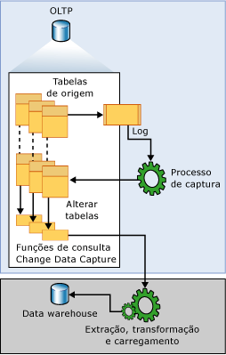

# <a name="about-change-data-capture-sql-server"></a>Sobre o change data capture (SQL Server)
[!INCLUDE[tsql-appliesto-ss2008-asdbmi-xxxx-xxx-md](../../includes/tsql-appliesto-ss2008-asdbmi-xxxx-xxx-md.md)]
  Os registros do Change Data Capture inserem, atualizam e excluem atividades aplicadas a uma tabela do [!INCLUDE[ssNoVersion](../../includes/ssnoversion-md.md)] . Ele também disponibiliza os detalhes das mudanças em um formato relacional facilmente utilizável. As informações de coluna e os metadados exigidos para a aplicação de alterações em um ambiente de destino são capturados para as linhas modificadas e armazenados nas tabelas de alteração que espelham a estrutura da coluna das tabelas de origem rastreadas. As funções avaliadas da tabela são fornecidas para permitir acesso sistemático aos dados de alteração pelos consumidores.  
  
 Um bom exemplo de um consumidor de dados visado por esta tecnologia é uma extração, transformação e aplicativo de carregamento (ETL). Um aplicativo ETL carrega incrementalmente dados de alteração das tabelas de origem de [!INCLUDE[ssNoVersion](../../includes/ssnoversion-md.md)] para um data warehouse ou data mart. Embora a representação das tabelas de fonte dentro do data warehouse deva refletir as alterações nessas tabelas de origem, uma tecnologia ponta-a-ponta que atualize uma réplica da origem não é apropriada. Em vez disso, é necessário um fluxo seguro de dados de alteração, estruturado de forma que consumidores possam aplicá-lo às representações dos dados de destino. [!INCLUDE[ssNoVersion](../../includes/ssnoversion-md.md)] a captura de dados de alterações fornece essa tecnologia.  
  
## <a name="change-data-capture-data-flow"></a>Fluxo de dados do Change Data Capture  
 A ilustração seguinte mostra o fluxo de dados principal para a captura de dados de alteração.  
  
   
  
 A origem de dados de alterações para a captura de dados de alterações é o log de transações do [!INCLUDE[ssNoVersion](../../includes/ssnoversion-md.md)] . Como inserções, atualizações e exclusões são aplicadas às tabelas de origem rastreadas, as entradas que descrevem essas alterações são adicionadas ao log. O log atua como entrada para o processo de captura. O processo lê o log e adiciona informações sobre alterações à tabela de alteração associada da tabela controlada. As funções são fornecidas para enumerar as alterações exibidas nas tabelas de alteração em um intervalo especificado, retornando informações em um conjunto de resultados filtrados. O conjunto de resultados filtrados é normalmente usado por um processo de aplicativo para atualizar uma representação da origem em algum ambiente externo.  
  
## <a name="understanding-change-data-capture-and-the-capture-instance"></a>Compreendendo o Change Data Capture e a instância de captura  
 Antes do rastreamento das alterações em qualquer tabela individual dentro de um banco de dados, a captura de dados de alterações deve ser explicitamente habilitada para o banco de dados. Isso é feito usando o procedimento armazenado [sys.sp_cdc_enable_db](../../relational-databases/system-stored-procedures/sys-sp-cdc-enable-db-transact-sql.md). Quando o banco de dados está habilitado, é possível identificar as tabelas de origem como tabelas controladas usando o procedimento armazenado [sys.sp_cdc_enable_table](../../relational-databases/system-stored-procedures/sys-sp-cdc-enable-table-transact-sql.md). Quando uma tabela está habilitada para Change Data Capture, uma instância de captura associada é criada para dar suporte à disseminação dos dados de alteração na tabela de origem. A instância de captura consiste em uma tabela de alteração e até duas funções de consulta. Os metadados que descrevem os detalhes de configuração da instância de captura são mantidos nas tabelas de metadados da captura de dados de alterações **cdc.change_tables**, **cdc.index_columns**e **cdc.captured_columns**. Estas informações podem ser recuperadas usando o procedimento armazenado [sys.sp_cdc_help_change_data_capture](../../relational-databases/system-stored-procedures/sys-sp-cdc-help-change-data-capture-transact-sql.md).  
  
 Todos os objetos associados a uma instância de captura são criados no esquema de captura de dados de alteração do banco de dados habilitado. Os requisitos para o nome da instância de captura deve ser um nome de objeto válido e exclusivo entre as instâncias de captura de banco de dados. Por padrão, o nome é \<*schema name*\_*table name*> da tabela de origem. Sua tabela de alteração associada é nomeada acrescentando **_CT** ao nome da instância de captura. A função usada para consultar todas as alterações é nomeada acrescentando **fn_cdc_get_all_changes_** ao nome da instância de captura. Se a instância de captura for configurada para dar suporte a **net changes**, a função de consulta **net_changes** também será criada e nomeada, acrescentando **fn_cdc_get_net_changes\_** ao nome da instância de captura.  
  
## <a name="change-table"></a>Tabela de alteração  
 As primeiras cinco colunas de uma tabela de alteração de captura de dados de alterações são colunas de metadados. Elas fornecem informações adicionais pertinentes à alteração registrada. As colunas restantes espelham as colunas capturadas identificadas da tabela de origem em nome e, geralmente, em tipo. Estas colunas mantêm os dados de coluna capturados que são juntados na tabela de origem.  
  
 Cada operação de inserção ou exclusão que é aplicada a uma tabela de origem aparece como uma única linha dentro da tabela de alteração. As colunas de dados da linha, que é o resultado de uma operação de inserção, contêm os valores de coluna depois da inserção. As colunas de dados da linha, que é o resultado uma operação de exclusão, contêm valores de coluna antes da exclusão. Uma operação de atualização requer uma entrada de linha para identificar os valores da coluna antes da atualização e uma segunda entrada para identificar os valores da coluna depois da atualização.  
  
 Cada linha em uma tabela de alteração também contém metadados adicionais para permitir interpretação da atividade de alteração. A coluna __$start_lsn identifica o número da sequência do log de confirmação (LSN) que foi atribuído à alteração. O LSN de confirmação não só identifica alterações que foram confirmadas dentro da mesma transação, mas também ordena essas transações. A coluna \_\_$seqval podem ser usados para ordenar mais alterações que acontecem na mesma transação. A coluna \_\_$operation registra a operação associada à alteração: 1 = excluir, 2 = inserir, 3 = atualizar (antes da imagem) e 4 = atualizar (depois da imagem). A coluna \_\_$update_mask é uma máscara de bit variável com um bit definido para cada coluna capturada. Para inserir e excluir entradas, a máscara de atualização sempre terá todos os bits definidos. No entanto, as linhas de atualização terão definidos apenas os bits que correspondam às colunas alteradas.  
  
## <a name="change-data-capture-validity-interval-for-a-database"></a>Intervalo de validade de captura de dados de alteração para um banco de dados  
 O intervalo de validade da captura de dados de alteração para um banco de dados é o tempo durante o qual os dados de alteração estão disponíveis para as instâncias de captura. O intervalo de validade começa quando a primeira instância de captura é criada para uma tabela de banco de dados e continua no momento atual.  
  
 Os dados depositados nas tabelas de alteração aumentam de modo não gerenciável se você não diminuir periódica e sistematicamente os dados. O processo de limpeza da captura de dados de alterações é responsável pela aplicação da política de limpeza com base em retenção. Primeiro, ele move o ponto de extremidade inferior do intervalo de validade para atender à restrição de hora. Então, ele remove as entradas da tabela de alteração expiradas. Por padrão, são retidos três dias de dados.  
  
 No alto nível, conforme o processo de captura confirma cada novo lote de dados de alteração, novas entradas são adicionadas ao **cdc.lsn_time_mapping** para cada transação que tem entradas da tabela de alteração. Na tabela de mapeamento, um número da sequência do log de confirmação (LSN) e um tempo de confirmação da transação (colunas start_lsn e tran_end_time, respectivamente) são mantidos. O valor máximo de LSN que é encontrado em **cdc.lsn_time_mapping** representa a marca d’água superior da janela de validade do banco de dados. Seu tempo de confirmação correspondente é usado como a base da qual a limpeza baseada em retenção calcula uma nova marca d'água inferior.  
  
 Como o processo de captura extrai dados de alteração de um log de transação, há um built em latência entre a hora em que uma alteração é confirmada para uma tabela de origem e a hora em que a alteração é exibida dentro de sua tabela de alteração associada. Embora essa latência seja normalmente pequena, nunca é demais lembrar que os dados de alteração não ficam disponíveis até que o processo de captura processe as entradas de log relacionadas.  
  
## <a name="change-data-capture-validity-interval-for-a-capture-instance"></a>Intervalo de validade de captura de dados de alterações para uma instância de captura  
 Embora seja comum a coincidência entre o intervalo de validade de banco de dados e o intervalo de validade de uma instância de captura individual, isso não é sempre verdadeiro. O intervalo de validade da instância de captura começa quando o processo de captura reconhece a instância de captura e inicia o registro de alterações associadas a sua tabela de alterações. Como resultado, se forem criadas instâncias de captura em horas diferentes, cada uma terá um ponto de extremidade inferior diferente inicialmente. A coluna start_lsn do conjunto de resultados que é retornado por [sys.sp_cdc_help_change_data_capture](../../relational-databases/system-stored-procedures/sys-sp-cdc-help-change-data-capture-transact-sql.md) mostra o ponto de extremidade inferior atual de cada instância de captura definida. Quando um processo de limpeza limpa as entradas da tabela de alterações, ele ajusta os valores de start_lsn para todas as instâncias de captura para refletir a nova marca d'água inferior em dados de alteração disponíveis. Somente essas instâncias de captura que têm valores start_lsn que sejam atualmente menores que a nova marca d'água inferior são ajustadas. Com o tempo, se nenhuma nova instância de captura for criada, os intervalos de validade para todas as instâncias individuais tenderão a coincidir com o intervalo de validade do banco de dados.  
  
 O intervalo de validade é importante para os consumidores de dados de alteração, porque o intervalo de extração para um pedido deve ser totalmente coberto pelo intervalo de validade da captura de dados de alteração atual para a instância de captura. Se o ponto de extremidade inferior do intervalo de extração estiver à esquerda do ponto de extremidade inferior do intervalo de validade, pode ser que dados de alteração estejam faltando devido a uma limpeza intensa. Se o ponto de extremidade superior do intervalo de extração estiver à direita do ponto de extremidade superior do intervalo de validade, e o processo de captura ainda não tiver sido processado naquele período representado pelo intervalo de extração, dados de alteração também poderão estar faltando.  
  
 A função [sys.fn_cdc_get_min_lsn](../../relational-databases/system-functions/sys-fn-cdc-get-min-lsn-transact-sql.md) é usada para recuperar o LSN mínimo atual de uma instância de captura, enquanto [sys.fn_cdc_get_max_lsn](../../relational-databases/system-functions/sys-fn-cdc-get-max-lsn-transact-sql.md) é usada para recuperar o valor máximo atual do LSN. Ao procurar dados de alteração, se o intervalo de LSN especificado não estiver dentro desses dois valores de LSN, as funções de consulta da captura de dados de alteração falhará.  
  
## <a name="handling-changes-to-source-tables"></a>Tratando alterações nas tabelas de origem  
 Acomodar alterações de coluna nas tabelas de origem que estão sendo rastreadas é um assunto difícil para consumidores de downstream. Apesar de a habilitação da captura de dados de alteração em uma tabela de origem não impedir que alterações de DDL ocorram, a captura de dados de alteração ajuda a reduzir o efeito para os consumidores, permitindo que os conjuntos de resultados fornecidos, retornados pela API, permaneçam inalterados mesmo que a estrutura da coluna da tabela de origem subjacente seja alterada. Essa estrutura de coluna fixa também é refletida na tabela de alteração subjacente que as funções de consulta definidas acessam.  
  
 Para acomodar uma tabela de alteração com estrutura de coluna fixa, o processo de captura responsável pela população da tabela de alteração irá ignorar qualquer nova coluna que não seja identificada pela captura quando a tabela de origem não estiver habilitada para a captura de dados de alteração. Se uma coluna rastreada for descartada, serão fornecidos valores nulos para a coluna nas entradas de alteração subsequentes. Entretanto, se uma coluna existente sofrer uma alteração em seu tipo de dados, a alteração será propagada para a tabela de alteração para garantir que o mecanismo de captura não insira perda de dados nas colunas rastreadas. O processo de captura também envia qualquer alteração detectada para a estrutura de coluna de tabelas rastreadas para a tabela cdc.ddl_history. Os consumidores que desejam ser alertados sobre ajustes que tenham de ser feitos em aplicativos downstream usam o procedimento armazenado [sys.sp_cdc_get_ddl_history](../../relational-databases/system-stored-procedures/sys-sp-cdc-get-ddl-history-transact-sql.md).  
  
 Normalmente, a instância de captura atual continuará a manter sua forma quando alterações de DDL forem aplicadas à sua tabela de origem associada. Porém, é possível criar uma segunda instância de captura para a tabela que reflete a nova estrutura de coluna. Isso permite que o processo de captura faça alterações na mesma tabela de origem em duas tabelas de alteração diferentes com duas estruturas de coluna distintas. Portanto, enquanto uma tabela de alteração pode continuar a alimentar os programas em operação atualmente, a segunda pode orientar um ambiente de desenvolvimento que está tentando inserir dados à nova coluna Permitir que o mecanismo de captura preencha ambas as tabelas de alteração em tandem significa que uma transição de uma para a outra pode ser cumprida sem a perda de dados de alteração. Isso pode acontecer quando as duas linhas de tempo da captura de dados de alterações se sobrepuserem. Quando a transição é efetuada, a instância de captura obsoleta pode ser removida.  
  
> [!NOTE]  
>  O número de máximo de instâncias de captura que podem ser associadas simultaneamente a uma única tabela de origem é dois.  
  
## <a name="relationship-between-the-capture-job-and-the-transactional-replication-logreader"></a>Relação entre o trabalho de captura e o leitor de log da replicação transacional  
 A lógica do processo de captura de dados de alterações é inserida ao procedimento armazenado [sp_replcmds](../../relational-databases/system-stored-procedures/sp-replcmds-transact-sql.md), uma função de servidor interna criada como parte de sqlservr.exe e também usada pela replicação transacional para coletar alterações do log de transações. Quando somente o Change Data Capture está habilitado para um banco de dados, você cria o trabalho de captura do SQL Agent do Change Data Capture como o veículo para chamar sp_replcmds. Quando a replicação também está presente, o leitor de log transacional sozinho é utilizado para atender às necessidades de dados de alteração de ambos esses consumidores. Essa estratégia reduz significativamente a contenção de log quando são habilitadas a replicação e a captura de dados de alterações para o mesmo banco de dados.  
  
 A alternância entre esses dois modos operacionais para a captura de dados de alteração ocorre automaticamente onde houver uma alteração no status de replicação de um banco de dados habilitado para captura de dados de alteração.  
  
> [!IMPORTANT]  
>  Ambas as instâncias da lógica de captura exigem que o [!INCLUDE[ssNoVersion](../../includes/ssnoversion-md.md)] Agent esteja em execução para que o processo seja executado.  
  
 A principal tarefa do processo de captura é verificar o log e gravar dados da coluna e informações relacionadas à transação nas tabelas de alteração do change data capture. Para garantir um limite consistente transacionalmente entre todas as tabelas de alteração de captura de dados de alteração preenchidas, o processo de captura abre e confirma sua própria transação em cada ciclo de verificação. Ele detecta quando tabelas são recém-habilitadas para a captura de dados de alteração e automaticamente os inclui no conjunto de tabelas ativamente monitoradas para as entradas de alteração no log. De modo semelhante, a desabilitação da captura de dados de alteração também será detectadas, fazendo com que a tabela de origem seja removida do conjunto de tabelas monitoradas ativamente para dados de alteração. Quando o processamento para uma seção de log é concluído, o processo de captura emite um sinal para a lógica de truncamento do log de servidor, que usa essa informação para identificar entradas de log qualificadas para truncamento.  
  
> [!NOTE]  
>  Quando um banco de dados está habilitado para captura de dados de alteração, mesmo que o modo de recuperação esteja definido como recuperação simples, o ponto de truncamento do log não avançará até que todas as alterações marcadas para captura tenham sido coletadas pelo processo de captura. Se o processo de captura não estiver sendo executado e houver alterações a serem coletadas, a execução de CHECKPOINT não truncará o log.  
  
 O processo de captura também é usado para manter o histórico nas alterações de DDL para tabelas rastreadas. As instruções DDL que estão associadas ao Change Data Capture criam entradas no log de transações do banco de dados sempre que um banco de dados ou uma tabela habilitados para o Change Data Capture são descartados ou que colunas de uma tabela habilitada para o Change Data Capture são adicionadas, modificadas ou descartadas. Essas entradas de log são processadas pelo processo de captura, que então envia os eventos de DDL associados para a tabela cdc.ddl_history. Você pode obter informações sobre eventos de DDL que afetam tabelas controladas usando o procedimento armazenado [sys.sp_cdc_get_ddl_history](../../relational-databases/system-stored-procedures/sys-sp-cdc-get-ddl-history-transact-sql.md).  
  
## <a name="change-data-capture-agent-jobs"></a>Trabalhos do Change Data Capture Agent  
 Dois trabalhos do [!INCLUDE[ssNoVersion](../../includes/ssnoversion-md.md)] Agent, normalmente, são associados a um banco de dados habilitado para a captura de dados de alterações: um que é usado para popular as tabelas de alteração de banco de dados e outro que é responsável pela limpeza da tabela de alteração. Ambos os trabalhos consistem em uma única etapa que executa um comando [!INCLUDE[tsql](../../includes/tsql-md.md)] . O comando [!INCLUDE[tsql](../../includes/tsql-md.md)] chamado é um procedimento armazenado definido para a captura de dados de alterações que implementa a lógica do trabalho. Os trabalhos são criados quando a primeira tabela do banco de dados é habilitada para captura de dados de alterações. O Trabalho de Limpeza sempre é criado. O trabalho de captura só será criado se não existir uma publicação transacional definida para o banco de dados. Um trabalho de captura é criado também quando a captura de dados de alterações e a replicação transacional são habilitadas para um banco de dados e o trabalho do leitor de log transacional é removido porque o banco de dados não definiu mais as publicações.  
  
 Ambos os trabalhos de captura e limpeza são criados usando parâmetros padrão. O trabalho de captura é iniciado imediatamente. Ele é executado continuamente, processando um máximo de 1000 transações por ciclo de verificação com uma espera de cinco segundos entre os ciclos. O trabalho de limpeza é executado diariamente às 2 horas. Ele retém as entradas da tabela de alteração por 4320 minutos ou 3 dias, removendo um máximo de 5000 entradas com uma única instrução de exclusão.  
  
 Os trabalhos de agente de captura de dados de alterações são removidos quando a captura de dados de alterações é desabilitada para um banco de dados. O trabalho de captura também pode ser removido quando a primeira publicação é adicionada a um banco de dados e tanto a captura de dados de alteração quanto a replicação transacional estão habilitadas.  
  
 Internamente, os trabalhos de agente da captura de dados de alterações são criados e removidos usando os procedimentos armazenados [sys.sp_cdc_add_job](../../relational-databases/system-stored-procedures/sys-sp-cdc-add-job-transact-sql.md) e [sys.sp_cdc_drop_job](../../relational-databases/system-stored-procedures/sys-sp-cdc-drop-job-transact-sql.md), respectivamente. Esses procedimentos armazenados também são expostos de forma que administradores possam controlar a criação e remoção desses trabalhos.  
  
 Um administrador não tem nenhum controle explícito sobre a configuração padrão dos trabalhos de agente de captura de dados de alterações. O procedimento armazenado [sys.sp_cdc_change_job](../../relational-databases/system-stored-procedures/sys-sp-cdc-change-job-transact-sql.md) é fornecido para permitir que os parâmetros de configuração padrão sejam modificados. Além disso, o procedimento armazenado [sys.sp_cdc_help_jobs](../../relational-databases/system-stored-procedures/sys-sp-cdc-help-jobs-transact-sql.md) permite exibir os parâmetros de configuração atuais. Os trabalhos de captura e de limpeza extraem os parâmetros de configuração da tabela msdb.dbo.cdc_jobs na inicialização. Qualquer alteração feita nesses valores utilizando [sys.sp_cdc_change_job](../../relational-databases/system-stored-procedures/sys-sp-cdc-change-job-transact-sql.md) não terá efeito até que o trabalho seja interrompido e reiniciado.  
  
 Dois procedimentos armazenados adicionais são fornecidos para permitir que os trabalhos de agente da captura de dados de alterações sejam iniciados e interrompidos: [sys.sp_cdc_start_job](../../relational-databases/system-stored-procedures/sys-sp-cdc-start-job-transact-sql.md) e [sys.sp_cdc_stop_job](../../relational-databases/system-stored-procedures/sys-sp-cdc-stop-job-transact-sql.md).  
  
> [!NOTE]  
>  Iniciar e interromper o trabalho de captura não resulta em uma perda de dados de alteração. Isso impede apenas o processo de captura de verificar ativamente o log quanto a entradas de alteração a serem colocadas nas tabelas de alteração. Uma estratégia razoável para impedir que a verificação do log adicione carga durante os períodos de pico de demanda é interromper o trabalho de captura e reiniciá-lo quando houver redução de demanda.  
  
 Os dois trabalhos do [!INCLUDE[ssNoVersion](../../includes/ssnoversion-md.md)] Agent foram projetados para serem flexíveis e configuráveis o suficiente para atender às necessidades básicas dos ambientes de captura de dados de alterações. Nos dois casos, entretanto, os procedimentos armazenados subjacentes que fornecem funcionalidade principal têm sido expostos para que seja possível a personalização posterior.  
  
 O Change Data Capture não funciona corretamente quando o serviço Mecanismo de Banco de Dados ou o serviço SQL Server Agent está sendo executado na conta NETWORK SERVICE. Isso pode resultar no erro 22832.  
 
## <a name="working-with-database-and-table-collation-differences"></a>Trabalhando com as diferenças de ordenação de banco de dados e de tabela

É importante estar ciente de uma situação em que há diferentes ordenações entre o banco de dados e as colunas de uma tabela configurada para a captura de dados de alterações. A CDA usa um armazenamento provisório para popular tabelas laterais. Se uma tabela tiver colunas CHAR ou VARCHAR com ordenações diferentes da ordenação de banco de dados e se essas colunas armazenarem caracteres não ASCII (como caracteres DBCS de byte duplo), a CDA não poderá persistir os dados alterados de maneira consistente com os dados nas tabelas base. Isso se deve ao fato de que as variáveis do armazenamento provisório não podem ter ordenações associadas a elas.

Considere uma das seguintes abordagens para garantir que os dados capturados da alteração sejam consistentes com as tabelas base:

- Use o tipo de dados NCHAR ou NVARCHAR para colunas que contêm dados não ASCII.

- Ou use a mesma ordenação para colunas e para o banco de dados.

Por exemplo, se você tiver um banco de dados que usa uma ordenação SQL_Latin1_General_CP1_CI_AS, considere a seguinte tabela:

```sql
CREATE TABLE T1( 
     C1 INT PRIMARY KEY, 
     C2 VARCHAR(10) collate Chinese_PRC_CI_AI)
```

A CDA poderá não capturar os dados binários para a coluna C2, porque sua ordenação é diferente (Chinese_PRC_CI_AI). Use NVARCHAR para evitar esse problema:

```sql
CREATE TABLE T1( 
     C1 INT PRIMARY KEY, 
     C2 NVARCHAR(10) collate Chinese_PRC_CI_AI --Unicode data type, CDC works well with this data type)
```

## <a name="see-also"></a>Consulte Também  
 [Controle de alterações de dados &#40;SQL Server&#41;](../../relational-databases/track-changes/track-data-changes-sql-server.md)   
 [Habilitar e desabilitar a captura de dados de alterações &#40;SQL Server&#41;](../../relational-databases/track-changes/enable-and-disable-change-data-capture-sql-server.md)   
 [Trabalhar com dados de alterações &#40;SQL Server&#41;](../../relational-databases/track-changes/work-with-change-data-sql-server.md)   
 [Administrar e monitorar a captura de dados de alteração &#40;SQL Server&#41;](../../relational-databases/track-changes/administer-and-monitor-change-data-capture-sql-server.md)  
  
  
