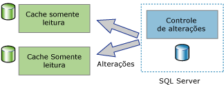
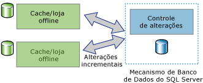

# Sobre o controle de alterações (SQL Server)
[!INCLUDE[tsql-appliesto-ss2008-asdb-xxxx-xxx-md](../../includes/tsql-appliesto-ss2008-asdb-xxxx-xxx-md.md)]

  O controle de alterações é uma solução leve que fornece um mecanismo de controle de alterações eficiente para aplicativos. Em geral, para permitir que os aplicativos consultassem as alterações nos dados de um banco de dados e acessassem as informações relacionadas às alterações, os desenvolvedores de aplicativos precisavam implementar mecanismos personalizados de controle de alterações. A criação desses mecanismos costumava envolver muito trabalho e, com frequência, o uso de uma combinação de gatilhos, colunas **timestamp** , novas tabelas para armazenar as informações de controle e processos personalizados de limpeza.  
  
 Tipos distintos de aplicativos têm requisitos diferentes quanto à quantidade de informações que precisam sobre as alterações. Os aplicativos podem usar o controle de alterações para responder às seguintes perguntas sobre as alterações feitas na tabela de um usuário:  
  
-   Que linhas da tabela de um usuário foram alteradas?  
  
    -   Só é necessário o fato de que uma linha foi alterada, e não quantas vezes ela foi alterada ou os valores das alterações intermediárias.  
  
    -   Os últimos dados podem ser obtidos diretamente da tabela que está sendo controlada.  
  
-   Uma linha foi alterada?  
  
    -   O fato de que uma linha foi alterada e as informações sobre a alteração devem estar disponíveis e serem registrados no momento em que a alteração foi feita na mesma transação.  
  
> [!NOTE]  
>  Se um aplicativo precisar de informações sobre todas as alterações feitas e os valores intermediários dos dados alterados, talvez seja adequado usar o Change Data Capture, em vez do controle de alterações. Para obter mais informações, veja [Sobre a captura de dados de alterações &#40;SQL Server&#41;](../../relational-databases/track-changes/about-change-data-capture-sql-server.md).  
  
## Aplicativos de sincronização unidirecional e bidirecional  
 Os aplicativos que precisam sincronizar dados com uma instância do [!INCLUDE[ssDEnoversion](../../includes/ssdenoversion-md.md)] devem poder consultar alterações. O controle de alterações pode ser usado como uma base para aplicativos de sincronização unidirecional e bidirecional.  
  
### Aplicativos de sincronização unidirecional  
 É possível criar aplicativos de sincronização unidirecional, como um aplicativo cliente ou de cache de camada intermediária, que usem o controle de alterações. Como mostra a ilustração a seguir, um aplicativo em cache exige que os dados sejam armazenados no [!INCLUDE[ssDE](../../includes/ssde-md.md)] e armazenados em cache em outros armazenamentos de dados. O aplicativo deve ser capaz de manter o cache atualizado com as alterações feitas nas tabelas do banco de dados. Não há nenhuma alteração para devolver ao [!INCLUDE[ssDE](../../includes/ssde-md.md)].  
  
   
  
### Aplicativos de sincronização bidirecional  
 Também é possível criar aplicativos de sincronização bidirecional que usem o controle de alterações. Neste cenário, os dados em uma instância do [!INCLUDE[ssDE](../../includes/ssde-md.md)] são sincronizados com um ou mais repositórios de dados. Os dados nesses repositórios podem ser atualizados, e as alterações devem ser sincronizadas novamente com o [!INCLUDE[ssDE](../../includes/ssde-md.md)].  
  
   
  
 Um bom exemplo de aplicativo de sincronização bidirecional é um aplicativo ocasionalmente conectado. Nesse tipo de aplicativo, um aplicativo cliente consulta e atualiza um repositório local. Quando houver uma conexão disponível entre um cliente e um servidor, o aplicativo será sincronizado com um servidor, e os fluxos de dados alterados ocorrerão nas duas direções.  
  
 Os aplicativos de sincronização bidirecional devem ser capazes de detectar conflitos. Ocorrerá um conflito se os mesmos dados forem alterados em ambos os repositórios de dados em algum momento entre sincronizações. Com a capacidade de detectar conflitos, um aplicativo pode certificar-se de que as alterações não sejam perdidas.  
  
## Como o controle de alterações funciona  
 Para configurar o controle de alterações, você pode usar instruções DDL ou [!INCLUDE[ssManStudioFull](../../includes/ssmanstudiofull-md.md)]. Para obter mais informações, veja [Habilitar e desabilitar o controle de alterações &#40;SQL Server&#41;](../../relational-databases/track-changes/enable-and-disable-change-tracking-sql-server.md). Para controlar alterações, o controle de alterações deve ser habilitado no banco de dados e, então, nas tabelas que você deseja controlar no banco de dados. A definição da tabela não precisa sofrer nenhuma alteração, e nenhum gatilho é criado.  
  
 Após a configuração do controle de alterações para uma tabela, qualquer instrução DML que afete as linhas da tabela fará com que as informações do controle de alterações de cada linha modificada sejam registradas. Para consultar as linhas que foram alteradas e obter informações sobre as alterações, você pode usar as [funções de controle de alterações](../../relational-databases/system-functions/change-tracking-functions-transact-sql.md).  
  
 Os valores da coluna de chave primária são as únicas informações da tabela controlada que são registradas com as informações sobre as alterações. Esses valores identificam as linhas que foram alteradas. Para obter os últimos dados sobre essas linhas, um aplicativo pode usar os valores da coluna de chave primária para unir a tabela de origem à tabela controlada.  
  
 As informações sobre a alteração feita em cada linha também podem ser obtidas usando o controle de alterações. Por exemplo, o tipo de operação DML que causou a alteração (inserção, atualização ou exclusão) ou as colunas que foram alteradas como parte de uma operação de atualização. 
 
## Limpeza do controle de alterações
Informações de controle de alterações para todas as tabelas (habilitado para Controle de Alterações) são armazenadas em um rowstore na memória. Dados de controle de alterações associados a cada tabela habilitados para Controle de Alterações são liberados em cada ponto de verificação do rowstore em memória para a respectiva tabela interna no disco. Durante o ponto de verificação, o rowstore em memória também é limpo após as linhas serem movidas para as tabelas em disco.

Cada tabela habilitada para Controle de Alterações tem uma tabela interna em disco que é usada por funções de Controle de Alterações para determinar a versão da alteração e as linhas que foram alteradas desde uma versão específica. Sempre que o thread **limpeza automática** é habilitado, ele examina todos os banco de dados na instância do SQL Server para identificar os bancos de dados habilitados para controle de alterações. Com base na configuração de período de retenção do banco de dados, é feita a limpeza dos registros expirados de cada tabela em disco interna.

Um procedimento armazenado foi adicionado em Service Packs para [!INCLUDE[ssSQL14](../../includes/sssql14-md.md)] e [!INCLUDE[ssSQL15](../../includes/sssql15-md.md)] para executar a limpeza manual para tabelas internas de Controle de Alterações. Mais informações sobre o procedimento armazenado estão disponíveis em [KB173157](https://support.microsoft.com/help/3173157/adds-a-stored-procedure-for-the-manual-cleanup-of-the-change-tracking-side-table-in-sql-server-2014-sp2-or-2016-sp1). 
  
## Consulte Também  
 [Habilitar e desabilitar o controle de alterações &#40;SQL Server&#41;](../../relational-databases/track-changes/enable-and-disable-change-tracking-sql-server.md)   
 [Trabalhar com o controle de alterações &#40;SQL Server&#41;](../../relational-databases/track-changes/work-with-change-tracking-sql-server.md)   
 [Gerenciar o controle de alterações &#40;SQL Server&#41;](../../relational-databases/track-changes/manage-change-tracking-sql-server.md)   
 [Controle de alterações de dados &#40;SQL Server&#41;](../../relational-databases/track-changes/track-data-changes-sql-server.md)  
  
  
