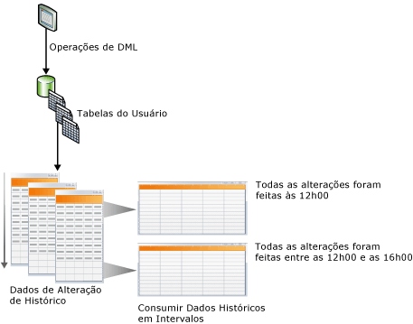
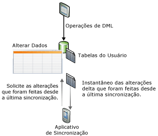

# Controle de alterações de dados (SQL Server)
[!INCLUDE[tsql-appliesto-ss2008-asdb-xxxx-xxx-md](../../includes/tsql-appliesto-ss2008-asdb-xxxx-xxx-md.md)]
  [!INCLUDE[ssCurrent](../../includes/sscurrent-md.md)] fornece dois recursos que controlam alterações em dados de bancos de dados: [captura de dados de alterações](#Capture) e [controle de alterações](#Tracking). Esses recursos permitem que os aplicativos determinem as alterações de DML (operações de inserção, atualização e exclusão) que foram feitas em tabelas de usuários em um banco de dados. A captura de dados de alteração e o controle de alterações podem ser habilitados no mesmo banco de dados; nenhuma consideração especial necessária. Para obter as edições do [!INCLUDE[ssNoVersion](../../includes/ssnoversion-md.md)] que dão suporte à captura de dados de alterações e ao controle de alterações, veja [Recursos com suporte nas edições do SQL Server 2016](~/sql-server/editions-and-supported-features-for-sql-server-2016.md). Há suporte para o controle de alterações no [!INCLUDE[ssSDS_md](../../includes/sssds-md.md)]. A captura de dados de alterações só é compatível com o SQL Server e a Instância Gerenciada do Banco de Dados SQL do Azure.
  
## Benefícios do uso da captura de dados de alterações ou do controle de alterações  
 Um requisito importante para a eficiência de alguns aplicativos é a capacidade de consultar os dados que foram alterados em um banco de dados. Em geral, para determinar alterações de dados, os desenvolvedores de aplicativos devem implementar um método personalizado de controle nos aplicativos usando uma combinação de gatilhos, colunas de carimbo de data/hora e tabelas adicionais. A criação desses aplicativos costumava envolve uma implementação muito trabalhosa, leva a atualizações de esquema e frequentemente acarreta uma sobrecarga de alto desempenho.  
  
 Usar a captura de dados de alterações ou o controle de alterações em aplicativos para rastrear alterações em um banco de dados em vez de desenvolver uma solução personalizada tem os seguintes benefícios:  
  
-   O tempo de desenvolvimento é reduzido. Como a funcionalidade está disponível no [!INCLUDE[ssCurrent](../../includes/sscurrent-md.md)], não é necessário desenvolver uma solução personalizada.  
  
-   Alterações de esquema não são necessárias. Você não precisar adicionar colunas, gatilhos nem criar tabelas laterais nas quais rastrear linhas excluídas ou armazenar informações do controle de alterações se não for possível adicionar colunas a tabelas de usuário.  
  
-   Há um mecanismo de limpeza interno. A limpeza do controle de alterações é executada automaticamente em segundo plano. A limpeza personalizada de dados armazenados em uma tabela lateral não é necessária.  
  
-   Funções são fornecidas para obter informações de alterações.  
  
-   Há pouca sobrecarga em operações DML. O controle de alterações síncrono sempre terá alguma sobrecarga. No entanto, o uso do controle de alterações pode ajudar a minimizar a sobrecarga. A sobrecarga será frequentemente menor do que ao usar soluções alternativas, principalmente soluções que precisam usar gatilhos.  
  
-   O controle de alterações é baseado em transações confirmadas. A ordem das alterações é baseada na hora da confirmação da transação. Isso permite que resultados confiáveis sejam obtidos ao executar transações demoradas e sobrepostas. Soluções personalizadas que usem valores de **timestamp** devem ser criadas especificamente para tratar desses cenários.  
  
-   Ferramentas padrão estão disponíveis para que você possa usar para configurar e gerenciar. [!INCLUDE[ssCurrent](../../includes/sscurrent-md.md)] fornece instruções DDL padrão, [!INCLUDE[ssManStudioFull](../../includes/ssmanstudiofull-md.md)], exibições do catálogo e permissões de segurança.  
  
## Diferenças de recurso entre captura de dados de alterações e controle de alterações  
 A tabela a seguir lista as diferenças de recursos entre a captura de dados de alterações e o controle de alterações. O mecanismo de controle na captura de dados de alteração envolve uma captura assíncrona de alterações no log de transação, de forma que as alterações fiquem disponíveis depois da operação de DML. No controle de alteração, o mecanismo de controle envolve o controle síncrono de alterações embutidas nas operações de DML de forma que as informações de alteração fiquem disponíveis imediatamente.  
  
|Recurso|captura de dados de alterações|controle de alterações|  
|-------------|-------------------------|---------------------|  
|**Alterações controladas**|||  
|Alterações de DML|Sim|Sim|  
|**Informações controladas**|||  
|Dados do histórico|Sim|Não|  
|Se a coluna foi alterada|Sim|Sim|  
|Tipo de DML|Sim|Sim|  
  
##   Change Data Capture  
 A captura de dados de alteração fornece informações de alteração de histórico para uma tabela de usuário, capturando o motivo pelo qual as alterações de DML foram feitas e os dados reais que foram alterados. As alterações são capturadas por meio de um processo assíncrono que lê o log de transações e tem baixo impacto no sistema.  
  
 Como mostrado na ilustração a seguir, as alterações feitas para tabelas de usuários são capturadas nas tabelas de alteração correspondentes. Essas tabelas de alteração fornecem uma exibição histórica das alterações com o passar do tempo. As funções de [captura de dados de alterações](../../relational-databases/system-functions/change-data-capture-functions-transact-sql.md) fornecidas pelo [!INCLUDE[ssNoVersion](../../includes/ssnoversion-md.md)] habilitam o consumo fácil e sistemático dos dados de alteração.  
  
   
  
### Modelo de segurança  
 Esta seção descreve o modelo de segurança da captura de dados de alterações.  
  
 **Configuração e administração**  
 Para habilitar ou desabilitar a captura de dados de alterações para um banco de dados, o chamador de [sys.sp_cdc_enable_db &#40;Transact-SQL&#41;](../../relational-databases/system-stored-procedures/sys-sp-cdc-enable-db-transact-sql.md) ou [sys.sp_cdc_disable_db &#40;Transact-SQL&#41;](../../relational-databases/system-stored-procedures/sys-sp-cdc-disable-db-transact-sql.md) deve ser membro da função de servidor fixa **sysadmin**. Habilitar e desabilitar a captura de dados de alterações no nível de tabela exige que o chamador de [sys.sp_cdc_enable_table &#40;Transact-SQL&#41;](../../relational-databases/system-stored-procedures/sys-sp-cdc-enable-table-transact-sql.md) e [sys.sp_cdc_disable_table &#40;Transact-SQL&#41;](../../relational-databases/system-stored-procedures/sys-sp-cdc-disable-table-transact-sql.md) seja membro da função sysadmin ou membro da função **database db_owner** do banco de dados.  
  
 O uso dos procedimentos armazenados para fornecer suporte aos trabalhos de captura de dados de alteração é restrito a membros da função **sysadmin** do servidor e a membros da função **database db_owner** .  
  
 **Consultas de metadados e enumeração de alteração**  
 Para obter acesso aos dados de alteração associados a uma instância de captura, o usuário deve ter acesso de seleção a todas as colunas capturadas da tabela de origem associada. Além disso, se uma função de acesso for especificada quando a instância de captura for criada, o chamador também deverá ser um membro da função de acesso especificada. Outras funções gerais de captura de dados de alteração para o acesso aos metadados estarão acessíveis a todos os usuários de banco de dados por meio da função pública, embora o acesso aos metadados retornados será sempre concedido pelo uso do acesso de seleção às tabelas de origem subjacentes e pela associação em qualquer função gating definida.  
  
 **Operações de DDL para tabelas de origem habilitadas para captura de dados de alterações**  
 Quando uma tabela é habilitada para a captura de dados de alteração, as operações de DDL podem ser aplicadas à tabela somente por um membro de função fixa de servidor **sysadmin**, um membro de **database role db_owner**ou um membro de **database role db_ddladmin**. Os usuários que têm acesso explícito para executar as operações de DDL na tabela receberão o erro 22914 se tentarem essas operações.  
  
### Considerações sobre tipos de dados para captura de dados de alteração  
 Todos os tipos de coluna base são suportados pela captura de dados de alteração. A tabela a seguir lista o comportamento e as limitações de vários tipos de coluna.  
  
|Tipo de coluna|Alterações capturadas em tabelas de alteração|Limitações|  
|--------------------|---------------------------------------|-----------------|  
|Colunas esparsas|Sim|Não dão suporte à captura de alterações durante o uso de columnset.|  
|Colunas computadas|Não|As alterações feitas a colunas computadas não são rastreadas. A coluna aparecerá na tabela de alterações com o tipo apropriado, mas terá um valor de NULL.|  
|XML|Sim|As alterações a elementos XML individuais não são rastreadas.|  
|Timestamp|Sim|O tipo de dados na tabela de alterações é convertido em binário.|  
|Tipos de dados BLOB|Sim|A imagem anterior da coluna BLOB somente será armazenada se a própria coluna for alterada.|  
  
### Change Data Capture e outros recursos do SQL Server  
 Esta seção descreve como os seguintes recursos interagem com a captura de dados de alteração:  
  
-   Espelhamento de banco de dados  
  
-   Replicação transacional  
  
-   Restauração ou anexação de banco de dados  
  
#### Espelhamento de banco de dados  
 Um banco de dados que é habilitado para captura de dados de alteração pode ser espelhado. Para assegurar que a captura e a limpeza ocorram automaticamente no espelho, siga estas etapas:  
  
1.  Verifique se o [!INCLUDE[ssNoVersion](../../includes/ssnoversion-md.md)] Agent está sendo executado no espelho.  
  
2.  Crie os trabalhos de captura e de limpeza no espelho depois que a entidade fizer failover no espelho. Para criar os trabalhos, use o procedimento armazenado [sys.sp_cdc_add_job &#40;Transact-SQL&#41;](../../relational-databases/system-stored-procedures/sys-sp-cdc-add-job-transact-sql.md).  

 Para obter mais informações sobre o espelhamento de banco de dados, veja [Espelhamento de banco de dados &#40;SQL Server&#41;](../../database-engine/database-mirroring/database-mirroring-sql-server.md).  
  
#### Replicação transacional  
 A captura de dados de alteração e a replicação transacional podem coexistir no mesmo banco de dados, mas a população das tabelas de alteração ocorre de modo diferente quando os dois recursos estão habilitados. A captura de dados de alteração e a replicação transacional sempre usam o mesmo procedimento, [sp_replcmds](../../relational-databases/system-stored-procedures/sp-replcmds-transact-sql.md), para ler alterações no log de transações. Quando a captura de dados de alterações é habilitada por iniciativa própria, um trabalho do [!INCLUDE[ssNoVersion](../../includes/ssnoversion-md.md)] Agent chama **sp_replcmds**. Quando os dois recursos estão habilitados no mesmo banco de dados, o Agente de Leitor de Log chama o **sp_replcmds**. Esse agente preenche as tabelas de alteração e do banco de dados de distribuição. Para obter mais informações, consulte [Replication Log Reader Agent](../../relational-databases/replication/agents/replication-log-reader-agent.md).  
  
 Considere um cenário em que a captura de dados de alteração está habilitada no banco de dados [!INCLUDE[ssSampleDBobject](../../includes/sssampledbobject-md.md)] e há duas tabelas habilitadas para captura. Para popular as tabelas de alteração, o trabalho de captura chama **sp_replcmds**. O banco de dados está habilitado para replicação transacional, e é criada uma publicação. Agora, o Agente de Leitor de Log é criado para o banco de dados, e o trabalho de captura é excluído. O Agente de Leitor de Log continua a examinar o log do último número de sequência de log confirmado na tabela de alteração. Isso assegura a consistência de dados nas tabelas de alteração. Se a replicação transacional estiver desabilitada nesse banco de dados, o Log Reader Agent será removido e o trabalho de captura, recriado.  
  
> [!NOTE]  
>  Quando o Agente de Leitor de Log for usado para captura de dados e replicação transacional, as alterações replicadas serão gravadas primeiro no banco de dados de distribuição. Em seguida, as alterações capturadas são gravadas nas tabelas de alteração. As duas operações são confirmadas ao mesmo tempo. Se houver uma latência na gravação no banco de dados de distribuição, haverá uma latência correspondente antes de as alterações aparecerem nas tabelas de alteração.  
  
#### Restaurando ou anexando um banco de dados habilitado para captura de dados de alteração  
 [!INCLUDE[ssNoVersion](../../includes/ssnoversion-md.md)] usa a seguinte lógica para determinar se a captura de dados de alteração deve permanecer habilitada depois que um banco de dados for restaurado ou anexado:  
  
-   Se um banco de dados for restaurado para o mesmo servidor com o mesmo nome de banco de dados, a captura de dados de alteração permanecerá habilitada.  
  
-   Se um banco de dados for restaurado para outro servidor, por padrão a captura de dados de alteração será desabilitada, e todos os metadados relacionados serão excluídos.  
  
     Para manter a captura de dados de alterações, use a opção **KEEP_CDC** ao restaurar o banco de dados. Para obter mais informações sobre essa opção, consulte [RESTORE](../../t-sql/statements/restore-statements-transact-sql.md).  
  
-   Se um banco de dados for desanexado e anexado ao mesmo servidor ou a outro servidor, a captura de dados de alteração permanecerá habilitada.  
  
-   Se um banco de dados for anexado ou restaurado com a opção **KEEP_CDC** para qualquer edição diferente de Standard ou Enterprise, a operação será bloqueada, pois a captura de dados de alterações exige as edições Standard ou Enterprise do [!INCLUDE[ssNoVersion](../../includes/ssnoversion-md.md)]. A mensagem de erro 932 é exibida:  
  
     `SQL Server cannot load database '%.*ls' because change data capture is enabled. The currently installed edition of SQL Server does not support change data capture. Either disable change data capture in the database by using a supported edition of SQL Server, or upgrade the instance to one that supports change data capture.`  
  
 Você pode usar [sys.sp_cdc_disable_db](../../relational-databases/system-stored-procedures/sys-sp-cdc-disable-db-transact-sql.md) para remover a captura de dados de alterações de um banco de dados restaurado ou anexado.  
  
##   Controle de alterações  
 O controle de alteração captura o motivo pelo qual as linhas em uma tabela foram alteradas, mas não captura o que foi alterado. Isso permite que os aplicativos determinem as linhas que foram alteradas com os últimos dados de linha obtidos diretamente das tabelas de usuários. Então, o controle de alterações é mais limitado nas perguntas de histórico do que pode responder comparado à captura de dados de alterações. Entretanto, para aqueles aplicativos que não exigem informações de histórico, há menos sobrecarga de armazenamento pois os dados alterados não são capturados. Um mecanismo de controle síncrono é usado para controlar as alterações. Isso foi projetado para ter o mínimo de sobrecarga nas operações de DML.  
  
 A ilustração a seguir mostra um cenário de sincronização que se beneficiaria com o uso do controle de alterações. No cenário, um aplicativo requer as seguintes informações: todas as linhas da tabela que foram alteradas desde a última sincronização da tabela e apenas os dados da linha atual. Como um mecanismo síncrono é usado para controlar as alterações, um aplicativo pode executar a sincronização de duas vias e detectar de modo confiável qualquer conflito que possa ocorrer.  
  
   
  
### Controle de alterações e serviços de sincronização para ADO.NET  
 [!INCLUDE[sql_sync_long](../../includes/sql-sync-long-md.md)] permite a sincronização entre bancos de dados, fornecendo uma API intuitiva e flexível que pode ser usada para criar aplicativos que têm como destino cenários offline e de colaboração. [!INCLUDE[sql_sync_long](../../includes/sql-sync-long-md.md)] fornece uma API para sincronizar alterações, mas não controla de fato as alterações no servidor ou banco de dados par. Você pode criar um sistema de controle de alterações personalizado, mas geralmente esse procedimento apresenta uma complexidade significativa e sobrecarga de desempenho. Para controlar as alterações em um servidor ou banco de dados par, recomendamos usar o controle de alteração no [!INCLUDE[ssCurrent](../../includes/sscurrent-md.md)] , pois sua configuração é fácil e ele oferece controle de alto desempenho.  
  
 Para obter mais informações sobre o controle de alterações e o [!INCLUDE[sql_sync_long](../../includes/sql-sync-long-md.md)], use os seguintes links:  
  
-   [Sobre o controle de alterações &#40;SQL Server&#41;](../../relational-databases/track-changes/about-change-tracking-sql-server.md)  
  
     Descreve o controle de alterações, fornece uma visão geral de alto nível sobre como o controle de alterações funciona e descreve como o controle de alterações interage com outros recursos do [!INCLUDE[ssDEnoversion](../../includes/ssdenoversion-md.md)] .  
  
-   [Microsoft Sync Framework Developer Center](https://go.microsoft.com/fwlink/?LinkId=108054)  
  
     Fornece a documentação completa do [!INCLUDE[ssSyncFrameLong](../../includes/sssyncframelong-md.md)] e do [!INCLUDE[sql_sync_short](../../includes/sql-sync-short-md.md)]. Na documentação do [!INCLUDE[sql_sync_short](../../includes/sql-sync-short-md.md)], o tópico "Como usar o controle de alterações do SQL Server" contém informações detalhadas e exemplos de código.  
  
## Tarefas relacionadas (necessárias)  
  
|||  
|-|-|  
|**Tarefa**|**Tópico**|  
|Fornece uma visão geral da captura de dados de alterações.|[Sobre a captura de dados de alterações &#40;SQL Server&#41;](../../relational-databases/track-changes/about-change-data-capture-sql-server.md)|  
|Descreve como habilitar e desabilitar a captura de dados de alterações em um banco de dados ou uma tabela.|[Habilitar e desabilitar a captura de dados de alterações &#40;SQL Server&#41;](../../relational-databases/track-changes/enable-and-disable-change-data-capture-sql-server.md)|  
|Descreve como administrar e monitorar a captura de dados de alterações.|[Administrar e monitorar a captura de dados de alteração &#40;SQL Server&#41;](../../relational-databases/track-changes/administer-and-monitor-change-data-capture-sql-server.md)|  
|Descreve como trabalhar com os dados de alteração que estão disponíveis para consumidores de captura de dados de alterações. Este tópico abrange a validação de limites de LSN, as funções de consulta e cenários de função de consulta.|[Trabalhar com dados de alterações &#40;SQL Server&#41;](../../relational-databases/track-changes/work-with-change-data-sql-server.md)|  
|Fornece uma visão geral do controle de alterações.|[Sobre o controle de alterações &#40;SQL Server&#41;](../../relational-databases/track-changes/about-change-tracking-sql-server.md)|  
|Descreve como habilitar e desabilitar o controle de alterações em um banco de dados ou uma tabela.|[Habilitar e desabilitar o controle de alterações &#40;SQL Server&#41;](../../relational-databases/track-changes/enable-and-disable-change-tracking-sql-server.md)|  
|Descreve como gerenciar o controle de alterações, configurar a segurança e identificar os efeitos sobre o armazenamento e o desempenho quando você usa o controle de alterações.|[Gerenciar o controle de alterações &#40;SQL Server&#41;](../../relational-databases/track-changes/manage-change-tracking-sql-server.md)|  
|Descreve como os aplicativos que usam o controle de alterações podem obter as alterações controladas, aplicá-las a outro repositório de dados e atualizar o banco de dados de origem. Este tópico também descreve a função que o controle de alterações desempenha quando ocorre um failover e um banco de dados precisa ser restaurado de um backup.|[Trabalhar com o controle de alterações &#40;SQL Server&#41;](../../relational-databases/track-changes/work-with-change-tracking-sql-server.md)|  
  
## Consulte Também  
 [Funções da captura de dados de alterações &#40;Transact-SQL&#41;](../../relational-databases/system-functions/change-data-capture-functions-transact-sql.md)   
 [Funções do controle de alterações &#40;Transact-SQL&#41;](../../relational-databases/system-functions/change-tracking-functions-transact-sql.md)   
 [Procedimentos armazenados de captura de dados de alterações &#40;Transact-SQL&#41;](../../relational-databases/system-stored-procedures/change-data-capture-stored-procedures-transact-sql.md)   
 [Tabelas da captura de dados de alterações &#40;Transact-SQL&#41;](../../relational-databases/system-tables/change-data-capture-tables-transact-sql.md)   
 [Exibições de gerenciamento dinâmico relacionadas à captura de dados de alterações &#40;Transact-SQL&#41;](https://msdn.microsoft.com/library/2a771d7d-693a-4f56-9227-02cd00e0e200)  
  
  

