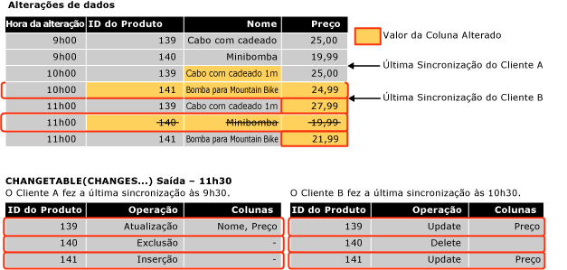

# <a name="work-with-change-tracking-sql-server"></a>Trabalhar com o controle de alterações (SQL Server)
[!INCLUDE[tsql-appliesto-ss2008-asdb-xxxx-xxx-md](../../includes/tsql-appliesto-ss2008-asdb-xxxx-xxx-md.md)]

  Os aplicativos que usam o controle de alterações devem ser capazes de obter as alterações controladas, aplicá-las a outro repositório de dados e atualizar o banco de dados de origem. Este tópico descreve como executar essas tarefas e também a função que o controle de alterações desempenha quando ocorre um failover e um banco de dados precisa ser restaurado de um backup.  
  
##  <a name="Obtain"></a> Obter alterações usando as funções de controle de alterações  
 Descreve como usar as funções de controle de alterações para obter as alterações feitas em um banco de dados e as respectivas informações.  
  
### <a name="about-the-change-tracking-functions"></a>Sobre as funções de controle de alterações  
 Os aplicativos podem usar as funções a seguir para obter as alterações feitas em um banco de dados e as informações sobre as alterações:  
  
 Função CHANGETABLE(CHANGES…)  
 Esta função de conjunto de linhas é usada para consultar informações de alteração. A função consulta os dados armazenados nas tabelas internas de controle de alterações e retorna um conjunto de resultados que contém as chaves primárias de linhas, que foram alteradas, junto com outras informações de alterações como a operação, as colunas atualizadas e a versão da linha.  
  
 A função CHANGETABLE(CHANGES…) usa uma última versão de sincronização como um argumento. A última versão de sincronização é obtida por meio da variável `@last_synchronization_version` . A semântica da última versão de sincronização é a seguinte:  
  
-   O cliente de chamada obteve e tem conhecimento de todas as alterações até, e inclusive, a última versão de sincronização.  
  
-   A função CHANGETABLE(CHANGES…) retornará todas as alterações ocorridas depois da última versão de sincronização.  
  
     A ilustração a seguir mostra como a função CHANGETABLE(CHANGES…) é usada para obter alterações.  
  
       
  
 Função CHANGE_TRACKING_CURRENT_VERSION()  
 É usada para obter a versão atual que será usada na próxima vez ao consultar alterações. Essa versão representa a versão da última transação confirmada.  
  
 Função CHANGE_TRACKING_MIN_VALID_VERSION()  
 Esta função é usada para obter a versão mínima válida que o cliente pode ter e também obter os resultados válidos de CHANGETABLE(). O cliente deverá comparar a última versão de sincronização com o valor retornado por essa função. Se a última versão de sincronização for menor que a versão retornada por essa função, o cliente não poderá obter os resultados válidos de CHANGETABLE() e deverá reinicializar os dados.  
  
### <a name="obtaining-initial-data"></a>Obtendo dados iniciais  
 Antes que um aplicativo possa obter as alterações pela primeira vez, ele deverá enviar uma consulta para obter os dados iniciais e a versão de sincronização. O aplicativo deve obter os dados adequados diretamente da tabela e usar a função CHANGE_TRACKING_CURRENT_VERSION() para obter a versão inicial. Essa versão passará para CHANGETABLE(CHANGES…) na primeira vez em que as alterações forem obtidas.  
  
 O exemplo a seguir mostra como obter a versão de sincronização inicial, bem como o conjunto de dados inicial.  
  
```sql  
    -- Obtain the current synchronization version. This will be used next time that changes are obtained.  
    SET @synchronization_version = CHANGE_TRACKING_CURRENT_VERSION();  
  
    -- Obtain initial data set.  
    SELECT  
        P.ProductID, P.Name, P.ListPrice  
    FROM  
        SalesLT.Product AS P  
```  
  
### <a name="using-the-change-tracking-functions-to-obtain-changes"></a>Usando as funções de controle de alterações para obter alterações  
 Para obter as linhas alteradas de uma tabela e as informações sobre as alterações, use a função CHANGETABLE(CHANGES…). Por exemplo, a consulta a seguir obtém as alterações da tabela `SalesLT.Product` .  
  
```sql  
SELECT  
    CT.ProductID, CT.SYS_CHANGE_OPERATION,  
    CT.SYS_CHANGE_COLUMNS, CT.SYS_CHANGE_CONTEXT  
FROM  
    CHANGETABLE(CHANGES SalesLT.Product, @last_synchronization_version) AS CT  
  
```  
  
 Geralmente, um cliente optará por obter os últimos dados de uma linha em vez de apenas as chaves primárias da linha. Além disso, um aplicativo juntaria os resultados de CHANGETABLE(CHANGES…) com os dados na tabela do usuário. Por exemplo, a consulta a seguir une as linhas da tabela `SalesLT.Product` para obter os valores das colunas `Name` e `ListPrice` . Observe o uso da função `OUTER JOIN`. Ela é obrigatória para garantir que as informações de alteração sejam retornadas para essas linhas que foram excluídas da tabela do usuário.  
  
```sql  
SELECT  
    CT.ProductID, P.Name, P.ListPrice,  
    CT.SYS_CHANGE_OPERATION, CT.SYS_CHANGE_COLUMNS,  
    CT.SYS_CHANGE_CONTEXT  
FROM  
    SalesLT.Product AS P  
RIGHT OUTER JOIN  
    CHANGETABLE(CHANGES SalesLT.Product, @last_synchronization_version) AS CT  
ON  
    P.ProductID = CT.ProductID  
```  
  
 Para obter a versão a ser usada na próxima enumeração de alteração, use  CHANGE_TRACKING_CURRENT_VERSION(), como mostra o exemplo a seguir.  
  
```sql  
SET @synchronization_version = CHANGE_TRACKING_CURRENT_VERSION()  
```  
  
 Quando um aplicativo obtiver alterações, ele deverá usar CHANGETABLE(CHANGES…) e CHANGE_TRACKING_CURRENT_VERSION(), como mostra o exemplo a seguir.  
  
```sql  
-- Obtain the current synchronization version. This will be used the next time CHANGETABLE(CHANGES...) is called.  
SET @synchronization_version = CHANGE_TRACKING_CURRENT_VERSION();  
  
-- Obtain incremental changes by using the synchronization version obtained the last time the data was synchronized.  
SELECT  
    CT.ProductID, P.Name, P.ListPrice,  
    CT.SYS_CHANGE_OPERATION, CT.SYS_CHANGE_COLUMNS,  
    CT.SYS_CHANGE_CONTEXT  
FROM  
    SalesLT.Product AS P  
RIGHT OUTER JOIN  
    CHANGETABLE(CHANGES SalesLT.Product, @last_synchronization_version) AS CT  
ON  
    P.ProductID = CT.ProductID  
```  
  
### <a name="version-numbers"></a>Números de versão  
 Um banco de dados com o controle de alterações habilitado tem um contador de versões que aumenta à medida que são realizadas mudanças nas tabelas controladas. Cada linha alterada tem um número de versão associado. Quando uma solicitação é enviada a um aplicativo para consultar as alterações, uma função é chamada para fornecer um número de versão. A função retorna informações sobre todas as alterações que foram feitas desde aquela versão. De certas formas, a versão de controle de alterações é semelhante no conceito ao tipo de dados **rowversion** .  
  
### <a name="validating-the-last-synchronized-version"></a>Validando a última versão sincronizada  
 As informações sobre as alterações são mantidas por um período limitado. A duração desse tempo e controlada pelo parâmetro CHANGE_RETENTION que pode ser especificado como parte de ALTER DATABASE.  
  
 Tenha em mente que o tempo especificado em CHANGE_RETENTION determina a frequência com que todos os aplicativos solicitarão alterações do banco de dados. Se o valor de *last_synchronization_version* em um aplicativo for anterior ao valor da versão de sincronização mínima válida para uma tabela, esse aplicativo não poderá executar a enumeração de alteração válida. Isso ocorre porque algumas informações de alteração podem ser apagadas. Antes que um aplicativo possa obter as alterações usando a função CHANGETABLE(CHANGES…), ele deve validar o valor de *last_synchronization_version* para passá-lo para CHANGETABLE(CHANGES…). Se o valor de *last_synchronization_version* não for válido, esse aplicativo deverá reinicializar todos os dados.  
  
 O exemplo a seguir mostra como verificar a validade do valor de `last_synchronization_version` para cada tabela.  
  
```sql  
-- Check individual table.  
IF (@last_synchronization_version < CHANGE_TRACKING_MIN_VALID_VERSION(  
                                   OBJECT_ID('SalesLT.Product')))  
BEGIN  
  -- Handle invalid version and do not enumerate changes.  
  -- Client must be reinitialized.  
END  
```  
  
 Como mostra o exemplo a seguir, a validade do valor de `last_synchronization_version` pode ser verificada em comparação a todas as tabelas no banco de dados.  
  
```sql  
-- Check all tables with change tracking enabled  
IF EXISTS (  
  SELECT COUNT(*) FROM sys.change_tracking_tables  
  WHERE min_valid_version > @last_synchronization_version )  
BEGIN  
  -- Handle invalid version & do not enumerate changes  
  -- Client must be reinitialized  
END  
```  
  
### <a name="using-column-tracking"></a>Usando o rastreamento de coluna  
 O rastreamento de coluna permite que os aplicativos obtenham dados apenas das colunas que foram alteradas em vez de toda a linha. Por exemplo, considere o cenário no qual uma tabela tem uma ou mais colunas extensas, mas que raramente têm alterações, e outras colunas com alterações frequentes. Com o rastreamento de coluna, um aplicativo pode determinar se apenas uma linha foi alterada e se seria preciso sincronizar todos os dados da coluna maior. Entretanto, por meio do rastreamento de coluna, um aplicativo poderá determinar se os dados da coluna grande foram alterados e sincronizar apenas os dados, caso tenham sido alterados.  
  
 As informações de rastreamento de coluna são exibidas na coluna SYS_CHANGE_COLUMNS que é retornada pela função CHANGETABLE(CHANGES…).  
  
 O rastreamento de coluna pode ser usado de forma que NULL seja retornado para uma coluna que não tenha sido alterada. Se a coluna puder ser alterada para NULL, outra coluna deverá ser retornada para indicar se a coluna foi alterada.  
  
 No exemplo a seguir, a coluna `CT_ThumbnailPhoto` será `NULL` se ela não tiver sido alterada. Esta coluna também deve ser `NULL` porque ela foi alterada para `NULL` - o aplicativo pode usar a coluna `CT_ThumbNailPhoto_Changed` para determinar se a coluna foi alterada.  
  
```sql  
DECLARE @PhotoColumnId int = COLUMNPROPERTY(  
    OBJECT_ID('SalesLT.Product'),'ThumbNailPhoto', 'ColumnId')  
  
SELECT  
    CT.ProductID, P.Name, P.ListPrice, -- Always obtain values.  
    CASE  
           WHEN CHANGE_TRACKING_IS_COLUMN_IN_MASK(  
                     @PhotoColumnId, CT.SYS_CHANGE_COLUMNS) = 1  
            THEN ThumbNailPhoto  
            ELSE NULL  
      END AS CT_ThumbNailPhoto,  
      CHANGE_TRACKING_IS_COLUMN_IN_MASK(  
                     @PhotoColumnId, CT.SYS_CHANGE_COLUMNS) AS  
                                   CT_ThumbNailPhoto_Changed  
     CT.SYS_CHANGE_OPERATION, CT.SYS_CHANGE_COLUMNS,  
     CT.SYS_CHANGE_CONTEXT  
FROM  
     SalesLT.Product AS P  
INNER JOIN  
     CHANGETABLE(CHANGES SalesLT.Product, @last_synchronization_version) AS CT  
ON  
     P.ProductID = CT.ProductID AND  
     CT.SYS_CHANGE_OPERATION = 'U'  
```  
  
### <a name="obtaining-consistent-and-correct-results"></a>Obtendo resultados consistentes e corretos  
 Para obter os dados alterados de uma tabela é preciso seguir várias etapas. Lembre-se de que podem ocorrer resultados inconsistentes ou incorretos, se determinados problemas não forem considerados e tratados.  
  
 Por exemplo, para obter as alterações realizadas em uma tabela Sales e uma tabela SalesOrders, um aplicativo executaria as seguintes etapas:  
  
1.  Validar a última versão sincronizada por meio de CHANGE_TRACKING_MIN_VALID_VERSION().  
  
2.  Obter a versão que pode ser usada para obter a alteração na próxima vez por meio de CHANGE_TRACKING_CURRENT_VERSION().  
  
3.  Obtenha as alterações da tabela Sales usando CHANGETABLE(CHANGES…).  
  
4.  Obtenha as alterações da tabela SalesOrders usando CHANGETABLE(CHANGES…).  
  
 Dois processos estão ocorrendo no banco de dados que podem afetar os resultados retornados pelas etapas anteriores:  
  
-   O processo de limpeza é executado em segundo plano e remove as informações de controle de alterações anteriores ao período de retenção especificado.  
  
     A limpeza é um processo interno e em segundo plano que usa um período de retenção especificado quando você configura o controle de alterações para o banco de dados. O problema é que o processo de limpeza pode ocorrer na hora em que a última versão de sincronização foi validada e quando a chamada para CHANGETABLE(CHANGES…) for feita. Uma última versão de sincronização que acabou de ser validada pode não ser mais válida no momento em que as alterações forem obtidas. Portanto, talvez sejam retornados resultados incorretos.  
  
-   Operações de DML contínuas ocorrem nas tabelas Sales e SalesOrders, como as operações a seguir:  
  
    -   Alterações poderão ser feitas na tabela depois que a versão tiver sido obtida por meio de CHANGE_TRACKING_CURRENT_VERSION(). Talvez sejam retornadas mais alterações do que o esperado.  
  
    -   Uma transação pode ocorrer no período entre a chamada para obter as alterações da tabela Sales e a chamada para obter as alterações da tabela SalesOrders. Entre os resultados da tabela SalesOrder pode haver um valor de chave estrangeira que não exista na tabela Sales.  
  
 Para superar os desafios previamente listados, é recomendável usar o isolamento de instantâneo. Isso ajudará a garantir a consistência das informações de alterações e evitará situações de competição relacionadas à tarefa de limpeza em segundo plano. Se você optar por não usar as transações de instantâneo, o desenvolvendo um aplicativo que usa controle de alterações poderá exigeer mais esforço.  
  
#### <a name="using-snapshot-isolation"></a>Usando o isolamento de instantâneo  
 O controle de alterações foi projetado para funcionar bem com o isolamento de instantâneo. O isolamento de instantâneo deve estar habilitado para o banco de dados. Todas as etapas são obrigatórias para obter as alterações que devem estar incluídas em uma transação de instantâneo. Isso garantirá que todas as alterações realizadas nos dados durante a obtenção de alterações não estarão visíveis às consultas dentro da transação de instantâneo.  
  
 Para obter dados dentro de uma transação de instantâneo, execute as seguintes etapas:  
  
1.  Defina o nível de isolamento da transação para o instantâneo e inicie uma transação.  
  
2.  Valide a última versão de sincronização usando a função CHANGE_TRACKING_MIN_VALID_VERSION().  
  
3.  Obtenha a versão a ser usada na próxima vez por meio de CHANGE_TRACKING_CURRENT_VERSION().  
  
4.  Obtenha as alterações da tabela Sales usando CHANGETABLE(CHANGES…).  
  
5.  Obtenha as alterações da tabela SalesOrders usando CHANGETABLE(CHANGES…).  
  
6.  Confirme a transação.  
  
 Alguns pontos a serem lembrados, uma vez que todas as etapas para obter alterações estão em uma transação de instantâneo:  
  
-   Se a limpeza ocorrer depois que a última versão de sincronização for validada, os resultados da função CHANGETABLE(CHANGES…) ainda serão válidos, pois as operações de exclusão executadas pela limpeza não serão visíveis dentro da transação.  
  
-   Todas as alterações realizadas nas tabelas Sales ou SalesOrders depois que a versão de sincronização tiver sido obtida não estarão visíveis e as chamadas para CHANGETABLE(CHANGES…) nunca retornarão alterações com uma versão posterior àquela retornada pela função CHANGE_TRACKING_CURRENT_VERSION(). A consistência entre as tabelas Sales e SalesOrders também será mantida porque as transações que foram confirmadas no período entre as chamadas para CHANGETABLE(CHANGES…) não estarão visíveis.  
  
 O exemplo a seguir mostra como o isolamento de instantâneo é habilitado para um banco de dados.  
  
```sql  
-- The database must be configured to enable snapshot isolation.  
ALTER DATABASE AdventureWorksLT  
    SET ALLOW_SNAPSHOT_ISOLATION ON;  
```  
  
 Uma transação de instantâneo é usada a seguinte forma:  
  
```sql  
SET TRANSACTION ISOLATION LEVEL SNAPSHOT;  
BEGIN TRAN  
  -- Verify that version of the previous synchronization is valid.  
  -- Obtain the version to use next time.  
  -- Obtain changes.  
COMMIT TRAN  
```  
  
 Para obter mais informações sobre transações de instantâneos, veja [SET TRANSACTION ISOLATION LEVEL &#40;Transact-SQL&#41;](../../t-sql/statements/set-transaction-isolation-level-transact-sql.md).  
  
#### <a name="alternatives-to-using-snapshot-isolation"></a>Alternativas para usar o isolamento de instantâneo  
 Existem alternativas para o uso do isolamento de instantâneo, mas elas exigem mais trabalho para certificar-se de que todos os requisitos do aplicativos sejam atendidos. Para verificar se *last_synchronization_version* é válido e se os dados não foram removidos pelo processo de limpeza antes de as alterações serem obtidas, siga estas etapas:  
  
1.  Verificar *last_synchronization_version* depois das chamadas para CHANGETABLE().  
  
2.  Verifique *last_synchronization_version* como parte de cada consulta para obter alterações usando CHANGETABLE().  
  
 As alterações podem ocorrer depois da versão de sincronização para a próxima enumeração for obtida. Existem duas maneiras para controlar essa situação: A opção que é usada depende do aplicativo e como ele pode controlar os efeitos colaterais de cada abordagem:  
  
-   Ignore as alterações cuja versão é maior que a nova versão de sincronização.  
  
     O efeito colateral dessa abordagem é fazer com que uma nova linha ou uma linha atualizada seja ignorada caso ela tenha sido criada ou atualizada antes da nova versão de sincronização, exceto a atualização posterior. Se houver uma nova linha, poderá ocorrer um problema de integridade referencial caso tenha existido uma linha em outra tabela que tenha sido criada com referência à linha ignorada. Se houver uma linha existente atualizada, a linha será ignorada e não será sincronizada até o próximo período.  
  
-   Inclua todas as alterações, até mesmo aquelas que contêm uma versão maior que a nova versão de sincronização.  
  
     As linhas com uma versão maior que a nova versão de sincronização serão obtidas na próxima sincronização. Isso deve ser esperado e controlado pelo aplicativo.  
  
 Além das duas opções anteriores, você pode criar uma abordagem que combine ambas as opções, dependendo da operação. Por exemplo, você poder desejar uma aplicação na qual seja melhor ignorar as alterações mais recentes do que a próxima versão de sincronização na qual a fila foi criada ou excluída, mas as atualizações não foram ignoradas.  
  
> [!NOTE]  
>  Ao optar pela abordagem que funcionará com o aplicativo quando você estiver usando o controle de alterações (ou qualquer mecanismo de controle personalizado), será preciso considerar uma análise significativa. Portanto, é muito mais simples usar o isolamento de instantâneo.  
  
##  <a name="Handles"></a> Como o controle de alterações controla as alterações em um banco de dados  
 Alguns aplicativos que usam controle de alterações executam sincronização de duas vias com outro repositório de dados. Isto é, as alterações que são feitas no banco de dados do [!INCLUDE[ssNoVersion](../../includes/ssnoversion-md.md)] são atualizadas no outro armazenamento de dados, e as alterações feitas no outro repositório são atualizadas no banco de dados do [!INCLUDE[ssNoVersion](../../includes/ssnoversion-md.md)] .  
  
 Quando um aplicativo atualiza o banco de dados local com alteração de outro armazenamento de dados, o aplicativo deve executar as seguintes operações:  
  
-   Verifique os conflitos.  
  
     Um conflito acontece quando os mesmos dados são alterados ao mesmo tempo em ambos os armazenamentos de dados. O aplicativo deve poder verificar um conflito e obter informações suficientes para permitir a solução do conflito.  
  
-   Armazene informações de contexto de aplicativo.  
  
     O aplicativo armazena dados que têm as informações de controle de alterações. Essas informações estariam disponíveis junto com outras informações de controle de alterações quando foram obtidas alterações do banco de dados local. Um exemplo comum dessas informações de contexto é um identificador para o repositório de dados que era a origem da alteração.  
  
 Para executar as operações anteriores, um aplicativo de sincronização pode usar as funções a seguir:  
  
-   CHANGETABLE(VERSION…)  
  
     Quando um aplicativo estiver fazendo alterações, poderá usar esta função para verificar conflitos. A função obtém as últimas informações de controle de alterações por uma linha especificada em uma tabela de alteração rastreada. As informações do controle de alterações incluem a versão da última vez que a linha foi alterada. Essa informação permite que um aplicativo determine se a linha foi alterada, depois da última vez que o aplicativo foi sincronizado.  
  
-   WITH CHANGE_TRACKING_CONTEXT  
  
     Um aplicativo pode usar esta cláusula para armazenar dados de contexto.  
  
### <a name="checking-for-conflicts"></a>Verificando conflitos  
 Em um cenário de sincronização de duas vias, o aplicativo cliente deve determinar se uma linha não foi atualizada desde que o aplicativo obteve as últimas alterações.  
  
 O exemplo a seguir mostra como usar a função CHANGETABLE(VERSION …) para verificar conflitos do modo mais eficiente, sem uma consulta separada. No exemplo, `CHANGETABLE(VERSION …)` determina o `SYS_CHANGE_VERSION` para a linha especificada por `@product id`. `CHANGETABLE(CHANGES …)` pode obter as mesmas informações, mas isso seria menos eficiente. Se o valor de `SYS_CHANGE_VERSION` para a linha for maior que o valor de `@last_sync_version`, haverá um conflito. Se houver um conflito, a linha não será atualizada. A verificação `ISNULL()` é necessária porque não poderia haver nenhuma informações de alteração disponível para a linha. Nenhuma informação de alteração existiria se a linha não tivesse sido atualizada, visto que o controle de alteração estava habilitado ou a informação de alteração foi limpa.  
  
```sql  
-- Assumption: @last_sync_version has been validated.  
  
UPDATE  
    SalesLT.Product  
SET  
    ListPrice = @new_listprice  
FROM  
    SalesLT.Product AS P  
WHERE  
    ProductID = @product_id AND  
    @last_sync_version >= ISNULL (  
        SELECT CT.SYS_CHANGE_VERSION  
        FROM CHANGETABLE(VERSION SalesLT.Product,  
                        (ProductID), (P.ProductID)) AS CT),  
        0)  
```  
  
 O código a seguir pode verificar a conta de linha atualizada e identificar mais informações sobre o conflito.  
  
```sql  
-- If the change cannot be made, find out more information.  
IF (@@ROWCOUNT = 0)  
BEGIN  
    -- Obtain the complete change information for the row.  
    SELECT  
        CT.SYS_CHANGE_VERSION, CT.SYS_CHANGE_CREATION_VERSION,  
        CT.SYS_CHANGE_OPERATION, CT.SYS_CHANGE_COLUMNS  
    FROM  
        CHANGETABLE(CHANGES SalesLT.Product, @last_sync_version) AS CT  
    WHERE  
        CT.ProductID = @product_id;  
  
    -- Check CT.SYS_CHANGE_VERSION to verify that it really was a conflict.  
    -- Check CT.SYS_CHANGE_OPERATION to determine the type of conflict:  
    -- update-update or update-delete.  
    -- The row that is specified by @product_id might no longer exist   
    -- if it has been deleted.  
END  
```  
  
### <a name="setting-context-information"></a>Configurando informações de contexto  
 Usando a cláusula WITH CHANGE_TRACKING_CONTEXT, um aplicativo pode armazenar informações de contexto junto com as informações de alteração. Essas informações podem ser obtidas na coluna SYS_CHANGE_CONTEXT que é retornada por CHANGETABLE(CHANGES …).  
  
 Informações de contexto são normalmente usadas para identificar a origem das alterações. Se a origem da alteração puder ser identificada, aquela informação poderá ser usada por um repositório de dados para evitar a obtenção de alterações quando ele for novamente sincronizado.  
  
```sql  
  -- Try to update the row and check for a conflict.  
  WITH CHANGE_TRACKING_CONTEXT (@source_id)  
  UPDATE  
     SalesLT.Product  
  SET  
      ListPrice = @new_listprice  
  FROM  
      SalesLT.Product AS P  
  WHERE  
     ProductID = @product_id AND  
     @last_sync_version >= ISNULL (  
         (SELECT CT.SYS_CHANGE_VERSION FROM CHANGETABLE(VERSION SalesLT.Product,  
         (ProductID), (P.ProductID)) AS CT),  
         0)  
```  
  
### <a name="ensuring-consistent-and-correct-results"></a>Assegurando resultados consistentes e corretos  
 Um aplicativo deve considerar o processo de limpeza ao validar o valor de @last_sync_version. Isso é porque dados podem ter sido removidos depois que CHANGE_TRACKING_MIN_VALID_VERSION () foi chamado, mas antes que a atualização fosse feita.  
  
> [!IMPORTANT]  
>  Recomendamos que você use isolamento de instantâneo e faça as alterações dentro de uma transação de instantâneo.  
  
```sql  
-- Prerequisite is to ensure ALLOW_SNAPSHOT_ISOLATION is ON for the database.  
  
SET TRANSACTION ISOLATION LEVEL SNAPSHOT;  
BEGIN TRAN  
    -- Verify that last_sync_version is valid.  
    IF (@last_sync_version <  
CHANGE_TRACKING_MIN_VALID_VERSION(OBJECT_ID(‘SalesLT.Product’)))  
    BEGIN  
       RAISERROR (N’Last_sync_version too old’, 16, -1);  
    END  
    ELSE  
    BEGIN  
        -- Try to update the row.  
        -- Check @@ROWCOUNT and check for a conflict.  
    END  
COMMIT TRAN  
```  
  
> [!NOTE]  
>  Há uma possibilidade de que a linha, que está sendo atualizada dentro da transação de instantâneo, possa ter sido atualizada em uma outra transação depois que a transação de instantâneo foi iniciada. Nesse caso, um conflito de atualização de isolamento do instantâneo acontecerá e a transação será encerrada. Se isso acontecer, tente novamente a atualização. Isso levará então a detecção de um conflito do controle de alterações e nenhuma linha será alterada.  
  
##  <a name="DataRestore"></a> Controle de alterações e restauração de dados  
 Os aplicativos que requerem sincronização devem considerar o caso de um banco de dados, com o controle de alterações habilitado, reverter a uma versão anterior dos dados. Isso pode ocorrer quando um banco de dados é restaurado de um backup, quando há failover de um espelho de banco de dados assíncrono ou quando há uma falha ao usar o envio de logs. O cenário a seguir ilustra o assunto:  
  
1.  A tabela T1 tem as alterações controladas, e a versão válida mínima para tabela é 50.  
  
2.  Um aplicativo cliente sincroniza dados com a versão 100 e obtém informações sobre todas as alterações entre as versões 50 e 100.  
  
3.  São feitas alterações adicionais na tabela T1 depois da versão 100.  
  
4.  Na versão 120, há uma falha e o administrador do banco de dados restaura o banco de dados com perda de dados. Depois da operação de restauração, a tabela contém dados até a versão 70, e a versão sincronizada mínima ainda é 50.  
  
     Isso significa que o repositório de dados sincronizado tem dados que já não existem mais no repositório de dados primário.  
  
5.  A T1 é atualizada muitas vezes. Isso traz a versão atual para 130.  
  
6.  O aplicativo cliente é sincronizado novamente e fornece uma última versão sincronizada de 100. O cliente valida esse número com êxito porque 100 é maior do que 50.  
  
     O cliente obtém alterações entre as versões 100 e 130. Nesse ponto, o cliente não reconhece que as alterações entre 70 e 100 não são as mesmas de antes. Os dados no cliente e no servidor não estão sincronizados.  
  
 Observe que, se o banco de dados foi recuperado em um ponto depois da versão 100, não haverá problemas com a sincronização. O cliente e o servidor sincronizarão os dados corretamente durante o próximo intervalo de sincronização.  
  
 O controle de alterações não oferece suporte para a recuperação da perda de dados. No entanto, há duas opções para detectar esses problemas de sincronização:  
  
-   Armazene um ID da versão do banco de dados no servidor e atualize esse valor sempre que o banco de dados for recuperado ou perder dados. Cada aplicativo cliente armazenará o ID, e cada cliente terá de validar esse ID quando sincronizar os dados. Se ocorrer perda de dados, os IDs serão incompatíveis, e os clientes serão reinicializados. Um aspecto negativo é que, se a perda de dados não tiver ultrapassado o último limite sincronizado, o cliente poderá ser reinicializado desnecessariamente.  
  
-   Quando um cliente consultar alterações, registre o último número de versão de sincronização para cada cliente no servidor. Se houver um problema com os dados, os últimos números de versão sincronizados não serão compatíveis. Isso indica que é necessária uma reinicialização.  
  
## <a name="see-also"></a>Consulte Também  
 [Controle de alterações de dados &#40;SQL Server&#41;](../../relational-databases/track-changes/track-data-changes-sql-server.md)   
 [Sobre o controle de alterações &#40;SQL Server&#41;](../../relational-databases/track-changes/about-change-tracking-sql-server.md)   
 [Gerenciar o controle de alterações &#40;SQL Server&#41;](../../relational-databases/track-changes/manage-change-tracking-sql-server.md)   
 [Habilitar e desabilitar o controle de alterações &#40;SQL Server&#41;](../../relational-databases/track-changes/enable-and-disable-change-tracking-sql-server.md)   
 [CHANGETABLE &#40;Transact-SQL&#41;](../../relational-databases/system-functions/changetable-transact-sql.md)   
 [CHANGE_TRACKING_MIN_VALID_VERSION &#40;Transact-SQL&#41;](../../relational-databases/system-functions/change-tracking-min-valid-version-transact-sql.md)   
 [CHANGE_TRACKING_CURRENT_VERSION &#40;Transact-SQL&#41;](../../relational-databases/system-functions/change-tracking-current-version-transact-sql.md)   
 [WITH CHANGE_TRACKING_CONTEXT &#40;Transact-SQL&#41;](../../relational-databases/system-functions/with-change-tracking-context-transact-sql.md)  
  
  
