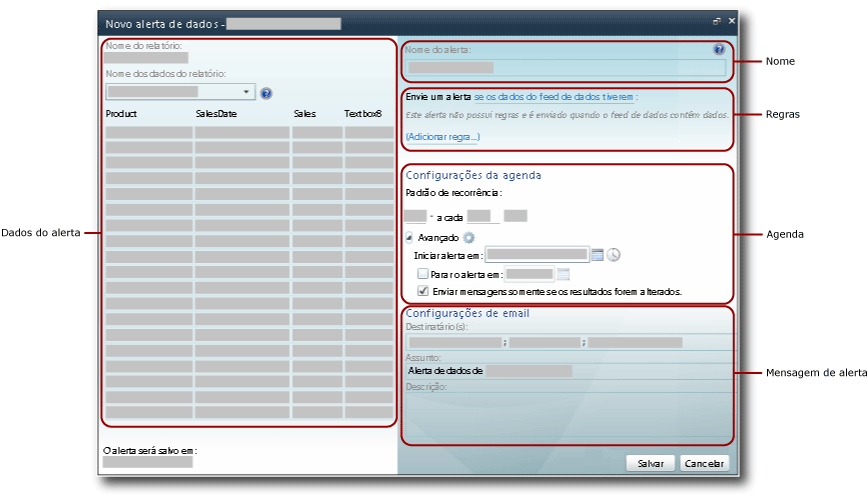
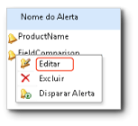

# Designer de Alertas de Dados

[!INCLUDE [ssrs-appliesto](../includes/ssrs-appliesto.md)] [!INCLUDE [ssrs-appliesto-2016](../includes/ssrs-appliesto-2016.md)] [!INCLUDE [ssrs-appliesto-not-2017](../includes/ssrs-appliesto-not-2017.md)] [!INCLUDE[ssrs-appliesto-sharepoint-2013-2016i](../includes/ssrs-appliesto-sharepoint-2013-2016.md)][!INCLUDE [ssrs-appliesto-not-pbirs](../includes/ssrs-appliesto-not-pbirs.md)]

[!INCLUDE [ssrs-previous-versions](../includes/ssrs-previous-versions.md)]

Você cria e edita definições de alerta de dados no Designer de Alertas de Dados. Uma definição de alerta é uma coleção de metadados, incluindo os dados de relatório nos quais você está interessado, as regras que os dados de relatório devem atender para criar instâncias de alerta de dados e enviar mensagens de alerta de dados, os destinatários da mensagem de alerta, e assim sucessivamente.  

> [!NOTE]
> A integração do Reporting Services ao SharePoint não está mais disponível após o SQL Server 2016.

 Para criar uma definição de alerta você executa várias tarefas relacionadas:  
  
-   Selecione o relatório e o feed de dados do relatório que inclui os dados que você deseja usar.  
  
-   Defina as regras e cláusulas que farão com que um alerta seja enviado. As regras podem ser simples ou complexas, usando várias cláusulas combinadas por operadores AND.  
  
-   Defina a frequência na qual a mensagem de alerta será enviada, e a data e a hora de início e de parada do alerta. As mensagens de alerta só poderão ser enviadas quando os resultados forem alterados.  
  
-   Especifique os endereços de email dos destinatários da mensagem de alerta.  
  
-   Personalize a linha **Assunto** da mensagem de alerta.  
  
-   Forneça uma descrição do alerta para incluir na mensagem de alerta.  
  
> [!NOTE]  
>  Como o recurso de alertas de dados do [!INCLUDE[ssRSnoversion](../includes/ssrsnoversion-md.md)] está disponível apenas quando você instala o [!INCLUDE[ssRSnoversion](../includes/ssrsnoversion-md.md)] no modo do SharePoint, o relatório no qual você deseja criar um alerta deve ser salvo, implantado ou carregado em uma biblioteca de documentos do SharePoint.  
>   
>  Os alertas de dados não podem ser criados nos relatórios que usam a autenticação Integrada do Windows ou avisos para credenciais. Os relatórios devem usar credenciais armazenadas. Para obter mais informações, consulte [Specify Credential and Connection Information for Report Data Sources](../reporting-services/report-data/specify-credential-and-connection-information-for-report-data-sources.md).  
  
 Para abrir o Designer de Alertas de Dados, clique na opção **Novo Alerta de Dados** no menu **Ações** na barra de ferramentas de relatório. Se a opção **Novo Alerta de Dados** não aparecer, o relatório não está configurado para usar credenciais armazenadas. Você pode atualizar o tipo de credencial atualizando a fonte de dados de relatório a partir da biblioteca do SharePoint.  
  
##   Interface de usuário do Designer de Alertas de Dados  
 O Designer de Alerta de Dados divide-se em áreas. A área onde você seleciona o feed de dados de relatório, a área onde você cria condições simples ou complexas com a adição de regras a condições e assim por diante. A imagem a seguir mostra as áreas do Designer de Alerta de Dados.  
  
   
  
  
### Dados do alerta  
 Quando você abre o Designer de Alerta de Dados, ele gera e disponibiliza todos os feeds de dados do relatório e a lista suspensa **Nome dos dados do relatório** contém os nomes dos feeds. Os feeds de dados são armazenados em cache na memória enquanto você cria a definição do alerta, e a tabela que exibe os dados do feed de dados é populada rapidamente quando você alterna entre feeds de dados para explorar os dados do relatório.  
  
 A primeira etapa na criação de uma definição de alerta de dados é selecionar o feed de dados de relatório que contém os dados a serem monitorados pelo alerta. Os relatórios podem ter zero ou vários feeds de dados. Se um relatório não tiver nenhum feed de dados, não será possível criar alertas para ele. Um feed de dados pode ser gerado por qualquer região de dados, inclusive todos os tipos de gráficos, indicadores, medidores, bem como tabelas, matrizes e listas.  
  
 Se o relatório estiver parametrizados e não forem exibidos os dados e as colunas esperados no feed de dados de relatório, execute novamente o relatório usando os valores de parâmetro apropriados. As colunas e os valores devem estar presentes no relatório a ser incluído no feed de dados.  
  
 Dependendo do layout do relatório, a quantidade de feeds de dados de um relatório talvez não seja intuitiva, nem quais dados estão incluídos em quais feeds de dados. A extensão de renderização Atom do [!INCLUDE[ssRSnoversion](../includes/ssrsnoversion-md.md)]gera os feeds de dados que são usados com alertas. A extensão de renderização Atom fornece dados de relatório como conjuntos de linhas bidimensionais, um formato tabular no qual todas as colunas têm o mesmo número de linhas. Esses conjuntos de linhas são o conteúdo dos feeds de dados. Como o layout de relatório normalmente é complexo e contém várias regiões de dados pares e aninhadas, vários feeds de dados são necessários para disponibilizar todos os dados do relatório. Para obter mais informações sobre como os feeds de dados são gerados com base em relatórios, consulte [Gerando feeds de dados com base em relatórios &#40;Construtor de Relatórios e SSRS&#41;](../reporting-services/report-builder/generating-data-feeds-from-reports-report-builder-and-ssrs.md) e [Gerar feeds de dados com base em um relatório &#40;Construtor de Relatórios e SSRS&#41;](../reporting-services/report-builder/generate-data-feeds-from-a-report-report-builder-and-ssrs.md).  
  
 Quando você escolher um feed de dados, os dados do feed serão exibidos em uma tabela com linhas e colunas no painel de dados de alerta do Designer de Alertas de Dados. Os metadados da fonte de dados usada pelo relatório ou o próprio relatório especifica os nomes das colunas e o feed de dados popula a lista de campos que você usa para definir regras na condição dos dados. O feed de dados também fornece metadados, como os tipos de dados de colunas da tabela que restringem os valores, e os operadores de comparação que você pode usar com campos ao criar as regras.  
  
 Alguns relatórios têm milhões de linhas de dados. A tabela mostra apenas as primeiras 100 linhas de dados no feed.  
  
### Nome do Alerta  
 Por padrão, a definição de alerta tem o mesmo nome que o relatório. É possível alterar o nome do alerta para que seja mais significativo. Isso facilita o gerenciamento de seus alertas, com a determinação de quais alertas devem ser atualizados, excluídos e assim por diante.  
  
 Você pode criar vários alertas em um relatório. É possível ter várias definições de alertas com o mesmo nome, mas é recomendável que os nomes dos alertas sejam exclusivos. Isso facilita a diferenciação e o gerenciamento de definições de alertas. Você pode exibir uma lista de todos os alertas criados no Gerenciador de Alerta de Dados. Para obter mais informações, consulte [Gerenciador de Alertas de dados para administradores de alertas](../reporting-services/data-alert-manager-for-alerting-administrators.md) e [Gerenciar meus alertas de dados no Gerenciador de Alertas de Dados](../reporting-services/manage-my-data-alerts-in-data-alert-manager.md).  
  
### Regras e cláusulas  
 O escopo das alterações de dados e nas regras de alerta definem as alterações de dados que acionam o alerta. Escopo das alterações de dados:  
  
-   **Todos os dados têm**— pelo menos um valor atende às regras especificadas pela condição.  
  
-   **Nenhum dado tem**— valores que atendem às regras especificadas pela condição.  
  
 Uma regra contém zero, uma ou várias cláusulas. Várias regras são combinadas pelo operador lógico AND. Uma regra poderá incluir várias cláusulas combinadas pelo operador OR se a coluna tiver o tipo de dados de cadeia de caracteres. O conteúdo a seguir mostra as regras básicas que usam somente uma cláusula, várias regras combinadas que usam o operador AND, várias regras com uma ou mais cláusulas OR.  
  
 **Regras simples**  
  
-   As rendas líquidas **são maiores que** 100000  
  
-   A data de vendas **é após** 1/6/2010  
  
-   O nome da empresa **não é** Contoso  
  
 **Regras combinadas pelo operador AND**  
  
-   As Vendas **são maiores que** 1500,00  
  
     **e** Unidades Vendidas **são menores que** 500  
  
     A Data de devolução **é anterior** a 1/1/2010  
  
-   As Vendas **são maiores ou iguais a** 1500,00  
  
     **e** a Data de devolução **é após** 1/1/2010  
  
     **e** Unidades Vendidas **são maiores que** 500  
  
-   O Nome da promoção **contém** Spring  
  
     **e** Unidades Vendidas **são maiores que** 500  
  
     **e** Devoluções **é**  0  
  
 **Regras com cláusula OR**  
  
-   O Sobrenome **é** Blythe  
  
     **Ou**  Petulescu  
  
     **Ou**  Martin  
  
-   A Data de devolução **é após** 1/1/2010  
  
     **e** o Território de Venda **é**  Central  
  
     **Ou**  South  
  
     **Ou**  North  
  
 Dependendo do tipo de dados do campo, o Designer de Alertas de Dados fornece diferentes comparações. O Design de Alertas de Dados fornece comparações de acordo com o tipo de dados do campo ao qual os valores são comparados. O conteúdo a seguir lista as comparações disponíveis para os diferentes tipos de dados. Não há suporte para o tipo de dados **Boolean** nas regras.  
  
-   As comparações do tipo de dados de data/hora são: **é**, **não é**, **é anterior**e **é após**  
  
-   As comparações do tipo de dados numéricos são: **é**, **não é**, **é menor que**, **é menor que ou igual a**, **é maior que**e **é maior que ou igual a**  
  
-   As comparações do tipo de dados de cadeia de caracteres são: **é**, **não é**e **contém**  
  
 Quando você criar uma regra, especifique se usará um valor ou campo na comparação escolhendo **Modo de Entrada de Valor** ou **Modo de Seleção de Campo**. Se você escolher **Modo de Entrada de Valor**, fornecerá uma lista de valores para comparar. Uma comparação que inclui várias cláusulas OR é bem parecida com a comparação lógica IN do [!INCLUDE[tsql](../includes/tsql-md.md)], que é uma lista de valores para testar uma correspondência. Para obter mais informações, consulte [IN &#40;Transact-SQL&#41;](../t-sql/language-elements/in-transact-sql.md).  
  
 Se você escolher **Modo de Seleção de Campo**, a comparação estará entre dois campos, linha por linha. Os dois campos devem ter tipos de dados compatíveis (por exemplo, dois campos numéricos) ou a comparação não é válida. Uma lista de campos é exibida automaticamente quando você escolhe **Modo de Seleção de Campo**.  
  
 Os alertas de dados sem regras também são válidos. Esse tipo de alerta pode ser muito útil. Imagine um cenário no qual você deseja apenas ser notificado quando o feed de dados do relatório tiver dados. O feed de dados contém informações de participantes e o feed é vazio até que um participante presente seja cancelado. Nesse cenário, você receberia um alerta, a partir do primeiro cancelamento.  
  
 Você pode excluir regras individuais e cláusulas.  
  
 São incluídas regras e cláusulas na mensagem de alerta de dados.  
  
### Configurações da agenda  
 A agenda definida para o alerta de dados define o padrão de recorrência para enviar a mensagem de alerta de dados, e quando iniciar e parar de enviar as mensagens de alerta. Os padrões são: uma vez, por minuto, diariamente e semanalmente. Embora um alerta tenha apenas uma agenda, é possível criar padrões complexos de recorrência que atendam à maioria das necessidades de negócios com o uso desses intervalos. Os seguintes são exemplos de padrões de recorrência comuns para uso em agendas:  
  
-   **Diariamente a cada 10 dias** — envia alertas uma vez por dia, a cada 10 dias.  
  
-   **Semanalmente a cada 2 semanas na segunda-feira** — envia alertas a cada duas semanas apenas nas segundas-feiras.  
  
-   **Por hora a cada 12 horas** — envia alertas a cada 12 horas.  
  
-   **Por minuto a cada 30 minutos** — envia alertas a cada 30 minutos.  
  
 O padrão de recorrência especifica quando o alerta é enviado. Se as regras forem atendidas durante o intervalo especificado pelo padrão, o alerta só será enviado após o fim do intervalo.  
  
 Se você desejar receber uma mensagem de alerta de dados o mais cedo possível quando os dados de relatório estiverem em conformidade com as regras especificadas, poderá agendar o alerta para ser executado frequentemente. Quando os dados de relatório não forem alterados, você e outros destinatários poderão receber muitas mensagens redundantes. Se você desejar receber apenas mensagens, quando os resultados da aplicação das regras forem alterados, selecione a opção **Enviar mensagem somente se os resultados do alerta mudarem** .  
  
> [!IMPORTANT]  
>  É recomendável que você não use um padrão de recorrência mais frequente que diariamente, a menos que você tenha uma razão comercial importante para fazer isso. O processamento da definição de alerta de dados em tempo real não é um cenário com suporte. O processamento muito frequente das definições de alerta de dados afeta o desempenho do servidor de relatórios e a implantação global do [!INCLUDE[ssRSnoversion](../includes/ssrsnoversion-md.md)] .  
  
### Configurações de email  
 Você especifica os endereços de email de destinatários para receber mensagens de alerta de dados por email na opção **Destinatário(s)** . Vários endereços de email são separados por ponto-e-vírgulas, da mesma maneira que você faz com mensagens de email do Microsoft Office Outlook. Você também pode especificar grupos de distribuição como destinatários, o que torna o gerenciamento da lista de destinatários mais fácil e eficiente. Se o SharePoint puder determinar seu endereço de email quando você estiver criando uma definição de alerta, seu endereço de email será adicionado automaticamente à lista de destinatários. Caso contrário, você precisará adicionar-se explicitamente como um destinatário.  
  
 O assunto padrão do email é **Alerta de dados para \<alert name>**. Você pode alterar o assunto para que se ajuste às suas necessidades.  
  
 Você também pode fornecer uma descrição a ser incluída na mensagem de alerta de dados na opção **Descrição** . A inclusão de uma descrição, principalmente se você tiver dados de alerta similares, ajudará você a diferenciar e compreender rapidamente as mensagens de alerta. Além da mensagem de alerta enviada quando os dados de relatório atenderem às regras especificadas, uma mensagem de alerta será enviada a todos os destinatários quando ocorrer um erro. Para obter mais informações, consulte [Data Alert Messages](../reporting-services/data-alert-messages.md).  
  
 Para obter mais informações sobre como a mensagem de email é gerada, consulte [Alertas de dados do Reporting Services](../reporting-services/reporting-services-data-alerts.md).  
  
##   Criar uma definição de alerta de dados  
 Se você tiver recebido as permissões Exibir Itens e Criar Alertas do SharePoint, poderá criar uma definição de alerta de dados para qualquer relatório que você tenha permissão para exibir, contanto que o relatório use credenciais armazenadas ou nenhuma credencial. Você executa o relatório em uma biblioteca do SharePoint. Os dados disponíveis para uso no Designer de Alertas de Dados são provenientes do relatório. Se o relatório estiver parametrizado, poderá ser necessário executar o relatório com valores de parâmetros diferentes para garantir que os dados nos quais você está interessado apareçam no relatório. Após abrir o relatório, clique na opção **Novo Alerta de Dados** no menu **Ações** , na barra de ferramentas de relatório, para abrir o Designer de Alertas de Dados. A imagem a seguir mostra como abrir o Designer de Alertas de Dados.  
  
   
  
 Para obter mais informações, consulte [Criar um Alerta de Dados no Designer de Alertas de Dados](../reporting-services/create-a-data-alert-in-data-alert-designer.md).  
  
  
##   Salvar uma definição de alerta de dados  
 O Designer de Alertas de Dados exibe a URL do site onde a definição de alerta de dados será salva. As definições de alertas de dados sempre são salvas no mesmo site dos relatórios.  
  
> [!NOTE]  
>  Os valores de parâmetros que você escolheu para executar o relatório são salvos na definição de alerta e serão usados quando o relatório for executado novamente como uma etapa do processamento da definição de alerta. Para usar diferentes valores de parâmetro, você deve criar uma nova definição de alerta.  
  
 Antes que a definição de alerta seja salva, ela é validada. Você deve corrigir todos os erros para que a definição de alerta possa ser salva com êxito. Para obter mais informações, consulte [Criar um Alerta de Dados no Designer de Alertas de Dados](../reporting-services/create-a-data-alert-in-data-alert-designer.md).  
  
  
##   Editar uma definição de alerta de dados  
 Após salvar uma definição de alerta de dados, é possível abri-la novamente e editá-la no Designer de Alertas de Dados. Você pode adicionar, alterar ou excluir regras e cláusulas, e alterar a agenda e as configurações de email. Se o feed de dados do relatório usado pelo alerta tiver sido alterado e não fornecer mais os campos que as regras de alerta referenciam, ou se os tipos de dados ou outros metadados dos campos tiverem sido alterados, a definição do alerta não será mais válida e você deverá corrigi-la para que possa salvá-la novamente. Se você desejar usar um feed de dados diferente, deverá criar uma nova definição de alerta.  
  
 Para editar uma definição de alerta de dados, clique com o botão direito do mouse no Gerenciador de Alerta de Dados e clique em **Editar**. A imagem a seguir mostra o menu de contexto em um alerta de dados no Gerenciador de Alertas de Dados.  
  
   
  
 Para obter mais informações, consulte [Editar um Alerta de Dados no Designer de Alertas](../reporting-services/edit-a-data-alert-in-alert-designer.md).  
  
  
##   Tarefas relacionadas  
 Esta seção lista procedimentos que mostram como criar e editar alertas.  
  
-   [Editar um Alerta de Dados no Designer de Alertas](../reporting-services/edit-a-data-alert-in-alert-designer.md)  
  
-   [Criar um Alerta de Dados no Designer de Alertas de Dados](../reporting-services/create-a-data-alert-in-data-alert-designer.md)  

## Consulte também

[Alertas de dados do Reporting Services](../reporting-services/reporting-services-data-alerts.md)   
[Gerenciador de alertas de dados para os administradores de alerta](../reporting-services/data-alert-manager-for-alerting-administrators.md)  

Ainda tem dúvidas? [Experimente perguntar no fórum do Reporting Services](http://go.microsoft.com/fwlink/?LinkId=620231)
