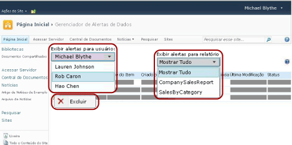

# Gerenciador de Alertas de dados para administradores de alertas

[!INCLUDE [ssrs-appliesto](../includes/ssrs-appliesto.md)] [!INCLUDE [ssrs-appliesto-2016](../includes/ssrs-appliesto-2016.md)] [!INCLUDE [ssrs-appliesto-not-2017](../includes/ssrs-appliesto-not-2017.md)] [!INCLUDE[ssrs-appliesto-sharepoint-2013-2016i](../includes/ssrs-appliesto-sharepoint-2013-2016.md)][!INCLUDE [ssrs-appliesto-not-pbirs](../includes/ssrs-appliesto-not-pbirs.md)]

[!INCLUDE [ssrs-previous-versions](../includes/ssrs-previous-versions.md)]

O SQL Server Reporting Services fornece o Gerenciador de Alertas de Dados para os administradores de alertas do SharePoint gerenciarem alertas de dados. Os administradores de alerta podem exibir informações sobre todos os alertas salvos no site e excluir alertas. A imagem a seguir mostra os recursos disponíveis para os gerenciadores de alerta do SharePoint no Gerenciador de Alertas de Dados.

> [!NOTE]
> A integração do Reporting Services ao SharePoint não está mais disponível após o SQL Server 2016.

 Quando o site está habilitado para alertas de dados, duas páginas do SharePoint, MyDataAlerts.aspx e SiteDataAlerts.aspx, são criadas e adicionadas ao site do SharePoint. SiteDataAlerts.aspx é o Gerenciador de Alertas de Dados para alertar os administradores. Os administradores de alerta podem abrir o Gerenciador de Alertas de Dados na página Configurações de Site do SharePoint. Os administradores de alerta devem ter a permissão Gerenciar Alertas do SharePoint para abrir o Gerenciador de Alertas de Dados.  
  
 Você também pode abrir o Gerenciador de Alertas de Dados diretamente por meio de uma URL. O seguinte mostra a sintaxe da URL:  
  
 `http: //<site name>/_layouts/ReportServer/ SiteDataAlerts.aspx`  
  
> [!NOTE]  
>  Como um administrador de alertas, você pode conceder permissão a operadores de informações para acessar os recursos de alertas de dados [!INCLUDE[ssRSnoversion](../includes/ssrsnoversion-md.md)] . Para obter mais informações sobre as permissões necessárias, consulte [Alertas de dados do Reporting Services](../reporting-services/reporting-services-data-alerts.md).  
  
##   Exibindo informações de alertas de dados  
 Quando o Reporting Services está instalado e configurado no SharePoint, a página Configurações do Site do SharePoint inclui as opções do **Reporting Services** . Os administradores de alerta clicam na opção **Gerenciar Alertas de Dados** dentro do Reporting Services para abrir o Gerenciador de Alertas de Dados. A imagem a seguir mostra de onde na página Configurações do Site você abre o Gerenciador de Alertas de Dados.  
  
   
  
 O Gerenciador de Alertas de dados inclui uma tabela que lista o nome do alerta, o nome do relatório, o nome do proprietário do alerta, o número da mensagem de alerta enviada, a última execução do alerta, a última vez que a definição do alerta foi modificada e o status da mensagem de alerta. Se a mensagem de alerta não puder ser gerada ou enviada, a coluna de status conterá informações sobre o erro e ajudará a solucionar problemas do alerta. Para obter mais informações, consulte [Manage All Data Alerts on a SharePoint Site in Data Alert Manager](../reporting-services/manage-all-data-alerts-on-a-sharepoint-site-in-data-alert-manager.md).  
  
 A tabela a seguir mostra dados de exemplo de uma tabela no Gerenciador de Alertas de Dados. Quando um erro ocorre, a mensagem de erro e o identificador da entrada no log (um GUID) são incluídos no campo **Status** na tabela.  
  
|Nome do Alerta|Nome do Relatório|Criado por|Alertas enviados|Última Execução|Última Modificação|Status|  
|----------------|-----------------|----------------|-----------------|--------------|-------------------|------------|  
|SalesQTR|SalesByTerritoryAndQTR|Lauren Johnson|4|6/12/2011|6/1/2011|O último alerta foi executado com êxito e o alerta foi enviado.|  
|UnitsSold|ProductsSalesByQTR|Michael Blythe|2|7/1/2011|6/28/2011|O último alerta foi executado com êxito, mas os dados estavam inalterados e nenhum alerta foi enviado.|  
|InventoryCount|StockStatusByQTR|Lauren Johnson|7|7/10/2011|7/2/2011|\<error message>O arquivo de log contém informações detalhadas sobre o erro. Consulte a entrada de log com o identificador: \<GUID>.|  
|TopPromotion|PromotionTracking|Cristian Petculescu|0||5/23/2011|Alertas criados.|  
  
 Para obter mais informações, consulte [Gerenciar todos os alertas de dados em um site do SharePoint no Gerenciador de Alertas de Dados](../reporting-services/manage-all-data-alerts-on-a-sharepoint-site-in-data-alert-manager.md).  
  
 É possível exibir todos os alertas criados pelos usuários do site. Você escolhe um usuário e, em seguida, escolhe se deseja exibir todos os alertas do usuário ou apenas alertas para um relatório específico.  
  
  
##   Excluir alertas de dados  
 Você exclui definições de alertas no Gerenciador de Alertas de Dados. Toda definição de alerta de dados tem um proprietário, o usuário do SharePoint que a criou. Os proprietários podem excluir apenas as definições de alertas que criaram. Para obter mais informações, consulte [Gerenciar meus alertas de dados no Gerenciador de Alertas de Dados](../reporting-services/manage-my-data-alerts-in-data-alert-manager.md).  
  
 A. Os administradores de alerta do SharePoint podem listar e, em seguida, excluir definições de alertas criadas por todos os usuários do site. Para obter mais informações, consulte [Gerenciar todos os alertas de dados em um site do SharePoint Site no Gerenciador de Alertas de Dados](../reporting-services/manage-all-data-alerts-on-a-sharepoint-site-in-data-alert-manager.md)  
  
 Depois que você excluir a definição de alerta, nenhum alerta adicional será enviado. No entanto, se você consultar o banco de dados de alertas, talvez descubra que a definição de alerta ainda existe. O serviço de alerta executa a limpeza de acordo com uma agenda e a definição de alerta será excluída permanentemente na próxima limpeza. O intervalo de limpeza padrão é de 20 minutos. Esse e outros intervalos de limpeza são configuráveis. Para obter mais informações, consulte [Reporting Services Data Alerts](../reporting-services/reporting-services-data-alerts.md)[Alertas de dados do Reporting Services].  
  
  
##   Tarefas relacionadas  
 Esta seção lista um procedimento que mostra como gerenciar seus alertas.  
  
-   [Manage All Data Alerts on a SharePoint Site in Data Alert Manager](../reporting-services/manage-all-data-alerts-on-a-sharepoint-site-in-data-alert-manager.md)  

## Consulte Também

[Reporting Services Data Alerts](../reporting-services/reporting-services-data-alerts.md)  

Ainda tem dúvidas? [Experimente perguntar no fórum do Reporting Services](http://go.microsoft.com/fwlink/?LinkId=620231)
