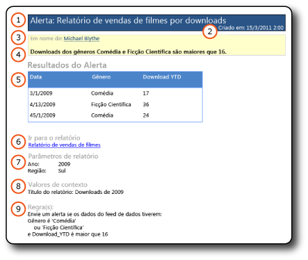

# Mensagens de alertas de dados

[!INCLUDE [ssrs-appliesto](../includes/ssrs-appliesto.md)] [!INCLUDE [ssrs-appliesto-2016](../includes/ssrs-appliesto-2016.md)] [!INCLUDE [ssrs-appliesto-not-2017](../includes/ssrs-appliesto-not-2017.md)] [!INCLUDE[ssrs-appliesto-sharepoint-2013-2016i](../includes/ssrs-appliesto-sharepoint-2013-2016.md)][!INCLUDE [ssrs-appliesto-not-pbirs](../includes/ssrs-appliesto-not-pbirs.md)]

[!INCLUDE [ssrs-previous-versions](../includes/ssrs-previous-versions.md)]

Os alertas de dados do SQL Server Reporting Services entregam dois tipos de mensagens de alerta de dados por email: mensagens com resultados de alertas de dados e mensagens com descrições de erro. As mensagens com resultados mantêm todos os destinatários informados sobre alterações nos dados de relatório que são de interesse comum e importantes para decisões comerciais. Se, por alguma razão, ocorrer um erro e os resultados não estiverem disponíveis, a mensagem de erro será enviada.

O proprietário da definição de alerta de dados também pode exibir informações sobre a instância de alerta de dados no Gerenciador de Alertas de Dados. Para obter mais informações, consulte [Gerenciador de alertas de dados para os usuários do SharePoint](../reporting-services/data-alert-manager-for-sharepoint-users.md).  

> [!NOTE]
> A integração do Reporting Services ao SharePoint não está mais disponível após o SQL Server 2016.
  
##   Mensagens de alertas de dados  
 As imagens a seguir mostram uma mensagem de alerta de dados com resultados e uma mensagem de alerta com uma descrição de erro.  
  
 **Mensagem de resultados**  
  
   
  
 **Mensagem de erro**  
  
   
  
 As mensagens incluem os mesmos tipos de informações.  
  
1.  **Em nome de** contém o nome da pessoa que criou a definição de alerta de dados.  
  
2.  Se você forneceu uma descrição na definição de alerta, ela será exibida abaixo de **Em nome de**.  
  
3.  **Resultados de Alerta** exibem as linhas no feed de dados de relatório que satisfazem as regras especificadas na definição de alerta em um formato de tabela ou exibem uma descrição de erro. Não há limite para o número de linhas exibidas.  
  
4.  **Ir para relatório** é um link para o relatório no qual a definição de alerta se baseia. Se o link não for válido porque o relatório foi movido ou excluído, uma mensagem de erro será exibida.  
  
5.  **Regra(s)** lista as regras e cláusulas na definição de alerta. Essas informações o ajudam a verificar e entender os resultados de alertas e identificar regras na definição de alerta de dados que talvez você queira alterar para limitar ou ampliar os resultados.  
  
6.  **Parâmetros de relatório** listam os parâmetros e valores de parâmetros que foram usados quando o relatório foi executado. Parâmetros e valores de parâmetros o ajudam a entender os resultados de alertas.  
  
7.  **Valores Contextuais** listam os nomes e valores de itens de relatório que estão fora das regiões de dados de relatório. Os itens geralmente são caixas de texto. Por exemplo, uma caixa de texto com um valor constante como o assunto ou a descrição de um relatório.  
  
 A única diferença entre os dois tipos de mensagem é o item 5, **Resultados de Alertas**. Se um erro ocorrer quando uma instância de alerta de dados ou mensagem de alerta de dados for criada, a opção **Resultados de Alertas** exibirá uma mensagem de erro que descreve o problema. A mensagem de erro, enviada a todos os destinatários, informa que os resultados de alertas esperados e que podem ser necessários para a tomada de decisões comerciais não estão disponíveis.  
  
  
##   Tarefas relacionadas  
 Esta seção lista os procedimentos que mostram como criar e editar as definições de alertas de dados que fornecem grande parte das informações exibidas em mensagens de alertas de dados.  
  
-   [Criar um alerta de dados no Designer de Alertas de Dados](../reporting-services/create-a-data-alert-in-data-alert-designer.md)  
  
-   [Editar um alerta de dados no Designer de alertas](../reporting-services/edit-a-data-alert-in-alert-designer.md)  

## Consulte Também

[Designer de Alertas de Dados](../reporting-services/data-alert-designer.md)   
[Reporting Services Data Alerts](../reporting-services/reporting-services-data-alerts.md)  

Ainda tem dúvidas? [Experimente perguntar no fórum do Reporting Services](http://go.microsoft.com/fwlink/?LinkId=620231)
