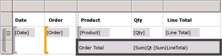
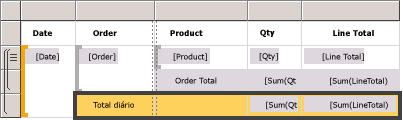
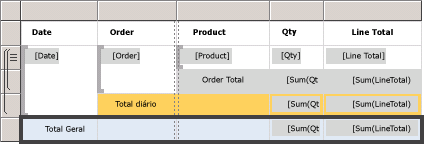
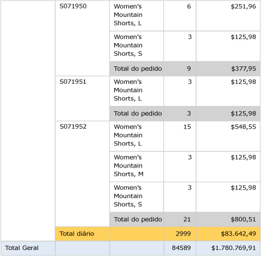

# Lesson 6: Adding Grouping and Totals (Reporting Services)
Nesta lição do tutorial, você adicionará agrupamentos e totais ao relatório do [!INCLUDE[ssRSnoversion](../includes/ssrsnoversion-md.md)] para organizar e resumir os dados.  
  
  
## Para agrupar dados em um relatório  
  
1.  Clique na guia **Design** .  
  
2.  Se o painel **Grupos de linhas** não estiver visível, clique com o botão direito do mouse na superfície de design, em seguida, clique em **Exibir** e em **Agrupamento**.  
  
3.  No painel **Dados do Relatório** , arraste o campo **Date** para o painel **Grupos de Linhas** . Coloque-o acima da linha chamada **(Detalhes)**.
  
    Observe que a alça de linha agora exibe um colchete para mostrar um grupo. A tabela também tem duas colunas Data – uma em cada lado de uma linha pontilhada vertical.  
  
      
  
4.  No painel **Dados do Relatório** , arraste o campo **Order** para o painel **Grupos de Linhas** . Coloque-o abaixo de Data e acima de **(Detalhes)**.

   
  
    Note that the row handle now has two brackets in it , to show two groups. The table now has two **Order** columns, too.  
  
5.  Exclua as colunas **Data** e **Pedido** originais à **direita** da linha dupla. Isso removerá os valores do registro individual para que apenas o valor do grupo seja exibido. Selecione as alças de coluna das duas colunas, clique com o botão direito do mouse e clique em **Excluir Colunas**.  
  
      
  
6.  Para formatar a nova coluna de data, clique com o botão direito do mouse na célula com a expressão de campo `[Date]` e clique em **Propriedades da Caixa de Texto**.  
  
7.  Clique em **Número**e, no campo **Categoria** , clique em **Data**.  
  
8.  Na caixa **Tipo** , selecione **31 de janeiro de 2000**.  
  
9.  [!INCLUDE[clickOK](../includes/clickok-md.md)].  
  
10.  Alterne para a guia **Visualizar** para visualizar o relatório. Sua aparência deve ser similar a esta ilustração:  
     
  
## Para adicionar totais a um relatório  
  
1.  Alterne para o modo Design.  
  
2.  Clique com o botão direito do mouse na célula da região de dados que contém o campo `[LineTotal]`e clique em **Adicionar Total**.  
  
    Isso adicionará uma linha com uma soma do valor monetário de cada pedido.  
  
3.  Clique com o botão direito do mouse na célula que contém o campo `[Qty]`e clique em **Adicionar Total**.  
  
    Isso adicionará uma soma da quantidade de cada pedido à linha de total.  
  
4.  Na célula vazia à esquerda de `Sum[Qty]`, digite o rótulo "**Total de Pedidos"**.  
  
5.  Você pode adicionar uma cor do plano de fundo à linha de total. Selecione as duas células de soma e a célula de rótulo.  
  
6.  No menu **Formatar** , clique em **Cor do Plano de Fundo**, clique em **Cinza Claro**e clique em **OK**.  
  
      
  
## Para adicionar um total diário a um relatório  
  
1.  Clique com o botão direito do mouse na célula **Pedido** , aponte para **Adicionar Total**e clique em **Após**.  
  
    Isso adicione uma nova linha contendo as somas de quantidade e valor em dólar de cada dia e o rótulo “**Total**” na parte inferior da coluna Pedido.  
  
2.  Digite o palavra **Diário** depois da palavra **Total** na mesma célula para que apareça **Total Diário**.  
  
3.  Selecione a célula **Total Diário** , as duas células **Soma** e a célula vazia entre eles.  
  
4.  No menu **Formatar** , clique em **Cor do Plano de Fundo**, clique em **Laranja**e clique em **OK**.  
  
      
  
## Para adicionar um total geral a um relatório  
  
1.  Clique com o botão direito do mouse na célula Data, aponte para **Adicionar Total**e clique em **Após**.  
  
    Isso adicionará uma nova linha contendo as somas de quantidade e valor monetário de todo o relatório e o rótulo **Total** na coluna **Data** .  
  
2.  Digite a palavra **Geral** depois da palavra **Total** na mesma célula para que apareça **Total Geral**.  
  
3.  Selecione a célula **Total Geral** , as duas células **Soma** e as células vazias entre eles.  
  
4.  No menu **Formatar** , clique em **Cor do Plano de Fundo**, clique em **Azul Claro**e clique em **OK**.  
  
      
  
5.  Clique em **Visualizar**.  
  
    A última página deve ser semelhante à imagem a seguir. Na barra de ferramentas, clique em Última Página .   
  
      
  
## Para publicar o relatório no Servidor de Relatório (opcional)  
  
1.  Uma etapa opcional é publicar o relatório concluído no servidor de relatório de modo nativo para poder exibi-lo no portal da Web.  
  
2.  Clique no menu **Projeto** e em **Propriedades do tutorial...**  
  
3.  Em **TargetServerURL** , digite o nome do servidor de relatório, por exemplo   
- `http:/<servername>/reportserver`  
   
- `http://localhost/reportserver` funcionará se você estiver criando o relatório no servidor de relatório.  
  
  
4. Observe que TargetReportFolder é o tutorial, o nome do projeto.  Esse é o nome da pasta na qual o relatório será implantado nas próximas etapas.  
5. Clique em **OK**.  
  
6.  Clique no menu **Criar** e em **Implantar tutorial**.  
  
    Se você vir uma mensagem semelhante à seguinte na janela de saída, ela indicará uma implantação com êxito.  
  
    > ------ Compilação iniciada: Projeto: tutorial, Configuração: Debug ------  
    > Ignorando 'Sales Orders.rdl'. O item está atualizado.  
    > Compilação concluída – 0 erros, 0 avisos  
    > ------ Implantação iniciada: Projeto: tutorial, Configuração: Debug ------  
    > Implantando em http://[nome do servidor]/reportserver  
    > Implantando relatório '/tutorial/Sales Orders'.  
    > Implantação concluída -- 0 erros, 0 avisos  
    > ========== Compilação: 1 com êxito ou atualizados, 0 com falha, 0 ignorados ==========  
    > ========== Implantação: 1 com êxito, 0 com falha, 0 ignorados ==========  
  
    Se você vir uma mensagem de erro semelhante à seguinte, verifique se você tem permissões no servidor de relatório e se iniciou o [!INCLUDE[ssBIDevStudio](../includes/ssbidevstudio-md.md)] com privilégios de administrador.  
  
    > "As permissões concedidas ao usuário 'XXXXXXXX\\[seu nome de usuário]' não são suficientes para a execução desta operação."  
  
7.  Vá para o portal da Web com privilégios de administrador, por exemplo, clique com o botão direito do mouse no ícone do Internet Explorer e clique em **Executar como administrador**.  
  
    Navegue até a URL do portal da Web do [!INCLUDE[ssRSnoversion_md](../includes/ssrsnoversion-md.md)] .   
    **Observação:** a URL do *portal* é "Reports", não a URL do *Servidor* de Relatório "Reportserver".  Por exemplo:   
    - `http://<server name>/reports`.  
     - `http://localhost/reports` funcionará se você estiver criando o relatório no servidor de relatório.  
  
8.  Procure a pasta que contém o relatório. O nome padrão é *tutorial*, o nome do projeto ou o nome digitado no campo TargetReportFolder nas propriedades do projeto.   
Clique no nome do relatório **Pedidos de Venda** para exibir o relatório renderizado no navegador.  
  
      
 
** Você concluiu com êxito o tutorial Criando um relatório de tabela básico.**  
  
## Consulte Também  
[Filtrar, agrupar e classificar dados &#40;Construtor de Relatórios e SSRS&#41;](../reporting-services/report-design/filter-group-and-sort-data-report-builder-and-ssrs.md)  
  
  
  

