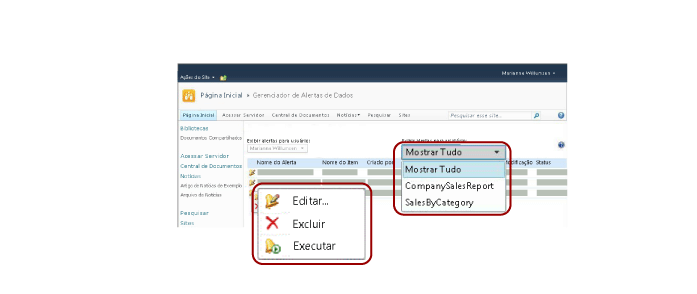
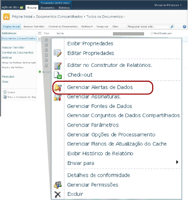

# Gerenciar meus alertas de dados no Gerenciador de Alertas de Dados

[!INCLUDE[ssrs-appliesto](../includes/ssrs-appliesto.md)] [!INCLUDE[ssrs-appliesto-2016](../includes/ssrs-appliesto-2016.md)] [!INCLUDE[ssrs-appliesto-not-pbirsi](../includes/ssrs-appliesto-not-pbirs.md)] [!INCLUDE[ssrs-appliesto-sharepoint-2013-2016i](../includes/ssrs-appliesto-sharepoint-2013-2016.md)]

Os usuários do SharePoint podem exibir uma lista dos alertas de dados que criaram e informações sobre os alertas. Os usuários também podem excluir seus alertas, abrir definições de alerta para edição no Designer de Alertas de Dados e executar seus alertas. A imagem a seguir mostra os recursos disponíveis para os usuários no Gerenciador de Alertas de Dados.

 

> [!NOTE]
> A integração do Reporting Services ao SharePoint não está mais disponível após o SQL Server 2016.

### Para exibir uma lista dos seus alertas  
  
1.  Vá para a biblioteca do SharePoint onde você salvou os relatórios em que criou os alertas de dados.  
  
2.  Clique no ícone para expandir o menu suspenso em um relatório e clique em **Gerenciar Alertas de Dados**. A imagem a seguir mostra o menu suspenso.  
  
       
  
     O Gerenciador de Alertas de Dados é aberto. Por padrão, ele lista os alertas para o relatório que você selecionou na biblioteca.  
  
3.  Clique na seta para baixo ao lado de **Exibir alertas para o relatório** e selecione um relatório para exibir seus alertas ou clique em **Mostrar Tudo** para listar todos os alertas.  
  
    > [!NOTE]  
    >  Se o relatório que você selecionou não tiver nenhum alerta, você não precisará voltar à biblioteca do SharePoint para localizar e selecionar um relatório que tenha alertas. Em vez disso, clique em **Mostrar Tudo** para consultar uma lista com todos os alertas.  
  
     Uma tabela lista o nome do alerta, o nome do relatório, seu nome como criador do alerta, o número com o qual o alerta foi enviado, a última vez que a definição de alerta foi modificada e o status do alerta. Se o alerta não puder ser gerado ou enviado, a coluna de status conterá informações sobre o erro e ajudará a solucionar o problema.  
  
### Para editar uma definição de alerta  
  
-   Clique com o botão direito do mouse no alerta de dados para o qual você deseja editar a definição de alerta e clique em **Editar**.  
  
     A definição de alerta é aberta no Designer de Alertas de Dados. Para obter mais informações, consulte [Editar um Alerta de Dados no Designer de Alertas](../reporting-services/edit-a-data-alert-in-alert-designer.md) e [Designer de Alertas de Dados](../reporting-services/data-alert-designer.md).  
  
    > [!NOTE]  
    >  Apenas o usuário que criou a definição de alerta de dados pode editá-la.  
  
    > [!NOTE]  
    >  Se o relatório tiver sido alterado e os feeds de dados gerados no relatório tiverem sido alterados, a definição de alerta talvez não seja mais válida. Isso ocorre quando uma coluna referenciada pelo alerta nas regras é excluída do relatório, altera o tipo de dados ou é incluída em outro feed de dados, ou quando o relatório é excluído ou movido. Você pode abrir uma definição de alerta que não é válida, mas só pode salvá-la novamente depois que ela estiver válida com base na versão atual do feed de dados de relatório do qual ela depende. Para saber mais sobre como os feeds de dados são gerados com base em relatórios, consulte [Gerando feeds de dados com base em relatórios &#40;Construtor de Relatórios e SSRS&#41;](../reporting-services/report-builder/generating-data-feeds-from-reports-report-builder-and-ssrs.md).  
  
### Para excluir uma definição de alerta  
  
-   Clique com o botão direito do mouse no alerta de dados que você deseja excluir e clique em **Excluir**.  
  
     Quando você excluir o alerta, nenhuma mensagem de alerta adicional será enviada.  
  
### Para executar um alerta  
  
-   Clique com o botão direito do mouse no alerta de dados que você deseja executar e clique em **Executar**.  
  
     A instância do alerta é criada e a mensagem de alerta de dados é enviada imediatamente, independentemente das opções de agenda especificadas no Designer de Alerta de Dados. Por exemplo, um alerta configurado para ser enviado semanalmente e, depois, somente se a alteração de resultados for enviada.  

## Consulte Também

[Gerenciador de Alertas de dados para administradores de alertas](../reporting-services/data-alert-manager-for-alerting-administrators.md)   
[Reporting Services Data Alerts](../reporting-services/reporting-services-data-alerts.md)  

Ainda tem dúvidas? [Experimente perguntar no fórum do Reporting Services](http://go.microsoft.com/fwlink/?LinkId=620231)
