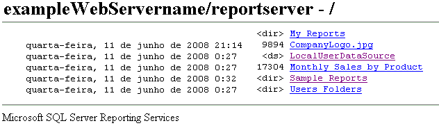

# Localizando e exibindo relatórios com um navegador (Construtor de Relatórios e SSRS)
  Você pode usar qualquer navegador da Web com suporte para exibir um relatório por meio de uma conexão direta com um servidor de relatório. Cada relatório tem um endereço URL em um servidor de relatórios. Você pode digitar o endereço da Web de um relatório para abri-lo em uma janela do navegador independentemente de um aplicativo da Web. O relatório é aberto no formato HTML e inclui a barra de ferramentas do relatório para que você possa navegar em páginas ou procurar valores de dados no relatório. Você pode definir parâmetros na URL para ocultar a barra de ferramentas ou selecionar o formato de saída do relatório.  
  
 A abertura de um relatório por seu endereço da Web é adequada para exibir um relatório, mas não para gerenciá-lo. Você não pode acessar as páginas de propriedade do item nem as páginas de definição de assinatura. Você deve usar o Gerenciador de Relatórios ou um site do SharePoint para essas tarefas.  
  
 Se você não souber o endereço da Web de um relatório, poderá abrir o endereço da Web do servidor de relatórios e procurar a hierarquia da pasta do servidor de relatórios para selecionar o relatório que deseja exibir. O diagrama a seguir ilustra uma hierarquia de pasta como ela é exibida em uma janela do navegador.  
  
   
Pastas em um navegador  
  
> [!NOTE]  
>  Se você estiver acessando um relatório a partir de um dispositivo portátil, deverá usar um navegador para abri-lo. O Gerenciador de Relatórios não é redimensionado para dispositivos portáteis.  
  
 Para obter mais informações sobre os tipos de navegadores que você pode usar, consulte “Tipos de navegadores com suporte pelo Reporting Services” na [documentação do Reporting Services](https://go.microsoft.com/fwlink/?linkid=121312) nos Manuais Online do SQL Server.  
  
> [!NOTE]  
>  [!INCLUDE[ssRBRDDup](../../includes/ssrbrddup-md.md)]  
  
## Navegando em pastas do servidor de relatórios em um navegador da Web  
 Você pode usar um navegador da Web para navegar em pastas do servidor de relatórios e executar relatórios. São exibidos relatórios e itens como links na hierarquia de pasta. Você pode clicar em links para abrir um relatório, recurso ou pasta ou ainda exibir o conteúdo de uma fonte de dados compartilhada. Navegar na hierarquia de pasta é útil se você não conhecer a URL de um relatório. Você pode especificar o endereço da Web do servidor de relatórios para abrir uma conexão do navegador no nó raiz da hierarquia da pasta e, em seguida, clicar nos links da pasta para navegar pela hierarquia.  
  
 Quando você acessa um diretório virtual de um servidor de relatório, você vê somente as pastas, os relatórios e os itens descarregados aos quais você tem acesso. A interface do usuário mostra somente a hierarquia da pasta e as informações básicas como data de criação ou modificação, tamanho do arquivo e tipo de item para itens individuais:  
  
-   Um link com nenhum outro indicador é um relatório ou um modelo.  
  
-   A marcação \<ds> indica uma fonte de dados compartilhada.  
  
-   A marcação \<dir> indica um item de pasta.  
  
-   Uma extensão de nome de arquivo indica um recurso. A extensão do nome do arquivo identifica o tipo MIME do recurso. Por exemplo, .jpg indica uma imagem em formato JPEG.  
  
## Digitando o endereço URL de um relatório  
 [!INCLUDE[ssRSnoversion](../../includes/ssrsnoversion-md.md)] dá suporte ao acesso de URL a itens específicos em um servidor de relatório. A URL deve incluir um caminho totalmente qualificado para o relatório e comandos para renderizar o relatório. Se o relatório incluir parâmetros, você também terá que especificar qualquer valor exigido para abrir o relatório. Se estiver digitando uma URL para um relatório que inclui espaços no caminho, valores de parâmetro ou uma extensão de renderização, deverá incorporar os caracteres codificados da URL na URL para obter os resultados esperados. O exemplo a seguir ilustra uma URL de relatório que inclui a codificação para espaços no nome do caminho, parâmetros e uma extensão de renderização:  
  
 `http://<Webservername>/reportserver?/<reportfolder>/employee+sales+summary&ReportYear=2004&ReportMonth=06&EmpID=24&rs:Command=Render&rs:Format=HTML4.0`  
  
 O limite máximo para uma URL no Internet Explorer é de 2.083 caracteres. Para obter mais informações, consulte [Comprimento máximo da URL no Internet Explorer](http://support.microsoft.com/kb/208427).  
  
 Para obter mais informações sobre como acessar um relatório usando uma URL, incluindo informações sobre como a URL é construída, consulte “Acesso à URL” na [documentação do Reporting Services](https://go.microsoft.com/fwlink/?linkid=121312) nos Manuais Online do SQL Server.  
  
  
