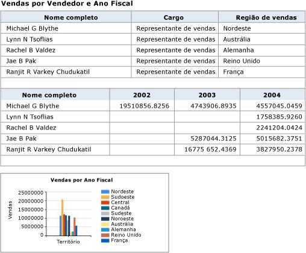
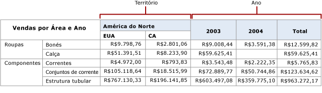
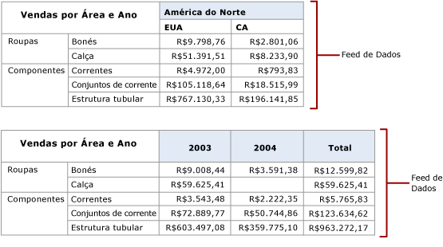
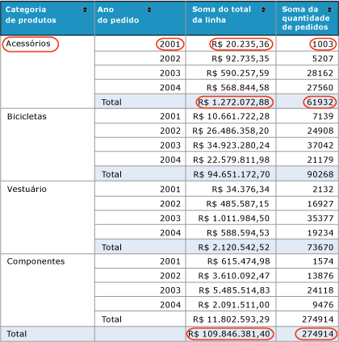

# Gerando feeds de dados de relatórios (Construtor de Relatórios e SSRS)

  A extensão de renderização do [!INCLUDE[ssRSnoversion](../../includes/ssrsnoversion-md.md)] Atom gera um documento de serviço Atom que lista os feeds de dados disponíveis em um relatório paginado e os feeds de dados das regiões de dados em um relatório. Use essa extensão para gerar feeds de dados compatíveis com Atom legíveis e intercambiáveis com aplicativos que podem consumir feeds de dados gerados de relatórios. Por exemplo, você pode usar a extensão de renderização Atom para feeds de dados gerados a serem usados no Power Pivot ou no Power BI.  
  
 O documento de serviço Atom lista pelo menos um feed de dados para cada região de dados em um relatório. Dependendo do tipo de região de dados e dos dados que a região de dados exibe, o [!INCLUDE[ssRSnoversion](../../includes/ssrsnoversion-md.md)] pode gerar vários feeds de dados de uma região de dados. Por exemplo, uma matriz ou gráfico podem fornecer vários feeds de dados. Quando a extensão de renderização Atom cria o documento de serviço Atom, um identificador exclusivo é criado para cada feed de dados e você usa o identificador na URL para acessar o conteúdo do feed de dados.  
  
 O modo como a extensão de renderização do Atom gera dados para um feed de dados é semelhante ao modo como a extensão de renderização CSV renderiza dados para um arquivo CSV. Como um arquivo CSV, um feed de dados é uma representação mesclada dos dados de relatório. Por exemplo, uma tabela com um grupo de linhas que soma as vendas dentro de um grupo repete a soma em cada linha de dados e não há nenhuma linha separada que contenha apenas a soma.  
  
 Você pode gerar documentos de serviço Atom e feeds de dados usando o portal da Web do [!INCLUDE[ssRSnoversion](../../includes/ssrsnoversion-md.md)] , o Servidor de Relatório ou um site do SharePoint integrado ao [!INCLUDE[ssRSnoversion](../../includes/ssrsnoversion-md.md)].  
  
 O Atom se aplica a um par de padrões relacionados. O documento de serviço segue a especificação de protocolo de publicação Atom RFC 5023 e os feeds de dados seguem a especificação de protocolo de formato de distribuição Atom RFC 4287.  
  
 As seções a seguir fornecem mais informações sobre como usar a extensão de renderização Atom:  
  
 [!INCLUDE[ssRBRDDup](../../includes/ssrbrddup-md.md)]  
  
##   Relatórios como feeds de dados  
 Você pode exportar um relatório de produção como um feed de dados ou pode criar um relatório cujo principal objetivo seja fornecer dados, na forma de feeds de dados, para aplicativos. O uso de relatórios como feeds de dados oferece um método adicional para o fornecimento de dados a aplicativos quando os dados não podem ser acessados facilmente por meio de provedores de dados cliente, ou quando você prefere ocultar a complexidade da fonte de dados e facilitar o uso dos dados. Outro benefício do uso de dados de relatório como um feed de dados é que você pode usar recursos do [!INCLUDE[ssRSnoversion](../../includes/ssrsnoversion-md.md)] , como a segurança, a programação e os instantâneos de relatório para gerenciar os relatórios que fornecem feeds de dados.  
  
 Para tirar o máximo proveito da extensão de renderização Atom, você deve entender como o relatório é renderizado em feeds de dados. Se você estiver usando relatórios existentes, a capacidade de prever quais feeds de dados os relatórios gerarão será útil; se você estiver escrevendo o relatório especificamente para uso como feeds de dados, a capacidade de incluir os dados e ajustar o layout do relatório para maximizar a utilidade dos feeds de dados será valiosa.  
  
 Para obter mais informações, consulte [Gerar feeds de dados de um relatório &#40;Construtor de Relatórios e SSRS&#41;](../../reporting-services/report-builder/generate-data-feeds-from-a-report-report-builder-and-ssrs.md).  
  
  
##   Documento de serviço Atom (arquivo .atomsvc)  
 Um documento do serviço Atom especifica uma conexão com um ou mais feeds de dados. No mínimo, a conexão é uma URL simples para o serviço de dados que gera o feed.  
  
 Quando você renderiza os dados do relatório usando a extensão de renderização Atom, o documento do serviço Atom lista os feeds de dados disponíveis para um relatório. O documento lista pelo menos um feed de dados para cada região no relatório. As tabelas e os medidores geram somente um feed de dados cada, mas matrizes, listas e gráficos podem ter gerado vários dependendo dos dados que exibem.  
  
 O diagrama a seguir mostra um relatório que usa duas tabelas e um gráfico.  
  
   
  
 O documento do serviço Atom gerado com base neste relatório inclui três feeds de dados, um para cada tabela e um para o gráfico.  
  
 As regiões de dados da matriz podem ter mais de um feed de dados, dependendo da estrutura da matriz. O diagrama a seguir mostra um relatório que usa uma matriz que gera dois feeds de dados.  
  
   
  
 O documento do serviço Atom gerado com base neste relatório inclui dois feeds de dados, um para cada coluna par dinâmica: Território e Ano. O diagrama a seguir mostra o conteúdo de cada feed de dados.  
  
   
  
  
##   Feeds de dados  
 O feed de dados é um arquivo XML com um formato de tabela consistente que não é alterado com o passar do tempo e dados variáveis que podem ser diferentes cada vez que o relatório é executado. Os feeds de dados gerados pelo [!INCLUDE[ssRSnoversion](../../includes/ssrsnoversion-md.md)] estão no mesmo formato que os gerados pelo ADO.NET Data Services.  
  
 Um feed de dados contém duas seções: cabeçalho e dados. A especificação Atom define os elementos em cada seção. O cabeçalho inclui informações, como o esquema de codificação de caracteres a ser usado com os feeds de dados.  
  
### Seção de cabeçalho  
 O código XML a seguir mostra a seção de cabeçalho de um feed de dados.  
  
 `<?xml version="1.0" encoding="utf-8" standalone="yes"?><feed xmlns:d="http://schemas.microsoft.com/ado/2007/08/dataservices" xmlns:m="http://schemas.microsoft.com/ado/2007/08/dataservices/metadata" xmlns="http://www.w3.org/2005/Atom">`  
  
 `<title type="text"></title>`  
  
 `<id>uuid:1795992c-a6f3-40ec-9243-fbfd0b1a5be3;id=166321</id>`  
  
 `<updated>2009-05-08T23:09:58Z</updated>`  
  
### Seção de dados  
 A seção de dados dos feeds de dados contém um elemento \<**entry**> para cada linha no conjunto de linhas bidimensional gerado pela extensão de renderização Atom.  
  
 O diagrama a seguir mostra um relatório que usa grupos e totais.  
  
   
  
 O XML a seguir mostra um elemento \<**entry**> desse relatório em um feed de dados. Observe que o elemento \<**entry**> inclui os totais de vendas e pedidos para o grupo e os totais de vendas e pedidos para todos os grupos. O elemento \<**entry**> inclui todos os valores no relatório.  
  
 `<entry><id>uuid:1795992c-a6f3-40ec-9243-fbfd0b1a5be3;id=166322</id><title type="text"></title><updated>2009-05-08T23:09:58Z</updated><author /><content type="application/xml"><m:properties>`  
  
 `<d:ProductCategory_Value>Accessories</d:ProductCategory_Value>`  
  
 `<d:OrderYear_Value m:type="Edm.Int32">2001</d:OrderYear_Value>`  
  
 `<d:SumLineTotal_Value m:type="Edm.Decimal">20235.364608</d:SumLineTotal_Value>`  
  
 `<d:SumOrderQty_Value m:type="Edm.Int32">1003</d:SumOrderQty_Value>`  
  
 `<d:SumLineTotal_Total_2_1 m:type="Edm.Decimal">1272072.883926</d:SumLineTotal_Total_2_1>`  
  
 `<d:SumOrderQty_Total_2_1 m:type="Edm.Double">61932</d:SumOrderQty_Total_2_1>`  
  
 `<d:SumLineTotal_Total_2_2 m:type="Edm.Decimal">109846381.399888</d:SumLineTotal_Total_2_2>`  
  
 `<d:SumOrderQty_Total_2_2 m:type="Edm.Double">274914</d:SumOrderQty_Total_2_2></m:properties></content>`  
  
 `</entry>`  
  
### Trabalhando com feeds de dados  
 Todos os feeds de dados gerados pelo relatório incluem os itens de relatório que estão no escopo do pai da região de dados que gera os feeds de dados. para obter informações sobre a ferramenta de configuração e recursos adicionais. Imagine um relatório que tenha várias tabelas e um gráfico. As caixas de texto no corpo do relatório fornecem texto descritivo de cada região de dados. Toda entrada em cada feed de dados que o relatório gera inclui o valor da caixa de texto. Por exemplo, se o texto for "O gráfico exibe as médias de vendas mensais por região de vendas", todos os três feeds de dados iincluirão esse texto em cada linha.  
  
 Se o layout do relatório incluir relações de dados hierárquicas, como regiões de dados aninhadas, essas relações serão incluídas no conjunto de linhas mescladas de dados de relatório.  
  
 As linhas de dados para regiões de dados aninhadas em geral são largas, principalmente se as tabelas aninhadas e as matrizes tiverem grupos e totais. Talvez você ache útil exportar o relatório para um feed de dados e exibir o feed de dados para verificar se os dados gerados correspondem ao esperado.  
  
 Quando a extensão de renderização Atom cria o documento de serviço Atom, um identificador exclusivo é criado para cada feed de dados e você usa o identificador na URL para exibir o conteúdo do feed de dados. O documento de serviço Atom de exemplo, mostrado acima, inclui a URL `http://ServerName/ReportServer?%2fProduct+Sales+Summary&rs%3aCommand=Render&rs%3aFormat=ATOM&rc%3aDataFeed=xAx0x1`. A URL identifica o relatório (Resumo de Vendas do Produto), o formato de renderização Atom (ATOM) e o nome do feed de dados (xAx0x1).  
  
 Os nomes do item de relatório seguem o padrão de nomes de elemento RDL dos itens de relatório e, com frequência, não são intuitivos, nem fáceis de lembrar. Por exemplo, o nome padrão da primeira matriz posicionada em um relatório é Tablix 1. Os feeds de dados usam esses nomes.  
  
 Para facilitar o trabalho com o feed de dados, use a propriedade DataElementName da região de dados para fornecer nomes amigáveis. Se você fornecer um valor para DataElementName, o subelemento do feed de dados \<**d**> usará isso, em vez do nome padrão da região de dados. Por exemplo, se o nome padrão de uma região de dados for Tablix1 e DataElementName definir SalesByTerritoryYear, o \<**d**> no feed de dados usará SalesByTerritoryYear. Se as regiões de dados tiverem dois feeds de dados como o relatório de matriz descrito acima, os nomes usados nos feeds de dados serão alesByTerritoryYear _Territory e SalesByTerritoryYear _Year.  
  
 Se você comparar os dados mostrados no relatório e os dados no feed de dados, poderá observar algumas diferenças. Os relatórios frequentemente mostram dados numéricos e dados de hora/data, enquanto o feed de dados contém dados não formatados.  
  
 Um feed de dados é salvo com a extensão de nome de arquivo .atom. Você pode usar um editor de texto ou XML, como o Bloco de Notas ou o Editor de XML para exibir a estrutura e o conteúdo do arquivo.  
  
  
##   Mesclando dados do relatório  
 O renderizador Atom fornece dados de relatório como conjuntos de linhas mescladas em um formato XML. As regras para mesclar tabelas de dados são iguais às do renderizador CSV com algumas exceções:  
  
-   Os itens no escopo são mesclados no nível de detalhe. Diferentemente do renderizador CSV, as caixas de texto no nível da parte superior aparecem em cada entrada gravada no feed de dados.  
  
-   Os valores de parâmetros de relatório são renderizados em cada linha da saída.  
  
 Os dados hierárquicos e agrupados devem ser mesclados para ser representados no formato compatível com Atom. A extensão de renderização mescla o relatório em uma estrutura de árvores que representa os grupos aninhados dentro da região de dados. Para mesclar o relatório:  
  
-   Uma hierarquia de linha é mesclada antes de uma hierarquia de coluna.  
  
-   Os membros da hierarquia de linha são renderizados para o feed de dados, antes dos membros da hierarquia de coluna.  
  
-   As colunas são ordenadas da seguinte forma: caixas de texto ordenadas da esquerda para a direita, de cima para baixo, seguida pelas regiões de dados ordenadas da esquerda para a direita, de cima para baixo.  
  
-   Dentro da região de dados, as colunas são ordenadas da seguinte maneira: membros do canto, membros da hierarquia de linha, membros da hierarquia de coluna e, em seguida, as células.  
  
-   As regiões de dados semelhantes são grupos de regiões de dados ou grupos dinâmicos que compartilham uma região de dados comum ou o ancestral dinâmico. Os dados pares são identificados pela ramificação da árvore mesclada.  
  
 Para obter mais informações, consulte [Tabelas, matrizes e listas &#40;Construtor de Relatórios e SSRS&#41;](../../reporting-services/report-design/tables-matrices-and-lists-report-builder-and-ssrs.md).  
  
  
##   Regras de renderização Atom  
 A extensão de renderização Atom ignora as seguintes informações ao renderizar um feed de dados:  
  
-   Formatação e layout  
  
-   Cabeçalho da página  
  
-   Rodapé  
  
-   Itens de relatório personalizados  
  
-   Retângulos  
  
-   Linhas  
  
-   Imagens  
  
-   Subtotais automáticos  
  
 Os itens restantes do relatório são classificados de cima para baixo e da esquerda para a direita. Cada item é renderizado em uma coluna. Se o relatório aninhou itens de dados, como listas ou tabelas, os itens pai serão repetidos em cada linha.  
  
 A tabela a seguir indica a aparência de itens de relatório quando renderizados:  
  
|Item|Comportamento da renderização|  
|----------|------------------------|  
|Table|Renderiza expandindo a tabela e criando uma linha e uma coluna para cada linha e coluna no nível mais baixo de detalhe. As linhas e colunas de subtotal não têm cabeçalhos de coluna ou de linha. Não há suporte para relatórios detalhados.|  
|Matriz|Renderiza expandindo a matriz e criando uma linha e uma coluna para cada linha e coluna no nível mais baixo de detalhe. As linhas e colunas de subtotal não têm cabeçalhos de coluna ou de linha.|  
|Lista|Renderiza um registro para cada linha de detalhes ou instância na lista.|  
|Sub-relatório|O item pai é repetido para cada instância de conteúdos.|  
|Gráfico|Renderiza um registro com todos os rótulos de gráfico para obter cada valor de gráfico. Os rótulos de séries e categorias em hierarquias são mesclados e incluídos na linha para obter um valor de gráfico.|  
|Barra de dados|Renderiza como um gráfico. Normalmente, uma barra de dados não inclui hierarquias ou rótulos.|  
|Minigráficos|Renderiza como um gráfico. Normalmente, um minigráfico não inclui hierarquias ou rótulos.|  
|Medidor|Renderiza como um único registro com os valores mínimo e máximo da escala linear, valores de início e fim do intervalo e valor do ponteiro.|  
|Indicador|Renderiza como um único registro com o nome do estado ativo, estados disponíveis e o valor de dados.|  
|Mapeamento|Gera um feed de dados para cada região de dados do mapa. Se várias camadas do mapa usarem a mesma região de dados, o feed de dados incluirá todas elas. O feed de dados inclui um registro com os rótulos e os valores para cada membro da camada do mapa.|  
  
  
##   Configurações de informações de dispositivo  
 Você pode alterar algumas configurações padrão desse renderizador, incluindo o esquema de codificação a ser usado. Para obter mais informações, consulte [ATOM Device Information Settings](../../reporting-services/atom-device-information-settings.md).  

## Próximas etapas

[Exportando para um arquivo CSV](../../reporting-services/report-builder/exporting-to-a-csv-file-report-builder-and-ssrs.md)   
[Exportar relatórios](../../reporting-services/report-builder/export-reports-report-builder-and-ssrs.md)  

Ainda tem dúvidas? [Experimente perguntar no fórum do Reporting Services](http://go.microsoft.com/fwlink/?LinkId=620231)
