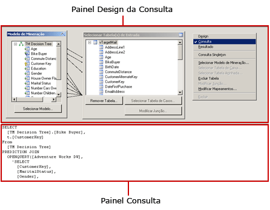
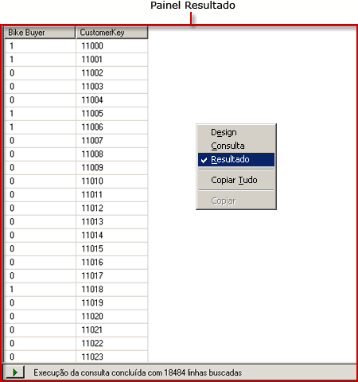

# Interface de usuário do Designer de Consulta DMX do Analysis Services
  [!INCLUDE[ssRSnoversion](../../includes/ssrsnoversion-md.md)] oferece designers de consultas gráficas que permitem criar consultas DMX (extensões DMX) e MDX (Multidimensional Expression) para uma fonte de dados do [!INCLUDE[ssASnoversion](../../includes/ssasnoversion-md.md)] . Este tópico descreve o designer de consulta DMX. Para obter mais informações, consulte [Interface do usuário do Designer de Consulta MDX do Analysis Services](../../reporting-services/report-data/analysis-services-mdx-query-designer-user-interface.md).  
  
 O designer de consultas gráficas DMX tem três modos: Design, Consulta e Resultado. Para alternar entre os modos, clique com o botão direito do mouse no painel Design da Consulta e selecione o modo desejado. Cada modo contém um painel Metadados, do qual é possível arrastar membros dos cubos selecionados para criar uma consulta DMX que recupere dados de um conjunto de dados quando o relatório for processado.  
  
## Barra de ferramentas do designer de consultas DMX gráficas  
 A barra de ferramentas do designer de consulta fornece botões para ajudá-lo a criar consultas DMX por meio da interface gráfica. A tabela a seguir descreve os botões e as respectivas funções.  
  
|Botão|Descrição|  
|------------|-----------------|  
|**Editar como Texto**|Desabilitado para este tipo de fonte de dados.|  
|**Importaçãoação**|Importa uma consulta existente de um arquivo de definição de relatório (.rdl) no sistema de arquivos. Para obter mais informações, consulte [Conjuntos de dados inseridos e compartilhados de relatório &#40;Construtor de Relatórios e SSRS&#41;](../../reporting-services/report-data/report-embedded-datasets-and-shared-datasets-report-builder-and-ssrs.md).|  
||Alterne para o modo do designer de consulta MDX.|  
||Alterne para o modo do designer de consulta DMX.|  
||Atualiza metadados na fonte de dados.|  
||Exclui da consulta a coluna selecionada no painel Dados.|  
||Exiba a caixa de diálogo **Parâmetros de Consulta** . Quando você atribui um valor padrão a uma variável, um parâmetro de relatório correspondente é criado no momento em que você alterna para o modo de Layout do Designer de Relatórios.|  
||Prepara a consulta.|  
||Alterna entre o modo Design e o modo Consulta. Para mudar para a exibição de resultado, clique com o botão direito do mouse no painel Design e escolha **Resultado**.|  
  
## Designer de consultas DMX gráficas no modo de Design  
 Quando você edita um conjunto de dados que usa uma fonte de dados do [!INCLUDE[ssASnoversion](../../includes/ssasnoversion-md.md)] sem cubos válidos, mas com modelos de mineração válidos, o designer de consultas gráficas é aberto no modo de Design. A figura a seguir mostra os painéis do modo Design.  
  
   
  
 A tabela a seguir descreve a função de cada painel.  
  
|Painel|Função|  
|----------|--------------|  
|Painel Designer da Consulta|Use as caixas de diálogo **Modelo de Mineração** e **Selecionar Tabela de Entrada** para criar a consulta DMX.|  
|Painel Grade|Para cada linha da grade, use a lista suspensa **Origem** para selecionar uma função ou expressão e escolha campos, grupos e critérios ou argumentos a serem usados na consulta DMX. Para ver o texto da consulta DMX gerado pelas seleções que você fez, clique no botão **Modo de Design** na barra de ferramentas.|  
  
 Para executar a consulta DMX e mostrar os resultados no painel Resultado, clique com o botão direito do mouse no painel Design da Consulta e selecione **Resultado**.  
  
## Designer de consultas DMX gráficas no modo de Consulta  
 Para mudar o designer de consultas gráficas para o modo de Consulta, clique no botão **Modo de Design** da barra de ferramentas ou clique com o botão direito do mouse na superfície de design de consulta e, no menu de atalho, escolha **Consulta** . Use este modo para inserir o texto DMX diretamente no painel Consulta.  
  
 A figura a seguir mostra os painéis do modo Consulta.  
  
   
  
 A tabela a seguir descreve a função de cada painel.  
  
|Painel|Função|  
|----------|--------------|  
|Painel Designer da Consulta|Use as caixas de diálogo **Modelo de Mineração** e **Selecionar Tabela de Entrada** para criar a consulta DMX.|  
|Painel Consulta|Exiba ou edite o texto da consulta DMX diretamente no painel. As alterações feitas no texto da consulta DMX não serão mantidas se você voltar para o modo de **Design** .|  
  
 Para executar a consulta DMX e mostrar os resultados no painel Resultado, clique com o botão direito do mouse no painel Design da Consulta e selecione **Resultado**.  
  
## Designer de consultas DMX gráficas no modo de Resultado  
 Para exibir o modo Resultado, clique com o botão direito do mouse na superfície de design de consulta e escolha **Resultado** no menu de atalho. Quando você alternar para o modo de Resultado, a consulta DMX será executada automaticamente.  
  
 A figura a seguir mostra o designer de consulta no modo Resultado.  
  
   
  
 Para voltar aos modos de Design ou de Consulta, clique com o botão direito do mouse no painel Resultado e selecione **Design** ou **Consulta**.  
  
## Consulte Também  
 [Definir parâmetros no Designer de Consulta MDX do Analysis Services &#40;Construtor de Relatórios e SSRS&#41;](../../reporting-services/report-data/define-parameters-in-the-mdx-query-designer-for-analysis-services.md)   
 [Criar um conjunto de dados compartilhado ou um conjunto de dados inserido &#40;Construtor de Relatórios e SSRS&#41;](../../reporting-services/report-data/create-a-shared-dataset-or-embedded-dataset-report-builder-and-ssrs.md)   
 [Tipo de conexão Analysis Services para DMX &#40;SSRS&#41;](../../reporting-services/report-data/analysis-services-connection-type-for-dmx-ssrs.md)   
 [Recuperar dados de um modelo de mineração de dados &#40;DMX&#41; &#40;SSRS&#41;](../../reporting-services/report-data/retrieve-data-from-a-data-mining-model-dmx-ssrs.md)   
 [Arquivo de configuração RSReportDesigner](../../reporting-services/report-server/rsreportdesigner-configuration-file.md)   
 [Tipo de conexão Analysis Services para MDX &#40;SSRS&#41;](../../reporting-services/report-data/analysis-services-connection-type-for-mdx-ssrs.md)   
 [Tipo de conexão Analysis Services para DMX &#40;SSRS&#41;](../../reporting-services/report-data/analysis-services-connection-type-for-dmx-ssrs.md)  
  
  
