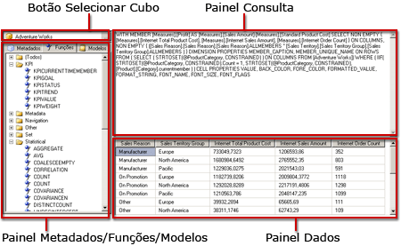

# Interface do usuário do Designer de Consulta MDX do Analysis Services
  [!INCLUDE[ssRSnoversion](../../includes/ssrsnoversion-md.md)] fornece designers de consultas gráficas para criar consultas MDX (Multidimensional Expression) e consultas DMX (extensões DMX) para uma fonte de dados do [!INCLUDE[ssASnoversion](../../includes/ssasnoversion-md.md)] . Este tópico descreve o designer de consulta MDX. Para obter mais informações sobre o designer de consultas DMX, consulte [Tipo de conexão Analysis Services para DMX &#40;SSRS&#41;](../../reporting-services/report-data/analysis-services-connection-type-for-dmx-ssrs.md).  
  
 O designer de consultas gráficas MDX tem dois modos: Design e Consulta. Cada modo contém um painel Metadados, do qual é possível arrastar membros dos cubos selecionados para criar uma consulta MDX que recupere dados quando o relatório for processado.  
  
> [!IMPORTANT]  
>  Os usuários acessam fontes de dados quando criam e executam consultas. Você deve conceder permissões mínimas nas fontes de dados, como permissões somente leitura.  
  
> [!NOTE]  
>  Não há suporte para a importação de uma consulta .mdx a partir de um arquivo.  
  
## Designer de consultas gráficas MDX no modo Design  
 Quando você edita uma consulta MDX para um conjunto de dados de relatórios, o designer de consultas gráficas MDX é aberto no modo Design.  
  
 A figura a seguir mostra os painéis do modo Design.  
  
   
  
 A tabela a seguir lista os painéis neste modo:  
  
|Painel|Função|  
|----------|--------------|  
|Botão Selecionar Cubo (**...**)|Exibe o cubo selecionado no momento.|  
|Painel Metadados|Exibe uma lista hierárquica de medidas, KPIs (Indicadores Chave de Desempenho) e dimensões definidas no cubo selecionado.|  
|Painel Membros Calculados|Exibe os membros calculados definidos no momento disponíveis para serem usados na consulta.|  
|Painel Filtro|Use para escolher dimensões e hierarquias relacionadas para filtrar dados na origem e limitar os dados retornados ao relatório.|  
|Painel Dados|Exibe os cabeçalhos de coluna do conjunto de resultados à medida que você arrasta os itens do painel Metadados e do painel Membros Calculados. Atualiza automaticamente o conjunto de resultados se o botão **Executar Automaticamente** for selecionado. para obter informações sobre a ferramenta de configuração e recursos adicionais.|  
  
 Você pode arrastar dimensões, medidas e KPIs do painel Metadados e membros calculados do painel Membro Calculado para o painel Dados. No painel Filtro, é possível selecionar dimensões e hierarquias relacionadas e definir expressões de filtro para limitar os dados disponíveis para consulta. Se o botão de alternância **Executar Automaticamente** () na barra de ferramentas estiver selecionado, o designer de consultas executará a consulta sempre que você soltar um objeto de metadados no painel Dados. Execute a consulta manualmente usando o botão **Executar** () na barra de ferramentas.  
  
 Quando você cria uma consulta MDX nesse modo, as seguintes propriedades adicionais são incluídas automaticamente na consulta:  
  
 **Propriedades do Membro** MEMBER_CAPTION, MEMBER_UNIQUE_NAME  
  
 **Propriedades da Célula** VALUE, BACK_COLOR, FORE_COLOR, FORMATTED_VALUE, FORMAT_STRING, FONT_NAME, FONT_SIZE, FONT_FLAGS  
  
 Para especificar suas próprias propriedades adicionais, você deve editar manualmente a consulta MDX no modo Consulta.  
  
### Barra de ferramentas do Designer de Consultas Gráficas MDX no modo Design  
 A barra de ferramentas do designer de consulta fornece botões para ajudá-lo a criar consultas MDX por meio da interface gráfica. A tabela a seguir lista os botões e as suas funções.  
  
|Botão|Description|  
|------------|-----------------|  
|**Editar como Texto**|Não habilitado para esse tipo de fonte de dados.|  
|**Importar**|Importa uma consulta existente de um arquivo de definição de relatório (.rdl) no sistema de arquivos. Para obter mais informações, consulte [Conjuntos de dados inseridos e compartilhados de relatório &#40;Construtor de Relatórios e SSRS&#41;](../../reporting-services/report-data/report-embedded-datasets-and-shared-datasets-report-builder-and-ssrs.md).|  
||Alternar para Tipo de Comando MDX.|  
||Alternar para Tipo de Comando DMX.|  
||Atualiza metadados na fonte de dados.|  
||Exibe a caixa de diálogo **Construtor de Membro Calculado** .|  
||Alterna entre mostrar ou ocultar células vazias no painel Dados. (Equivale a usar a cláusula NON EMPTY em MDX).|  
||Executa automaticamente a consulta e mostra o resultado sempre que é feita uma alteração. Os resultados são mostrados no painel Dados.|  
||Mostra agregações no painel Dados.|  
||Exclui da consulta a coluna selecionada no painel Dados.|  
||Exiba a caixa de diálogo **Parâmetros de Consulta** . Quando você especifica os valores para um parâmetro de consulta, um parâmetro de relatório com o mesmo nome é automaticamente criado. O valor do parâmetro da consulta é definido como uma expressão que faz referência ao parâmetro do relatório.|  
||Prepara a consulta.|  
||Executa a consulta e exibe os resultados no painel Dados.|  
||Cancela a consulta.|  
||Alterna entre o modo Design e o modo Consulta.|  
  
## Designer de Consultas Gráficas MDX no modo Consulta  
 Para alterar o designer de consultas gráficas para o modo **Consulta** , clique no botão de alternância **Modo Design** na barra de ferramentas.  
  
 A figura a seguir mostra os painéis do modo Consulta.  
  
   
  
 A tabela a seguir lista os painéis neste modo:  
  
|Painel|Função|  
|----------|--------------|  
|Botão Selecionar Cubo (**...**)|Exibe o cubo selecionado no momento.|  
|Painel Metadados/Funções/Modelos|Exibe uma lista hierárquica de medidas, KPIs e dimensões definidas no cubo selecionado.|  
|Painel Consulta|Exibe o texto da consulta.|  
|Painel Resultado|Exibe os resultados da execução da consulta.|  
  
 O painel Metadados exibe as guias para **Metadados**, **Funções**e **Modelos**. Na guia **Metadados** , você pode arrastar as dimensões, hierarquias, KPIs e medidas no painel Consulta MDX. Na guia **Funções** , você pode arrastar as funções no painel Consulta MDX. Na guia **Modelos** , você pode adicionar modelos MDX ao painel Consulta MDX. Quando você executar a consulta, o painel Resultado exibirá os resultados da consulta MDX.  
  
 Você pode ampliar a consulta MDX padrão gerada no modo Design para incluir propriedades do membro adicionais e propriedades da célula. Ao executar a consulta, esses valores não são exibidos no conjunto de resultados. No entanto, eles são passados de volta para [!INCLUDE[ssRSnoversion](../../includes/ssrsnoversion-md.md)] e você pode usar esses valores em um relatório. Para obter mais informações, consulte [Propriedades de campos estendidos para um banco de dados do Analysis Services &#40;SSRS&#41;](../../reporting-services/report-data/extended-field-properties-for-an-analysis-services-database-ssrs.md).  
  
### Barra de ferramentas do Designer de Consultas Gráficas no modo Consulta  
 A barra de ferramentas do designer de consulta fornece botões para ajudá-lo a criar consultas MDX por meio da interface gráfica.  
  
 Os botões da barra de ferramentas são idênticos nos modos Design e Consulta, mas os botões a seguir não estão ativados no modo Consulta:  
  
-   **Editar como Texto**  
  
-   **Adicionar Membro Calculado** ()  
  
-   **Mostrar Células Vazias** ()  
  
-   **Executar automaticamente** ()  
  
-   **Mostrar Agregações** ()  
  
## Consulte Também  
 [Definir parâmetros no Designer de Consulta MDX do Analysis Services &#40;Construtor de Relatórios e SSRS&#41;](../../reporting-services/report-data/define-parameters-in-the-mdx-query-designer-for-analysis-services.md)   
 [Criar um conjunto de dados compartilhado ou um conjunto de dados inserido &#40;Construtor de Relatórios e SSRS&#41;](../../reporting-services/report-data/create-a-shared-dataset-or-embedded-dataset-report-builder-and-ssrs.md)   
 [Tipo de conexão Analysis Services para DMX &#40;SSRS&#41;](../../reporting-services/report-data/analysis-services-connection-type-for-dmx-ssrs.md)   
 [Arquivo de configuração RSReportDesigner](../../reporting-services/report-server/rsreportdesigner-configuration-file.md)   
 [Tipo de conexão Analysis Services para MDX &#40;SSRS&#41;](../../reporting-services/report-data/analysis-services-connection-type-for-mdx-ssrs.md)  
  
  
